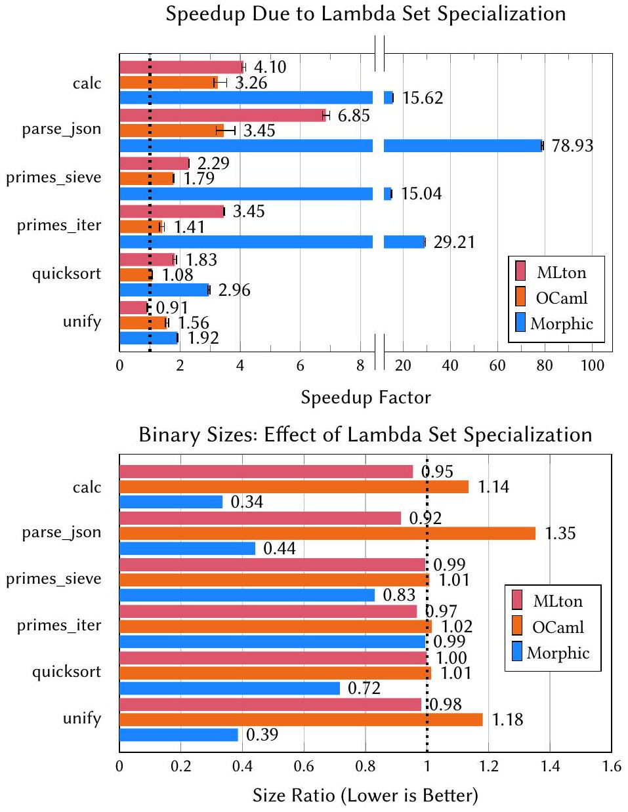

<!--
Third-party paper; not covered by the evm-sail software license.
Authors: William Brandon, Benjamin Driscoll, Frank Dai, Wilson Berkow, and Mae Milano.
Original: https://doi.org/10.1145/3591260
License: Creative Commons Attribution 4.0 International (CC BY 4.0),
https://creativecommons.org/licenses/by/4.0/
Change notice: converted from the accompanying PDF to Markdown with Mathpix on
2026-07-29. The conversion may contain OCR, equation, or layout errors.
-->

# Better Defunctionalization through Lambda Set Specialization

WILLIAM BRANDON*, Massachusetts Institute of Technology, USA BENJAMIN DRISCOLL*, Stanford University, USA FRANK DAI, WILSON BERKOW, and MAE MILANO, University of California, Berkeley, USA[^authors][^equal-contrib]

Higher-order functions pose a challenge for both static program analyses and optimizing compilers. To simplify the analysis and compilation of languages with higher-order functions, a rich body of prior work has proposed a variety of defunctionalization techniques, which can eliminate higher-order functions from a program by transforming the program to a semantically-equivalent first-order representation. Several modern languages take this a step further, specializing higher-order functions with respect to the functions on which they operate, and in turn allowing compilers to generate more efficient code. However, existing specializing defunctionalization techniques restrict how function values may be used, forcing implementations to fall back on costly dynamic alternatives. We propose lambda set specialization (LSS), the first specializing defunctionalization technique which imposes no restrictions on how function values may be used. We formulate LSS in terms of a polymorphic type system which tracks the flow of function values through the program, and use this type system to recast specialization of higher-order functions with respect to their arguments as a form of type monomorphization. We show that our type system admits a simple and tractable type inference algorithm, and give a formalization and fully-mechanized proof in the Isabelle/HOL proof assistant showing soundness and completeness of the type inference algorithm with respect to the type system. To show the benefits of LSS, we evaluate its impact on the run time performance of code generated by the MLton compiler for Standard ML, the OCaml compiler, and the new Morphic functional programming language. We find that pre-processing with LSS achieves run time speedups of up to $6.85 \times$ under MLton, $3.45 \times$ for OCaml, and $78.93 \times$ for Morphic.

CCS Concepts: • Software and its engineering → Polymorphism; Procedures, functions and subroutines.
Additional Key Words and Phrases: monomorphization, defunctionalization, type systems
ACM Reference Format:
William Brandon, Benjamin Driscoll, Frank Dai, Wilson Berkow, and Mae Milano. 2023. Better Defunctionalization through Lambda Set Specialization. Proc. ACM Program. Lang. 7, PLDI, Article 146 (June 2023), 24 pages. https://doi.org/10.1145/3591260

## 1 INTRODUCTION

Higher-order functions are ubiquitous and desirable, but challenging to implement efficiently. Dynamic function values inhibit inlining and pose an obstacle to interprocedural analysis. Moreover, their implementations frequently rely on heap-allocated storage and indirect jumps, imposing runtime overhead compared to calling a known function symbol.

These challenges have motivated the need for defunctionalization transformations: algorithms which transform a higher-order program into an equivalent first-order representation. Dating back to the first defunctionalization technique proposed by Reynolds [1972], defunctionalization transformations have traditionally been monovariant, meaning that each higher-order function is transformed to at most one first-order function. Unfortunately, monovariant defunctionalization can produce output which is difficult to analyze and difficult to compile to efficient code, because each higher-order function must be transformed to a first-order function embodying all its possible behaviors across all call sites in the program.

In contrast to traditional monovariant techniques, some more recent approaches to defunctionalization employ specialization, allowing a single higher-order function to give rise to multiple first-order functions specialized to different call sites. Specializing defunctionalization promises a dramatic increase in the effectiveness of downstream optimizations by reducing or eliminating jump tables. Furthermore, unlike monovariant approaches, specializing defunctionalization need not lose precision when repeated expressions are factored out into reusable functions.

Restricted versions of specializing defunctionalization, such as C++ and Rust's aggressive monomorphizing strategy and Julia JIT-enhanced approach, are already in widesrpead use [Bezanson et al. 2017; Hovgaard et al. 2018; Klabnik and Nichols 2019, Ch. 10; Paszke et al. 2021; Stroustrup 2013, Ch. 26]. However, all existing specializing techniques suffer from limitations of expressiveness-either not supporing truly first-class functions (as in [Hovgaard et al. 2018; Paszke et al. 2021]), or forcing the programmer to fall back to traditional, slow virtually-dispatched closures in the general case (as in C++ and Rust [Klabnik and Nichols 2019, Ch. 13; Stroustrup 2013, Ch. 11]).

In this work we introduce lambda set specialization (LSS), the first specializing defunctionalization capable of eliminating all higher-order control flow in a realistic functional source language. Unlike existing industry-standard specializing techniques, LSS has no expressiveness limitations, and never falls back to traditional dynamic function representations. In our evaluation, we find that the ability of LSS to specialize higher-order functions to their call sites produces significantly more efficient code than the state-of-the-art monovariant defunctionalization of MLton [Cejtin et al. 2000], yielding a speedup of up to 6.85× over MLton's built-in defunctionalization.

We formulate LSS in terms of a polymorphic type system which we use to track the flow of function values through the program. In this type system, each function type is decorated with a lambda set annotation, which symbolically tracks the set of possible lambdas it might contain at runtime. Using this type information, we are able to perform specialization by recasting specialization of higher-order functions as a form of type monomorphization. To apply LSS to arbitrary source programs without lambda set annotations, we have developed a type inference algorithm capable of converting any well-typed program in our source language to a well-typed program in our extended type system. Using Isabelle/HOL, we give a fully mechanized proof of the soundness and completeness of this inference algorithm with respect to our type system.

The main contributions of this paper are as follows:

(1) We introduce lambda set specialization, a new defunctionalization technique which achieves the performance benefits of specializing defunctionalization while maintaining the expressiveness of prior non-specializing approaches.
(2) We formulate LSS in terms of type inference and type monomorphization within a novel polymorphic type system.
(3) We formally prove in Isabelle/HOL that our type inference is sound and complete with respect to our type system.
(4) We conduct a comprehensive evaluation of the performance impact of LSS, showing speedups of up to $6.85 \times$ for code compiled under MLton, $3.45 \times$ for OCaml, and $78.93 \times$ for Morphic.

## 2 OVERVIEW

To motivate our transformation, consider the following pseudocode:

> `def twice` $(f:\text{int}\rightarrow\text{int},x:\text{int})\rightarrow\text{int}=f(f(x))$  
> `let` $y=\operatorname{twice}((\lambda x.x+2),5)$  
> `let maybeplus2 = if` $b$ `then` $\lambda x.x$ `else` $\lambda x.x+2$  
> `let` $z=\operatorname{twice}(\text{maybeplus2},5)$

Suppose we would like to transform this program to a first-order representation-that is, to defunctionalize it. In particular, we would like to transform the higher-order function $t$ wice into firstorder code whose type annotations and control flow are as simple as possible. Using a specializing strategy to achieve this goal, we might hope to arrive at something like the following:

> `def` $\operatorname{plus2}(x:\text{int})\rightarrow\text{int}=x+2$  
> `def` $\operatorname{id}(x:\text{int})\rightarrow\text{int}=x$  
> `def` $\operatorname{twice}_{\text{plus2}}(x:\text{int})\rightarrow\text{int}=\operatorname{plus2}(\operatorname{plus2}(x))$  
> `def` $\operatorname{twice}_{\text{maybeplus2}}(\text{tag}:(\text{'id}\mid\text{'plus2}),x:\text{int})\rightarrow\text{int}=$  
> &nbsp;&nbsp;`match tag {` $\text{'id}\rightarrow\operatorname{id}(\operatorname{id}(x)),\ \text{'plus2}\rightarrow\operatorname{plus2}(\operatorname{plus2}(x))$ `}`  
> `let` $y=\operatorname{twice}_{\text{plus2}}(5)$  
> `let maybeplus2 = if` $b$ `then 'id else 'plus2`  
> `let` $z=\operatorname{twice}_{\text{maybeplus2}}(\text{maybeplus2},5)$

In this transformation, we have generated a new top-level function for each lambda in the program, and two separate top-level functions for $t$ wice: $t$ wice ${ }_{\text {plus } 2}$ and $t$ wice ${ }_{\text {maybeplus }}$. Each of these two new twice functions has been specialized for a specific syntactic call site of twice, with the function's body modified to directly call the possible lambdas that might be passed at that call site.

Thanks to specialization, each transformed version of twice precisely characterizes the control flow possible at its particular call site. Importantly, twice $_{\text {plus } 2}$ is able to dispatch statically to a known jump target. By contrast, the jump target of $t$ wice $_{\text {maybeplus2 }}$ is runtime dependent, with its dynamic lambda argument represented by a sum type whose possible variants are 'id and 'plus2. The idea of representing sets of possible lambdas by sum types is standard in the defunctionalization literature [Cejtin et al. 2000; Reynolds 1972]. However, such lambda-set-based defunctionalization has traditionally been monovariant, rather than specializing. A compiler employing monovariant defunctionalization, such as MLton, would merge the functions $t$ wice ${ }_{\text {plus } 2}$ and $t$ wice ${ }_{\text {maybeplus } 2}$ into a single function. We seek a specializing technique which avoids conflating the behavior of higherorder functions at independent call sites.

Interestingly, a form of specializing defunctionalization is already in widespread use in Rust and C++, which both support the use of templating mechanisms to instantiate higher-order functions independently for different individual lambdas. However, existing examples of such templatingbased approaches lack support for specializing with respect to lambda sets, such as (' id | 'plus2) above, and would instead need to fall back to an opaque virtually-dispatched implementation of lambdas to represent a variable like maybeplus2.

With our technique, we aim to capture the best of both approaches: defunctionalizing without restrictions on how lambdas may be used, while still specializing for efficiency. To do this, we must perform a precise, decidable, call-site specific flow analysis in the presence of arbitrary higher-order functions, recursive functions, and recursive datatypes.

Our key idea is to formulate our analysis in terms of a polymorphic type system which tracks the flow of function values through the program. In this type system, we decorate every function type with a lambda set annotation. A lambda set annotation may consist of a concrete set of possible lambdas, such as $\{\lambda x . x, \lambda x . x+2\}$, but is also allowed to take the form of a symbolic lambda set variable. Using lambda set variables, it is possible for higher-order functions to be polymorphic over lambda sets, which in turn allows lambda set annotations to vary between call sites. We return to our example, now decorated with lambda set annotations:

> `def` $\operatorname{twice}\langle\alpha\rangle(f:\text{int}\xrightarrow{\alpha}\text{int},x:\text{int})\rightarrow\text{int}=f(f(x))$  
> `let` $y:\text{int}=\operatorname{twice}\langle\{\lambda x.x+2\}\rangle(\lambda x.x+2,5)$  
> `let maybeplus2` $:\text{int}\xrightarrow{\{\lambda x.x,\lambda x.x+2\}}\text{int}=$ `if` $b$ `then` $\lambda x.x$ `else` $\lambda x.x+2$  
> `let` $z=\operatorname{twice}\langle\{\lambda x.x,\lambda x.x+2\}\rangle(\text{maybeplus2},5)$

Note that the type of twice is now polymorphic over a lambda set parameter $\alpha$, which it uses to to refine the type int → int to int $\xrightarrow{\alpha}$ int. In different calls to twice, the parameter $\alpha$ can take on different concrete lambda set values, capturing the information required to specialize $t$ wice. In the definition of $y$, we see that the lambda set $\{\lambda x . x+2\}$ constrains twice to take as its first argument exactly the lambda $\lambda x . x+2$. In the definition of maybeplus2, we see that the lambda set annotation on its type indicates that it must be either $\lambda x . x$ or $\lambda x . x+2$. This matches the lambda set argument to the application of $t$ wice in the definition of $z$, ensuring that twice is specialized to exactly the lambdas that may reside in maybeplus2.

Using such an extended type system, our lambda set specialization technique proceeds in three passes: a type inference pass, a specialization pass, and a lowering pass. Given a well-typed source program without lambda set annotations, our type inference elaborates it to a well-typed program in our extended type system. We take care to infer signatures which are polymorphic over lambda sets, to facilitate specialization. During the specialization pass, we monomorphize definitions with respect to our inferred types, instantiating specialized copies of polymorphic definitions as necessary to ensure that all lambda set annotations become concrete. In the lowering pass, we finally use the program's lambda set annotations to translate it to a first-order representation, converting function types to sum types, and function applications to pattern matches on those sum types.

## 3 SETTING: THE $L^{\text {src }}$ LANGUAGE

We present our technique, LSS, in the setting of a small higher-order functional language $L^{\text {src }}$, an extension of the simply-typed lambda calculus. In addition to function types, we equip $L^{\text {src }}$ with $n$-ary product and sum types, as well as isorecursive $\mu$ types [Pierce 2002]. The inj and match constructs introduce and eliminate elements of sum types, while fold and unfold introduce and eliminate elements of $\mu$ types. The full syntax of $L^{\text {src }}$ is given in Figure 1. Our examples use a sugared version of $L^{\text {src }}$ which includes integer types, tuple destructuring, and implicit lambda captures, and leave some type annotations implicit where they are unambiguous.

To guide specialization, we include in $L^{\text {src }}$ a notion of top-level definitions distinguished from the local bindings introduced by let, match, and lambda abstraction. Top-level definitions are introduced with def and are intended to act as the unit of specialization. Consider the $L^{\text {src }}$ program

> `def twice` $=\lambda(f:\text{int}\rightarrow\text{int},x:\text{int}).f(f(x))$ `in`  
> $(\operatorname{twice}(\lambda(x:\text{int}).x+1,5),\operatorname{twice}(\lambda(x:\text{int}).x-1,5))$

Because def bindings act as the unit of specialization, this program would defunctionalize to a first-order program where the def-bound function twice is specialized into two distinct functions,

$$
\begin{aligned}
x,y&\in\mathrm{Var} & d&\in\mathrm{DefName} & a&\in\mathrm{MuVar} & i,n&\in\mathbb{N} \\
t\in\mathrm{Type}&::=t_1\rightarrow t_2
  \mid t_1\times\cdots\times t_n
  \mid t_1+\cdots+t_n
  \mid \mu a.t
  \mid a \\
e\in\mathrm{Expr}&::=(e_1,\ldots,e_n)
  \mid\operatorname{proj}_i(e)
  \mid\operatorname{inj}^{i}_{t_1+\cdots+t_n}(e)
  \mid\operatorname{fold}_{\mu a.t}(e)
  \mid\operatorname{unfold}(e) \\
&\quad\mid\mathbf{let}\ x=e_1\ \mathbf{in}\ e_2
  \mid\mathbf{match}\ e\{\mathbf{inj}^{1}(x_1)\rightarrow e_1,\ldots,\mathbf{inj}^{n}(x_n)\rightarrow e_n\} \\
&\quad\mid\lambda[x:t_1=e_1](y:t_2).(e_2:t_3)
  \mid e_1(e_2)
  \mid x
  \mid d \\
p\in\mathrm{Program}&::=d\mid\mathbf{def}\ d:t=e\ \mathbf{in}\ p
\end{aligned}
$$

*Figure 1. The $L^{\text{src}}$ language.*

one for each lambda with which it was invoked. By contrast, if twice had been let-bound, as in:

> `let twice` $=\lambda(f:\text{int}\rightarrow\text{int},x:\text{int}).f(f(x))$ `in`  
> $(\operatorname{twice}(\lambda(x:\text{int}).x+1,5),\operatorname{twice}(\lambda(x:\text{int}).x-1,5))$

then twice would not be specialized, and would instead transform after defunctionalization to a single function capable of accommodating both lambdas.

Since specialization may duplicate a def binding, or even delete it if it is unused, the semantics of def bindings with side effects must be given special consideration. To sidestep this issue, $L^{\text {src }}$ does not evaluate def bindings where they are defined, but rather reevaluates them each time they are used. In a real-world setting, one might alternatively choose to enforce a constraint on def bindings similar to ML's value restriction [Wright 1995] to ensure that they can be safely duplicated.

We denote the big-step operational semantics of $L^{\text {src }}$ with a judgment of the form $\Delta ; \Gamma \vdash e \Downarrow v$. Here, $v$ is a metavariable ranging over runtime values drawn from the following set:

$$
v \in \text { Value }:=\lambda[x=v] y . e\left|\left(v_{1}, \ldots, v_{n}\right)\right| \mathbf{i n j}^{i}(v)
$$

The full operational semantics of $L^{\text {src }}$ can be found in Appendix A. We use $\Delta$ to refer to the context of def bindings $(d:=e)$ and $\Gamma$ to refer to the context of local bindings $(x:=e)$. A def binding may refer to earlier def bindings and to itself (allowing recursive $L^{\text {src }}$ programs), but not to later def bindings. An $L^{\text {src }}$ program must always end with the name of a single def to use as the program's entry point. Evaluating the program then consists of evaluating the entry point. In examples, as shorthand, we often end programs with a full expression $e$ instead.

To simplify our formal treatment, we allow lambda abstractions in $L^{\text {src }}$ to refer to any def-bound variables in scope, but not to any local variables. Instead, for a lambda abstraction to capture values from its environment it must specify an explicit capture expression, written with the notation $[x: \ldots=\ldots]$. In the following example, the $L^{\text {src }}$ def make-mult returns a lambda capturing $n$ :

> `def make-mult` $:\text{int}\rightarrow(\text{int}\rightarrow\text{int})=\lambda(n:\text{int}).(\lambda[c:\text{int}=n](x:\text{int}).x*c)$

For a lambda abstraction $\lambda\left[x: t_{1}=e_{1}\right]\left(y: t_{2}\right) . e_{2}$, the expression $e_{1}$ is evaluated at the point where the lambda is constructed and stored in the captured variable $x$, and the only local variables which may appear free in $e_{2}$ are the capture $x$ and the argument $y$. Without loss of generality, lambdas with no captures can be modeled as capturing unit, and lambdas with multiple captures can be modeled as capturing a tuple. Similarly, lambdas with multiple arguments can be modeled as lambdas taking a single tuple argument. A language with implicit lexical captures can be converted to this form by a straightforward transformation. The full typing rules for $L^{\text {src }}$ are given in Appendix B.

## 4 LAMBDA SET ANALYSIS AS POLYMORPHIC TYPE INFERENCE

At the core of our LSS technique is an intermediate language $L^{\text {annot }}$. It features a type system capable of modeling all the lambda set information necessary to perform specializing defunctionalization.

$$
\begin{aligned}
\alpha,\beta,\gamma&\in\mathrm{LamSetVar} \\
\ell\in\mathrm{Lambda}&::=\lambda[x:\tau_1](y:\tau_2).(\epsilon:\tau_3) \\
\sigma\in\mathrm{LambdaSet}&::=\{\ell_1,\ldots,\ell_n\}\mid\alpha\mid\mu a.\sigma\mid a \\
\tau\in\mathrm{AnnotType}&::=\tau_1\xrightarrow{\sigma}\tau_2
  \mid\tau_1\times\cdots\times\tau_n
  \mid\tau_1+\cdots+\tau_n
  \mid\mu a.\tau
  \mid a \\
\epsilon\in\mathrm{AnnotExpr}&::=(\epsilon_1,\ldots,\epsilon_n)
  \mid\operatorname{proj}_i(\epsilon)
  \mid\operatorname{inj}^{i}_{\tau_1+\cdots+\tau_n}(\epsilon)
  \mid\operatorname{fold}_{\mu a.\tau}(\epsilon)
  \mid\operatorname{unfold}(\epsilon) \\
&\quad\mid\mathbf{let}\ x=\epsilon_1\ \mathbf{in}\ \epsilon_2
  \mid\mathbf{match}\ \epsilon\{\mathbf{inj}^{1}(x_1)\rightarrow\epsilon_1,\ldots,\mathbf{inj}^{n}(x_n)\rightarrow\epsilon_n\} \\
&\quad\mid(\lambda[x:\tau_1=\epsilon_1](y:\tau_2).(\epsilon_2:\tau_3))\ \mathbf{as}\ \sigma
  \mid(\epsilon_1\ \mathbf{as}\ \sigma)(\epsilon_2)
  \mid x
  \mid d\langle\sigma_1,\ldots,\sigma_n\rangle \\
C\in\mathrm{Constraint}&::=\ell\in\sigma
  & Q\in\mathrm{Constraints}&::=\{C_1,\ldots,C_n\} \\
\pi\in\mathrm{AnnotProgram}&::=d\langle\rangle
  \mid\mathbf{def}\ d\langle\alpha_1,\ldots,\alpha_n\rangle:(Q\Rightarrow\tau)=\epsilon\ \mathbf{in}\ \pi
\end{aligned}
$$

*Figure 2. The $L^{\text{annot}}$ language.*

The $L^{\text {annot }}$ language is an extension of $L^{\text {src }}$ which places lambda set annotations on certain types and expressions. The full syntax of $L^{\text {annot }}$ is presented in Figure 2. Note that annotated types and expressions in $L^{\text {annot }}$ are referred using Greek variables $(\tau, \epsilon)$, to distinguish them from their unannotated equivalents $(t, e)$ in $L^{\text {src }}$. The languages $L^{\text {src }}$ and $L^{\text {annot }}$ are related by an erasure operator $\lfloor\cdot\rfloor$, which takes any $L^{\text {annot }}$ term and strips it of its lambda set annotations, yielding an $L^{\text {src }}$ term. The full definition of $\lfloor\cdot\rfloor$ is given in Appendix E. We define the operational semantics of an $L^{\text {annot }}$ term to be the operational semantics of its erasure.

We introduce lambda set annotations in three key places, each motivated by a different requirement of the defunctionalization transformation:

- Function types in $L^{\text {annot }}$ take the form $\tau_{1} \xrightarrow{\sigma} \tau_{2}$, where $\sigma$ is a lambda set representing an upper bound on the possible lambdas which might inhabit the function type at runtime. This tracks the information needed to transform function types into sum types.
- Function applications in $L^{\text {annot }}$ take the form $\left(\epsilon_{1}\right.$ as $\left.\sigma\right)\left(\epsilon_{2}\right)$, where $\sigma$ is the lambda set of the function $\epsilon_{1}$. This tracks the information needed to transform function applications into pattern matches.
- Lambda abstractions in $L^{\text {annot }}$ take the form ( $\lambda \cdots$ ) as $\sigma$, where $\sigma$ is a "target" lambda set large enough to accommodate both the lambda being constructed and any other lambdas which might be present at locations to which the result of the current expression might flow. This tracks the information needed to transform abstractions to injections into sum types.

As described so far, these lambda set annotations are conceptually similar to the whole-program data flow annotations collected as part of existing non-specializing defunctionalization techniques, like that of MLton [Cejtin et al. 2000]. However, in order to support specialization, we break from prior work by introducing a mechanism for lambda set polymorphism into the $L^{\text {annot }}$ type system. In the next section we discuss the design of this polymorphism mechanism in more detail.

### 4.1 Lambda Set Polymorphism and Inclusion Constraints

Recall that top-level def bindings in $L^{\text {src }}$ are intended to act as the unit of specialization during defunctionalization, each potentially giving rise to multiple def bindings in the defunctionalized program. Therefore, we introduce lambda set polymorphism at the level of def bindings. A def binding in $L^{\text {annot }}$ may be parameterized by zero or more lambda set variables, which may appear in the binding's type and body in place of concrete lambda set annotations.

We write the lambda set parameters for a definition in angle brackets $\langle\cdots\rangle$ after its name, both when defining a def binding and when calling it. For instance, we could lift the $L^{\text {src }}$ definition from

Expression Typing:

$$
\Delta ; Q ; \Gamma \vdash \epsilon: \tau
$$

$$
\begin{aligned}
& \ell=\lambda\left[x: \tau_{1}\right]\left(y: \tau_{2}\right) .\left(\epsilon_{2}: \tau_{3}\right) \quad Q \vdash \ell \in \sigma \\
& \frac{\Delta ; Q ; \Gamma \vdash \epsilon_{1}: \tau_{1} \quad \Delta ; Q ;\left\{x: \tau_{1}, y: \tau_{2}\right\} \vdash \epsilon_{2}: \tau_{3}}{\Delta ; Q ; \Gamma \vdash \ell\left[\epsilon_{1}\right] \text { as } \sigma: \tau_{2} \xrightarrow{\sigma} \tau_{3}} \text { [AT-ABS] }
\end{aligned}
$$

$$
\begin{array}{cc}
\Delta ; Q ; \Gamma \vdash \epsilon_{1}: \tau_{1} \xrightarrow{\sigma} \tau_{2} & \left(d: \forall \bar{\alpha} . Q_{2} \Rightarrow \tau\right) \in \Delta \\
\frac{\Delta ; Q ; \Gamma \vdash \epsilon_{2}: \tau_{1}}{\Delta ; Q ; \Gamma \vdash\left(\epsilon_{1} \text { as } \sigma\right)\left(\epsilon_{2}\right): \tau_{2}}[\text { AT-App }] & \frac{Q_{1} \vdash Q_{2}[\overline{\alpha \mapsto \sigma}]}{\Delta ; Q_{1} ; \Gamma \vdash d\langle\bar{\sigma}\rangle: \tau[\overline{\alpha \mapsto \sigma}]} \text { [AT-Def-Ref] }
\end{array}
$$

Program Typing:

$$
\Delta \vdash \pi: \tau
$$

free lambda set variables of $Q, \tau_{1}, \epsilon \subseteq\{\bar{\alpha}\}$

$$
\begin{array}{ll}
\Delta \cup\left\{d: \forall \bar{\alpha} . Q \Rightarrow \tau_{1}\right\} ; Q ; \varnothing \vdash \epsilon: \tau_{1} & (d: \varnothing \Rightarrow \tau) \in \Delta \\
\frac{\Delta \cup\left\{d: \forall \bar{\alpha} \cdot Q \Rightarrow \tau_{1}\right\} \vdash \pi: \tau_{2} \quad d \notin \Delta}{\Delta \vdash \mathbf{d e f} d\langle\bar{\alpha}\rangle:\left(Q \Rightarrow \tau_{1}\right)=\epsilon \text { in } \pi: \tau_{2}} & {[\text { AT-Def }]} \\
& \frac{\tau \text { has no function types }}{\Delta \vdash d\rangle: \tau} \\
\text { [AT-Entry] } &
\end{array}
$$

$$
\begin{array}{ccc} 
& \begin{array}{c}
\text { Constraint Entailment: } \\
Q \vdash C
\end{array} & \\
\frac{(\ell \in \alpha) \in Q}{Q \vdash \ell \in \alpha} & \frac{\ell \in\left\{\ell_{1}, \ldots, \ell_{n}\right\}}{Q \vdash \ell \in\left\{\ell_{1}, \ldots, \ell_{n}\right\}} & \frac{Q \vdash \ell \in \sigma[a \mapsto \mu a . \sigma]}{Q \vdash \ell \in \mu a . \sigma} \\
& \frac{Q \vdash C_{1} \ldots Q \vdash C_{n}}{Q \vdash\left\{C_{1}, \ldots, C_{n}\right\}}
\end{array}
$$
*Figure 3. Selected typing rules for $L^{\text{annot}}$.*

the twice example in Section 3 to the polymorphic $L^{\text {annot }}$ definition[^1]

$$
\text { def } t \text { wice }\langle\alpha\rangle:((\text { int } \xrightarrow{\alpha} \text { int }), \text { int }) \rightarrow \text { int }=\lambda(f: \text { int } \xrightarrow{\alpha} \text { int }, x: \text { int }) .(f \text { as } \alpha)((f \text { as } \alpha)(x))
$$

and instantiate it at its first call site by providing the concrete lambda set $\{\lambda(x: \mathbf{i n t}) . x+1\}$ as $\alpha$ :

$$
\text { twice }\langle\{\lambda(x: \text { int }) . x+1\}\rangle((\lambda(x: \text { int }) . x+1) \text { as }\{\lambda(x: \text { int }) . x+1\}, 5)
$$

A difficulty arises when considering the interaction between lambda set polymorphism and the lambda abstraction construct. As a central design objective, we would like $L^{\text {annot }}$ to satisfy the property that whenever an $L^{\text {annot }}$ program is well-typed, its lambda set annotations can be used to successfully specialize and defunctionalize it to a semantically equivalent first-order program. To this end, it is critical that whenever a lambda set $\sigma$ appears as the target of a lambda abstraction, the set $\sigma$ contains at least the lambda currently being constructed. However, this implies it is not safe in general to instantiate a polymorphic $L^{\text {annot }}$ definition at arbitrary concrete lambda sets.

For example, consider the following attempt at lifting the example definition make-mult from Section 3 into the $L^{\text {annot }}$ type system:

$$
\text { def } \text { make-mult }\langle\alpha\rangle: \text { int } \text { → }(\text { int } \xrightarrow{\alpha} \text { int })=\lambda(n: \text { int }) .((\lambda[c: \text { int }=n](x: \text { int }) . x * c) \text { as } \alpha)
$$

It is not safe to instantiate this definition with arbitrary concrete lambdas sets in place of $\alpha$. For example, the substitution $\alpha \mapsto\{\lambda(x: \mathbf{i n t}) . x+1\}$ would produce the specialized definition:

> `def` $\operatorname{make\text{-}mult}_{\mathrm{spec}}\langle\rangle:
\operatorname{int}\rightarrow
(\operatorname{int}\xrightarrow{\{\lambda(x:\operatorname{int}).x+1\}}\operatorname{int})=$  
> $\lambda(n:\operatorname{int}).
((\lambda[c:\operatorname{int}=n](x:\operatorname{int}).x*c)\ \mathbf{as}\
\{\lambda(x:\operatorname{int}).x+1\})$

which is impossible to defunctionalize. The sum type generated to represent the function type

$$
\text { int } \xrightarrow{\{\lambda(x: \text { int }) . x+1\}} \text { int }
$$

would not contain a variant suitable for representing $(\lambda[c: \mathbf{i n t}=n](x: \mathbf{i n t}) . x * c)$.
To enforce that situations like this do not occur in well-typed $L^{\text {annot }}$ programs, we introduce a notion of lambda inclusion constraints into the $L{ }^{\text {annot }}$ type system, which allow polymorphic $L^{\text {annot }}$ definitions to impose constraints on the lambda sets with which they may be instantiated. We write $\ell \in \sigma$ to denote the constraint that a lambda set $\sigma$ must include a lambda $\ell$, and use the notation " $Q \Rightarrow \ldots$ " to denote the constraint set $Q$ of a polymorphic definition. The problematic definition above could be typed correctly using an inclusion constraint as:

> `def` $\operatorname{make\text{-}mult}\langle\alpha\rangle:
(\{(\lambda[c:\operatorname{int}](x:\operatorname{int}).x*c)\in\alpha\}
\Rightarrow\operatorname{int}\rightarrow
(\operatorname{int}\xrightarrow{\alpha}\operatorname{int}))=$  
> $\lambda(n:\operatorname{int}).
((\lambda[c:\operatorname{int}=n](x:\operatorname{int}).x*c)\ \mathbf{as}\ \alpha)$

Note that the constraint $(\lambda[c: \mathbf{i n t}](x: \mathbf{i n t}) . x * c) \in \alpha$ makes no mention of the capture expression $n$. As formalized in Figure 2, the lambdas in lambda inclusion constraints are of a different syntactic category than lambda expressions and do not track capture expressions.

The following example, which references twice and make-mult as defined in our previous examples, demonstrates a call to a function whose $L^{\text {annot }}$ type requires an inclusion constraint[^2]:

$$
\begin{aligned}
& \text { let } f=\text { match }(\text { get-user-input }())\left\{\begin{array}{l}
0 \rightarrow \text { make-mult }(5) \\
1 \rightarrow \text { make-mult }(7) \\
2 \rightarrow \lambda(x: \text { int }) \cdot x+1
\end{array}\right\} \text { in } \\
& \operatorname{twice}(f, 20)
\end{aligned}
$$

After running our type inference, this $L^{\text {src }}$ program would be transformed to the following welltyped $L^{\text {annot }}$ program, which satisfies all relevant inclusion constraints and ensures that $f$ is typed with the same lambda set everywhere:[^3]

$$
\begin{aligned}
& \text { let } f=\text { match }(\text { get-user-input }())\left\{\begin{array}{l}
0 \rightarrow \text { make-mult }\langle\{(\lambda[c](x) \cdot x * c),(\lambda(x) \cdot x+1)\}\rangle(5) \\
1 \rightarrow \text { make-mult }\langle\{(\lambda[c](x) \cdot x * c),(\lambda(x) \cdot x+1)\}\rangle(7) \\
2 \rightarrow(\lambda(x) \cdot x+1) \text { as }\{(\lambda[c](x) \cdot x * c),(\lambda(x) \cdot x+1)\}
\end{array}\right\} \text { in } \\
& t \text { wice }\langle\{(\lambda[c](x) \cdot x * c),(\lambda(x) \cdot x+1)\}\rangle(f, 20)
\end{aligned}
$$

Although the calls make-mult(5) and make-mult(7) return different concrete function values, the $L^{\text {annot }}$ type system models them both as simply returning a value with type int $\xrightarrow{\alpha}$ int with inclusion constraint $(\lambda[c](x) . x * c) \in \alpha$.

Selected key typing rules for $L^{\text {annot }}$, including a treatment of lambda inclusion constraints, are given in Figure 3, and the full typing rules for $L^{\text {annot }}$ are given in Appendix C. Expressions are typed in a three-part context consisting of a def-binding context $\Delta$, a constraint context $Q$, and a local binding context $\Gamma . L^{\text {annot }}$ programs are typed in only a def-binding context $\Delta$. For a lambda $\ell=\lambda\left[x: \tau_{1}\right]\left(y: \tau_{2}\right) .\left(\epsilon_{2}: \tau_{3}\right)$, we define the notation $\ell\left[\epsilon_{1}\right]$ to denote the lambda-abstraction-withcapture $\ell\left[\epsilon_{1}\right]=\lambda\left[x: \tau_{1}=\epsilon_{1}\right]\left(y: \tau_{2}\right) .\left(\epsilon_{2}: \tau_{3}\right)$.

$$
\mathcal{F}(t)=\tau \quad \mathcal{F}\left(t_{1} \rightarrow t_{2}\right)=\mathcal{F}\left(t_{1}\right) \xrightarrow{\alpha} \mathcal{F}\left(t_{2}\right) \quad \text { for } \alpha \text { fresh }
$$
$$
\mathcal{F}(\Delta, e)=\epsilon
$$

*Figure 4. Selected rules for $\mathcal{F}$.*

### 4.2 Type Inference for $L^{\text {annot }}$

Automatically elaborating well-typed $L^{\text {src }}$ programs into well-typed, polymorphic $L^{\text {annot }}$ programs is tractable. To do this, it suffices to run a unification-based type inference algorithm [Hindley 1969; Milner 1978] on the body of each definition, augmented with features to handle our lambda inclusion constraints.

We present the details of our type inference procedure, and characterize its correctness with respect to the $L^{\text {annot }}$ type system via Theorem 4.1. An Isabelle/HOL formalization of this section, including a proof of Theorem 4.1, is available (see Artifact Availability).
#### 4.2.1 Unification of Lambda Set Variables

Our type inference proceeds from the observation that the $L^{\text {annot }}$ typing rules for expressions, minus lambda inclusion constraints, induce only simple equality constraints between $L^{\text {annot }}$ types. We call an $L^{\text {annot }}$ expression pre-well-typed if it is welltyped ignoring lambda inclusion constraints.

The first major component of our type inference is a procedure for elaborating well-typed $L^{\text {src }}$ definitions into pre-well-typed $L^{\text {annot }}$ definitions. We achieve this by way of unification. Given a well-typed $L^{\text {src }}$ expression $e$, we:

(1) Annotate $e$ with fresh lambda set variables to obtain $\epsilon$ in the expression grammar of $L^{\text {annot }}$.
(2) Accumulate the set of type equality constraints $\xi$ induced by $\epsilon$.
(3) Determine the set of lambda set variable equality constraints $\zeta$ implied by $\xi$.
(4) Compute the most general lambda set variable unifier $\phi$ which satisfies $\zeta$.
(5) Apply the unifier $\phi$ to obtain a pre-well-typed $L^{\text {annot }}$ expression $\epsilon^{\prime}=\phi \epsilon$.

We formalize step (1) in terms of an imperative procedure $\mathcal{F}$ which lifts $L^{\text {src }}$ types and expressions into the grammar of $L^{\text {annot }}$ by annotating them with fresh lambda set variables. Selected rules for $\mathcal{F}$ are given in Figure 4, and a complete definition is given in Appendix D. Note that when $\mathcal{F}$ is applied to expressions it takes an additional context parameter $\Delta$, which holds the signatures of prior def bindings in the program; this context is necessary in order to determine the number of lambda set parameters with which referenced definitions must be instantiated. Note also that type inference always takes place inside the body of some $L^{\text {src }}$ def binding, and that the current enclosing definition will never be present in $\Delta$. When $\mathcal{F}$ encounters a recursive reference to the current definition, it leaves that reference's lambda set parameter list empty, to be filled in later when type inference for the current definition is complete.

We formalize step (2) in terms of a unification constraint accumulation relation $\Delta ; \Sigma ; \Gamma \vdash \epsilon \leadsto_{U} \tau ; \xi$. The rules for this relation are syntax-directed, and should be understood as defining a procedure with $\tau$ and $\xi$ as outputs. Given a def context $\Delta$ and a local context $\Gamma$, the relation $\epsilon \leadsto_{U} \tau ; \xi$ states that $\epsilon$ is inferred to have type $\tau$, and that $\epsilon$ induces a set of type equality constraints $\xi$. The special

$$
\begin{aligned}
& \xi \in \text { Type-Equalities }::=\left\{\tau_{1} \sim \tau_{1}^{\prime}, \ldots, \tau_{n} \sim \tau_{n}^{\prime}\right\} \quad \Delta ; \Sigma ; \Gamma \vdash \epsilon \leadsto_{U} \tau ; \xi \\
& \zeta \in \text { Lambda-Set-Var-Equalities }:=\left\{\alpha_{1} \sim \alpha_{1}^{\prime}, \ldots, \alpha_{n} \sim \alpha_{n}^{\prime}\right\} \quad \mathcal{E}(\xi)=\zeta \\
& \frac{\Delta ; \Sigma ; \Gamma \vdash \epsilon_{1} \leadsto_{U} \tau_{1}^{\prime} ; \xi_{1} \quad \Delta ; \Sigma ; \Gamma \cup\left\{x: \tau_{1}, y: \tau_{2}\right\} \vdash \epsilon_{2} \leadsto_{U} \tau_{3}^{\prime} ; \xi_{2} \quad \xi=\xi_{1} \cup \xi_{2}}{\Delta ; \Sigma ; \Gamma \vdash\left(\lambda\left[x: \tau_{1}=\epsilon_{1}\right]\left(y: \tau_{2}\right) .\left(\epsilon_{2}: \tau_{3}\right)\right) \text { as } \alpha \leadsto_{U} \tau_{2} \xrightarrow{\alpha} \tau_{3} ; \xi \cup\left\{\tau_{1} \sim \tau_{1}^{\prime}, \tau_{3} \sim \tau_{3}^{\prime}\right\}} \text { [TIU-ABS] } \\
& \frac{\Delta ; \Sigma ; \Gamma \vdash \epsilon_{1} \leadsto_{U} \tau_{1} \xrightarrow{\alpha_{1}} \tau_{2} ; \xi_{1} \quad \Delta ; \Sigma ; \Gamma \vdash \epsilon_{2} \leadsto_{U} \tau_{3} ; \xi_{2}}{\Delta ; \Sigma ; \Gamma \vdash\left(\epsilon_{1} \operatorname{as} \alpha_{2}\right)\left(\epsilon_{2}\right) \leadsto_{U} \tau_{3} ; \xi_{1} \cup \xi_{2} \cup\left\{\left(\tau_{1} \xrightarrow{\alpha_{1}} \tau_{2}\right) \sim\left(\tau_{3} \xrightarrow{\alpha_{2}} \tau_{2}\right)\right\}} \text { [TIU-App] } \\
& \frac{(d: \forall \bar{\alpha} . Q \Rightarrow \tau) \in \Delta}{\Delta ; \Sigma ; \Gamma \vdash d\langle\bar{\beta}\rangle \leadsto_{U} \tau[\overline{\alpha \mapsto \beta}] ; \varnothing}[\text { TIU-Def-Ref }] \frac{}{\Delta ;(d: \tau) ; \Gamma \vdash d \leadsto_{U} \tau ; \varnothing}[\text { TIU-Self-Ref }]
\end{aligned}
$$

*Figure 5. Selected rules for unification constraint accumulation.*

$$
\begin{gathered}
\mathbb{Q}(\Delta, \epsilon)=Q \quad Q\left(\Delta,\left(\lambda\left[x: \tau_{1}=\epsilon_{1}\right]\left(y: \tau_{2}\right) .\left(\epsilon_{2}: \tau_{3}\right)\right) \text { as } \alpha\right) \\
=\mathbb{Q}\left(\Delta, \epsilon_{1}\right) \cup \mathbb{Q}\left(\Delta, \epsilon_{2}\right) \cup\left\{\left(\lambda\left[x: \tau_{1}\right]\left(y: \tau_{2}\right) .\left(\epsilon_{2}: \tau_{3}\right)\right) \in \alpha\right\} \\
\mathbb{Q}(\Delta, d\langle\bar{\sigma}\rangle)= \begin{cases}Q[\overline{\alpha \mapsto \sigma}] & \text { if }(d: \forall \bar{\alpha} . Q \Rightarrow \tau) \in \Delta \\
\varnothing & \text { otherwise }\end{cases}
\end{gathered}
$$

*Figure 6. Selected rules for lambda inclusion constraint accumulation.*
context parameter $\Sigma$ tracks a provisional $L^{\text {annot }}$ type for the current enclosing definition, which we use to ensure that recursive references to the current definition have the same type as the current definition's body. Tracking the inferred type of the current definition in this way ensures by construction that our elaboration procedure never introduces polymorphic recursion. Selected rules for the $\leadsto_{U}$ relation are given in Figure 5, and the complete rules are given in Appendix D.

Note that $\leadsto_{U}$ defines a partial function, and can fail in cases where inferred types do not match the structure expected by any of its defining rules (for example, if $e_{1}$ fails to yield a type of the form $\tau_{1} \xrightarrow{\alpha_{1}} \tau_{2}$ in TIU-App). However, when operating on input programs which were well-typed under the $L^{\text {src }}$ type system, such structural incompatibilities cannot occur, and $\leadsto_{U}$ always succeeds.

We formalize step (3) in terms of a procedure $\mathcal{E}$ which recursively traverses the types in each type equality constraint $\tau_{1} \sim \tau_{2}$ to obtain a set of implied lambda set equalities. The form of $\mathcal{E}$ is given in Figure 5, and a complete definition is given in Appendix D. Note that in order to ensure that $\mathcal{E}$ always emits constraints which we can solve by unification, we require that each implied lambda set equality take the form $\alpha_{1} \sim \alpha_{2}$ where $\alpha_{1}, \alpha_{2}$ are lambda set variables, not concrete lambda sets. To guarantee this, we proceed from the observation that lambda set annotations encountered during type inference can come from two places: they may be introduced by $\mathcal{F}$, or they may be retrieved from $\Delta$. In $\mathcal{F}$, we ensure by construction that all new lambda set annotations are fresh variables. In $\Delta$, we maintain an inductive invariant throughout type inference that all inferred def signatures are fully flexible, in the sense that all their lambda set annotations take the form of universally quantified lambda set variables.

Together with steps (4) and (5), which are standard, this completes the unification component of our algorithm.

$$
\begin{array}{ll}
\operatorname{lsv}(\sigma)=\{\alpha \mid \alpha \text { appears in } \sigma\} & \mathcal{S}(Q, \alpha)=\sigma \\
\mathcal{S}(Q, \alpha)= \begin{cases}\mu a .\{\ell[\alpha \mapsto a] \mid(\ell \in \alpha) \in Q\} \text { for } a \text { fresh } & \text { if } \alpha \in \operatorname{lsv}(\{\ell \mid(\ell \in \alpha) \in Q\}) \\
\{\ell \mid(\ell \in \alpha) \in Q\} & \text { otherwise }\end{cases} \\
\mathcal{I}(\varnothing, Q, \epsilon)=(Q, \epsilon) \\
\mathcal{I}\left(\left\{\alpha_{1}, \ldots, \alpha_{n}\right\}, Q, \epsilon\right)=\mathcal{I}\left(\left\{\alpha_{2}, \ldots, \alpha_{n}\right\}, Q\left[\alpha_{1} \mapsto \sigma\right], \epsilon\left[\alpha_{1} \mapsto \sigma\right]\right) \quad \text { where } \sigma=\mathcal{S}\left(Q, \alpha_{1}\right)
\end{array}
$$

*Figure 7. The $\mathcal{S}$ and $\mathcal{I}$ functions.*

#### 4.2.2 Inclusion Constraints and Internalization

Although our unification algorithm suffices to lift each def binding in an $L^{\text {src }}$ program to a pre-well-typed $L^{\text {annot }}$ def binding, additional measures specific to our setting are necessary to ensure that the $L^{\text {annot }}$ program generated by type inference also satisfies the lambda inclusion constraints imposed by the AT-Abs and AT-Def-Ref rules.

To ensure that all lambda inclusion constraints are satisfied, we first define a procedure $\mathbb{Q}$ which returns the set of inclusion constraints induced by an $L^{\text {annot }}$ expression. The procedure $\mathbb{Q}$ is parameterized by a def context $\Delta$, because the AT-Def-Ref typing rule (given in Figure 3) allows references to definitions to impose inclusion constraints. Selected rules for $\mathbb{Q}$ are given in Figure 6.

Our type inference then uses the constraints returned by Q in two ways:

- Lambda set variables appearing free in the type signature of the current definition are promoted to universally quantified lambda set parameters, and any inclusion constraints on these variables are added to the constraint set for the current definition.
- Variables not appearing in the type signature are "internalized," meaning that they are replaced with concrete lambda sets sufficient to satisfy all their inclusion constraints.

We formalize this "internalization" procedure in Figure 7, in terms of two functions $\mathcal{S}$ and $\mathcal{I}$. The function $\mathcal{S}$ gives a minimal concrete solution for a lambda set variable $\alpha$ subject to a set of inclusion constraints $Q$. The function $\mathcal{I}$ "internalizes" a sequence of lambda set variables $\left\{\alpha_{1}, \ldots, \alpha_{n}\right\}$ in the body $\epsilon$ of a definition, replacing those variables by their minimal concrete solutions given $Q$.

During internalization, we note that a difficulty arises when attempting to generate a solution for a lambda set variable which occurs free in its own constraints. Consider the problem of generating a lambda set $\gamma$ satisfying a single constraint of the form:

$$
(\lambda[f: \text { int } \xrightarrow{\gamma} \text { int }](x: \text { int }) .(f \text { as } \gamma)(x)+1) E \gamma
$$

As noted by Hovgaard [2018], constraints like the above can arise in the presence of recursive or iterative control flow. To represent concrete lambda sets satisfying such recursive constraints without generating infinite-size lambda set expressions, we introduce a lambda-set-level fixed point operator $\mu$. Using $\mu$, we can express a concrete solution for $\gamma$ satisfying the original constraint:

$$
\gamma=\mu a \cdot(\lambda[f: \text { int } \xrightarrow{a} \text { int }](x: \text { int }) .(f \text { as } a)(x)+1)
$$

The typing rule for $\mu$ lambda sets is given as part of Figure 3, and the rule which introduces $\mu$ lambda sets during type inference is given as part of the definition of $\mathcal{S}$ in Figure 7.
#### 4.2.3 The End-to-End Type Inference Procedure

Putting all the components of our type inference together, we obtain a procedure $\mathscr{D}$, presented in Figure 8, which applies our full type inference technique to a single definition. Given a well-typed $L^{\text {src }}$ definition def $d: t=e$ and a context $\Delta$ holding inferred $L^{\text {annot }}$ signatures for all prior definitions in the program, the procedure $\mathscr{D}(\Delta, d, t, e)$ returns a tuple $\left(\{\bar{\alpha}\}, Q, \tau^{\prime \prime}, \epsilon^{\prime \prime \prime}\right)$ containing the lambda set parameters $\bar{\alpha}$, inclusion constraint set
$\mathscr{D}(\Delta, d, t, e)=\left(\{\bar{\alpha}\}, Q, \tau^{\prime \prime}, \epsilon^{\prime \prime \prime}\right)$ where

$$
\begin{aligned}
& \tau=\mathcal{F}(t) \quad \epsilon=\mathcal{F}(\Delta, e) \quad \Delta ;(d: \tau) ; \varnothing \vdash \epsilon \leadsto_{U} \tau^{\prime} ; \xi \quad \phi=\operatorname{mgu}\left(\mathcal{E}\left(\xi \cup\left\{\tau \sim \tau^{\prime}\right\}\right)\right) \quad \tau^{\prime \prime}=\phi \tau^{\prime} \\
& \epsilon^{\prime}=\phi \epsilon \quad\{\bar{\alpha}\}=\operatorname{lsv}\left(\tau^{\prime \prime}\right) \quad \epsilon^{\prime \prime}=\epsilon^{\prime}[d\langle \rangle \mapsto d\langle\bar{\alpha}\rangle] \quad\left(Q, \epsilon^{\prime \prime \prime}\right)=\mathcal{I}\left(\left(\operatorname{lsv}\left(\epsilon^{\prime \prime}\right) \backslash\{\bar{\alpha}\}\right), \mathbb{Q}\left(\Delta, \epsilon^{\prime \prime}\right), \epsilon^{\prime \prime}\right)
\end{aligned}
$$

$\mathcal{A}(\Delta, d)=d\langle \rangle$

$$
\begin{gathered}
\mathcal{A}(\Delta,(\text { def } d: t=e \text { in } p))=(\text { def } d\langle\bar{\alpha}\rangle:(Q \Rightarrow \tau)=\epsilon \text { in } \pi) \text { where } \\
(\{\bar{\alpha}\}, Q, \tau, \epsilon)=\mathscr{D}(\Delta, d, t, e) \quad \pi=\mathcal{A}(\Delta \cup\{d: \forall \bar{\alpha} . Q \Rightarrow \tau\}, p)
\end{gathered}
$$
*Figure 8. Type inference.*

$Q$, type signature $\tau^{\prime \prime}$, and body $\epsilon^{\prime \prime \prime}$ of a corresponding well-typed $L^{\text {annot }}$ definition. The procedure $\mathscr{D}$ first runs the unification algorithm described in Section 4.2.1 to obtain a most general unifier ("mgu") $\phi$ which it applies to the definition, then accumulates inclusion constraints and performs internalization as described in Section 4.2.2. The free variables $\{\bar{\alpha}\}$ of the inferred type signature $\tau^{\prime \prime}$ become the universally quantified lambda set parameters of the definition, and we apply the substitution $d\rangle \mapsto d\langle\bar{\alpha}\rangle$ to fix any temporary placeholder references to the current definition which were introduced in the $\mathcal{F}$ procedure.

The procedure $\mathcal{A}$, also presented in Figure 8, defines our type inference technique at the level of whole $L^{\text {src }}$ programs, processing def bindings one-by-one in dependency order. We express our central theoretical result for type inference in terms of $\mathcal{A}$ :

Theorem 4.1 (Soundness and Completeness of Type Inference with Respect to the $L^{\text {annot }}$ Type System). Let $p$ be an $L^{\text {src }}$ program, and let $\varnothing \vdash p: t$ where $t$ contains no occurrences of the function type constructor $\cdot \rightarrow \cdot$. Then computing $\pi=\mathcal{A}(\Delta, p)$ always succeeds, and gives $\pi$ such that:

- We have $\lfloor\pi\rfloor=p$.
- We have $\varnothing \vdash \pi: \tau$ where $\lfloor\tau\rfloor=t$.
- The program $\pi$ contains no instances of polymorphic recursion.

## 5 LOWERING $L^{\text {annot }}$ PROGRAMS TO FIRST-ORDER

The lambda set annotations in the $L^{\text {annot }}$ language are designed to track all information necessary to defunctionalize a higher-order program to an equivalent first-order form. Although a polymorphic $L^{\text {annot }}$ program cannot be directly defunctionalized, it can be defunctionalized after specializing def bindings with respect to concrete lambda set parameters, producing a monomorphic $L^{\text {annot }}$ program annotated entirely by concrete lambda sets. In this section, we first discuss our specialization procedure and then the lowering procedure for monomorphic $L^{\text {annot }}$ programs.

### 5.1 Specialization of $L^{\text {annot }}$ Programs

The procedure for specializing definitions in $L^{\text {annot }}$ with respect to lambda sets is straightforward, and proceeds similarly to the type monomorphization of languages such as C++ and Rust.

At the end of Section 4.1, we introduced the $L^{\text {src }}$ and inferred $L^{\text {annot }}$ code for an example program which matches on user input, calling the function twice with either a concrete lambda or the result of a call to higher-order function make-mult. The $L^{\text {annot }}$ code calls both functions, where they appear, with lambda set parameter $\sigma=\{(\lambda[c](x) . x * c),(\lambda(x) . x+1)\}$. Hence, when we specialize, we get a program with a single specialization of $t$ wice and of make-mult, each with respect to $\sigma$ :

$$
\text { def } \text { make-mult }_{\text {spec }}\langle \rangle: \operatorname{int} \rightarrow(\operatorname{int} \xrightarrow{\{(\lambda[c](x) \cdot x * c),(\lambda(x) \cdot x+1)\}} \text { int })=
$$

$$
\lambda(n) \cdot((\lambda[c=n](x) \cdot x * c) \text { as }\{(\lambda[c](x) \cdot x * c),(\lambda(x) \cdot x+1)\}) \text { in }
$$

def twice $_{\text {spec }}\langle \rangle:(($ int $\xrightarrow{\{(\lambda[c](x) \cdot x * c),(\lambda(x) \cdot x+1)\}}$ int $)$, int $) \rightarrow$ int =

$$
\lambda(f, x),(f \text { as }\{(\lambda[c](x) \cdot x * c),(\lambda(x) \cdot x+1)\})((f \text { as }\{(\lambda[c](x) \cdot x * c),(\lambda(x) \cdot x+1)\})(x))
$$

let $f=$ match $($ get-user-input $))\left\{\begin{array}{l}0 \rightarrow \text { make-mult }{ }_{\text {spec }}\langle \rangle(5) \\ 1 \rightarrow \text { make-multspec }\rangle(7) \\ 2 \rightarrow(\lambda(x) \cdot x+1) \text { as }\{(\lambda[c](x) . x * c),(\lambda(x) . x+1)\}\end{array}\right\}$ in
twice $_{\text {spec }}\langle \rangle(f, 20)$
We present rules formalizing our specialization procedure in Figure 9. The algorithm works iteratively, starting from the entry point at the end of the program and traversing the program's list of def bindings in reverse dependency order-the "outer specialization loop" in Figure 9. As we step backwards through the list of def bindings, we replace each (potentially polymorphic) binding by a set of zero or more monomorphic specialized copies, and replace references to the original binding elsewhere in the program with references to these new specialized copies-the "inner specialization loop" in Figure 9. For each binding, we determine the set of specializations to generate for it by inspecting the references to it which exist in the parts of the program which have already been specialized. Note that the intermediate programs produced during specialization might reference undefined def bindings.

$$
\left.(\pi) \rightsquigarrow \pi_{\text {mono }}| | d\langle\bar{\alpha}\rangle: \tau=\epsilon ; \pi_{\text {mono }}\right) \rightsquigarrow \pi_{\text {final }}
$$

Outer Specialization Loop:

$$
\frac{\left(\pi D \rightsquigarrow \pi_{\text {mono }} \quad\left(d\langle\bar{\alpha}\rangle: \tau=\epsilon ; \pi_{\text {mono }}\right) \leadsto \pi_{\text {final }}\right.}{(\text { def } d\langle\bar{\alpha}\rangle:(Q \Rightarrow \tau)=\epsilon \text { in } \pi) \rightsquigarrow \pi_{\text {final }}} \text { [Mono-Def] } \quad \overline{(d\rangle) \rightsquigarrow d\rangle} \text { [Mono-Entry] }
$$

Inner Specialization Loop:

$$
\frac{\operatorname{uses}\left(d, \pi_{\mathrm{mono}}\right)=\varnothing}{\left(d\langle\bar{\alpha}\rangle: \tau=\epsilon ; \pi_{\mathrm{mono}}\right) \leadsto \pi_{\mathrm{mono}}}[\text { Mono-Unused }]
$$

$(\bar{\sigma}) \in$ uses $\left(d, \pi_{\text {mono }}\right) \quad d_{\text {spec }}$ fresh
$\tau_{\text {spec }}=\tau[\overline{\alpha \mapsto \sigma}]\left[d\langle\bar{\sigma}\rangle \mapsto d_{\text {spec }}\langle \rangle\right]^{\mu} \quad \epsilon_{\text {spec }}=\epsilon[\overline{\alpha \mapsto \sigma}]\left[d\langle\bar{\sigma}\rangle \mapsto d_{\text {spec }}\langle \rangle\right]^{\mu}$
$\left(d\langle\bar{\alpha}\rangle: \tau=\epsilon ; \pi_{\text {mono }}\left[d\langle\bar{\sigma}\rangle \mapsto d_{\text {spec }}\langle \rangle\right]^{\mu}\right) \leadsto \pi_{\text {final }}$

$$
\left(d\langle\bar{\alpha}\rangle: \tau=\epsilon ; \pi_{\mathrm{mono}}\right) \leadsto \mathbf{d e f} d_{\mathrm{spec}}\langle \rangle: \tau_{\mathrm{spec}}=\epsilon_{\mathrm{spec}} \text { in } \pi_{\mathrm{final}}
$$

[Mono-Used]

*Figure 9. The monomorphization procedure for $L^{\text{annot}}$.*

We can formally characterize the behavior of our specialization procedure in terms of the following soundness property:

Theorem 5.1 (Soundness of Specialization). Suppose we have $\Delta \vdash \pi: \tau$ and that $\pi$ contains no instances of polymorphic recursion. Then:

- Specialization Terminates: There exists $\pi_{\text {mono }}$ such that $(\pi) \leadsto \pi_{\text {mono }}$.
- Specialization Monomorphizes: The program $\pi_{\text {mono }}$ is monomorphic.
- Specialization Preserves Types: We have $\Delta \vdash \pi_{\text {mono }}: \tau$.
- Specialization Preserves Semantics: We have $\Delta \vdash\left\lfloor\pi_{\text {mono }}\right\rfloor \Downarrow v$ if and only if $\Delta \vdash\lfloor\pi\rfloor{ } \downarrow v$.

These properties follow as a corollary from the soundness of the inner loop:
Lemma 5.2 (Soundness of Specialization Inner Loop). Let $\pi$ be given by

$$
\pi=\left(\boldsymbol{d} \text { ef } d\langle\bar{\alpha}\rangle:\left(Q \Rightarrow \tau_{d}\right)=\epsilon_{d} \text { in } \pi_{\text {mono }}\right)
$$

Suppose that $\pi$ contains no instances of polymorphic recursion, that $\pi_{\text {mono }}$ is monomorphic, and that $\Delta \vdash \pi: \tau$. Then:

- Inner Loop Terminates: There exists $\pi_{\text {final }}$ such that $\left(d\langle\bar{\alpha}\rangle: \tau_{d}=e_{d} ; \pi_{\text {mono }}\right) \leadsto \pi_{\text {final }}$.
- Inner Loop Monomorphizes: The program $\pi_{\text {final }}$ is monomorphic.
- Inner Loop Preserves Types: We have $\Delta \vdash \pi_{\text {final }}: \tau$.
- Inner Loop Preserves Semantics: We have $\Delta \vdash\left\lfloor\pi_{\text {final }}\right\rfloor \Downarrow v$ if and only if $\Delta \vdash\lfloor\pi\rfloor \Downarrow v$.

Recall that our type inference procedure never introduces instances of polymorphic recursion, so the conditions of Theorem 5.1 hold for any $L^{\text {annot }}$ program produced by our type inference.

In the remainder of this section we explain how the inner loop procedure upholds the properties stated in Lemma 5.2.

To understand the inner loop rules Mono-Unused and Mono-Used, first note that the notation 'uses $\left(d, \pi_{\text {mono }}\right)$ ' used in these rules denotes the set of all lambda set parameter lists with which $d$ is instantiated in $\pi_{\text {mono }}$. This justifies the Mono-Unused rule; if a definition $d$ is not mentioned anywhere in a program $\pi_{\text {mono }}$, then removing $d$ from the context of $\pi_{\text {mono }}$ has no effect on its typing or semantics.

We now turn our attention to the Mono-Used rule. In Mono-Used, we produce a version of the definition $d\langle\bar{\alpha}\rangle:(Q \Rightarrow \tau)=\epsilon$ specialized to the lambda set parameters $\bar{\sigma}$, and replace any references to $d\langle\bar{\sigma}\rangle$ which occur in $\pi_{\text {mono }}$ with references to its new specialization $d_{\text {spec }}\langle \rangle$. To preserve our typing rules, it turns out to be necessary to perform this replacement $d\langle\bar{\sigma}\rangle \mapsto d_{\text {spec }}\langle \rangle$ using a nonstandard substitution strategy which we refer to as $\mu$-aware substitution. We notate our $\mu$-aware substitution operator as $(\cdot)[\cdot \mapsto \cdot]^{\mu}$, and explain its definition and motivation in more detail in Section 5.1.1. For the purposes of understanding the rule Mono-Used, it is sufficient to note that both lambda set substitution and $\mu$-aware substitution preserve expression typing. This is formalized in lemmas 5.3 and 5.5. We state Lemma 5.3 here:

Lemma 5.3 (Lambda Set Variable Substitution Preserves Expression Typing). Let $Q, Q^{\prime}, \bar{\alpha}, \bar{\sigma}$ satisfy $Q^{\prime} \vdash Q[\overline{\alpha \mapsto \sigma}]$. Then for any $\Delta, \Gamma, \epsilon, \tau$ we have that

$$
\Delta ; Q ; \Gamma \vdash \epsilon: \tau \Longrightarrow \Delta ; Q^{\prime} ; \Gamma[\overline{\alpha \mapsto \sigma}] \vdash \epsilon[\overline{\alpha \mapsto \sigma}]: \tau[\overline{\alpha \mapsto \sigma}]
$$

Lemma 5.3 follows directly from the typing rules for $L^{\text {annot }}$. We defer the formal statement of Lemma 5.5 to Section 5.1.1.

Using Lemma 5.3 and Lemma 5.5, it follows that each specialized definition $d_{\text {spec }}$ produced by Mono-Used is well-typed and monomorphic. In particular, suppose that $\pi_{\text {mono }}$ is monomorphic and that we have

$$
\Delta \vdash\left(\text { def } d\langle\bar{\alpha}\rangle:\left(Q \Rightarrow \tau_{d}\right)=\epsilon_{d} \text { in } \pi_{\text {mono }}\right): \tau
$$

Then let $\bar{\sigma} \in$ uses $\left(d, \pi_{\text {mono }}\right)$. From the assumption that $\pi_{\text {mono }}$ is monomorphic, we know $\bar{\sigma}$ must be monomorphic. Moreover, from the fact that $\pi_{\text {mono }}$ is well-typed in a context which includes $d$, we know that we must have $\varnothing \vdash Q[\overline{\alpha \mapsto \sigma}]$. Letting $\tau_{\text {spec }}, \epsilon_{\text {spec }}$ be given by

$$
\tau_{\text {spec }}=\tau_{d}[\overline{\alpha \mapsto \sigma}]\left[d\langle\bar{\sigma}\rangle \mapsto d_{\text {spec }}\langle \rangle\right]^{\mu} \quad \epsilon_{\text {spec }}=\epsilon_{d}[\overline{\alpha \mapsto \sigma}]\left[d\langle\bar{\sigma}\rangle \mapsto d_{\text {spec }}\langle \rangle\right]^{\mu}
$$

we then have by lemmas 5.3 and 5.5 that the specialized definition $d_{\text {spec }}\langle \rangle: \tau_{\text {spec }}=\epsilon_{\text {spec }}$ is monomorphic and well-typed in $\Delta$.

$$
\begin{gathered}
\psi \in \text { Def-Subst }:=\left(d_{1}\langle\bar{\sigma}\rangle \mapsto d_{2}\langle \rangle\right) \\
\underline{\mathcal{M}\left(\epsilon, \epsilon^{\prime}, \psi\right)=\epsilon^{\prime \prime}} \quad \mathcal{M}\left(d\langle\bar{\sigma}\rangle, d\left\langle\overline{\sigma^{\prime}}\right\rangle, d_{1}\left\langle\overline{\sigma_{1}}\right\rangle \mapsto d_{2}\langle \rangle\right)= \begin{cases}d_{2}\langle \rangle & \text { if } d=d_{1}, \overline{\sigma^{\prime}}=\overline{\sigma_{1}} \\
\mathcal{M}\left(d\langle\bar{\sigma}\rangle, d\left\langle\overline{\sigma^{\prime}}\right\rangle, \psi\right) & \text { otherwise }\end{cases} \\
\mathcal{M}\left(\sigma, \sigma^{\prime}, \psi\right)=\sigma^{\prime \prime} \quad \mathcal{M}\left(\left\{\ell_{1}, \ldots, \ell_{n}\right\},\left\{\ell_{1}^{\prime}, \ldots, \ell_{n}^{\prime}\right\}, \psi\right)=\left\{\mathcal{M}\left(\ell_{1}, \ell_{1}^{\prime}, \psi\right), \ldots, \mathcal{M}\left(\ell_{n}, \ell_{n}^{\prime}, \psi\right)\right\} \\
\\
\mathcal{M}(\alpha, \alpha, \psi)=\alpha \\
\mathcal{M}\left(\mu a . \sigma, \mu a . \sigma^{\prime}, \psi\right)=\mu a .\left(\mathcal{M}\left(\sigma, \sigma^{\prime}\left[a \mapsto \mu a . \sigma^{\prime}\right], \psi\right)\right) \\
\mathcal{M}\left(a, \sigma^{\prime}, \psi\right)=a \\
\epsilon[\psi]^{\mu}=\epsilon^{\prime} \quad \epsilon[\psi]^{\mu}=\mathcal{M}(\epsilon, \epsilon, \psi) \quad \sigma[\psi]^{\mu}=\sigma^{\prime} \quad \sigma[\psi]^{\mu}=\mathcal{M}(\sigma, \sigma, \psi)
\end{gathered}
$$

*Figure 10. Selected rules for $\mu$-aware substitution.*

Lemma 5.2 then follows by induction on the number of remaining occurrences of $d$ in $\pi_{\text {mono }}$, which is monotonically decreasing on each Mono-Used step thanks to the assumption that the original polymorphic program contains no instances of polymorphic recursion.
#### 5.1.1 $\mu$-Aware Substitution

On each step of our specialization procedure, we need to replace references to a definition $d$ with references to a specialized definition $d_{\text {spec }}$ everywhere $d$ appears instantiated with parameters $\bar{\sigma}$. It turns out that to perform this substitution in a manner which preserves types, it is not quite sufficient to simply replace every syntactic occurrence of $d\langle\bar{\sigma}\rangle$ by a reference to the new specialized definition $d_{\text {spec }}\langle \rangle$. Instead, it is necessary to also replace expressions which would match $d\langle\bar{\sigma}\rangle$ if $\mu$ binders were unfolded. To accommodate this, we define a special $\mu$-aware substitution operator, which we describe in this section.

To see why naïve syntactic substitution is not sufficient, first note that the following judgment is valid in our type system:

$$
\varnothing \vdash(\lambda x . d\langle\mu a .\{\lambda x . d\langle a\rangle\}\rangle) \in \mu a .\{\lambda x . d\langle a\rangle\}
$$

This is because the $\mu$ lambda set on the right hand side can be unfolded as:

$$
\{\lambda x . d\langle a\rangle\}[a \mapsto \mu a .\{\lambda x . d\langle a\rangle\}]=\{\lambda x . d\langle\mu a .\{\lambda x . d\langle a\rangle\}\rangle\}
$$

This gives a lambda set expression containing the lambda on the left hand side. If we were to apply the naïve substitution $d\langle\mu a .\{\lambda x . d\langle a\rangle\}\rangle \mapsto d_{\text {spec }}\langle \rangle$ to both sides of this judgment, we would obtain the judgment:

$$
\varnothing \vdash\left(\lambda x . d_{\text {spec }}\langle \rangle\right) \in \mu a .\{\lambda x . d\langle a\rangle\}
$$

This judgment does not hold under our type system. To obtain a valid judgment, we would need to also replace the expression $d\langle a\rangle$ in the right hand side $\mu$ lambda set with $d_{\text {spec }}\langle \rangle$, so that the transformed right hand side still unfolds to a lambda set containing the transformed left hand side:

$$
\varnothing \vdash\left(\lambda x . d_{\text {spec }}\langle \rangle\right) \in \mu a .\left\{\lambda x . d_{\text {spec }}\langle \rangle\right\}
$$

To achieve this desired substitution behavior, we introduce a $\mu$-aware substitution operator $(\cdot)[\cdot \mapsto \cdot]^{\mu}$. Selected rules are given in Figure 10 and the full definition in given in appendix F. The substitution procedure is implemented in terms of a helper function $\mathcal{M}$. Each call to $\mathcal{M}\left(\epsilon, \epsilon^{\prime}, \psi\right)$ recursively tracks both the current term $\epsilon$ into which to apply the substitution $\psi$, as well as an "unfolded version" $\epsilon^{\prime}$ of the current term which corresponds to what we would obtain if all enclosing $\mu$ binders in the context surrounding $\epsilon$ were to be unfolded. When we reach a term which is a
reference to a definition, we consult the unfolded version of the term to determine if its lambda set arguments match those appearing in the left hand side of the substitution.

Unlike naïve syntactic substitution, $\mu$-aware substitution satisfies the following:
Lemma 5.4 ( $\mu$-Aware Def Substitution Preserves Constraint Entailment). Let $\psi$ stand for the def substitution $\psi=\left(d_{1}\langle\bar{\sigma}\rangle \mapsto d_{2}\langle \rangle\right)$. Then, for any $Q, \ell, \sigma$ we have:

$$
Q \vdash \ell \in \sigma \Longrightarrow Q[\psi]^{\mu} \vdash \ell[\psi]^{\mu} \text { E } \sigma[\psi]^{\mu}
$$

This result follows from an induction on the constraint judgment, taking advantage of the rules determining how $\mathcal{M}(\cdot, \cdot, \cdot)$ acts on $\mu$ lambda sets. Lemma 5.4 accounts for the core case of a much stronger lemma, which states that using $\mu$-aware substitution to replace occurrences of a polymorphic definition $d$ with a compatible specialization $d_{\text {spec }}$ preserves typing in $L^{\text {annot }}$ :

Lemma 5.5 ( $\mu$-Aware Def Substitution Preserves Typing). Let the $L^{\text {annot }}$ definition typing context $\Delta$ decompose as

$$
\Delta=\Delta_{\text {other }} \cup\left\{d: \forall \bar{\alpha} . Q_{d} \Rightarrow \tau_{d}\right\}
$$

and let $\bar{\sigma}$ be a sequence of monomorphic lambda sets of the same length as $\bar{\alpha}$. Let $\psi$ denote the def substitution $\psi=\left(d\langle\bar{\sigma}\rangle \mapsto d_{\text {spec }}\right)$, let $\tau_{\text {spec }}=\tau_{d}[\overline{\alpha \mapsto \sigma}][\psi]^{\mu}$, and let $\Delta_{\text {spec }}$ be given by

$$
\Delta_{\text {spec }}=\Delta_{\text {other }}[\psi]^{\mu} \cup\left\{\left(d: \forall \bar{\alpha} . Q_{d} \Rightarrow \tau_{d}\right),\left(d_{\text {spec }}: \tau_{\text {spec }}\right)\right\}
$$

Then:

- Def Substitution Preserves Expression Typing: For any $Q, \Gamma, \epsilon, \tau$, we have
$$
\Delta ; Q ; \Gamma \vdash \epsilon: \tau \Longrightarrow \Delta_{\text {spec }} ; Q[\psi]^{\mu} ; \Gamma[\psi]^{\mu} \vdash \epsilon[\psi]^{\mu}: \tau[\psi]^{\mu}
$$
- Def Substitution Preserves Program Typing: For any $\pi$, we have
$$
\Delta \vdash \pi: \tau \Longrightarrow \Delta_{\text {spec }} \vdash \pi[\psi]^{\mu}: \tau[\psi]^{\mu}
$$

Note that the statement of Lemma 5.5 is, beyond parsing out definitions of interest from △, a straightforward substitution lemma which doesn't even mention $\mu$. This demonstrates that $\mu$ doesn't complicate our formal results.

### 5.2 Lowering of Monomorphic $L^{\text {annot }}$ Programs To First-Order

Lambda set annotations in a monomorphic $L^{\text {annot }}$ program can be used to guide a lowering process which transforms the $L^{\text {annot }}$ program to a first-order representation. The target of this lowering process is a simple first-order language $L^{\mathrm{FO}}$ and the basic strategy underlying our lowering procedure is the same as that used in existing defunctionalization techniques such as [Cejtin et al. 2000]. Namely, function types are lowered to sum types where each variant of the sum represents the environment of a different possible lambda which might inhabit the function type. Lambda abstractions are then lowered to injections into these sum types, and function applications are lowered to matches on these sum types. The following is the lowered version of our specialized make-mult code from Section 5.1, which demonstrates our lowering strategy in the presence of non-trivial lambda captures:

$$
\begin{aligned}
\mathbf{let\text{-}funs}\quad
\operatorname{twice}_{FO}(f:\operatorname{int}+\operatorname{unit},x:\operatorname{int})
  &: \operatorname{int}
   = \mathbf{match}\ f
     \begin{cases}
       \mathbf{inj}^{1}_{\operatorname{int}+\operatorname{unit}}(c)
         \rightarrow\operatorname{lam}_1(c,x) \\
       \mathbf{inj}^{2}_{\operatorname{int}+\operatorname{unit}}(())
         \rightarrow\operatorname{lam}_2(x)
     \end{cases} \\
\operatorname{make\text{-}mult}_{FO}(n:\operatorname{int})
  &: \operatorname{int}+\operatorname{unit}
   = \mathbf{inj}^{1}_{\operatorname{int}+\operatorname{unit}}(n) \\
\operatorname{lam}_1(c:\operatorname{int},x:\operatorname{int})
  &: \operatorname{int}=x*c \\
\operatorname{lam}_2(x:\operatorname{int})
  &: \operatorname{int}=x+1
\end{aligned}
$$

$$
\left.\begin{array}{l}
\text { let } f=\text { match }(\text { get-user-input }())\left\{\begin{array}{l}
0 \rightarrow \text { make-mult }_{F O}(5) \\
1 \rightarrow \text { make-mult }_{F O}(7) \\
2 \rightarrow \text { inj }_{\text {int }+ \text { unit }}^{2}(())
\end{array}\right.
\end{array}\right\} \text { in }
$$

While very similar to the translation strategy used in prior work on defunctionalization, for completeness we provide Appendix G, which defines and provides semantics for $L^{\mathrm{FO}}$, and formalizes our lowering process in terms of a partial function $\llbracket \cdot \rrbracket_{\text {global }}$ which takes $L^{\text {annot }}$ programs to $L^{\text {FO }}$ programs. This function enjoys a straightforward semantics preservation property:

Theorem 5.6 (Global Lowering Preserves Semantics). Let $\pi$ be a monomorphic $L{ }^{\text {annot }}$ program such that $\varnothing \vdash \pi: \tau$. Then we have $\varnothing \vdash \llbracket \pi \rrbracket_{\text {global }} \downarrow v$ if and only if $\varnothing \vdash\lfloor\pi\rfloor \Downarrow v$.

Composing this result with Theorem 4.1 and 5.1, we obtain the following result showing that LSS preserves semantics end-to-end:

Theorem 5.7 (LSS Preserves Semantics). Let $p$ be an $L^{\text {src }}$ program such that $\varnothing \vdash p: t$ where $t$ contains no occurrences of the function type constructor $\cdot \rightarrow \cdot$. Then:

- Elaboration to $L^{\text {annot }}$ Succeeds: We have $\pi$ such that $\pi=\mathcal{A}(\varnothing, p)$.
- Specialization Succeeds: We have $\pi_{\text {mono }}$ such that $(\pi) \leadsto \pi_{\text {mono }}$.
- Lowering Succeeds: We have $\mathfrak{p}$ such that $\mathfrak{p}=\llbracket \pi_{\text {mono }} \rrbracket_{\text {global }}$.
- Semantics are Preserved: We have $\varnothing \vdash \mathfrak{p} \Downarrow v$ if and only if $\varnothing \vdash p \Downarrow v$.

## 6 IMPLEMENTATION CONSIDERATIONS

Although the formal rules we present for our defunctionalization algorithm are semantically correct, a naïve translation of these rules into code is not sufficient to obtain an efficient implementation. From our experience implementing LSS, in this section we briefly describe the implementation details which allow our algorithm to be implemented efficiently in practice.

### 6.1 Structure Sharing for Lambda Terms

In our formalism, elements of lambda sets are represented as lambda expressions of the form

$$
\lambda\left[x: \tau_{1}\right]\left(y: \tau_{2}\right) . \epsilon: \tau_{3}
$$

Recall that the sub-terms $\tau_{1}, \tau_{2}, \tau_{3}$ and $\epsilon$ can recursively contain additional lambda set annotations, thus creating scenarios in which lambda sets will syntactically mention other lambda sets. This is in fact an essential feature of our formalism, as it allows our type system to distinguish between lambdas which differ only by the content of other lambdas on which they operate.

In practice however, lambda sets contain common subterms which frequently appear in many different locations. This is a natural consequence of our use of lambda sets as a flow analysis tool; every function call or lambda abstraction to which some lambda set $\sigma$ flows will be annotated with a distinct lambda set, each of which includes $\sigma$. This appearance of a common term on all paths yields an exponentially-sized representation of lambda sets in realistic programs.

Consider, for example, an $L^{\text {src }}$ program fragment of the form

$$
\begin{aligned}
& \text { let } f_{1}=\lambda(x: \operatorname{int}) . x \text { in } \\
& \text { let } f_{2}=\lambda\left[f_{1}: \operatorname{int} \rightarrow \operatorname{int}\right](x: \operatorname{int}) . f_{1}(x)+f_{1}(x) \text { in } \\
& \text { let } f_{3}=\lambda\left[f_{2}: \operatorname{int} \rightarrow \operatorname{int}\right](x: \operatorname{int}) . f_{2}(x)+f_{2}(x) \text { in } \ldots
\end{aligned}
$$

In this program, each newly-defined lambda requires a lambda set annotation which includes all lambdas previously defined in the program. In particular, the $L^{\text {annot }}$ syntax tree for the function $f_{n}$
contains the entire body of $f_{n-1}$ inlined multiple times and the size of the $L^{\text {annot }}$ syntax tree for $f_{n}$ is exponential in $n$.

Thankfully, this exponential blowup is not an essential limitation of our algorithm and is only an artifact of the absence of any binding form for lambda set variables. If we were to simply bind common lambda sets to a name, allowing references to that name to appear in later lambda sets, $L^{\text {annot }}$ programs like the above can be easily represented in linear space. Because typical $L^{\text {annot }}$ programs equipped with named lambda sets admit representations exponentially smaller than their inlined representations, it is essential to hoist common lambda set subterms to into named definitions. In our implementation, we do this by using a memoization cache.

### 6.2 Delayed Variable Substitution

Even with common lambda set subterms eliminated, an otherwise naïve implementation of the rules in our formalism would result in an algorithm which needlessly runs in super-linear time on realistic programs. In particular, the type inference and specialization phases of our algorithm both rely heavily on performing variable substitutions on $L^{\text {annot }}$ terms, and as demonstrated by the example in Section 6.1, the depth of such terms can be realistically expected to be linear in the size of the program. As a result, performing all variable substitutions eagerly would cause both type inference and specialization to run in at least quadratic time for such programs.

Again, thankfully, this quadratic behavior is not an essential feature; we can represent lambda sets using a data structure which delays variable substitutions until specialization. The idea is to introduce explicit substitutions of lambda term:

$$
\ell \in \operatorname{Lambda-Term}::=\left(\lambda\left[x_{1}: \tau_{1}\right]\left(x_{2}: \tau_{2}\right) . \epsilon: \tau_{3}\right) \mid \operatorname{Subst}(\ell,[\overline{\alpha \mapsto \sigma}])
$$

With this new representation, applying a substitution to a lambda term during type inference takes constant time. Evaluation of the stack of substitutions can be done in linear time, avoiding the need for quadratic, eager substitution application. Crucially, these deferred substitutions need not be forced during type inference. We do note however that our lambda sets may now contain multiple distinct substitution expressions which ultimately evaluate to the same lambda term. This is not a problem, as we already evaluate substitutions before checking lambda sets for equality, cardinality, or inclusion.

### 6.3 Handling Mutually Recursive Functions

In $L^{\text {src }}$, definitions-as opposed to lambda abstractions-are the unit of specialization. An important property of $L^{\text {src }}$ is that an $L^{\text {src }}$ definition can only reference itself or previous definitions. This means that the definition dependency graph of an $L^{\text {src }}$ program is topologically ordered. Our type inference algorithm requires this property because type inference on a definition $d$ is a function of the type signatures of each of the definitions upon which $d$ depends.

In many programming languages, the function dependency graph for a source program does not necessarily admit a topological order. Nests of mutually-recursive functions may form a strongly-connected component (SCC) in the function dependency graph. Thus, implementations should use SCCs, rather than individual functions, as the unit of specialization. In $L^{\text {src }}$, this means that every SCC in the function dependency graph is converted to an $L^{\text {src }}$ def, and every function within that component can become a let-bound lambda in that def's body.

## 7 EVALUATION

When evaluating LSS, we sought to answer three primary research questions:

(1) Does LSS improve performance over monovariant defunctionalization?
(2) Does LSS improve performance over non-defunctionalizing compilation?

(3) Does LSS's specialization significantly increase binary size?

To answer these questions, we applied LSS in the setting of three compilers: Morphic [Brandon et al. 2023a], MLton [Weeks 2006], and OCaml [Leroy et al. 2022]. For each of these compilers, we ran a consistent suite of six higher-order benchmark programs. We compiled each program once in a baseline configuration without LSS, and again using LSS as a pre-processing step. We then measured the relative change in each program's run time and binary size after applying LSS.

*Figure 11. (Above) Effect of LSS on runtime performance in MLton, OCaml, and Morphic. Numbers reported are the average of 10 runs; error bars represent a ratio of the slowest post-LSS to the fastest preLSS run at their minimum, and the fastest post-LSS to the slowest pre-LSS at their maximum. All benchmarks are translated from Morphic, and express speedups obtained after applying Morphic's LSS pass vs a baseline without LSS. (Below) Relative binary sizes of compiled benchmarks; numbers below 1 show binaries that shrunk after LSS, while numbers above 1 show binaries which grew. All experiments were conducted on a system with Intel i7-8850 CPU and 32GB RAM. We compiled our benchmarks using MLton version 20210117, and OCaml version 4.14 with flambda enabled.*

### 7.1 Experimental Configuration for Morphic, MLton, and OCaml

To compare the performance of our technique across three distinct languages, we first expressed all benchmarks in Morphic, a new functional language designed with LSS from the ground up. We then implemented semantics-preserving translators from Morphic to Standard ML and OCaml. For our baseline measurements, this takes the form of a simple syntactic transformation; Morphic, OCaml, and SML are similar enough that our translations produce acceptably-idiomatic code in all three languages. To measure the effect of applying LSS, we pre-processed those same Morphic source programs using the LSS pass implemented in the Morphic compiler, and then translated the resulting first-order programs to Standard ML and OCaml for further compilation. To evaluate the
benefits of LSS in Morphic, we took as our baseline a version of the Morphic compiler modified to use a more traditional monovariant defunctionalization in place of LSS, similar to that of MLton.

One key difference between benchmarks run under Morphic and under OCaml or SML is the treatment of arrays; while Morphic's lack of mutability forces us to use semantically-immutable arrays in the Morphic benchmarks, our translation to SML and OCaml uses mutable arrays for all configurations. We took care when selecting benchmarks to ensure that the mutability of arrays did not affect the benchmark semantics. In fact, Morphic compiler optimizations will choose to convert to mutable arrays for these benchmarks, allowing us to make a more direct comparison.

### 7.2 Benchmarks

We evaluated the impact of LSS on six different benchmark programs which make use of higherorder functions. All programs were written in Morphic, and tested under MLton and OCaml using automated translators as described in Section 7.1. Calc is a calculator utility which parses and evaluates integer arithmetic strings with precedence. Parse JSON is a complete JSON deserializer. PrimesIter is a program to enumerate and count prime numbers up to a given limit by checking all of their possible divisors by brute force. PrimesSieve is an implementation of the sieve of Eratosthenes to enumerate all prime numbers up to a given limit. Quicksort sorts arrays of 64-bit integers. Unify is a syntactic unification algorithm operating on trees of S-expression-like terms.

We designed our benchmarks to make significant use of combinator-based library abstractions, as we believe such abstractions represent a common and important source of higher-order control flow in many functional programs. To this end, we wrote Morphic code to define a lazy iterator library, a state monad library, and a parser combinator library, all making heavy use of higher-order functions in both their implementations and their public APIs. The iterator library is used in the benchmarked sections of PrimesIter, PrimesSieve, Quicksort and Unify, the state monad library is used in Unify, and the parser combinator library is used in Calc and ParsefSON. The use of these libraries account for most of the higher-order control flow in our benchmarks.

### 7.3 Results and Discussion

We found that LSS significantly improved run time performance in all six of our benchmarks-save one-running under all compilers we tested. As shown in Figure 11, speedups under MLton range from $0.91 \times$ to $6.85 \times$, and speedups under OCaml range from $1.08 \times$ to $3.45 \times$. When compiling our benchmarks with Morphic, the results are more extreme, with specialization enabling speedups of up to 78.93× relative to monovariant defunctionalization. In all compilers, introducing specialized versions of higher-order functions did not significantly increase the size of the generated binary; rather, binary size was not affected by LSS in SML, resulted in smaller binaries for Morphic, and resulted in slightly larger binaries for OCaml.

- MLton: Our results under MLton show that defunctionalization via LSS can significantly improve performance over monovariant defunctionalization. The MLton compiler incorporates a state-of-the-art monovariant defunctionalization early in its compilation pipeline [Cejtin et al. 2000], and pre-processing with LSS consistently outperforms this monovariant approach across our benchmarks.
- OCaml: Our results under OCaml show that LSS can also improve performance over nondefunctionalizing compilation, even when integrated into existing compilers, like OCaml, whose optimization pipelines are not specifically designed to exploit the benefits of defunctionalization. We note that our pre-processing-based LSS implementation increases binary size under OCaml, which we suspect is due to the compiler treating every specialization as a separate externally-linkable symbol.

- Morphic: We take our results under Morphic as evidence that LSS can be an especially powerful tool in compilers designed from the beginning to take advantage of it. Morphic's interprocedural analyses for safe in-place mutation and optimized memory management were designed to depend on LSS's specialization for precision, and we see empirically that they do indeed degrade significantly when LSS is replaced with a monovariant defunctionalization.

Across all compilers, we additionally remark that our largest and most realistic benchmark program, ParsefSON, is also the program in which we see the largest performance gains due to LSS. We take this as evidence in support of the hypothesis that the benefits of specialization become more significant with increasing scale.

## 8 RELATED WORK

Defunctionalization was first presented by Reynolds [1972] as a transformation which converts lambda values to instances of single sum type encompassing the representation of each lambda in the program, and calls to higher-order functions to calls to a single apply function which cases on that sum type. Reynolds' defunctionalization can be thought of as conservatively inferring one global lambda set which it applies to indiscriminately to all functions in the program. This gave rise to further work on inferring more precise lambda sets using typing information [Bell et al. 1997; Minamide et al. 1996] or control-flow analysis [Cejtin et al. 2000; Dimock et al. 2001]. Of particular note is MLton, a whole-program optimizing compiler for Standard ML which uses control flow analysis [Midtgaard 2012] to infer concrete lambda sets in Standard ML programs. Because MLton's analysis infers concrete lambda sets rather than symbolic lambda set signatures, its analysis is subject to a limitation known as poisoning [Wansbrough and Peyton Jones 1999], whereby the lambda set annotation on the parameter to a higher-order function must approximate the conditions at all of its call-sites in the entire program. While Pottier and Gauthier [2006] propose a polymorphic defunctionalization, this is not a specializing defunctionalization; rather it is a monovariant defunctionalization that handles polymorphic code.

Banerjee [1997] presents an approach to lambda set analysis as polymorphic type inference, but it differs from our inference in key ways which limit its applicability to defunctionalization. In particular, Banerjee leaves inference of $\mu$ types to future work, and its use of subtyping means that a program defunctionalized according to its analysis would need to coerce lambdas at runtime between sum types corresponding to differently sized lambda sets (alternatively, such coercions can be avoided by heap-allocating closure data).

Hovgaard [2018] presents a defunctionalization algorithm which specializes higher-order functions with respect to individual lambdas to which they are applied. Like the approach of C++ [Stroustrup 2013, Ch. 26] and Rust [Klabnik and Nichols 2019, Ch. 10] to eliminating higher-order functions during compilation, Hovgaard imposes a type-based restriction on the use of lambdas to prohibit code from dynamically choosing between lambdas, inserting lambdas into arrays, or dynamically nesting closures (hanlding these cases would require the analysis to reason about lambda sets). Hovgaard highlights that lifting this restriction on the use of lambdas in its source language is a valuable avenue for future work, and anticipates some of the challenges we address in this paper, such as inferring $\mu$ types in lambda set annotations.

The array programming language Dex [Paszke et al. 2021] applies a specializing defunctionalization transformation which amounts to inlining higher-order functions anywhere they appear. This is less scalable than LSS, which is capable of deduplicating identical instantiations of highorder functions. Dex does not support general recursion and its rewriting based simplification strategy means that adding general recursion as an extension would be difficult. Similarly, the Julia programming language uses a JIT-based approach to generate precise specializations of each
function the first time it is invoked. This approach does not require lambda sets, as there is no ambiguity at JIT-time about which concrete lambda is being applied; conversely, it requires a JIT. Julia's combination of multiple-dispatch and hyper-specializing JIT suffers from a form of poisoning in which functions may become uncallable at existing call sites due to the discovery of a later specialization [Bezanson et al. 2017].

Where defunctionalization is not available and higher-order functions are heavily used, more incremental techniques for eliminating higher-order functions and analyzing higher-order control flow have proven invaluable for optimization. Bergstrom et al. [2014] present an approach to higher-order inlining for contexts in which the lexical environment at the call-site differs from that at which a closure was constructed, but they explain that their algorithm is unpredictable from the perspective of the developer because the results of its control flow analysis can be thrown off by non-local changes in the program. This unpredictability owes itself to the poisoning property of its underlying control flow analysis, 0-CFA [Midtgaard 2012], which also affects MLton. Jones and Marlow [2002] show the importance of inlining in the context of the Glasgow Haskell Compiler. De Souza [2022] presents the use of function specialization as a means to improve analysis of higher-order functions in INFER, a static analysis framework that deduces preconditions and postconditions of functions to detect potential bugs in Objective-C, C++, and Java programs.

Finally, it is worth considering the similarity between our type system for $L^{\text {annot }}$ and existing effect systems [Pierce 2005]. With some rearrangement, our $L^{\text {annot }}$ typing relation with constraint context $Q$, i.e. $\Delta ; Q ; \Gamma \vdash \epsilon: \tau$, can be viewed alternatively as a typing relation with an effect $Q$, i.e. $\Delta ; \Gamma \vdash \epsilon:^{Q} \tau$. However, the interaction between our constraint context $Q$ and our lambda abstraction construct does not match the usual formulation of an effect system. In an effect system, the effect annotation for the body of a lambda abstraction is typically independent of the effect annotation for the lambda expression itself; the effects of the body of the lambda are "screened off" from the outer effect context by the lambda abstraction. By contrast, in $L^{\text {annot }}$ the constraint contexts for a lambda abstraction and its body are identical, in keeping with the usual treatment of constraint contexts in such systems as Haskell's typeclass constraints [Wadler and Blott 1989].

## 9 CONCLUSION

In this paper, we have introduced LSS via an intermediate "annotated" type system which captures precise symbolic information about the possible inhabitants of function values at runtime. We have developed a type inference, formalized in Isabelle/HOL, which we have proven always succeeds in lifting well-typed source programs into our extended type system. We have provided a specialization and lowering procedure that operate on a program typed under this system. Composed with type inference, these procedures form a specializing defunctionalization algorithm that captures both the flexibility of prior monovariant defunctionalization transformations and the performance benefits of prior specializing defunctionalization transformations. Our evaluation confirmed that LSS yields significant performance benefits in practice.

## ACKNOWLEDGMENTS

We especially thank Jonathan Ragan-Kelley and Alex Reinking for their valuable guidance and suggestions, as well as Molly Feldman, Ethan Smith, and the anonymous reviewers for their helpful feedback. We thank Sanjit Seshia for supporting the class project that became this paper. In addition to Sutter Hill Ventures and NSF CISE Expeditions Award CCF-1730628, this research is supported by gifts from Amazon Web Services, Astronomer, Ant Group, Ericsson, Futurewei, Google, IBM, Intel, Lacework, Meta, Microsoft, Mohamed Bin Zayed University of Artificial Intelligence, Nexla, Samsung SDS, Scotiabank, Uber, and VMware.

## ARTIFACT AVAILABILITY

Our Isabelle/HOL formalism as well as the source code of the Morphic compiler and our benchmarks (listed in Figure 11) have been packaged into a Docker image which is available via Zenodo [Brandon et al. 2023b]. They are respectively contained in directories /home/morphic/LSSIsabelle and /home/morphic/morphic of the Docker image alongside README.md files detailing how to reproduce our results.

## REFERENCES

Anindya Banerjee. 1997. A Modular, Polyvariant and Type-Based Closure Analysis. In Proceedings of the Second ACM SIGPLAN International Conference on Functional Programming (Amsterdam, The Netherlands) (ICFP '97). Association for Computing Machinery, New York, NY, USA, 1-10. https://doi.org/10.1145/258948.258951
Jeffrey M Bell, Françoise Bellegarde, and James Hook. 1997. Type-driven defunctionalization. In Proceedings of the second ACM SIGPLAN international conference on Functional programming. 25-37. https://doi.org/10.1145/258948.258953
Lars Bergstrom, Matthew Fluet, Matthew Le, John Reppy, and Nora Sandler. 2014. Practical and Effective Higher-Order Optimizations. In Proceedings of the 19th ACM SIGPLAN International Conference on Functional Programming (Gothenburg, Sweden) (ICFP '14). Association for Computing Machinery, New York, NY, USA, 81-93. https://doi.org/10.1145/2628136. 2628153
Jeff Bezanson, Alan Edelman, Stefan Karpinski, and Viral B Shah. 2017. Julia: A fresh approach to numerical computing. SIAM review 59, 1 (2017), 65-98. https://doi.org/10.1137/141000671
William Brandon, Benjamin Driscoll, Frank Dai, and Wilson Berkow. 2023a. Morphic Research Language. https://morphic-lang.org [Online].
William Brandon, Benjamin Driscoll, Frank Dai, Wilson Berkow, and Mae Milano. 2023b. Better Defunctionalization Through Lambda Set Specialization. https://doi.org/10.5281/zenodo. 7712285
Henry Cejtin, Suresh Jagannathan, and Stephen Weeks. 2000. Flow-directed closure conversion for typed languages. In European Symposium on Programming. Springer, Berlin, Heidelberg, 56-71. https://doi.org/10.1007/3-540-46425-5_4
Corentin De Souza. 2022. Higher-order function specialization in Infer. Presented at the 43rd ACM SIGPLAN Conference on Programming Language Design and Implementation.
Allyn Dimock, Ian Westmacott, Robert Muller, Franklyn Turbak, and Joseph Brian Wells. 2001. Functioning without closure: Type-safe customized function representations for Standard ML. In Proceedings of the sixth ACM SIGPLAN international conference on Functional programming. 14-25. https://doi.org/10.1145/507635.507640
Roger Hindley. 1969. The Principal Type-Scheme of an Object in Combinatory Logic. Trans. Amer. Math. Soc. 146 (1969), 29-60. https://doi.org/10.2307/1995158
Anders Kiel Hovgaard. 2018. Higher-order functions for a high-performance programming language for GPUs. Master's thesis. University of Copenhagen, Copenhagen, Denmark.
Anders Kiel Hovgaard, Troels Henriksen, and Martin Elsman. 2018. High-Performance Defunctionalisation in Futhark. In International Symposium on Trends in Functional Programming. Springer, Cham, Switzerland, 136-156. https://doi.org/10. 1007/978-3-030-18506-0_7
Simon Peyton Jones and Simon Marlow. 2002. Secrets of the Glasgow Haskell Compiler inliner. Journal of Functional Programming 12, 4-5 (2002), 393-434. https://doi.org/10.1017/S0956796802004331
Steve Klabnik and Carol Nichols. 2019. The Rust Programming Language. No Starch Press, San Francisco, CA.
Xavier Leroy, Damien Doligez, Alain Frisch, Jacques Garrigue, Didier Rémy, and Jérôme Vouillon. 2022. The OCaml system release 4.14: Documentation and user's manual. (2022).
Jan Midtgaard. 2012. Control-flow analysis of functional programs. ACM computing surveys (CSUR) 44, 3 (2012), 1-33. https://doi.org/10.1145/2187671.2187672
Robin Milner. 1978. A theory of type polymorphism in programming. Journal of computer and system sciences 17, 3 (1978), 348-375. https://doi.org/10.1016/0022-0000(78)90014-4
Yasuhiko Minamide, Greg Morrisett, and Robert Harper. 1996. Typed closure conversion. In Proceedings of the 23rd ACM SIGPLAN-SIGACT symposium on principles of programming languages. 271-283. https://doi.org/10.1145/237721.237791
Adam Paszke, Daniel Johnson, David Duvenaud, Dimitrios Vytiniotis, Alexey Radul, Matthew Johnson, Jonathan Ragan-Kelley, and Dougal Maclaurin. 2021. Getting to the point. Index sets and parallelism-preserving autodiff for pointful array programming. arXiv preprint arXiv:2104.05372 (2021). https://doi.org/10.1145/3473593
Benjamin C Pierce. 2002. Types and programming languages. MIT Press, Cambridge, MA.
Benjamin C Pierce. 2005. Advanced topics in types and programming languages. MIT Press, Cambridge, MA.
François Pottier and Nadji Gauthier. 2006. Polymorphic typed defunctionalization and concretization. Higher-Order and Symbolic Computation 19, 1 (2006), 125-162. https://doi.org/10.1007/s10990-006-8611-7

John C Reynolds. 1972. Definitional interpreters for higher-order programming languages. In Proceedings of the ACM annual conference - Volume 2. ACM, New York, NY, USA, 717-740. https://doi.org/10.1145/800194.805852
Bjarne Stroustrup. 2013. The C++ Programming Language. Addison-Wesley, Boston, MA.
Philip Wadler and Stephen Blott. 1989. How to make ad-hoc polymorphism less ad hoc. In Proceedings of the 16th ACM SIGPLAN-SIGACT symposium on Principles of programming languages. 60-76. https://doi.org/10.1145/75277.75283
Keith Wansbrough and Simon Peyton Jones. 1999. Once upon a polymorphic type. In Proceedings of the 26th ACM SIGPLAN-SIGACT symposium on Principles of programming languages. 15-28. https://doi.org/10.1145/292540.292545
Stephen Weeks. 2006. Whole-program compilation in MLton. ML 6 (2006), 1-1. https://doi.org/10.1145/1159876.1159877
A.K. Wright. 1995. Simple imperative polymorphism. LISP and Symbolic Computation 8 (1995), 343-355. https://doi.org/10. 1007/BF01018828

Received 2022-11-10; accepted 2023-03-31

[^authors]: Authors' addresses: William Brandon, wbrandon@csail.mit.edu, Massachusetts Institute of Technology, USA; Benjamin Driscoll, bdrisc@stanford.edu, Stanford University, USA; Frank Dai, fydai@berkeley.edu; Wilson Berkow, wberkow@berkeley.edu; Mae Milano, mpmilano@berkeley.edu, University of California, Berkeley, USA.

[^equal-contrib]: William Brandon and Benjamin Driscoll contributed equally to this research.

[^1]: Here we omit the lambda set annotation on the lambda abstraction for the twice function itself.

[^2]: We match on `get-user-input()` to emphasize LSS's ability to accommodate dynamic control flow.

[^3]: We omit some “$\cdots : \operatorname{int}$” type annotations in this example for space.
