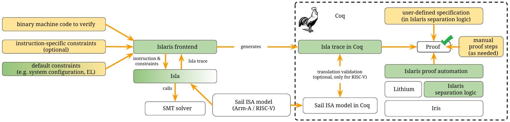
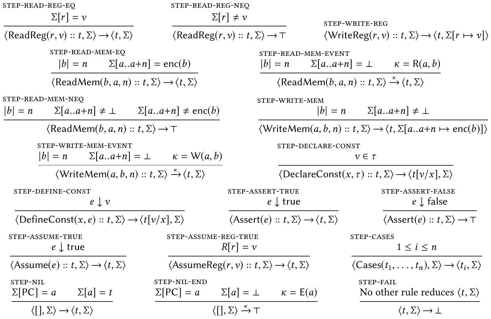

<!--
Third-party paper conversion for research use.
Authors: Michael Sammler, Angus Hammond, Rodolphe Lepigre, Brian Campbell,
Jean Pichon-Pharabod, Derek Dreyer, Deepak Garg, and Peter Sewell.
Original: https://doi.org/10.1145/3519939.3523434
License: CC BY 4.0 (https://creativecommons.org/licenses/by/4.0/).
Changes: PDF converted to Markdown with Mathpix; headings, footnotes, tables,
code blocks, and figure links were normalized, and extracted figures were
stored locally. Conversion completed 2026-07-30. The adjacent PDF remains the
source of truth.
-->

# Islaris: Verification of Machine Code Against Authoritative ISA Semantics

Michael Sammler<br>MPI-SWS[^campus]<br>Germany<br>msammler@mpi-sws.org

Angus Hammond<br>University of Cambridge<br>UK<br>angus.hammond@cl.cam.ac.uk

Rodolphe Lepigre<br>MPI-SWS<br>Germany<br>lepigre@mpi-sws.org

Brian Campbell<br>University of Edinburgh UK<br>Brian.Campbell@ed.ac.uk

Jean Pichon-Pharabod<br>Aarhus University<br>Denmark<br>jean.pichon@cs.au.dk

Derek Dreyer<br>MPI-SWS<br>Germany<br>dreyer@mpi-sws.org

Deepak Garg<br>MPI-SWS<br>Germany<br>dg@mpi-sws.org

Peter Sewell<br>University of Cambridge UK<br>Peter.Sewell@cl.cam.ac.uk


## Abstract

Recent years have seen great advances towards verifying large-scale systems code. However, these verifications are usually based on hand-written assembly or machine-code semantics for the underlying architecture that only cover a small part of the instruction set architecture (ISA). In contrast, other recent work has used Sail to establish formal models for large real-world architectures, including Armv8A and RISC-V, that are comprehensive (complete enough to boot an operating system or hypervisor) and authoritative (automatically derived from the Arm internal model and validated against the Arm validation suite, and adopted as the official formal specification by RISC-V International, respectively). But the scale and complexity of these models makes them challenging to use as a basis for verification.

In this paper, we propose Islaris, the first system to support verification of machine code above these complete and authoritative real-world ISA specifications. Islaris uses a novel combination of SMT-solver-based symbolic execution (the Isla symbolic executor) and automated reasoning in a foundational program logic (a new separation logic we derive using Iris in Coq). We show that this approach can handle Armv8-A and RISC-V machine code exercising a wide range of systems features, including installing and calling exception vectors, code parametric on a relocation address offset (from the production pKVM hypervisor); unaligned access faults; memory-mapped IO; and compiled C code using inline assembly and function pointers.


CCS Concepts: • Theory of computation → Separation logic; Logic and verification; Automated reasoning.

Keywords: assembly, verification, separation logic, proof automation, Iris, Isla, Sail, Coq, Arm, RISC-V

ACM Reference Format:
Michael Sammler, Angus Hammond, Rodolphe Lepigre, Brian Campbell, Jean Pichon-Pharabod, Derek Dreyer, Deepak Garg, and Peter Sewell. 2022. Islaris: Verification of Machine Code Against Authoritative ISA Semantics. In Proceedings of the 43rd ACM SIG-PLAN International Conference on Programming Language Design and Implementation (PLDI '22), June 13-17, 2022, San Diego, CA, USA. ACM, New York, NY, USA, 16 pages. https://doi.org/10.1145/3519939.3523434

## 1 Introduction

Program verification can be applied at many levels, from high-level languages to low-level assembly or machine code. Low-level code verification is desirable for three reasons. First, some critical code manipulates architectural features that are not exposed in higher-level languages, e.g., to access system registers to install exception vector tables, or to configure address translation; this is necessarily written in assembly. Second, machine code is the form in which programs are actually executed, so a verification can be grounded on the architecture semantics, without needing trust or verification of any compilation or assembly steps. One can moreover verify the machine code after any modifications introduced by linking or initialisation (perhaps parametrically w.r.t. these). Third, some code is written in assembly for performance reasons.

In low-level code verification, it remains a grand challenge to develop tools that are demonstrably sound w.r.t. the underlying architecture and support reasoning about all of it, including all systems features. There are several aspects to this. One is the relaxed-memory concurrency exhibited by modern hardware. For this, the underlying models for user code have been clarified [1, 2, 5, 51, 57, 59],[5, Ch.B2]; work on systems concurrency is in progress [52, 60, 61]; and researchers are starting to build low-level-code verifications targeting relaxed memory, e.g., for hypervisors [40].

Another key aspect-and the one we focus on here-is ensuring fidelity and completeness w.r.t. the underlying
instruction-set architecture (ISA), the sequential semantics of machine instructions. Until recently, the only option was to hand-write an ISA semantics, as several verification projects did, each for the fragment of the ISA they needed [2, 4, 19, 22, 27, 31, 33, 36-38, 43, 45, 58, 69]. These typically cover only a small user-level fragment of the ISA, are simplified in various ways, and have, at best, only limited validation with respect to the architectural intent or hardware implementations. For x86, there is a hand-written larger fragment in ACL2 [25], and empirical and hand-written models [16, 17, 30]. Others add models of some systems aspects [3, 10, 29, 36, 39, 40, 63, 65], but similarly without tight connections to production architecture definitions.

In contrast to the above, recent work has established sequential ISA models for Armv8-A and RISC-V, that are both comprehensive-complete enough to boot an operating system or hypervisor-and authoritative. These are expressed in the Sail ISA definition language [6, 8, 9, 44, 53]. For Armv8-A, the Sail model is automatically derived from the Arm-internal model and tested against the Arm-internal validation suite, while for RISC-V the hand-written Sail model has been adopted as the official formal specification by RISC-V International. This makes these attractive foundations for verification, providing high confidence that they accurately capture the architecture (and hence that the results of verification will hold above correct hardware implementations), and enabling verification about all aspects of the sequential ISA, especially the systems aspects that are key to security.

However, that fidelity and coverage also makes these models intimidatingly large and complex, and only sometimes practical for mechanised proof. The Sail Armv8.5-A and RISC-V models are 113k and 14k non-whitespace lines of specification, respectively. Sail generates Isabelle and Coq versions of these definitions. For Armv8-A, the former has been used for some metatheory [6, §8][9], but not for program verification, and in the Coq version even simple definition unfoldings take an unreasonably long time or fail to terminate.

To see how this complexity arises, consider the seemingly simple Armv8-A add sp,sp,64 instruction, adding 64 to the stack-pointer register. Some hand-written Arm semantics describe this in a single line [67], but its full Sail definition spans 146 lines in 9 functions, excerpted in Fig. 2. These do much more than just compute the addition: they compute arithmetic flags (discarded by this particular add instruction); they support subtraction as well as addition (irrelevant for this instance of the instruction); they support other registers; and sp is in fact a banked family of registers, selected based on the current exception level register value. A yet more extreme example is a "simple" ldrb instruction to load a byte. This involves over 2000 lines of specification, even without address translation, for alignment checks, big/little endianness, tagged memory, different address sizes and exception levels, and the store and prefetch instructions that are specified simultaneously.

The challenge we face, therefore, is how one can reason above such models while avoiding up-front idealisation, so that we retain the ability to reason about the whole architecture, and the confidence in the authoritative model.

In this paper, we present Islaris, a novel approach to machine-code verification that achieves the above. Our key insight is to realise that the verification problem can be split into two subtasks, separating the irrelevant complexity from the inherent complexity, so that each can then be solved by techniques well suited for the respective task: SMT-based symbolic evaluation, and a mechanised program logic.

The first step is to realise that, when verifying a concrete program under specific assumptions, many aspects of the ISA definition are irrelevant, because they do not influence the results of instructions or are ruled out by the system configuration. To handle this irrelevant complexity, we leverage and extend the Isla symbolic evaluation tool for Sail ISA specifications [7]. Isla takes an opcode and SMT constraints, e.g., that the exception-level register has a specific value or some general-purpose register is aligned, and symbolically evaluates the Sail model using an SMT solver. It produces a trace of the instruction's register and memory accesses, constrained by SMT formulas. Crucially, this can be much simpler than the full Sail definition, without irrelevant and unreachable parts, and is in a much simpler language.

That leaves the inherent complexity of verification, typically including address and memory manipulations, higherorder reasoning with code-pointers, reasoning about the relevant aspects of the systems architecture, and modular reasoning about user-defined specifications. Islaris addresses these with a higher-order separation logic for the Isla traces that produces machine-checkable proofs, based on Iris [32]. The key challenge is designing proof automation that makes the verification practical. Here, Islaris adapts Lithium, an automated (separation) logic programming language originally designed for the RefinedC type system [56]. In particular, we realise that Lithium's efficiency can be retained even without the type information relied on by RefinedC, by using the separation logic context to guide proof search. Overall, we obtain a level of proof automation comparable to previous foundational approaches [13, 41], but for full ISA semantics rather than a simple intermediate language.

Overview. Fig. 1 shows an overview of the Islaris workflow. First, the user passes the machine code to verify together with suitable constraints on the system state to the Islaris frontend, which invokes Isla to generate a trace describing the effects of the instructions based on the Sail ISA model. The generated trace has already been simplified by Isla, by pruning parts of the ISA specification that cannot be reached under the given constraints (Isla uses symbolic execution and an SMT solver for this pruning). The frontend outputs a deep embedding of this trace in Coq, which is then verified against a user-written specification using the Islaris


Figure 1. The Islaris workflow. White: from previous work. Green: new in this paper. Yellow: provided by the Islaris user.

proof automation, together with manual Coq proof if needed. For RISC-V, we also provide infrastructure to prove the Isla trace correct against the Coq ISA model generated directly from Sail.

Contributions. Our overarching contribution is this new approach for machine-code verification above complete and authoritative real-world ISA specifications, including systems features. The Islaris combination of Isla-based symbolic execution with an Iris-based program logic and Lithiumbased proof automation gives us practical tooling for verification above such models, which we demonstrate on a range of examples. All this is generic in the actual Sail model, applying equally to Armv8-A and RISC-V. We give:

- Operational semantics for the Isla trace language (§3).
- Improvements to Isla to support Islaris (also §3).
- An Iris-based separation logic for Isla traces with Lithium-based proof automation (§4).
- Translation validation infrastructure for RISC-V Isla traces, proving them correct with respect to the Coq model generated from Sail directly for RISC-V (§5).
- Demonstration that Islaris is able to handle Armv8-A and RISC-V machine code exercising a wide range of systems features (and interacting with many system registers), including installing and calling an exception vector, compiled C code using inline assembly and function pointers, using memory-mapped IO to interact with a UART device, and code that is parametric on a relocation address offset; the last of these is part of an exception handler from the production pKVM hypervisor under development at Google (§6).

Islaris, including its Coq development and case studies, is open-source [55].

Non-goals and limitations. The main contribution of this paper is to make it possible to reason above authoritative ISA semantics (especially the full Armv8-A ISA model) without upfront idealisation, which has not been done previously. This is important in two contexts: for the lowest, security-critical, layers of a software stack, and as a more solid foundation for large-scale verification of higher layers of a software stack. This paper focuses on the first. When the critical code is short, e.g., the pKVM exception-handler dispatch described in §6, Islaris as presented here can be applied directly. For the second, Islaris can provide a useful building block. However, demonstrating the use of Islaris on higher layers of a software stack is future work; Islaris as presented in this paper is not intended or claimed to replace general-purpose verification tools for such.

Islaris targets the verification of concrete machine code, where one has specific (or highly constrained) opcodes in hand, together with constraints on the system state, as the Isla symbolic evaluation can provide substantial simplification in such situations. For proving facts about all the instructions of an architecture, one would typically want a different approach, e.g., as in [6, §8][9]. For proving facts about a compiler, one might want to prove correctness of a simplified model, tuned to the subset of instructions it generates. In some cases, this could also be done using Islaris, but we do not explore this use-case here.

Ideally, the trusted computing base (TCB) would only include the ISA definitions and one proof assistant kernel. The basic Islaris approach adds Isla and the SMT solver to the TCB (but not the Islaris separation logic, which produces machinechecked proofs). We consider this a reasonable price to pay for the benefits Islaris provides. For additional assurance, we have explored post-hoc validation of the Isla output with respect to the Sail-generated Coq semantics (see §5). We have done this for RISC-V; for Armv8-A, the model size makes it challenging. Complete assurance is of course impossible: even the Arm-internal ISA definition, while well-validated in many ways, is surely not perfect; there is the possibility of error in the Sail-to-Coq translations; and full verification of the underlying hardware is not yet feasible.

The other main limitation is that Islaris currently assumes single-threaded execution. This is not inherent to our approach-Isla's output is generic in the underlying memory model, and supporting a sequentially consistent concurrency semantics would not be hard. However, supporting the Armv8-A or RISC-V relaxed-memory concurrency models requires a more sophisticated separation logic, the subject
of active research. Islaris also does not currently support self-modifying code or address translation, which involve additional forms of relaxed-memory concurrency, likewise subjects of active research [60, 61] (our underlying ISA semantics includes translation-table walks, but here we only use machine configurations that turn translation off). Finally, we have focused so far on 64-bit little-endian cases, and on small but tricky examples; scaling remains future work.

## 2 Overview of the Islaris Approach

In this section, we give a high-level presentation of the Islaris approach to machine-code verification. We explain how the complexity of raw Sail models is made manageable using the Isla symbolic evaluator in §2.1, and then show how Islaris builds a modular verification framework on Isla.

### 2.1 Background: Symbolic Execution with Isla

As already discussed in §1, in a real-world architecture the semantics of even seemingly simple instructions like an addition can be surprisingly complex. For example, consider the excerpt of the Sail semantics for the add sp,sp,64 instruction in Fig. 2. The decode64 entry point decodes an opcode and dispatches to many auxiliary functions expressing the register and memory accesses of its semantics. This size makes direct verification against these semantics challenging, which is why Islaris uses Isla. Isla [7] takes as input an opcode and a collection of SMT constraints on the machine state, and symbolically evaluates the Sail model w.r.t. those, pruning unreachable branches using an SMT solver. The result of such a symbolic evaluation for (the opcode of) add sp,sp,64 is the trace in Fig. 3. This describes the behaviour of the instruction using a small set of primitive constructs. Ignoring lines 2-5 for the moment, this trace first reads the value v38 from the stack pointer SP_EL2, on lines 6-7. This read is expressed by first declaring a new 64-bit bitvector variable v38 on line 6, and then setting it to the value of the SP_EL2 register on line 7. Then the trace computes v61 as the bitvector addition of v38 and 64 (0x40). It might seem curious that the addition is computed on 128-bit integers (by first zeroextending v38) from which the lowest 64 bits are extracted as the result (via (_ extract 63 0)); this is a vestige of the fact that the model also computes whether this addition overflows, used for other variants of add, but discards that in this case. Finally, the result in v61 is stored back into SP_EL2, and the _PC register is updated to point to the next instruction. This example shows that Isla can condense the 100+ executed lines of the original model down to the operations that one would expect of this add instruction: reading the stack pointer, computing the addition, writing the result back, and incrementing the program counter.

Isla has also simplified away the complexity from the banked stack pointer registers (which is not covered in some

```
function clause decode64
((_:bits(1) @ 0b0010001 @ _:bits(24) as opcode) if ...)={
Rd:bits(5)=opcode[4 .. 0]; Rn=...; imm2=...; sf=...; ...
integer_arithmetic_addsub_immediate_decode(Rd,Rn,...)}
function integer_arithmetic_addsub_immediate_decode(...)={
let 'd = UInt(Rd); ...
let 'datasize = if sf == 0b1 then 64 else 32;
imm : bits('datasize) = undefined : bits('datasize); ...
match shift {
0b00 => { imm = ZeroExtend(imm12, datasize) },
0b01 => { imm = ZeroExtend(imm12 @ Zeros(12), datasize)},
0b10 => { throw(Error_See("ADDG, SUBG")) },
0b11 => { ReservedValue() } };
integer_arithmetic_addsub_immediate(d,datasize,imm,...) }
function integer_arithmetic_addsub_immediate (...) = {
let op1 : bits('datasize) =
if eq_int(n, 31) then aget_SP(__id(datasize))
    else aget_X(__id(datasize), n); ...
if sub_op then { op2 = not_vec(op2); carry_in = 0b1 }
    else { carry_in = 0b0 }
let (tup__0, tup__1) = AddWithCarry(op1,op2,carry_in) in
...
if setflags then
{PSTATE={PSTATE with N=vector_subrange_A(nzcv,3,3)};...};
if and_bool(eq_int(d,31),not_bool(setflags)) then
{ aset_SP(result) } else { aset_X(d, result) } }
function AddWithCarry (x,y,carry_in) = { ... }
```

Figure 2. Excerpts of the 146-line Sail defn. of add sp,sp,64.

```
(trace
(assume-reg |PSTATE| ((_ field |EL|)) #b10)
(assume-reg |PSTATE| ((_ field |SP|)) #b1)
(read-reg |PSTATE| ((_ field |SP|)) (_ struct(|SP| #b1)))
(read-reg |PSTATE| ((_ field |EL|)) (_ struct(|EL| #b10)))
(declare-const v38 (_ BitVec 64))
(read-reg |SP_EL2| nil v38)
(define-const v61 (bvadd ((_ extract 63 0)
    ((_ zero_extend 64) v38)) #x0000000000000040))
(write-reg |SP_EL2| nil v61)
(declare-const v62 (_ BitVec 64))
(read-reg |_PC| nil v62)
(define-const v63 (bvadd v62 #x0000000000000004))
(write-reg |_PC| nil v63))
```

Figure 3. Isla trace of add sp, sp, 64 (opcode 0x910103ff).
handwritten models, notably excepting Fox [21]): Armv8-A has distinct exception levels for user, kernel, hypervisor, and monitor execution, and a stack pointer register for each. The stack pointer used by add sp,sp,64 is selected based on the EL and SP fields of the PSTATE register, where the first gives the current exception level and the second toggles whether the multiple stack pointers are enabled (when $\mathrm{SP}=0$ all exception levels use the stack pointer of exception level 0, SP_EL0). Typically, the values of EL and SP are fixed for a given piece of code, and thus it is clear which stack pointer

```
$e::=v|\operatorname{not}(e)| \operatorname{bvadd}\left(e_{1}, e_{2}\right) \mid \ldots$ (SMT-Expr)
$v::=b$ | true | false $|x| \ldots$ (Val)
$r::=\rho \mid \rho . f$ (Reg)
$\tau::=\operatorname{BitVec}(n) \mid$ Boolean | ... (Type)
$j::=\operatorname{ReadReg}(r, v) \mid$ WriteReg $(r, v)$ (Event)
    $\left|\operatorname{ReadMem}\left(v_{d}, v_{a}, n\right)\right| \operatorname{WriteMem}\left(v_{a}, v_{d}, n\right)$
    $|\operatorname{AssumeReg}(r, v)| \operatorname{DeclareConst}(x, \tau)$
    | DefineConst $(x, e)|\operatorname{Assert}(e)| \operatorname{Assume}(e)$
$t::=[]|j:: t| \operatorname{Cases}\left(t_{1}, \ldots, t_{n}\right)$ (Trace)
```

Figure 4. Syntax of the Isla trace language (ITL).
is used. Isla can exploit this knowledge to simplify the trace by adding constraints to the symbolic execution. Concretely, the trace in Fig. 3 was generated with the constraints EL=2 and $\mathrm{SP}=1$ (for code running at exception level 2 with multiple stack pointers enabled). As a consequence, the trace directly uses the stack pointer of exception level 2, SP_EL2, and the reads of SP and EL on lines 4-5 have been simplified to specify their concrete known values. Without these constraints, the trace distinguishes five cases (via the mechanism described in §2.4): one for $\mathrm{SP}=0$, and one for each of the four exception levels when $\mathrm{SP}=1$. The assumptions used by Isla are recorded in the trace via assume-reg on lines 2-3. These become proof obligations during verification, so one has to prove that SP and EL have their assumed values.

Isla trace language. The Sail ISA definition language is designed to be as simple as possible while still supporting readable definitions of full-scale ISAs, but it is still relatively complex, with a rich type structure (including lightweight dependent types for bitvector lengths) and complex control flow (first-order functions, pattern matching, and loops). In contrast, the Isla trace language, with syntax in Fig. 4 (as adapted for Islaris, and typeset in the mathematical form we use later), is simple: traces $t$ are trees of events $j$-register and memory accesses, augmented by declarations and definitions of SMT constants, and assertions, assumptions, and a Cases() construct for branching (explained in §2.4). We have already seen most of the trace language in Fig. 3. For example, $\operatorname{ReadReg}(\mathrm{R} 0, v)$ corresponds to (read-reg |R0| nil v), and DefineConst $(x, e)$ to (define-const x e). Events rely on SMT-lib expressions $e$, values $v$ containing bitvectors $b$ and booleans, register names $r$, and value types $\tau$.

### 2.2 Our Contribution: Islaris

After seeing how Isla can generate specialised traces for single instructions, we now describe how we use that in modular verification for machine code. §2.3 describes the Islaris separation logic for reasoning about Isla traces; §2.4 shows how Islaris handles branching; §2.5 discusses how complete functions are verified, with a simple memcpy example; §2.6 explains how Islaris can reason equally well about systems code, e.g., installing and calling an Armv8-A exception vector table; and §2.7 demonstrates that Islaris is not specific to Armv8-A but can also be used for RISC-V.

### 2.3 Islaris Separation Logic

The core of Islaris is the Islaris separation logic for reasoning about Isla traces. We present the logic using a Hoare double $\{P\} t$, which asserts that the Isla trace $t$ is safe assuming the precondition $P$ (technically, Islaris proves more than safety; see §4.2). Hoare doubles are commonly used in Hoare logics for assembly languages [13, 31], as the postconditions of Hoare triples are difficult to interpret with assembly's unstructured indirect jumps.

We now explain how we verify the addition to the SP_EL2 register on lines 6-10 of Fig. 3-the following implication, where $t_{S P}$ comprises those four Isla trace events:

$$
\left\{\text { SP_EL2 } \mapsto_{R}(b+64)\right\} t \Rightarrow\left\{\text { SP_EL2 } \mapsto_{R} b\right\} t_{S P}+t
$$

Intuitively, assuming that SP_EL2 initially contains the 64bit bitvector $b$, we have to show that after those four trace events, SP_EL2 contains $b+64$, where (+) is 64-bit bitvector addition (observe how the precondition on the left of the implication acts like a postcondition). Note that, similar to Myreen and Gordon [46], the Islaris separation logic uses a points-to predicate $r \mapsto_{R} v$ for asserting that register $r$ contains the value $v$. This is useful for dealing with the large number of registers in the full Armv8-A model, as irrelevant registers can easily be framed away.

To prove this implication, we first verify the read of the SP_EL2 register in two steps. First, the declaration of the v38 variable on line 6 is handled by hoare-declare-const (Fig. 5), which non-deterministically chooses a bitvector value $v$ to substitute for v38. This rule uses $v \in \tau$ to assert that the value $v$ has type $\tau$ (here, that $v$ is a 64-bit bitvector). Then, hoare-read-reg uses SP_EL2 $\mapsto_{R} b$ to determine that $v$ must be equal to $b$, i.e., it provides $v=b$ as an assumption for the following proof.

In contrast, in hoare-assume-reg, $v=v^{\prime}$ is an obligation. This use of "assume" might seem counter-intuitive, but it makes sense from the perspective of Isla: AssumeReg is an assumption used by Isla's symbolic execution. The same applies to the names of Assert and Assume discussed later.

The rest of the verification is straightforward: on line 8, define-const is handled by hoare-define-const which computes $b+64$ and, after some simplification, substitutes it for v61. Finally, the write of this value to SP_EL2 is verified using hoare-write-reg.

Islaris proof automation. Applying these proof steps by hand quickly becomes quite tedious, especially for more complex instructions with many events. Islaris thus provides

$$
\begin{aligned}
& \text { HOARE-DECLARE-CONST } \\
& \frac{\forall v \in \tau \cdot\{P\} t[v / x]}{\{P\} \text { DeclareConst }(x, \tau):: t}
\end{aligned}
$$

$$
\begin{aligned}
& \text { HOARE-WRITE-REG } \\
& \frac{\left\{r \mapsto_{R} v * P\right\} t}{\left\{r \mapsto_{R} v^{\prime} * P\right\} \text { WriteReg }(r, v):: t}
\end{aligned}
$$

$$
\begin{aligned}
& \text { HOARE-ASSUME } \\
& \frac{e \downarrow \text { true } \quad\{P\} t}{\{P\} \text { Assume }(e):: t}
\end{aligned}
$$

$$
\begin{aligned}
& \text { HOARE-INSTR } \\
& \frac{\left\{\text { PC } \mapsto_{R} a * \operatorname{instr}(a, t) * P\right\} t}{\left\{\text { PC } \mapsto_{R} a * \operatorname{instr}(a, t) * P\right\}[]}
\end{aligned}
$$

$$
\begin{aligned}
& \text { HOARE-INSTR-PRE } \\
& \frac{P * Q}{\left\{\mathrm{PC} \mapsto_{R} a * a @ @ Q * P\right\}[]}
\end{aligned}
$$

$$
\begin{aligned}
& \stackrel{\text { HOARE-READ-REG }}{\left\{r \mapsto_{R} v^{\prime} * v=v^{\prime} * P\right\} t} \\
& \left\{r \mapsto_{R} v^{\prime} * P\right\} \operatorname{ReadReg}(r, v):: t
\end{aligned}
$$

Figure 5. Key rules of the Islaris separation logic.

```
(trace
    (declare-const v27 (_ BitVec 1))
    (read-reg |PSTATE| ((_ field |Z|)) (_ struct (|Z| v27)))
    (define-const v37 (= v27 #b1))
    (cases
        (trace
            (assert v37)
            (declare-const v38 (_ BitVec 64))
            (read-reg |_PC| nil v38)
            (define-const v39 (bvadd v38 #xfffffffffffffff0))
            (define-const v52 v39)
            (write-reg |_PC| nil v52))
        (trace
            (assert (not v37))
            (declare-const v38 (_ BitVec 64))
            (read-reg |_PC| nil v38)
            (define-const v39 (bvadd v38 #x0000000000000004))
            (write-reg |_PC| nil v39))))
```

Figure 6. Isla trace of beq -16 (simplified).
proof automation that automatically completes the verification described above. We describe the automation in §4.3.

### 2.4 Intra-instruction Branching

The Sail semantics for a single instruction typically involves many Sail-language control-flow choices, e.g., to select among the Arm stack-pointer registers as mentioned in §2.1. In many cases, these are resolved by the assumed constraints, and the instruction's behaviour can be represented by a linear trace. But what if this is not the case? The canonical examples are conditional-jump instructions such as beq -16, jumping 16 bytes backwards if the zero flag is set, whose semantics include a Sail-level branch determined by the flag register (which is usually written by a preceding cmp instruction).

The Isla trace of beq -16 is shown in Fig. 6 (simplified for presentation to remove assumptions about nine different system registers). It reads the zero flag (pstate.z) on line 3 and computes the branching condition in v37 on line 4 (i.e., whether PSTATE.Z is set). The cases on line 5 expresses the control-flow choice by giving two subtraces. The subtraces begin with assertions about their respective branch conditions. The first asserts on line 7 that v37 is true (i.e., the zero flag is set) and subtracts 16 from _PC (expressed as addition of 0xfffffffffffffff0 in 64-bit arithmetic). The second subtrace asserts on line 14 that v37 is false (i.e., the zero flag is not set), and sets _PC to the address of the next instruction.

During verification, the cases construct is handled by hoare-cases, which requires verifying the subtraces independently. In this rule, both branches use the full separation logic precondition $P$, since the actual execution will follow only one branch. The asserts within the two branches are verified using hoare-assert. This rule provides the respective branching condition as an assumption within each branch (similar to hoare-read-reg). Overall, hoare-cases combined with hoare-assert works like the standard rule for an if-thenelse in other program logics. The rest of the trace is verified using the rules explained in §2.3.

All conditional execution is expressed using such cases, with unconstrained non-determinism over subtraces, followed by asserts providing additional assumptions implied by the choice of the case.

### 2.5 Verification of a Complete C Function: memcpy

So far, we have discussed how Islaris reasons about single instructions. Next, we turn to code containing multiple instructions. We illustrate this on the naive C memcpy implementation in Fig. 7, compiled to Arm using GCC.

Our goal is to show that the memcpy implementation satisfies the specification in Fig. 8. Lines 1, 2 of the specification encode the precondition on the registers used by memcpy. Following the Armv8-A ABI C calling convention, $\mathrm{x} 0, \mathrm{x} 1$, and x 2 contain the arguments d, s, and n; x3 and x4 are scratch registers; and x30 contains the return address $r$. Line 3 states that memcpy also requires ownership of standard system registers and the flags registers (like pstate. z). This is encoded using the reg_col(...) predicate, which is shorthand for a collection of register points-to assertions (described further in §4.1).

Finally, Line 4 asserts that the pointers $s$ and $d$ point to memory containing the lists of bytes $B_{s}$ and $B_{d}$ of length $n$, using the points-to predicate for arrays $\left(\mapsto_{M}^{*}\right)$ (see also §4.1).

```
void memcpy(unsigned char *d,
        unsigned char *s,
        size_t n) {
for (size_t i = 0; i < n; i++) {
    d[i] = s[i];
}
}
```

```
memcpy: cbz x2, .L1 ; if (x2 == 0) goto .L1;
    mov x3,0 ; x3 = 0;
ldrb w4, [x1, x3] ; w4 = *(x1 + x3);
strb w4, [x0, x3] ; *(x0 + x3) = w4;
add x3, x3, 1 ; x3 = x3 + 1;
cmp x2, x3 ; (with next line)
bne .L3 ; if (x2 != x3) goto .L3;
ret ; return;
```

```
memcpy: beqz a2, .L2
.L1: lb a3, 0(a1)
sb a3, 0(a0)
addi a2, a2, -1
addi a0, a0, 1
addi a1, a1, 1
bnez a2, .L1
ret
```

Figure 7. C implementation of a memcpy-like function (first column) together with Arm assembly (second column, compiled with GCC 11.2-02) and RISC-V assembly (third column, compiled with Clang 13.0.0-02). We actually verify the machine-code versions of this assembly. For readability, the Arm assembly is annotated with a simplified pseudocode version of its semantics.

$$
\begin{aligned}
& \mathrm{memcpy} \_ \text {spec } \triangleq \exists s_{d} n r B_{s} B_{d} . \\
& \mathrm{x} 0 \mapsto_{R} d * \mathrm{x} 1 \mapsto_{R} s * \mathrm{x} 2 \mapsto_{R} n * \\
& \mathrm{x} 3, \mathrm{w} 4 \mapsto_{R} \_* \mathrm{x} 30 \mapsto_{R} r * \\
& \mathrm{reg} \_ \text {col }\left(\mathrm{sys} \_ \text {regs }\right) * \text { reg } \_ \text {col }\left(\mathrm{CNVZ} \_ \text {regs }\right) * \\
& s \mapsto_{M}^{*} B_{s} * d \mapsto_{M}^{*} B_{d} * n=\left|B_{s}\right| * n=\left|B_{d}\right| * \\
& r @ @( \\
& \quad s \mapsto_{M}^{*} B_{s} * d \mapsto_{M}^{*} B_{s} * \\
& \quad \mathrm{x} 0, \mathrm{x} 1, \mathrm{x} 2, \mathrm{x} 3, \mathrm{w} 4, \mathrm{x} 30 \mapsto_{R} \_* \\
& \quad \text { reg_col(sys_regs) } * \text { reg_col(CNVZ_regs)) }
\end{aligned}
$$

is represented as the " $Q$ " of this assertion, i.e., as the precondition of memcpy's continuation. The verification of ret on line 8 uses hoare-instr-pre, and thus establishes the postcondition.

Verification of memcpy. The main task is to find a loop invariant $I$ for the code between . L 3 and .L1. Here, we use the invariant that the first $m$ bytes, where $m$ is the value of x3, have already been copied from $s$ to $d$, and the remaining bytes of $d$ are unchanged. With this invariant $I$, we establish .L3 @ @ I. The proof can assume that this assertion holds for later iterations of the loop, thanks to step-indexing in the underlying Iris logic.

The proof is almost completely automated by the Islaris proof automation. The proof automation handles all separation logic reasoning for the 169 events of the Isla traces in 9 seconds, and most generated sideconditions are automatically discharged via a solver for bitvectors provided by Islaris. The only manual steps are hints related to array indices that are accessed, and pure reasoning about lists to prove that one more byte is copied from $s$ to $d$ after each iteration of the loop.

### 2.6 Installing and Using an Exception Vector

The above memcpy is expressed in C, and the binary we verify uses only user-mode instructions, but because Islaris handles the full ISA, we can verify code that involves sequential aspects of the systems architecture, and system-mode instructions, in the same way, and just as easily and authoritatively. To illustrate this, we hand-wrote an Arm assembly program (Fig. 9) that sets up an exception vector table to handle hypervisor calls at exception level 2 (EL2), sets up the system state to transition to exception level 1 (EL1), and then performs a hypervisor call (hvc) at EL1, which is handled at EL2 before returning to EL1 with an eret. The exception handler for the hypervisor call is itself very simple: it sets the value of register ×0 to 42. This assembles, links, and runs correctly on a Raspberry Pi 3B+, and on QEMU.

The specification we prove for this code states that, upon reaching line 16, register ×0 contains the expected value 42. The interesting part of this verification is how Islaris handles the (changing) system configuration. The system configuration in the Sail models is largely held in registers. For

```
.org 0x80000
_start: ; *** initialisation at EL2 ***
    mov x0, 0xa0000
    msr vbar_el2, x0 ; Install exception vector
    mov x0, 0x80000000
    msr hcr_el2, x0 ; Hypervisor config: aarch64 at EL1
    mov x0, 0x3c4
    msr spsr_el2, x0 ; EL1 config (use SP_EL0, no interupts)
    mov x0, 0x90000
    msr elr_el2, x0 ; Write EL1 start address to ELR_EL2
    eret ; Simulate an "exception return"
.org 0x90000
enter_el1: ; *** calling the vector from EL1 ***
    mov x0, xzr ; Zero out x0.
    hvc 0 ; Perform a hypervisor call
    b . ; Hang forever in a loop
.org 0xa0000
el2_exception_vector:;*** the exception vector table ***
    ...
    ; Synchronous - Lower EL with AArch64
    mov x0, 42 ; Put 42 in x0
    eret ; Return from exception
```

Figure 9. Install and use an exception vector.

Armv8-A, these include around 500 system registers from the Arm ASL, alongside the normal general-purpose registers; the ASL/Sail definition refers to these in many places. An example is the hcr_el2 register which controls many aspects of the Armv8-A virtualization. Here, we care about bit 31 of hcr_el2 (set on line 6) which switches the EL1 exception level from 32-bit mode (AArch32) to 64-bit mode (AArch64). Reasoning about hcr_el2 is like reasoning about any other register: the Isla trace of msr hcr_el2, x0 contains a (write-reg |HCR_EL2| v0) event which is verified using hoarewrite-reg, turning HCR_EL2 $\mapsto_{R}$ _ into HCR_EL2 $\mapsto_{R}$ 0x80000000 (which is the word all of whose bits are 0, except the 31st bit, which is 1). The values of hcr_el2 and other system registers are passed to Isla to simplify the traces of the instructions running at EL1 (lines 14-16) and the HCR_EL2 $\mapsto_{R} 0 x 80000000$ assertion is used to discharge the corresponding assume-reg inserted by Isla.

### 2.7 RISC-V

We focused so far on Armv8-A, but it is important to note that almost everything presented here, including the tooling, is independent of the underlying architecture. To use Islaris as a verification tool for RISC-V code instead of Armv8-A code, one just needs to give the RISC-V Sail model instead of the Armv8-A Sail model to Isla, with a suitable assumption on the initial machine configuration. To demonstrate this, we compiled the memcpy C function from Fig. 7 for RISC-V using the mainstream Clang compiler, and verified the resulting code (third column in Fig. 7) using Islaris.

Although these two architectures differ greatly (e.g., in their definitions of memory accesses), we can use the same assertions and rules described earlier, as the Isla traces are expressed in the same language. The specification of memcpy is thus very similar between the two architectures, differing only in the calling convention, system registers, valid ranges of memory addresses, and the required alignment of the return address (the last two omitted for presentation). Crucially, the specifications use the same assertion language, and the Islaris proof automation works equally well for both architectures.

### 2.8 Verification Workflow

Having seen how various kinds of programs can be verified using Islaris, we recap the verification workflow when using Islaris.

The first step of Islaris-based verification is to run Isla with the right constraints to generate the instruction traces. For most instructions the default constraints suffice to generate sensible traces but more complex instructions (e.g. eret) require specialized constraints (e.g. on specific bits of hcr_el2). These constraints are usually determined by knowledge of the architecture, knowledge of the intended context and behaviour of the code, and interactive exploration using Isla. These constraints are enforced by the previously explained assume and assume-reg events.

The next step is to write a specification for the code and use the proof automation to discharge the separation logic reasoning. These steps are often intertwined as one often interactively modifies the specification (e.g. adding register points-to assertions) and re-runs the proof automation until it successfully discharges the separation logic reasoning. For large examples one can use intermediate specifications for chunks of code to make this process faster.

After the separation logic reasoning is discharged, the last step is to solve the pure sideconditions generated by the verification. These are usually discharged by a combination of automatic solvers and manual reasoning, depending on the exact nature of the side conditions.

## 3 Isla Trace Language

The Isla trace language (ITL) was originally developed solely for SMT-based symbolic execution [7]. This section describes our operational semantics for ITL (as enhanced to support this work) that enables reasoning about Isla traces in Coq.

Traces, whose syntax is given in Fig. 4, are reduced from left to right using the rules of Fig. 10. The operational semantics is a labeled transition system over machine configurations $\sigma$. A machine configuration can either be a pair $\langle t, \Sigma\rangle$ of a trace $t$ and a machine state, or a final configuration ⟂ or T (denoting failure and successful termination). The single-step relation $(\xrightarrow{\kappa})$ is annotated with an (optional) label $\kappa$ representing externally visible events, which are then accumulated by the multi-step relation $\left.(\xrightarrow{\kappa s})^{*}\right)$ in $\kappa s$.

$$
\kappa::=\mathrm{R}\left(a, v_{d}\right)\left|\mathrm{W}\left(a, v_{d}\right)\right| \mathrm{E}(a)
$$


Figure 10. Operational semantics of the Isla trace language.

Most reduction rules inspect and/or modify the machine state $\Sigma$, which is a triple $(R, I, M)$ of finite partial maps.
$R:$ Reg ⇀ Val $\quad I:$ Addr ⇀ Trace $\quad M:$ Addr ⇀ Byte The register map $R$ associates registers with their value (e.g., a bitvector), the instruction map $I$ associates addresses (i.e., 64bit bitvectors) to Isla traces (i.e., the trace for the instruction stored at the address), and the memory map $M$ associates addresses to bytes (i.e., 8-bit bitvectors). Assuming $\Sigma=(R, I, M)$, we write $\Sigma[r]$ for $R[r]$ and $\Sigma[r \mapsto v]$ for $(R[r \mapsto v], I, M)$, and similarly for $I$ and $M$.

Non-determinism. The operational semantics of ITL are non-standard, because ITL is based on SMT constraints, not designed as a programming language. One therefore first introduces new (symbolic) variables via declare-const, which are then restricted by later constructs like read-reg or assert, as seen e.g., in Fig. 3 (in a more standard programming language, the read would return a value). To model this, the operational semantics of ITL makes heavy use of non-determinism: the operational semantics of DeclareConst $(x, \tau):: t$ (given by step-declare-const) nondeterministically picks a value $v$ of type $\tau$ and substitute it for $x$ in $t$. This non-determinism is then restricted by events later in the trace. For example, the operational semantics of $\operatorname{ReadReg}(r, v)$ compares $v$ with the value stored in $r$, and only allows further execution if the two values coincide (step-read-reg-eq). Otherwise, execution terminates in the state T (step-read-reg-neq), and thus these executions do not have to be considered further during verification. Overall, this leads to the proof rule hoare-read-reg in Fig. 5. Note that the use of $\top$ instead of ⟂ is crucial here, as otherwise it would be trivial to reach ⟂ by picking a wrong value in STEP-DECLARE-CONST.

Non-determinism is also used for branching, as explained in §2.4. Traces of instructions with branching (e.g., conditional jumps) typically contain a Cases $\left(t_{1}, t_{2}\right)$ that splits the trace into multiple subtraces. The operational semantics nondeterministically picks one of these subtraces (step-cases), but this non-determinism is then restricted by Assert events on each subtrace. An $\operatorname{Assert}(e)$ ensures that one only has to consider this subtrace if $e$ evaluates to true (step-asserttrue, using a standard big-step semantics of SMT expressions $e \downarrow v$ ). Otherwise, execution terminates with T, and this subtrace can be ignored (step-assert-false). So, intuitively, an Assert can be seen as an assertion proven by Isla during symbolic execution and assumed by verification.

The dual of these assertions are assumptions used by Isla to simplify the trace. These are encoded using Assume and AssumeReg, which behave like Assert and ReadReg, except
that they terminate in the failure state ⟂, instead of T (stepfail). One therefore has to prove during verification that these assumptions used by Isla hold (since the verification ensures that ⟂ is not reachable).

Memory events. The ITL memory events ReadMem and WriteMem are similar to the corresponding register events, except that they read and write (little-endian) bitvectors from and to memory (enc $(b)$ denotes the little-endian encoding of bitvector $b$ and $|b|$ the number of bytes in this encoding). Reads and writes for unmapped memory (stepread-mem-event and step-write-mem-event) are treated as externally visible events, modeling interaction with devices via memory-mapped IO. This will be important for the adequacy of the Islaris separation logic (§4.2).

Instruction fetch. At the end of the trace of an instruction (configuration of the form $\langle[], \Sigma\rangle$ ), rule (step-nil) retrieves the address of the next instruction from the PC register, and loads the trace of the next instruction from the instruction map. If there is no such trace, the operational semantics terminates with the visible event $\mathrm{E}(a)$ (step-nilend). (The name of the PC register is the only part of the operational semantics that is specific to the underlying Sail model.)

Improvements to ITL and Isla. To support Islaris, we had to improve ITL and Isla in various ways. We added Assume and AssumeReg to encode the assumptions used by Isla, and Cases to retain the tree structure of executions (previously Isla generated a set of linear traces). Additionally, Isla now preserves more of the useful variable names of the Sail models, has deterministic variable names and subtrace orderings, performs some additional simplification of traces, has a new interface for stating assumptions, and supports symbolic immediate operands (not just fully concrete opcodes). Islaris includes tooling to generate the Coq embedding of the Isla traces for the opcodes in an annotated objdump file.

## 4 Islaris Separation Logic

This section presents the Islaris separation logic: the interesting assertions and rules not already in §2 (§4.1 and Fig. 11), the adequacy theorem (§4.2), and proof automation (§4.3).

### 4.1 Assertions and Rules

Register collections. We have already seen the $r \mapsto_{R} v$ assertion, asserting that the register $r$ contains the value $v$, with its corresponding rules, in Fig. 5 (§2.3). The Islaris separation logic additionally provides the reg_col( $C$ ) assertion that collects a set of $r \mapsto_{R} v$ into a single assertion via a big separating conjunction. This is useful to deal with large numbers of registers. For example, reg_col(sys_regs) asserts the values of commonly used systems registers like PSTATE. SP. One can remove and add elements from reg_col( $C$ ) via eqreg-col-reg, and with this rule it is straightforward to derive rules for the register operations (e.g., hoare-read-reg-col).

Memory. The main assertion about memory is $a \mapsto_{M} b$, which asserts that the memory at address $a$ stores the (littleendian encoded) bitvector $b$. The rule hoare-read-mem for reading memory behaves similarly to the corresponding rule for registers, except that one has to check that the number of bytes of $b,|b|$, corresponds to the size of the read. The rule for writing works accordingly, and is omitted for brevity. Islaris also provides the $a \mapsto_{M}^{*} B$ assertion to handle arrays of bitvectors $B$, since arrays are common in low-level code. The rules for this assertion (e.g., hoare-read-mem-array) can be easily derived from the rules for $a \mapsto_{M} b$.

### 4.2 Adequacy of the Islaris Separation Logic

Islaris's adequacy theorem describes the guarantee that a successful verification provides. There are two parts to this guarantee. First, Islaris proves that the program never reaches the ⟂ state, and thus that all assumptions used by Isla hold. Second, Islaris proves a (user-defined) safety property about the externally visible behaviour of the program (i.e., reads and writes to unmapped memory and termination as described in §3). For this, Islaris provides the $\operatorname{spec}(s)$ assertion stating that the externally visible behaviour of the program satisfies the specification $s$ given as a set of label sequences. This assertion is used in the following rule for reading from unmapped memory (there is a similar rule for writing):

$$
\begin{aligned}
& \text { HOARE-READ-MEM-MMIO } \\
& \qquad|b|=n \\
& \frac{\left\{a \mapsto_{M}^{I O} n * \operatorname{spec}(\{\kappa s \mid \operatorname{R}(a, b)] \in s\right.}{\left\{a \mapsto_{M}^{I O} n * \operatorname{spec}(s) * P\right\} \operatorname{Read} M e m(b, a, n):: t}
\end{aligned}
$$

When reading a value $v$ from unmapped memory at address $a$ (witnessed by the assertion $a \mapsto_{M}^{I O} n$ ), one has to prove that the event $\mathrm{R}(a, v)$ is allowed by the spec $s$ and the rest of the execution can only produce events $\kappa s$ where $\mathrm{R}(a, b):: \kappa s \in s$.

We can now state adequacy for Islaris:
Theorem 1 (Adequacy). For all initial states $\Sigma=(R, I, M)$ with $P_{I}=\mathbb{*}_{I[a]=t} \operatorname{instr}(a, t), P_{M}=\mathbb{*}_{M[a]=b} a \mapsto_{M} b$, and $P_{I O}=*_{M[a]=\perp} a \mapsto_{M}^{I O} 1$, the following rule is sound:

$$
\frac{\left\{\operatorname{reg} \_\operatorname{col}(R) * P_{I} * P_{M} * P_{I O} * \operatorname{spec}(s)\right\}[] \quad\langle[], \Sigma\rangle \xrightarrow{\kappa s *} \sigma}{\sigma \neq \perp \wedge \kappa s \in s}
$$

This captures the above intuition: for all initial states $\Sigma$, if one can prove a Hoare double assuming all the ownership from the initial state and $\operatorname{spec}(s)$, executions from this initial state never reach ⟂, and the produced events satisfy $s$.

### 4.3 Islaris Proof Automation

While the above rules allow the verification of machine-code programs, using them directly would be quite tedious, since Isla expands every instruction to several ITL events. Thus,

$$
\begin{aligned}
& \text { EQ-REG-COL-REG } \\
& \frac{(r, v) \in C}{\operatorname{reg} \_ \text {col }(C) \dashv \vdash \text { reg_col }(C \backslash(r, v)) * r \mapsto_{R} v}
\end{aligned}
$$

HOARE-READ-MEM

$$
\frac{\left|b^{\prime}\right|=|b|=n \quad\left\{a \mapsto_{M} b * b=b^{\prime} * P\right\} t}{\left\{a \mapsto_{M} b * P\right\} \operatorname{ReadMem}\left(b^{\prime}, a, n\right):: t}
$$

HOARE-READ-REG-COL

$$
\frac{\left(r, v^{\prime}\right) \in C \quad\left\{\operatorname{reg} \_ \text {col }(C) * v=v^{\prime} * P\right\} t}{\left\{\operatorname{reg} \_ \text {col }(C) * P\right\} \operatorname{Read} \operatorname{Reg}(r, v):: t}
$$

HOARE-READ-MEM-ARRAY

$$
\frac{0 \leq i<|B| \quad\left|b^{\prime}\right|=\left|B_{i}\right|=n \quad\left\{a \mapsto_{M}^{*} B * B_{i}=b^{\prime} * P\right\} t}{\left\{a \mapsto_{M}^{*} B * P\right\} \operatorname{ReadMem}\left(b^{\prime}, a+i * n, n\right):: t}
$$

Figure 11. Selected rules of the Islaris separation logic.
a crucial part of Islaris is proof automation, which is challenging because it should simultaneously be comprehensive (covering as much reasoning as possible), and efficient. Prior work on RefinedC [56] addressed this problem using efficient and predictable logic programming (backchaining proof search) in a fragment of separation logic, called Lithium. Efficiency is obtained by avoiding backtracking during proof search. However, there is a fundamental challenge when applying Lithium to Islaris: RefinedC avoids backtracking by using rich types and the structure of source C programs to guide Lithium's proof search. However, Islaris has no types and, additionally, most of the source program structure has been lost. Up front, it is unclear how to avoid expensive backtracking during proof search.

Our key insight is that-with some effort-backtracking can also be avoided using the separation logic context, which is available in Islaris. We illustrate this using $\operatorname{Read} \operatorname{Reg}(r, v)$. Let us start by considering the following naive representations of hoare-read-reg and hoare-read-reg-col in Lithium:

$$
\begin{aligned}
& \text { LI-READ-REG-NAIVE } \\
& \frac{\exists v^{\prime} \cdot r \mapsto_{R} v^{\prime} *\left(v=v^{\prime} * r \mapsto_{R} v^{\prime} * \text { wp } t\right)}{\text { wp } \operatorname{ReadReg}(r, v):: t}
\end{aligned}
$$

LI-READ-REG-COL-NAIVE

$$
\frac{\exists C v^{\prime} . \text { reg_col }(C) *\left(r, v^{\prime}\right) \in C *\left(v=v^{\prime} * \text { reg_col }(C) * \text { wp } t\right)}{\text { wp } \operatorname{ReadReg}(r, v):: t}
$$

These rules are stated using Iris's weakest precondition, wp $t$ (Hoare doubles are defined as $\{P\} t \triangleq P * \mathrm{wp} t$ ). They apply when the automation needs to verify a trace starting with ReadReg $(r, v)$. Rule li-read-reg-naive instructs Lithium to find an assertion $r \mapsto_{R} v^{\prime}$ in the context, add the assumptions $v=v^{\prime}$ and $r \mapsto_{R} v^{\prime}$ to the context, and finally continue with proving wp $t$. Rule li-read-reg-col-naive is similar except that it requires finding reg_col $(C)$ and proving $\left(r, v^{\prime}\right) \in C$.

There are two problems when doing proof search with these two rules. (1) It is not clear which rule to apply when verifying a trace starting with ReadReg. One solution is to try each rule in turn, but this requires backtracking and makes proof search inefficient. (2) A similar issue arises with rule li-read-reg-col-naive alone in cases where the context contains multiple register collections: finding the appropriate one also requires backtracking.

Our solution to these problems is to extend Lithium with a new instruction $\operatorname{find}_{R}(r)$ that searches for $r$ in the separation logic context, which we then use to replace the two rules above with a single rule that does not require backtracking:

$$
\begin{gathered}
\text { find }_{R}(r)\left\{\begin{array}{cc}
v=v^{\prime} * r \mapsto_{R} v^{\prime} * \text { wp } t & \text { if } v^{\prime} \\
\exists v^{\prime} .\left(r, v^{\prime}\right) \in C & \text { if } C \\
*\left(v=v^{\prime} * \text { reg_col }(C) * \text { wp } t\right) &
\end{array}\right\}
\end{gathered}
$$

If find ${ }_{R}(r)$ finds $r \mapsto_{R} v^{\prime}$, then the rule above goes into the first branch (corresponding to li-read-reg-naive). If find ${ }_{R}(r)$ finds reg_col $(C)$ with $\left(r, \_\right) \in C$, the rule goes into the second branch (corresponding to li-read-reg-col-naive).

In effect, we have solved the problems above by shifting the role of backtracking over nondeterministic rules to a deterministic instruction $\operatorname{find}_{R}(r)$ which looks through the separation logic context efficiently.

A similar instruction $\operatorname{find}_{M}(a)$ is used to decide between the rules for memory points-to predicates (hoare-readmem, hoare-read-mem-array, and hoare-read-mem-mmio). It searches the context for an $a^{\prime} \mapsto_{M} b, a^{\prime} \mapsto_{M}^{*} B$, or $a^{\prime} \mapsto_{M}^{I O} n$ assertion that contains the address $a$. Checking this containment requires querying a bitvector solver, as $a$ is usually a complex bitvector expression computed by the Sail model.

## 5 Translation Validation of Islaris w.r.t. Sail-Generated Coq for RISC-V

To explore whether one can remove Isla and the SMT solver from the Islaris TCB, we built infrastructure to prove (in Coq) correctness of the Isla-generated traces with respect to the Coq definitions generated by Sail from the Sail RISC-V model. This is a form of translation validation, rather than an up-front correctness proof of Isla: given an Isla-generated trace, the infrastructure can be used to prove that the trace is refined by the Sail-generated Coq model. This proof can then be composed with Theorem 1 to obtain a theorem that only mentions the Sail-generated Coq model and the user-written specification, without Isla or the Islaris separation logic. We have also investigated this approach for Armv8-A but found it infeasible, since the size of the Armv8-A model means it cannot be manipulated efficiently in Coq.

We first define an operational semantics for the free monad used by the Sail-generated Coq model, with constructors corresponding to the ITL events in Fig. 4. The state of this semantics is similar to that of ITL except that the current instruction is an element $m$ of the monad, instead of an ITL trace, and the instructions $I_{\text {Coq }}$ are represented as bitvector opcodes not Isla traces. We then define a notion of refinement $\sigma_{\text {Coq }} \sqsubseteq \sigma_{\text {ITL }}$. Crucially, when proving such refinements one can use the assumptions given by Assume and AssumeReg. Finally, we prove this refinement by establishing a simulation $m \sim t$ between the instructions (Done initiates the fetch of the next instruction, similar to []):

Theorem 2 (Isla validation).

$$
\frac{\forall a . I_{\text {Coq }}[a] \sim I_{\text {ITL }}[a]}{\left\langle\text { Done },\left(R, I_{\text {Coq }}, M\right)\right\rangle \sqsubseteq\left\langle[],\left(R, I_{\text {ITL }}, M\right)\right\rangle}
$$

To evaluate this infrastructure, we have proven $m \sim t$ for all instructions that appear in the RISC-V memcpy binary. The proofs are mostly automated using custom tactics, but require a few manual steps to match the branches of the Coq model to the subtraces of the Isla trace, and to check some facts that were automatically proven by the SMT solver. We also used this infrastructure to obtain a closed statement about a simple program that only mentions the Coq model and the user-defined specification. Overall, this shows that the operational semantics described in §3 is sensible (especially its use of non-determinism and Assert vs. Assume), and increases confidence in our use of Isla and the underlying SMT solver, showing that this example does not trigger any bugs in those. We did find a bit-flip bug in a primitive used by the Sail-generated Coq (not previously thoroughly exercised).

## 6 Evaluation

We demonstrate that Islaris supports practical verification of a range of system software idioms. Our examples are not large in instruction count, but direct proofs above the Arm and RISC-V ISA models would require reasoning about many thousands of lines of those specifications, and they involve many system registers. They include part of a real-world exception handler that installs a new exception vector, and that is parametric on a relocation address offset; faulting from misaligned accesses; memory-mapped IO; and production C compiler output with inline assembly and function pointers. The hvc and memcpy examples are in §2.

Relocation-parametric real-world code: pKVM exception handler. This is part of an exception handler taken from real-world code, namely the pKVM hypervisor under development by Google. The handler branches to one of two sub-handlers, depending on the cause of the exception and the value of a hypercall parameter. We assume one of these to be correct, as it calls into the large pKVM C codebase, but verify the hypercalls handled by the other, two of which replace the exception vector table-in total interacting with 49 different system registers. The verification establishes that that each hypercall returns to the correct address at the correct exception level with appropriately updated system state.

This example exercises Islaris's ability to handle parametric traces. The hypervisor code is loaded into memory at an address offset determined at runtime, so a branch from the handler into the rest of the hypervisor needs to be adapted to that offset. This is done during initialisation by patching four Armv8-A instructions, that each load a 16-bit immediate, to use the appropriate parts of the correct value. We thus have to verify a family of programs, one for each possible offset value. To achieve this, we use Isla's support for partially symbolic opcodes to generate traces for these instructions that are parametric in their immediate values. We can then verify for all offsets that the patched code will branch to the correct address.

The example also requires reasoning about an instruction under somewhat relaxed constraints. The two hypercalls that update the exception vector table (HVC_SOFT_RESTART and HVC_RESET_VECTORS) both conclude with the same block of code, ending in an eret instruction to return from the exception. The eret instruction uses the SPSR register to determine the values of various registers to be restored at the termination of an exception handler. However the HVC_SOFT_RESTART hypercall updates SPSR so that eret returns to exception level 2 (rather than the exception level of the caller)-this is necessary during the initialisation of the hypervisor. Unfortunately this means neither the original nor the updated value of SPSR can be used to simplify the traces for eret. Instead we give a more complex constraint, capturing both possible values. This results in a set of traces simple enough that we can prove in Coq which traces are relevant for each fixed value of SPSR. This allows us to recover fully simplified reasoning.

Unaligned access faults. To show how one can reason accurately about faults, we verified a misaligned store w.r.t. an Armv8-A configuration in which this raises an exception. We prove it jumps to the correct exception handler, saves the PC and PSTATE registers, masks interrupts, and updates the exception syndrome and fault address registers.

Interaction with MMIO: UART. To evaluate Islaris's capabilities to verify interaction with memory-mapped IO, we have verified the binary for the following C function, writing a character to a memory-mapped UART.

```
void uart1_putc(char c) {
    while(!(*LSR & LSR_TX_EMPTY)) { asm volatile("nop"); }
    *IO = (u32) c; }
```

The code polls whether the UART is ready to receive an input and then writes c to a special 10 memory location; it runs on a Raspberry Pi 3B+ and in QEMU. We verified the

| Test | ISA | asm lines | ITL lines | Spec lines | Proof lines | Isla time (s) | Coq time (s) |
| :--- | :--- | ---: | ---: | ---: | ---: | ---: | :--- |
| memcpy | Arm | 8 | 169 | 20 | 55 | 6 | 9/2/8/- |
| memcpy | RV | 8 | 134 | 19 | 54 | 1 | 10/4/7/- |
| hvc | Arm | 13 | 436 | 93 | 5 | 10 | 28/5/25/- |
| pKVM | Arm | 47 | 1070 | 159 | 232 | 37 | 67/16/62/16 |
| unaligned | Arm | 1 | 104 | 89 | 29 | 2 | 10/12/24/- |
| UART | Arm | 14 | 207 | 33 | 42 | 10 | 9/3/6/- |
| rbit | Arm | 2 | 26 | 18 | 27 | 3 | 4/73/54/- |
| bin.search | Arm | 32 | 741 | 25 | 146 | 25 | 54/16/37/19 |
| bin.search | RV | 48 | 801 | 25 | 108 | 5 | 63/22/37/21 |

Figure 12. Example sizes and times.

specification:

$$
\operatorname{srec}(R . \exists b . \operatorname{scons}(\mathrm{R}(\mathrm{LSR}, b), b[5] ? \operatorname{scons}(\mathrm{~W}(\mathrm{IO}, c), s): R)))
$$

This uses a loop (encoded via the least fixpoint combinator srec) to read $b$ from the memory-mapped location LSR (via $\operatorname{scons}(\kappa, s)$ which prepends $\kappa$ to the elements in $s$ ). If the fifth bit of $b$ (corresponding to LSR_TX_EMPTY) is set, the UART is ready to receive input and the character $c$ is written to the memory-mapped IO register, and the specification continues with $s$. Otherwise, it tries again.

C inline assembly: rbit. C code using inline assembly is often challenging for C verification tools, but not for Islaris, which applies to the compiled machine code. We show this by verifying a (compiled) C function that reverses the bits of its argument via an inline rbit instruction. The combination of C and assembly is handled automatically, with manual proof needed only to relate the complex bitvector term produced by Isla to the function's intuitive specification.

Higher-order reasoning: Binary search. C supports a limited form of higher-order functions, via function pointers. To show how Islaris handles this, we verified a binary search implementation that is parametric over the comparison function (based on an example in Sammler et al. [56]). The implementation is written in C and compiled with clang -02. In the verification, the function pointer is encoded via the $a$ @ $@ P$ assertion and a formalization of the Arm AArch64 ABI C calling convention. Since this encoding only uses standard Islaris constructs, Islaris handles reasoning about the function pointer automatically.

RISC-V: Binary search and memcpy. To demonstrate that Islaris is not specific to a single ISA, we compiled and verified the binary for RISC-V, in addition to Armv8-A, for our two platform-independent case studies: the memcpy of §2, and the binary search. As already described in §2.7, the Islaris separation logic and most of the tooling is shared between the two ISAs. Only the (system) registers, calling convention, and some sideconditions had to be adapted.

Proof sizes and times. The main goal of Islaris is to make it possible and practical to verify machine code above these authoritative models, which was not previously possible. Practicality requires a reasonable level of performance. Fig. 12 gives the proof sizes and the Isla and Coq proof times for our examples. Proof size is the number of manuallywritten lines, including any loop invariants. The Coq time is subdivided by '/'s into the Lithium-based proof automation (second step in §2.8), custom tactics to solve sideconditions (third step in §2.8), and the Qed check of the generated proof term (this check happens after the programmer finishes the interactive proof). The larger case studies use intermediate specifications for some instructions to let these be verified in parallel; these are the last times given. Times were collected with a populated lia cache on an 8-core Intel CORE i7 8th Gen laptop with 24 GB RAM. Isla and the instruction specification proofs are parallelised. Overall, this shows that Islaris is already a practical tool for verifying challenging case studies against the full Armv8-A and RISC-V models, but further performance improvements are possible (especially when using many registers and in the bitvector automation).

## 7 Related Work

There have been many approaches to verification of assembly and machine code, using a wide variety of underlying models. Here, we compare to the most relevant related work.

L3 and decompilation into logic. Some closely related work uses L3 [20, 21], which is a well-developed ISA specification language broadly similar to Sail, but with a simpler type system. L3 comes with hand-written models of ISA fragments of several architectures (ARMv4-7, ARMv8, MIPS, x86, and RISC-V) that can be extracted to HOL4 and Isabelle/HOL. The main reasoning support in HOL4 is provided by per-architecture hand-written step libraries, which provide an equational view of individual instructions; CakeML [23] builds directly on these libraries and Myreen and Gordon [46] build a separation logic using them. This logic is significantly simpler than the Iris-based Islaris separation logic; in particular, it does not support higher-order specifications for code pointers. It is then integrated into the decompilation into logic approach [45, 47, 48], which produces HOL functions that are equivalent to the machine code. This process has the advantage that it does not rely on an external SMT-solver, but the L3 models of Armv8 and RISC-V have substantially less coverage than the Sail models used here, and it is unclear whether the approach would scale to these larger models. Campbell and Stark [11] automate construction of step libraries using symbolic execution, similar to our use of Isla, but for test generation rather than verification.

ACL2 X86isa model. The ACL2 X86isa model [24-26] gives a detailed and well-validated description of a large
fragment of the x86 architecture, including both user- and system-level instructions. The model comes with a large proof library for verifying programs via direct reasoning about the model and its state. However, unlike Islaris, X86isa does not provide a high-level separation logic. As a consequence, the proofs become quite large-e.g., Goel et al. [26] report thousands of lines for a simple example. In contrast, Islaris proofs for similar-scale examples are usually one to two orders of magnitude smaller thanks to its proof automation. One reason for this difference is that X86isa requires explicit disjointness reasoning about memory regions that are automatically handled via separation logic in Islaris.

Higher-order separation logic for assembly. Jensen et al. [31] provide a separation logic for a fragment of x86 assembly [33] in Coq. Its key feature is a higher-order frame connective that gives nice reasoning principles for jumps to unknown code. We achieve similar reasoning principles via the wp $t$ connective described in §4.3 that is based on the standard Iris weakest precondition.

Bedrock [13, 14, 41] provides a separation logic for a custom intermediate language in Coq with a focus on proof automation. Bedrock inspired the $a$ @ $@ P$ connective for handling code pointers. Bedrock's annotation overhead for verifying a memcpy function [66] is comparable to Islaris's for the similar memcpy function described in §2.5, with roughly comparable performance, even though Bedrock targets a much simpler intermediate language rather than full ISA semantics (~45s for Bedrock vs. ~30s for Islaris on the same machine, but with an older version of Coq for Bedrock).

Both approaches use models that are simple enough that they can be handled directly in Coq without SMT-based simplification, and both are specific to concrete languages, while Islaris works for multiple ISAs specified in Sail.

Large-scale systems verification efforts. There have been several successful efforts to verify large-scale systems w.r.t. assembly code, but based on low-level semantics that are considerably less authoritative and complete compared with the models used by Islaris. The PROSPER project [10, 29] and seL4 [34] manually extend the L3 models described above with the systems features they need. The verified concurrent kernel CertiKOS and hypervisor SeKVM [12, 28, 39, 40, 65] use CompCert's [37] assembly semantics and add various models of some systems aspects. The assembly verification of the VerisoftXT project (that verified parts of the Hyper-V hypervisor [36]) uses Vx86 [42] to translate x86 assembly code including some virtualization extensions to C code that can then be verified using VCC [15]. Syeda and Klein [62] build a program logic for address translation for Armv7-A.

Erbsen et al. [18] provide an integrated verification of an embedded system across hardware and software that includes direct verification of application code against the MIT RISC-V formalization (which is roughly comparable to the Sail-based RISC-V formalization [68]). Since RISC-V is comparatively small, it is not surprising that direct proofs against this model are possible, but it is unclear whether this approach would scale to significantly more complex models like Armv8-A. Also, all the work by Erbsen et al. [18] is specific to RISC-V while Islaris applies generically to Armv8-A and RISC-V.

Push-button verification of assembly code. Serval [49] achieved impressive push-button verification w.r.t. small hand-written models of x86 and RISC-V, using SMT-based symbolic execution. However, Serval does not support modular Hoare-style reasoning as provided by Islaris, and only works for programs with bounded loops.

Separation logic automation. There is a large body of prior work on automatic solvers for separation logic [35, 50, 54, 64]. While these tools can provide a higher degree of automation than Islaris's Lithium-based proof automation, they are usually designed for higher-level languages and do not support higher-order features like the $a @$ @ $P$ assertion.

## Acknowledgments

This research was supported in part by a European Research Council (ERC) Consolidator Grant for the project "RustBelt", funded under the European Union's Horizon 2020 Framework Programme (grant agreement no. 683289), in part by a European Research Council (ERC) Advanced Grant "ELVER" under the European Union's Horizon 2020 research and innovation programme (grant agreement no. 789108), in part by the UK Government Industrial Strategy Challenge Fund (ISCF) under the Digital Security by Design (DSbD) Programme, to deliver a DSbDtech enabled digital platform (grant 105694), in part by a Google PhD Fellowship (Sammler), in part by an EPSRC Doctoral Training studentship (Hammond), and in part by awards from Android Security's ASPIRE program and from Google Research.

## References

[1] 2017. The RISC-V Instruction Set Manual. Volume I: User-Level ISA; Volume II: Privileged Architecture. https://riscv.org/specifications/.
[2] Jade Alglave, Luc Maranget, and Michael Tautschnig. 2014. Herding Cats: Modelling, Simulation, Testing, and Data Mining for Weak Memory. ACM TOPLAS 36, 2, Article 7 (July 2014), 74 pages. https: //doi.org/10.1145/2627752
[3] Eyad Alkassar, Mark A. Hillebrand, Wolfgang J. Paul, and Elena Petrova. 2010. Automated Verification of a Small Hypervisor. In Proceedings of Verified Software: Theories, Tools, Experiments, VSTTE (Lecture Notes in Computer Science, Vol. 6217). Springer, 40-54. https: //doi.org/10.1007/978-3-642-15057-9_3
[4] Roberto M. Amadio, Nicholas Ayache, François Bobot, Jaap Boender, Brian Campbell, Ilias Garnier, Antoine Madet, James McKinna, Dominic P. Mulligan, Mauro Piccolo, Randy Pollack, Yann RégisGianas, Claudio Sacerdoti Coen, Ian Stark, and Paolo Tranquilli. 2013. Certified Complexity (CerCo). In Foundational and Practical Aspects of Resource Analysis - Third International Workshop, FOPARA. 1-18. https://doi.org/10.1007/978-3-319-12466-7_1

[5] Arm. 2021. Arm Architecture Reference Manual. Armv8, for Aprofile architecture profile. https://developer.arm.com/documentation/ ddi0487/. DDI 0487G.b. 8.7 EAC updated. 8696 pages.
[6] Alasdair Armstrong, Thomas Bauereiss, Brian Campbell, Alastair Reid, Kathryn E. Gray, Robert M. Norton, Prashanth Mundkur, Mark Wassell, Jon French, Christopher Pulte, Shaked Flur, Ian Stark, Neel Krishnaswami, and Peter Sewell. 2019. ISA Semantics for ARMv8-A, RISC-V, and CHERI-MIPS. In Proc. ACM Program. Lang. 3, POPL, Article 71. https://doi.org/10.1145/3290384
[7] Alasdair Armstrong, Brian Campbell, Ben Simner, Christopher Pulte, and Peter Sewell. 2021. Isla: Integrating Full-Scale ISA Semantics and Axiomatic Concurrency Models. In CAV (LNCS, Vol. 12759). Springer, 303-316. https://doi.org/10.1007/978-3-030-81685-8_14
[8] Alasdair Armstrong, Alastair Reid, Thomas Bauereiss, Peter Sewell, Kathryn Gray, and Anthony Fox. 2019. Sail ARMv8.5-A ISA model. https://github.com/rems-project/sail-arm.
[9] Thomas Bauereiss, Brian Campbell, Thomas Sewell, Alasdair Armstrong, Lawrence Esswood, Ian Stark, Graeme Barnes, Robert N. M. Watson, and Peter Sewell. 2022. Verified Security for the Morello Capability-enhanced Prototype Arm Architecture. In ESOP (LNCS, Vol. 13240). Springer, 174-203. https://doi.org/10.1007/978-3-030-99336-8_7
[10] Christoph Baumann, Mats Näslund, Christian Gehrmann, Oliver Schwarz, and Hans Thorsen. 2016. A high assurance virtualization platform for ARMv8. In EuCNC. IEEE, 210-214. https://doi.org/10. 1109/EuCNC.2016.7561034
[11] Brian Campbell and Ian Stark. 2016. Extracting behaviour from an executable instruction set model. In FMCAD. IEEE, 33-40. https: //doi.org/10.1109/FMCAD.2016.7886658
[12] Hao Chen, Xiongnan (Newman) Wu, Zhong Shao, Joshua Lockerman, and Ronghui Gu. 2016. Toward compositional verification of interruptible OS kernels and device drivers. In PLDI. ACM, 431-447. https://doi.org/10.1145/2908080.2908101
[13] Adam Chlipala. 2011. Mostly-automated verification of low-level programs in computational separation logic. In PLDI. ACM, 234-245. https://doi.org/10.1145/1993498.1993526
[14] Adam Chlipala. 2013. The Bedrock structured programming system: Combining generative metaprogramming and Hoare logic in an extensible program verifier. In ICFP. ACM, 391-402. https://doi.org/10. 1145/2500365.2500592
[15] Ernie Cohen, Markus Dahlweid, Mark A. Hillebrand, Dirk Leinenbach, Michal Moskal, Thomas Santen, Wolfram Schulte, and Stephan Tobies. 2009. VCC: A Practical System for Verifying Concurrent C. In TPHOLs (LNCS, Vol. 5674). Springer, 23-42. https://doi.org/10.1007/978-3-642-03359-9_2
[16] Sandeep Dasgupta, Daejun Park, Theodoros Kasampalis, Vikram S. Adve, and Grigore Rosu. 2019. A complete formal semantics of x8664 user-level instruction set architecture. In PLDI. ACM, 1133-1148. https://doi.org/10.1145/3314221.3314601
[17] Ulan Degenbaev. 2012. Formal Specification of the x86 Instruction Set Architecture. Ph.D. Dissertation. Universität des Saarlandes. https: //publikationen.sulb.uni-saarland.de/handle/20.500.11880/26394.
[18] Andres Erbsen, Samuel Gruetter, Joonwon Choi, Clark Wood, and Adam Chlipala. 2021. Integration verification across software and hardware for a simple embedded system. In PLDI. ACM, 604-619. https://doi.org/10.1145/3453483.3454065
[19] Shaked Flur, Kathryn E. Gray, Christopher Pulte, Susmit Sarkar, Ali Sezgin, Luc Maranget, Will Deacon, and Peter Sewell. 2016. Modelling the ARMv8 architecture, operationally: concurrency and ISA. In POPL. ACM, 608-621. https://doi.org/10.1145/2837614.2837615
[20] Anthony C. J. Fox. 2012. Directions in ISA Specification. In ITP (LNCS, Vol. 7406). Springer, 338-344. https://doi.org/10.1007/978-3-642-32347-8_23
[21] Anthony C. J. Fox. 2015. Improved Tool Support for Machine-Code Decompilation in HOL4. In ITP (LNCS, Vol. 9236). Springer, 187-202. https://doi.org/10.1007/978-3-319-22102-1_12
[22] Anthony C. J. Fox and Magnus O. Myreen. 2010. A Trustworthy Monadic Formalization of the ARMv7 Instruction Set Architecture. In ITP. 243-258. https://doi.org/10.1007/978-3-642-14052-5_18
[23] Anthony C. J. Fox, Magnus O. Myreen, Yong Kiam Tan, and Ramana Kumar. 2017. Verified compilation of CakeML to multiple machinecode targets. In CPP. ACM, 125-137. https://doi.org/10.1145/3018610. 3018621
[24] Shilpi Goel and Warren A. Hunt Jr. 2013. Automated Code Proofs on a Formal Model of the X86. In VSTTE (LNCS, Vol. 8164). Springer, 222-241. https://doi.org/10.1007/978-3-642-54108-7_12
[25] Shilpi Goel, Warren A. Hunt Jr., and Matt Kaufmann. 2017. Engineering a Formal, Executable x86 ISA Simulator for Software Verification. In Provably Correct Systems. Springer, 173-209. https://doi.org/10.1007/978-3-319-48628-4_8
[26] Shilpi Goel, Warren A. Hunt Jr., Matt Kaufmann, and Soumava Ghosh. 2014. Simulation and formal verification of x86 machine-code programs that make system calls. In FMCAD. IEEE, 91-98. https: //doi.org/10.1109/FMCAD.2014.6987600
[27] Kathryn E. Gray, Gabriel Kerneis, Dominic Mulligan, Christopher Pulte, Susmit Sarkar, and Peter Sewell. 2015. An integrated concurrency and core-ISA architectural envelope definition, and test oracle, for IBM POWER multiprocessors. In Proc. MICRO-48, the 48th Annual IEEE/ACM International Symposium on Microarchitecture. https://doi. org/10.1145/2830772.2830775
[28] Ronghui Gu, Zhong Shao, Hao Chen, Jieung Kim, Jérémie Koenig, Xiongnan (Newman) Wu, Vilhelm Sjöberg, and David Costanzo. 2019. Building certified concurrent OS kernels. Commun. ACM 62, 10 (2019), 89-99. https://doi.org/10.1145/3356903
[29] Roberto Guanciale, Hamed Nemati, Mads Dam, and Christoph Baumann. 2016. Provably secure memory isolation for Linux on ARM. J. Comput. Secur. 24, 6 (2016), 793-837. https://doi.org/10.3233/JCS-160558
[30] Stefan Heule, Eric Schkufza, Rahul Sharma, and Alex Aiken. 2016. Stratified synthesis: automatically learning the x86-64 instruction set. In PLDI. ACM, 237-250. https://doi.org/10.1145/2908080.2908121
[31] Jonas Braband Jensen, Nick Benton, and Andrew Kennedy. 2013. Highlevel separation logic for low-level code. In POPL. ACM, 301-314. https://doi.org/10.1145/2429069.2429105
[32] Ralf Jung, Robbert Krebbers, Jacques-Henri Jourdan, Ales Bizjak, Lars Birkedal, and Derek Dreyer. 2018. Iris from the ground up: A modular foundation for higher-order concurrent separation logic. J. Funct. Program. 28 (2018), e20. https://doi.org/10.1017/S0956796818000151
[33] Andrew Kennedy, Nick Benton, Jonas Braband Jensen, and PierreÉvariste Dagand. 2013. Coq: the world's best macro assembler?. In PPDP. ACM, 13-24. https://doi.org/10.1145/2505879.2505897
[34] Gerwin Klein, Kevin Elphinstone, Gernot Heiser, June Andronick, David Cock, Philip Derrin, Dhammika Elkaduwe, Kai Engelhardt, Rafal Kolanski, Michael Norrish, Thomas Sewell, Harvey Tuch, and Simon Winwood. 2009. seL4: Formal verification of an OS kernel. In SOSP. ACM, 207-220. https://doi.org/10.1145/1629575.1629596
[35] Quang Loc Le, Jun Sun, and Shengchao Qin. 2018. Frame Inference for Inductive Entailment Proofs in Separation Logic. In TACAS (LNCS, Vol. 10805). Springer, 41-60. https://doi.org/10.1007/978-3-319-89960-2_3
[36] Dirk Leinenbach and Thomas Santen. 2009. Verifying the Microsoft Hyper-V Hypervisor with VCC. In FM (LNCS, Vol. 5850). Springer, 806-809.
[37] Xavier Leroy. 2009. A formally verified compiler back-end. J. Automated Reasoning 43, 4 (2009), 363-446. https://doi.org/10.1007/s10817-009-9155-4
[38] Xavier Leroy et al. 2017. CompCert 3.1. http://compcert.inria.fr/.

[39] Shih-Wei Li, Xupeng Li, Ronghui Gu, Jason Nieh, and John Zhuang Hui. 2021. Formally Verified Memory Protection for a Commodity Multiprocessor Hypervisor. In USENIX Security. USENIX Association, 3953-3970. https://www.usenix.org/conference/usenixsecurity21/presentation/li-shih-wei
[40] Shih-Wei Li, Xupeng Li, Ronghui Gu, Jason Nieh, and John Zhuang Hui. 2021. A Secure and Formally Verified Linux KVM Hypervisor. In IEEE Symposium on Security and Privacy. IEEE, 1782-1799. https: //doi.org/10.1109/SP40001.2021.00049
[41] Gregory Malecha, Adam Chlipala, and Thomas Braibant. 2014. Compositional Computational Reflection. In ITP (LNCS, Vol. 8558). Springer, 374-389. https://doi.org/10.1007/978-3-319-08970-6_24
[42] Stefan Maus, Michal Moskal, and Wolfram Schulte. 2008. Vx86: x86 Assembler Simulated in C Powered by Automated Theorem Proving. In AMAST (LNCS, Vol. 5140). Springer, 284-298. https://doi.org/10. 1007/978-3-540-79980-1_22
[43] Greg Morrisett, Gang Tan, Joseph Tassarotti, Jean-Baptiste Tristan, and Edward Gan. 2012. RockSalt: better, faster, stronger SFI for the x86. In PLDI. https://doi.org/10.1145/2254064.2254111
[44] Prashanth Mundkur, Jon French, Brian Campbell, Robert Norton-Wright, Alasdair Armstrong, Thomas Bauereiss, Shaked Flur, Christopher Pulte, and Peter Sewell. 2014-2021. Sail RISC-V ISA model. https://github.com/riscv/sail-riscv.
[45] Magnus Oskar Myreen. 2009. Formal verification of machine-code programs. Ph.D. Dissertation. University of Cambridge, UK. http: //ethos.bl.uk/OrderDetails.do?uin=uk.bl.ethos. 611450
[46] Magnus O. Myreen and Michael J. C. Gordon. 2007. Hoare Logic for Realistically Modelled Machine Code. In TACAS (LNCS, Vol. 4424). Springer, 568-582. https://doi.org/10.1007/978-3-540-71209-1_44
[47] Magnus O. Myreen, Michael J. C. Gordon, and Konrad Slind. 2008. Machine-Code Verification for Multiple Architectures - An Application of Decompilation into Logic. In FMCAD. IEEE, 1-8. https://doi.org/10. 1109/FMCAD.2008.ECP. 24
[48] Magnus O. Myreen, Michael J. C. Gordon, and Konrad Slind. 2012. Decompilation into logic - Improved. In FMCAD. IEEE, 78-81. https: //ieeexplore.ieee.org/document/6462558/
[49] Luke Nelson, James Bornholt, Ronghui Gu, Andrew Baumann, Emina Torlak, and Xi Wang. 2019. Scaling symbolic evaluation for automated verification of systems code with Serval. In SOSP. ACM, 225-242. https: //doi.org/10.1145/3341301.3359641
[50] Ruzica Piskac, Thomas Wies, and Damien Zufferey. 2014. Automating Separation Logic with Trees and Data. In CAV (LNCS, Vol. 8559). Springer, 711-728. https://doi.org/10.1007/978-3-319-08867-9_47
[51] Christopher Pulte, Shaked Flur, Will Deacon, Jon French, Susmit Sarkar, and Peter Sewell. 2018. Simplifying ARM Concurrency: Multicopyatomic Axiomatic and Operational Models for ARMv8. In POPL 2018. https://doi.org/10.1145/3158107
[52] Azalea Raad, Luc Maranget, and Viktor Vafeiadis. 2022. Extending Intel-x86 Consistency and Persistency. In ACM Program. Lang. 6, POPL, Article 22. https://doi.org/10.1145/3498683.
[53] Alastair Reid. 2016. Trustworthy Specifications of ARM v8-A and v8-M System Level Architecture. In FMCAD 2016. 161-168. https: //alastairreid.github.io/papers/fmcad2016-trustworthy.pdf
[54] Andrew Reynolds, Radu Iosif, Cristina Serban, and Tim King. 2016. A Decision Procedure for Separation Logic in SMT. In ATVA (LNCS, Vol. 9938). 244-261. https://doi.org/10.1007/978-3-319-46520-3_16
[55] Michael Sammler, Angus Hammond, Rodolphe Lepigre, Brian Campbell, Jean Pichon-Pharabod, Derek Dreyer, Deepak Garg, and Peter Sewell. 2022. Islaris: Verification of Machine Code Against Authoritative ISA Semantics (Artifact). https://doi.org/10.5281/zenodo. 6320641 Repository: https://github.com/rems-project/islaris.
[56] Michael Sammler, Rodolphe Lepigre, Robbert Krebbers, Kayvan Memarian, Derek Dreyer, and Deepak Garg. 2021. RefinedC: automating the foundational verification of C code with refined ownership types. In PLDI. ACM, 158-174. https://doi.org/10.1145/3453483. 3454036
[57] Susmit Sarkar, Peter Sewell, Jade Alglave, Luc Maranget, and Derek Williams. 2011. Understanding POWER Multiprocessors. In PLDI 2011. 175-186. https://doi.org/10.1145/1993498.1993520
[58] Susmit Sarkar, Peter Sewell, Francesco Zappa Nardelli, Scott Owens, Tom Ridge, Thomas Braibant, Magnus Myreen, and Jade Alglave. 2009. The Semantics of x86-CC Multiprocessor Machine Code. In POPL. 379-391. https://doi.org/10.1145/1594834.1480929
[59] Peter Sewell, Susmit Sarkar, Scott Owens, Francesco Zappa Nardelli, and Magnus O. Myreen. 2010. x86-TSO: A Rigorous and Usable Programmer's Model for x86 Multiprocessors. Comm. of the ACM 53, 7 (July 2010), 89-97. https://doi.org/10.1145/1785414.1785443
[60] Ben Simner, Alasdair Armstrong, Jean Pichon-Pharabod, Christopher Pulte, Richard Grisenthwaite, and Peter Sewell. 2022. Relaxed virtual memory in Armv8-A. In ESOP (LNCS, Vol. 13240). Springer, 143-173. https://doi.org/10.1007/978-3-030-99336-8_6
[61] Ben Simner, Shaked Flur, Christopher Pulte, Alasdair Armstrong, Jean Pichon-Pharabod, Luc Maranget, and Peter Sewell. 2020. ARMv8-A System Semantics: Instruction Fetch in Relaxed Architectures. In ESOP (LNCS, Vol. 12075). Springer, 626-655. https://doi.org/10.1007/978-3-030-44914-8_23
[62] Hira Taqdees Syeda and Gerwin Klein. 2018. Program Verification in the Presence of Cached Address Translation. In ITP. 542-559. https: //doi.org/10.1007/978-3-319-94821-8_32
[63] Hira Taqdees Syeda and Gerwin Klein. 2020. Formal Reasoning Under Cached Address Translation. J. Autom. Reason. 64, 5 (2020), 911-945. https://doi.org/10.1007/s10817-019-09539-7
[64] Quang-Trung Ta, Ton Chanh Le, Siau-Cheng Khoo, and Wei-Ngan Chin. 2018. Automated lemma synthesis in symbolic-heap separation logic. Proc. ACM Program. Lang. 2, POPL (2018), 9:1-9:29. https: //doi.org/10.1145/3158097
[65] Runzhou Tao, Jianan Yao, Xupeng Li, Shih-Wei Li, Jason Nieh, and Ronghui Gu. 2021. Formal Verification of a Multiprocessor Hypervisor on Arm Relaxed Memory Hardware. In SOSP. ACM, 866-881. https: //doi.org/10.1145/3477132.3483560
[66] The Bedrock Team. 2015. Verification of memcpy. https: //github.com/mit-plv/bedrock/blob/e3ff3c2cba9976ac4351caaabb4bf/ Bedrock/Examples/Arr.v.
[67] The CompCert Team. 2021. CompCert Arm semantics. https://github.com/AbsInt/CompCert/blob/ d194e47a7d494944385ff61c194693f8a67787cb/aarch64/Asm.v.
[68] The RISC-V Team. 2019. ISA Formal Spec Public Review. https://github.com/riscvarchive/ISA_Formal_Spec_Public_Review/ blob/master/comparison_table.md.
[69] Jaroslav Ševčík, Viktor Vafeiadis, Francesco Zappa Nardelli, Suresh Jagannathan, and Peter Sewell. 2013. CompCertTSO: A Verified Compiler for Relaxed-Memory Concurrency. J. ACM 60, 3, Article 22 (June 2013), 50 pages. https://doi.org/10.1145/2487241.2487248

[^campus]: Saarland Informatics Campus.
