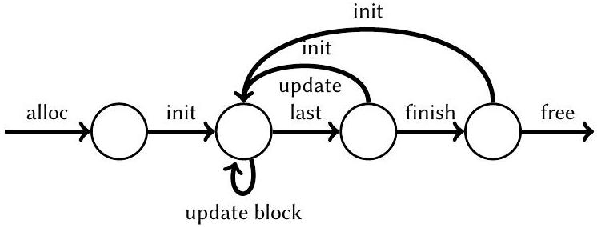
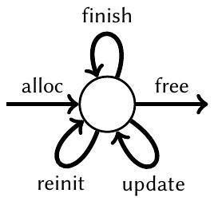

<!--
Third-party paper; not covered by the evm-sail software license.
Authors: Son Ho, Aymeric Fromherz, and Jonathan Protzenko.
Original: https://doi.org/10.1145/3607844
ArXiv source: https://arxiv.org/abs/2102.01644
License: Creative Commons Attribution 4.0 International (CC BY 4.0),
https://creativecommons.org/licenses/by/4.0/
Change notice: converted from the accompanying PDF to Markdown with Mathpix on
2026-07-29. The conversion may contain OCR, equation, or layout errors.
-->

# Modularity, Code Specialization, and Zero-Cost Abstractions for Program Verification

SON HO, Inria, France<br>AYMERIC FROMHERZ, Inria, France<br>JONATHAN PROTZENKO, Microsoft Research, USA[^0]

For all the successes in verifying low-level, efficient, security-critical code, little has been said or studied about the structure, architecture and engineering of such large-scale proof developments.

We present the design, implementation and evaluation of a set of language-based techniques that allow the programmer to modularly write and verify code at a high level of abstraction, while retaining control over the compilation process and producing high-quality, zero-overhead, low-level code suitable for integration into mainstream software.

We implement our techniques within the F* proof assistant, and specifically its shallowly-embedded Low* toolchain that compiles to C. Through our evaluation, we establish that our techniques were critical in scaling the popular HACL* library past 100,000 lines of verified source code, and brought about significant gains in proof engineer productivity.

The exposition of our methodology converges on one final, novel case study: the streaming API, a finicky API that has historically caused many bugs in high-profile software. Using our approach, we manage to capture the streaming semantics in a generic way, and apply it "for free" to over a dozen use-cases. Six of those have made it into the reference implementation of the Python programming language, replacing the previous CVE-ridden code.

## 1 INTRODUCTION

Within the span of a few years, formal verification has gone mainstream. Previously confined to academic circles, the idea of proving properties about security-critical code is now widely accepted. Case in point: a major cloud company like Amazon will pay for a full sponsored article in the Wall Street Journal, touting the benefits of formal verification for its cloud computing unit [40].

Such security-critical code often lies on the critical path of larger subsystems; users therefore expect security-critical code to be not only secure and reliable, but also fast. To that effect, programmers continue to resort to low-level programming idioms and manual memory management, which allows them to exert fine-grained control on the structure of their code, and hence squeeze every last inch of performance out of it [76], sometimes directly leveraging hardware facilities to do so [37, 57]. This unfortunately comes at a cost; taming the complexity of such programs is errorprone, leading to abundant mistakes with dire consequences [1, 3-5, 15, 20, 21, 27, 36, 54, 55, 58-60, 74].

Aiming to address this problem, formal verification practitioners have thus focused on code that is both security-critical and low-level. Success stories include verified cryptography, with e.g., HACL ${ }^{\star}$ /EverCrypt [63, 64, 78] (integrated into the Linux kernel, Mozilla Firefox, and the Tezos blockchain), or Fiat Cryptography [29] (integrated into Google's BoringSSL cryptographic library); verified parsers, with e.g., EverParse [66, 73] (integrated into Microsoft's Hyper-V network virtualization stack); verified kernels, such as CertiKOS [34, 35] or seL4 [43]; and many more.

But for all the success stories, it remains a technical challenge to author and verify a system that is simultaneously large-scale, low-level, and performant. Large-scale verification projects abound;

One must only think of e.g., Mathlib [51], a large collection of mathematical proofs and theorems written in Lean3, which recently crossed the million-line threshold. Large-scale and low-level verified projects are not unheard of: seL4 [71], based on a dialect of Haskell, or CertiKOS [35], written in Coq, both demonstrate that one can write non-trivial pieces of software (such as OSes) that deal with low-level concerns and deliver reasonable performance. But when it comes to large-scale, lowlevel and competitively performant verification projects, few candidates come to mind. One reason is that verification remains onerous: expert proof engineers are rare, and their task is hard enough; as such, advances in proof engineering and reusable abstractions are badly needed to increase productivity. Nowhere is this more salient than when trying to verify low-level code. Verification calls for high-level abstractions and extreme modularity, while low-level efficient code calls for breaking up those very abstractions barriers. This, in our opinion, has hindered the development of large-scale, low-level, and efficient libraries.

High-level abstractions are well-known to functional programmers; they may include type-level abstraction and polymorphism; module interfaces and functors; type classes. They are also known to the mythical "real-world" programmers: templates and concepts in C++, or traits in Rust, also support modularity in the large. But sooner or later, the programmer will, on the quest to ultimate performance, pull low-level tools from their arsenal. The infamous C preprocessor oftentimes makes an appearance, with tricks so frightening that basic decency prevents us from describing them here [33]. And these are not just simple, straightforward patterns such as loop unrolling; entire polymorphic data structures are emulated using the C preprocessor. This route usually ends in pain and suffering, with unmaintainable code, subtle mistakes, and generally, the inability to reason about such code. There is thus a tension between going low-level for efficiency, and introducing high-level concepts, abstraction and modular boundaries to make the code easier to reason about. This tension is heightened in the context of verification: the need for modular, high-level code is even greater, so as to ease verification; but the pressure for efficient, low-level code is also stronger, to meet practitioners' performance requirements and thus give our verified code the chance to be integrated and then deployed in mainstream software.

In this paper, we set out to have our cake and eat it. That is, to have efficient, low-level, verified code, and to do so at a large scale, in a verified software project that exceeds 100,000 lines of verified code. Worded differently, we want to reconcile the modularity of, say, SML or OCaml's functors, or Haskell's type classes, with the efficiency of Rust traits and the infamous "zero-cost abstraction" of C++ templates, for verified code. And we want to have our cherry on top of the cake: we set out to do so without extending the Trusted Computing Base (TCB) of the tools we use. We design, implement and evaluate our techniques within the $\mathrm{F}^{\star}$ dependently-typed proof assistant, which culminate in the following contributions.

First (§3), we propose a proof engineering methodology that allows one to structure their verified code as they would, say, with functors, all the while still producing idiomatic, low-level code with readable functions and no runtime overhead of any kind.

Second (§4), we observe that using this methodology is burdensome in practice, because structuring the code to fit our proof engineering pattern requires a fair amount of bookkeeping. We thus automate our methodology by designing a DSL that guides an automated code-rewriting transformation which automatically applies the pattern from §3 to the user's code. In practice, this allows the user to write their code in a modular, high-level, natural style that emulates ML's functors, while relying on inlining and partial evaluation to eliminate the high-level abstractions and make our discipline truly, a zero-cost abstraction. The DSL is interpreted via meta-programming, specifically, via elaborator reflection; in essence, we script the compiler, and add an early compilation
stage that takes our functor DSL and evaluates it away. The techniques we introduce are implemented in user-space, meaning we do not modify the compiler and leave the TCB intact, so as to provide the same guarantees as code written without our libraries.

Third (§5), we explain how several algorithms previously released via the HACL ${ }^{\star}$ and EverCrypt projects were, in reality, relying on our techniques to scale up, and to avert engineering and usability disasters. We review a series of case studies and show how several cryptographic primitives can be implemented using our DSL so as to maximize code sharing and minimize maintenance.

Fourth (§6), and final, we examine a large case study: the streaming API, a cryptographic construct that transforms an unsafe, block-based algorithm into a safe, high-level API by means of an internal buffer. With our DSL, we write a generic streaming API once, then instantiate it "for free" over any unsafe block-based algorithm. Out of a dozen instantiations of our streaming functor, six have been integrated into the reference implementation of the Python programming language. This case study is a contribution on its own: to the best of our knowledge, no one had precisely described, captured with dependent types and implemented generically what it means to turn a block-based algorithm into a streaming API.

Our evaluation section quantifies the improvements in programmer productivity and effectiveness stemming from the use of our methodology. We have evaluated our techniques on the HACL ${ }^{\star}$ project, and found that they were the key ingredient that allowed HACL ${ }^{\star}$ to cross the barrier of 100,000 lines of verified source $\mathrm{F}^{\star}$ code. Without our work, modularizing and scaling up the codebase would have been impossible.

We conclude and observe that while our case studies focus on cryptographic code, our techniques are general and can be applied to data structures, or more generally, any situation that calls for modular proofs of low-level programs, as evidenced by our choice of running example (§3).

## 2 BACKGROUND

In this section, we introduce the background required to understand our methodology. We start our presentation by an overview of our verification environment: the $\mathrm{F}^{\star}$ proof assistant (§2.1). We then present a well-known technique to encode functors with dependent types (§2.2) and that we build upon in the later sections.

### 2.1 F ${ }^{\star}$, Low ${ }^{\star}$, Meta-F ${ }^{\star}$

$\mathbf{F}^{\star}$ is a state-of-the-art verification-oriented programming language. Hailing from the tradition of ML [53], $\mathrm{F}^{\star}$ features dependent types, refinement types, and a user-extensible effect system [67], which allows reasoning about IO, concurrency, divergence, various flavors of mutability, or any combination thereof. For verification, F ${ }^{\star}$ uses a weakest precondition calculus based on Dijkstra Monads [6, 72], which synthesizes verification conditions that are then discharged to the Z3 SMT solver [25]. Proofs in $\mathrm{F}^{\star}$ typically are a mixture of manual reasoning (calls to lemmas), semiautomated reasoning (via tactics [49]) and fully automated reasoning (via SMT).

Low ${ }^{\star}$ is a subset of $\mathrm{F}^{\star}$ that exposes a carefully curated subset of the C language. Using $\mathrm{F}^{\star}$ 's effect system, Low ${ }^{\star}$ models the C stack and heap, and allocations in those regions of the memory. Low* also models data-oriented features of C, such as arrays, pointer arithmetic, machine integers with modulo semantics, const pointers, and many others via a set of distinguished libraries. Programming in Low* guarantees spatial safety (no out-of-bounds accesses), temporal safety (no double frees, no use-after free) and a form of side-channel resistance [65, 78]. All of these guarantees are enforced statically and incur no run-time checks. To provide a flavor of programming in Low*, we present the swap function below. We first focus on the various typical Low ${ }^{\star}$ features of this function signature.

```
let swap (x y : pointer U32.t) : ST unit (requires ...) (ensures ...) =
    let xv = deref x in let yv = deref y in upd x yv; upd y xv
```

Functions in Low ${ }^{\star}$ are annotated with their return effect, in this case ST, which indicates that the function may perform heap allocations.[^1] Functions without a return effect are understood to be total. The input parameters have type pointer U32.t, i.e., pointers to 32-bit unsigned machine integers with modulo semantics. Functions are specified using pre and post-conditions, which we omit here and whose explanation we defer until §6. Finally, the implementation of swap simply dereferences x and y (deref), then updates them while swapping their values (upd).

Erasure and extraction in F ${ }^{\star}$ follows Letouzey's extraction principles for Coq [47]. After type-checking and performing partial evaluation, $\mathrm{F}^{\star}$ erases computationally-irrelevant code and performs extraction to an intermediary representation dubbed the "ML AST".

For erasure, F ${ }^{\star}$ eliminates type refinements, pre- and post-conditions, and generally replaces computationally irrelevant terms with units. F ${ }^{\star}$ also removes calls to (pure) unit-returning functions, which means that calls to lemmas are also eliminated. For extraction, $\mathrm{F}^{\star}$ ensures that the "ML AST" features only prenex polymorphism (i.e., type schemes), and that it is annotated with classic ML types. In the context of this paper, we are only concerned with the generation of C code, which is possible only on a subset of the "ML AST"; when extracting for C, a battery of checkers verifies that the code is in the proper subset.

KaRaMeL [65] compiles the "ML AST" to readable, auditable C by using a series of small, composable passes. The KaRaMeL preservation theorem [65] states that the safety guarantees in Low* carry over to the generated C code. We show below the result of compiling swap to C.

```
void swap(uint32_t *x, uint32_t *y) { uint32_t xv = *x; uint32_t yv = *y; *x = yv; *y = xv; }
```


### 2.2 Encoding Functors With Dependent Types

We now illustrate the challenge of combining generic, modular programming (good for proofs) with low-level compilation (good for efficiency). We start with a running example that we will reuse in §3: an imperative key-value map implemented using an associative list. For simplicity of exposition, we use standard algebraic datatypes, such as list. Low ${ }^{\star}$ features low-level data structures, notably linked lists; however, these would significantly complicate our running example with notions of memory footprints and memory reasoning. We thus stick with list for the paper, and provide a complete low-level example relying on linked lists in the supplementary material.

To enable code reuse, we wish to make the associative list generic in the type of its keys and values. If we were to use a language like OCaml or Haskell we would naturally implement this map by using a functor or typeclasses. Listing 1 illustrates this with an OCaml functor named MkMap, which takes an argument EqType containing a type for keys k, and a corresponding decidable equality. The MkMap functor implements find using a loop and mutable references, generically, for any type of keys k and corresponding equality eq.

We want to attain the same modularity when verifying code in a prover like F ${ }^{\star}$. As a first attempt, we can reuse a well-known technique [48, 69] to encode this OCaml functor using dependent types (Listing 1, right). The Map module signature becomes a record map, and the type k of keys becomes a record field. Since this is a dependent record, eq may refer to k. We implement the MkMap functor with the mk_map function, which receives an instance of eq_type along with a type a. The return type of mk_map uses a refinement: a value m:map has type m:map a\{m.k == e.t\} if it satisfies the logical predicate m.k == e.t; this equation exactly encodes the condition type key = E.t of the OCaml code (line 11). Finally, Low ${ }^{\star}$ uses a special while combinator for loops, which takes two

```
module type Map = sig
    type k
    val find: k -> (k * 'a) list -> 'a option
end
module type EqType = sig
    type t
    val eq: t -> t -> bool end
module MkMap (E : EqType) :
    Map with type key = E.t = struct
    type k = E.t
    let find x ls =
        let b = ref true in
        let lsp = ref ls in
        while !b do
            match !lsp with
            | [] -> b := false
            | (x', _) :: tl ->
                if E.eq x x' then b := false
                else lsp := tl done;
        match !lsp with
        | [] -> None | (_, y) :: _ -> Some y
end
```

```
type map (a : Type) = {
    k: Type;
    find: k -> list (k * a) -> ST (option a) ... }
type eq_type = {
    t: Type;
    eq: t -> t -> bool; }
let mk_map (e : eq_type) (a : Type) :
    m:map a{m.k == e.t} = {
    k = e.t;
    find = (fun x ls ->
        let b = alloc true in
        let lsp = alloc ls in
        while (fun () -> !* b)
            (fun () ->
                let ls = !* lsp in
                match ls with
                | [] -> upd b false
                | (x', _) :: tl ->
                    if e.eq x x' then upd b false
                    else upd lsp tl);
        match !* lsp with
            | [] -> None | (_, y) :: _ -> Some y) }
```

Listing 1. An associative map implemented in OCaml (left) and F * (right)
closures as inputs, for the loop condition and the loop body respectively; the implementation of find otherwise mimics its OCaml counterpart. As the code is stateful, i.e., it lives in the ST effect, it requires annotations such as pre- and post-conditions; at this point in the paper we are concerned with the shape of the code and not its correctness, we thus omit them for the purpose of simplicity.

Even when assuming that all data structures are suitably low-level, the issue remains that the implementation of find manipulates dictionaries (e.g., instances of eq_type). Note that this is not specific to our encoding: we would have the same problems had we used functors or typeclasses, and this is the case for the OCaml implementation of the map. Dictionary-passing is problematic because it has a cost at runtime. Worse, our implementation doesn't fit in the Low ${ }^{\star}$ subset and thus can't be extracted to C; indeed, the resulting code would manipulate records with fields containing types, which is not supported in C. We show in the next section how we solved this problem.

## 3 WRITING LOW-LEVEL, MODULAR CODE

We showed in §2.2 how one can achieve the same level of modularity and genericity in $\mathrm{F}^{\star}$ as in a regular, high-level programming language like OCaml, by encoding functors with dependent types by means of an already known technique. But now we ask: how can one turn this into idiomatic, efficient low-level code? In the coming section, we answer by introducing new methods which build upon the technique explained in §2.2. We stick to the same running example, that is an imperative key-value map, and for the purpose of illustration, we assume once again that all data structures, such as list, are suitably low-level.

### 3.1 Making Functors Zero-Cost: A First Attempt

We now present a first naive technique that allows the user to successfully generate specialized Low* code (i.e., without dictionary-passing), at the expense of code size explosion. The key idea is to perform partial evaluation at extraction time to inline all uses of eq_type (and a). To do so,

```
(* Map instantiation *)
let str_eqty : eq_type = { t = string; eq = String.eq; }
let ifind = (mk_map str_eqty int).find
(* After partial evaluation *)
let ifind (x: string) (ls: list (string * int)): option int =
    let b = alloc true in let lsp = alloc ls in
    while (fun () -> !* b)
        (fun () -> let ls = !* lsp in match ls with
            | [] -> upd b false | (x', _) :: tl -> if String.eq x x' then upd b false else upd lsp tl);
    match !* lsp with | [] -> None | (_, y) :: _ -> Some y
```

Listing 2. find after instantiation (top), then partial evaluation (bottom)

```
type dv = {
    pid : Type;
    send : pid -> list (pid * ckey) -> bytes -> option bytes;
    recv : pid -> list (pid * ckey) -> bytes -> option bytes; }
type cipher = { enc : ckey -> bytes -> bytes; dec : ckey -> bytes -> option bytes; }
let mk_dv (m : map ckey) (c : cipher) : d:dv{d.pid == m.k} = {
    pid = m.k;
    send = (fun id dv plain -> match m.find id dv with | None -> None | Some sk -> Some (c.enc sk plain));
    recv = (fun id dv secret -> match m.find id dv with | None -> None | Some sk -> c.dec sk secret) }
```

Listing 3. Implementation in $\mathrm{F}^{\star}$ of a peer device for a secure channel protocol
we can leverage the $\mathrm{F}^{\star}$ normalizer to symbolically reduce terms. The normalizer is not an $\mathrm{F}^{\star}$ specificity; it is at the core of dependent type systems, and therefore a mandatory component of the type-checker of a dependently typed language. As such, this component is part of the TCB of type-theory-based proof assistants.

The user proceeds as follows. First, they pick concrete values for the functor arguments. In our example (Listing 2), the user picks str_eqty and int for the mk_map parameters e:eq_type and a:Type, respectively. Then, the user applies those arguments to the functor itself, hence defining an instantiated version of find, dubbed ifind (line 3). The normalizer then kicks in and $\beta$-reduces the application of ifind to its concrete arguments. By inlining the body of find, then by simplifying some terms like the projection str_eqty.eq, all uses of records inside ifind are removed; the resulting specialized ifind is indistinguishable from a direct, monomorphic implementation of find. We show the result of partial evaluation in Listing 2.

This approach therefore allows us to turn our functors into zero-cost abstractions. The caveat with this style, however, is that every single function needs to be inlined, except for the top-level functions that make up the API entry points. This is fine for our small example; but in a real-world development, this leads to both code size explosion (we insert a copy of find's body at each call-site), and unacceptable code quality (implementing an algorithm as a single 20,000-line C function is generally frowned upon). To illustrate this more concretely, we introduce in Listing 3 a client of find, known as a "device", a high-level data structure used in communication protocols to store a map from peer identifiers to session keys, i.e., a map from unique participant identifiers to the cryptographic keys used for secure communications.

A device should implement two functions to communicate with participants. The send function takes as arguments a peer identifier id, a map from peer identifiers to cryptographic keys (of type ckey), and a message plain. It looks up the key associated to id, and finally uses it to encrypt plain.

```
let mk_send (pid : Type)
    (find : pid -> list (pid * ckey) -> option ckey) (enc : ckey -> bytes -> bytes)
    (id : pid) (dv : list (pid * ckey)) (plain : bytes) : option bytes =
    match find id dv with | None -> None | Some sk -> Some (enc sk plain)
let mk_recv (pid : Type)
    (find : pid -> list (pid * ckey) -> option ckey) (dec : ckey -> bytes -> option bytes)
    (id : pid) (dv : list (pid * ckey)) (plain : bytes) : option bytes =
    match find id dv with | None -> None | Some sk -> dec sk plain
```

Listing 4. Parameterizing send and recv by their callees
The recv function performs the dual operation, i.e., it searches for the key to decrypt a message received from a known peer. The choice of the peer identifier type pid is orthogonal to the implementation of a device dv; we can therefore write a generic implementation parametric in pid and accordingly in the map from peer identifiers to cryptographic keys. Furthermore, this device can be useful in a variety of contexts and with a range of ciphersuites, and should thus be independent of the specifics of any cryptographic encryption algorithm: we also parameterize the implementation mk_dv with the encryption and decryption functions, encapsulated in a record of type cipher.

Equipped with a generic device, we can, as in the map example, instantiate it for a specific choice of peer identifiers and cryptographic functions, before applying partial evaluation to get specialized code which does not manipulate dictionaries. Unfortunately, doing so would lead us into the pitfall we mentioned earlier, where the code for find is duplicated in both the instantiations for send and recv. In our experience interacting with maintainers of some of the most popular opensource projects, such aesthetic faux-pas are bad enough that a practitioner will dismiss our code as 'not serious' and 'too verbose', raising barriers to its integration to existing codebases. In this regard, we insist on the fact that the HACL ${ }^{\star}$ code, part of which we applied our methodology on (§5), was deployed in real-world projects such as the NSS library or Python.

### 3.2 A General Rewriting Pattern for Fine-Tuned Code Generation

When specializing functions like send and recv, we want them to call the same specialized version of find, rather than duplicate the body of find. In effect, we want to perform whole-program specialization (in the style of MLton [77]) while preserving the shape of the static call-graph (in order to give the programmer enough control so as to generate palatable code). To do so, we propose a modular approach that allows us to rewrite each function in isolation without knowing yet how the function will later be instantiated, all the while avoiding the need for inlining everything. We proceed as follows. Instead of using a dependent record, for each function, we add additional parameters that stand in for the callees that need to be specialized; and we re-implement the function body to refer to those arguments. For instance, send and recv become the mk_send and mk_recv functions in Listing 4. Note that a function is parameterized with exactly its callees: for instance send is parameterized by enc but not dec, while it is the converse for recv. We intentionally refrain from using a record ("functor")-based encoding like in the previous sections: this would rapidly lead to a proliferation of type definitions, as there would typically be one record per definition. This would make both programming and maintaining our codebase tedious, as the addition or modification of any element in the record would require changing all occurences across the call-graph.

Anticipating a bit on the automation we introduce in §4, we request that the polymorphism be prenex, i.e., that all type parameters be captured by the first argument; this does not restrict expressivity, and allows us to avoid having extra type-level dependencies across function arguments which would be difficult to automatically handle. More specifically, we keep the generic types in a

```
type mindex = { k : Type; v : Type }
let mk_find (i : mindex) (eq : i.k-> i.k -> bool) (x : i.k) (ls : list (i.k * i.v)) : option i.v =
    let b = alloc true in let lsp = alloc ls in
    while (fun () -> !* b)
        (fun () -> let ls = !* lsp in
        match ls with | [] -> upd b false
            | (x', _) :: tl -> if eq x x' then upd b false else upd lsp tl);
    match !* lsp with | [] -> None | (_, y) :: _ -> Some y)
```

Listing 5. Rewriting find to follow a systematic pattern
record, that we call the "index" and make the first parameter of the function. This index must capture all the choices of parametricity for the types. In practice, as we'll see in concrete, real-world examples in §5, we often pick the index to be an enumeration, but this is not a requirement of our approach. The index can also range over an infinite number of elements, as is the case for the generic type pid in Listing 4. In this specific example, since we are only parametric in one type, we dispense with a record type and parameterize our functions over pid directly.

We also apply this approach to the find function previously presented. This function is parametric in two types: the type of keys k, and the type of values v of the map. We collect both types in a record of type mindex, which becomes the first argument of mk_find, presented in Listing 5.

Importantly, we drop the "functor" encoding for the functions but not the types, i.e., we use a record which holds all the type parameters. Keeping this encoding for types doesn't lead to the same proliferation of records as for functions. Indeed, type parameters tend to be fewer, change less often, and their parameterization tends to be more uniform accross functions.

We finally show an instantiation of those generic definitions in Listing 6, where aes_enc and aes_dec are encryption/decryption functions for AES-GCM, one of the most widely used authenticated encryption algorithm. We omit their implementation, which is irrelevant for presentation purposes; they can be provided by a separate cryptographic library. With this new encoding, we can individually unfold the definitions of mk_find, mk_send and mk_recv before simplifying the projections over record fields, e.g., i.k, while preserving the call graph; we show the result of the partial evaluation in Listing 6. Note in particular that the definition of mk_find is not inlined in the resulting isend and irecv; both functions instead call the specialized ifind.

Our goals are met: we have described a general rewriting pattern that allows us to write generic implementations, that can be specialized for a choice of types (the "index"), while preserving the shape of the static call-graph and hence produce high-quality low-level code.

Discussion. Previous work in F ${ }^{\star}$ used a precursor to the techniques we present in this section. In particular, HACL ${ }^{\star}$ [63, 78] made heavy use of specialization and partial evaluation to factor out large pieces of code, for instance by writing a single generic implementation of Poly1305 for three variants (C, C+AVX, C+AVX2). However, this early style had two issues. First, it led to code size explosion due to excessive inlining, which was solved by manually introducing alternating levels of generic and specialized functions, a tedious and time-consuming task. Second, it relied on closed enumerations (i.e., an inductive with constant constructors) as opposed to the open-ended "indices" that we introduce in the present section. The first point is addressed by our DSL, the rewriting tactic and the systematic higher-order pattern it produces. Regarding the second point, parameterizing over closed enumerations is a legacy style (§5) that is acceptable as long as the user is adamant that no further cases will be added. Indeed, adding a new case to the enumeration entails a re-verification of the generic code, affecting modularity. We strongly encourage users to

```
(* Instantiation *)
let i = { k = string; v = ckey; }
let ifind = mk_find i String.eq
let isend = mk_send string ifind aes_enc
let irecv = mk_recv string ifind aes_dec
(* After partial evaluation *)
let ifind x ls =
    let b = alloc true in let lsp = alloc ls in
    while (fun () -> !* b) (fun () -> let ls = !* lsp in match ls with
        | [] -> upd b false | (x', _) :: tl -> if String.eq x x' then upd b false else upd lsp tl);
    match !* lsp with | [] -> None | (_, y) :: _ -> Some y)
let isend = id dv plain -> match ifind id dv with | None -> None | Some sk -> Some (aes_enc sk plain)
let irecv = id dv secret -> match ifind id dv secret with | None -> None | Some sk -> aes_dec sk secret
```

Listing 6. Instantiation (top) and partial evaluation (bottom) of the map and device functions
try to define a generic index type (i.e., at type Type), which provides more flexibility, modularity, and allows the user to trivially add new specializations without affecting the generic code. This requires, however, more thought on the part of the user to correctly define the index type.

Closer to the present work, Noise* [39] uses a mix of the encodings presented in sections 3.1 and 3.2 to make the implementation generic in, say, the cryptographic primitive implementations or the peer identifiers. More precisely, it uses the idea of writing generic mk_ functions that are later specialized, as we do in this section, but where the mk_ functions are parameterized in a style closer to the "functor" parameters of §3.1 (i.e., without an index), because it didn't leverage the automation that we introduce in the next section. Importantly, the Noise* paper does not detail nor claim this technique due to lack of space, and rather focuses on the use of partial evaluation on code not written in a "functor" style. As such, the present paper is for us an opportunity to detail in one place the culmination of all the techniques which were introduced to make the Everest [19] project scale up to its current size.

## 4 STATIC CALL-GRAPH REWRITING WITH META-PROGRAMMING

In the previous section, we identified a programming pattern that allowed us to modularly write verified code, in a way reminiscent of ML functors, by rewriting our low-level functions into a higher-order form that lends itself to code specialization via partial application. In practice, manually writing code which uses this pattern requires a fair amount of tedious, administrative work. In this section, we thus set out to relieve the user from this burden by designing a small DSL, to be more precise a subset of Low* extended with a mechanism of annotations, by which the user can write code in a natural style before calling a rewriting procedure which automatically turns this code into a higher-order form. To do so, we i) propose a small usability tweak to make parameterization easier, then ii) formally define our rewriting rules, and iii) devise a frontend language that allows the user to express their intent via a mechanism of annotations. Our rewriting rules are interpreted by a custom pre-processing phase implemented via elaborator reflection, i.e., "scripting the compiler". In effect, we are adding a user-defined early compilation stage.

### 4.1 A Declarative Style for Callee Arguments

The higher-order, rewritten functions presented in §3.2 allow us to write low-level, verified code in a modular fashion. However, there remains a usability problem. The functions that we parameterize over, like eq, need to be brought in scope frequently, as eq has many callers. This is currently

```
type mindex = { k : Type; v : Type }
assume val eq (i : mindex) : i.k -> i.k -> bool
let find (i : mindex) (x : i.k) (ls : list (i.k * i.v)) : option i.v =
    let b = alloc true in let lsp = alloc ls in
    while (fun () -> !* b)
        (fun () -> let ls = !* lsp in
        match ls with | [] -> upd b false
            | (x', _) :: tl -> if eq i x x' then upd b false else upd lsp tl);
    match !* lsp with | [] -> None | (_, y) :: _ -> Some y
```

Listing 7. Hoisting callee arguments from find
achieved by making every function in our development that needs it parametric over eq, which incurs a non-trivial amount of boilerplate. Even worse, in the case of an actual algorithm, e.g., Curve25519 (§5.2), we parameterize the algorithm over a dozen operations. Asking the user to add as many arguments to every declaration and call-site would be too onerous.

To alleviate these concerns, we propose to adopt a more declarative style. For presentation purposes, let us reuse the map example from the previous section. Instead of explicitly parameterizing the definitions (e.g., find) with their generic parameters (e.g., the decidable equality eq), we introduce the parameters of our implementations as top-level declarations annotated with the assume qualifier, as shown in Listing 7. We achieve the same effect as before: the declaration is in scope for our entire development. But this time, we avoid the syntactic overhead. Once this declaration is in the scope of find, it can be freely used and referred to in the body of the function. In practice, the index is an implicit argument, which further reduces the syntactic burden.

With this approach, changing the signature of eq becomes less dreary. Instead of performing modifications in all functions relying on eq, it suffices to tweak its top-level declaration. The reader might wonder why one would need to change the type of eq; while this example is overly simple for presentation purposes, making minor modifications to specifications to, say, add a missing invariant or fix a mistake in a precondition is common when doing incremental verification. Leveraging F ${ }^{\star}$ 's SMT-backed automation, small changes to the callee often do not require modifying the callers.

An assumed declaration in $\mathrm{F}^{\star}$ is tantamount to introducing a hole in our code. Trying to generate C code containing such a hole would lead to C extern declarations, and raise compilation failures unless an external definition is provided by the user. In the following section, we will describe how to fill this hole, and ensure that the provided definition matches the assumed function type.

### 4.2 Static Call-Graph Rewriting

While hoisting callee arguments to assumed top-level declarations reduces code clutter, it only alleviates some of the burden that a programmer is facing when using our methodology. Relying on top-level assumed declarations for callees is not always desirable. In our map and device example, while send and recv are parametric in find, find itself is implemented in the module; adding an assumed type declaration would be redundant. We would rather preserve the existing definition of find, and automatically rewrite, e.g., send into its mk_send counterpart that takes find as an argument. We show in this section how to reach this goal using metaprogramming.

Rewriting, Formally. Following the programming pattern described in §3.2, we assume that every function node $g_{i}$ in the static call-graph is parameterized over an argument $\mathrm{idx}: t_{\mathrm{idx}}$ that represents the specialization index, and that this argument appears in first position.

```
Section map.
    Record mindex := { k : Set; v : Set }.
    Variable eq : forall i:mindex, i.(k) -> i.(k) -> bool.
    Definition find (i : mindex) (x : i.(k)) (ls : list (i.(k) * i.(v))) : option i.(v) := ...
End map.
```

Listing 8. An equivalent of find using Coq's section variables

At definition site, every function definition let $f \mathrm{idx} \bar{x}=$ is replaced by let $\mathrm{mk}_{\mathrm{f}} \mathrm{idx}\left(g_{1}: t_{g_{1}} \mathrm{idx}\right)$ $\ldots\left(g_{n}: t_{g_{n}} \mathrm{idx}\right) \bar{x}=$. The $g_{i}$ represent all the callees in the body of $f$. The $t_{g_{i}}$ are the types of the original $g_{i}$, abstracted over the index idx, that is, if the type of $g_{i}$ was the dependent arrow $\mathrm{idx}: t_{\mathrm{idx}} \rightarrow t$, then $t_{g_{i}}$ is the dependent function $t_{g_{i}}=\lambda\left(\mathrm{idx}: t_{\mathrm{idx}}\right) . t$, which allows us to write the application $t_{g_{i}} \mathrm{idx}$. At call-site, when encountering a call $g_{i} \mathrm{idx} \bar{e}$, the call becomes $g_{i} \bar{e}$ and references the bound variable $g_{i}$ instead of the global name.

Taking our running example, we have $t_{\mathrm{idx}}=$ mindex, and eq $: i: t_{\mathrm{idx}} \rightarrow i . k \rightarrow i . k \rightarrow$ bool. Our goal is to make sure that find becomes parameterized over an argument eq specialized for the same value of the index as find. To achieve that, we pick $t_{\mathrm{eq}}=\lambda\left(i: t_{\mathrm{idx}}\right) . i . k \rightarrow i . k \rightarrow$ bool, and thus rewrite find into let $\mathrm{mk}_{\text {find }}\left(i: t_{\mathrm{idx}}\right)\left(e q: t_{\mathrm{eq}} \mathrm{idx}\right)$, which then reduces into let $\mathrm{mk}_{\text {find }}\left(i: t_{\mathrm{idx}}\right)(e q$ : $i . k \rightarrow i . k \rightarrow$ bool ), where the index $i$ is the same everywhere, meaning that eq is specialized for the same choice of types as find.

Recursively Traversing the Call-Graph. The rewriting presented above is highly modular; it allows us to rewrite each function in isolation. Following the same process as for find, we notice when rewriting send that it should be parameterized by a specialized version of find itself. Empirically, we observe the composition of parametric functions to be a common pattern. Instead of manually applying our rewriting to send, recv, and find, we recursively traverse the call-graph, automatically performing rewriting on the definitions of all callees of the function being rewritten. Using this approach, a user only needs to invoke the rewriting on the API endpoints of their library, i.e., specific top-level functions. When encountering a top-level assume declaration, as described in §4.1, the traversal stops. Callers end up with the correct additional parameters, and it will be up to the user to exhibit suitable instantiations for the assumed functions.

Section Variables. Our mechanism is very similar to the section variables mechanism provided by provers such as Coq and Lean. For instance, it would be possible to automatically parameterize find with eq by using a section in which eq is declared as a Variable; we show such an example for Coq in Listing 8. The section mechanism in its current shape would however lead to slightly more work on the user side: it would work for all the definitions that we mark as assume in $\mathrm{F}^{\star}$, as we would simply declare them as section variables, but doesn't provide a straightforward way of parameterizing functions like send and recv with find. Indeed, we would need to both define mk_find and declare find as a section variable for send and recv to use it, so that they get correctly parameterized; with our call-graph rewriting we write a single definition for find.

### 4.3 Fine-Grained Code Specialization

While inlining all functions, as explained in §3.1, is not desirable, specializing all functions in the call-graph can also conflict with a programmer's intent. Many functions, e.g., alloc and upd from the standard library, are not parametric and thus do not require specialization; furthermore, to reduce the size of proof contexts and ease verification, programmers often rely on auxiliary functions that are expected to be inlined at extraction-time. Consider for instance the while combinator used to implement find. While inlining the closures for the loop condition and the loop body is reasonable

```
let while_cond (b: pointer bool) (_:unit) = !*b
let while_body (i: mindex) (b: pointer bool) (lsp: list (i.k * i.v)) (x:i.k) (_:unit) =
    let ls = !* lsp in
    match ls with
    | [] -> upd b false | (x', _) :: tl -> if eq x x' then upd b false else upd lsp tl
let find (i : mindex) (x : i.k) (ls : list (i.k * i.v)) : option i.v =
    let b = alloc true in let lsp = alloc ls in
    while (while_cond b) (while_body i b lsp x);
    match !* lsp with | [] -> None | (_, y) :: _ -> Some y
```

Listing 9. Hoisting loop closures
for small examples, a programmer might find it useful to hoist them for verification purposes, as shown in Listing 9, while unfolding them at extraction-time to retrieve idiomatic code.

Designing generic heuristics to determine which functions should be specialized or inlined is tricky; getting them wrong risks alienating developers when they do not obtain the shape of the code they expect. Instead of a generic solution, we prefer to leverage programmers' knowledge of their code. Using F ${ }^{\star}$ 's annotation system, we provide two attributes, Specialize and Eliminate, that enable a fine-grained control on the rewritings performed by our approach.

Before rewriting, declarations annotated with Eliminate are preprocessed; their top-level declarations are removed, and their definitions are inlined at the different call-sites.[^2] After preprocessing, instead of rewriting each function definition and callee as described in §4.2, we limit the code transformation to functions annotated with the Specialize attribute.

We show in Listing 10 a complete example using the different features presented in this section. The code on the right corresponds to the $\mathrm{F}^{\star}$ code on the left, after automatically rewriting find. As while_body and while_cond are annotated with Eliminate, they are inlined during preprocessing. The eq function declaration is annotated with the Specialize attribute; it therefore appears as an argument to mk_find. Other functions, i.e., alloc and upd take their roots in F ${ }^{\star}$ 's standard library, and are not annotated with any of our custom attributes. They are therefore ignored and left as-is while statically rewriting the call-graph. In real developments (see sections 5 and 6), annotating the functions proved to be extremely straightforward and light. In return, it allowed us to automatically transform the code into a higher-order version, which represents a fair amount of work when performed manually.

### 4.4 Implementation in Meta-F ${ }^{\star}$

We have implemented this call-graph rewriting using syntax inspection, term generation and definition splicing in Meta- $\mathrm{F}^{\star}$ [49]. Meta- $\mathrm{F}^{\star}$ allows the programmer to script the $\mathrm{F}^{\star}$ compiler using user-written $F^{\star}$ programs, a technique known as elaborator reflection and pioneered by Lean [26] and Idris [23]. This approach means that any fresh term generated by a meta-program must be re-checked for soundness; we therefore do not prove any results about our procedure and let $\mathrm{F}^{\star}$ validate the terms we produce. When calling our procedure, the user passes the roots of the call-graph traversal, i.e., the API endpoints of their library, along with the type of the index. The procedure traverses the call-graph, generates rewritten variants of all the definitions, and inserts them at the current program point.

```
type mindex = { k : Type; v : Type }
[@ Specialize]
assume val eq (i : mindex) : i.k -> i.k -> bool
[@ Eliminate]
let while_cond (b: pointer bool) (_:unit) = !*b
[@ Eliminate]
let while_body (i: mindex) (b: pointer bool)
    (lsp: list (i.k * i.v)) (x:i.k) (_:unit) =
    ... (* elided, same as Listing 9 *)
[@ Specialize] let find (i : mindex) (x : i.k)
    (ls : list (i.k * i.v)) : option i.v =
    let b = alloc true in let lsp = alloc ls in
    while (while_cond b) (while_body i b lsp x);
```

```
(* After rewriting *)
type mindex = { k : Type; v : Type }
let mk_find (i: mindex) (eq: i.k-> i.k -> bool)
    (x: i.k) (ls: list (i.k * i.v)) : option i.v =
    let b = alloc true in let lsp = alloc ls in
    while (fun () -> !* b)
        (fun () -> let ls = !* lsp in
        match ls with
        | [] -> upd b false
        | (x', _) :: tl ->
            if eq x x' then upd b false
            else upd lsp tl);
    match !* lsp with
    | [] -> None
    | (_, y) :: _ -> Some y
```

```
    match !* lsp with
    | [] -> None | (_, y) :: _ -> Some y
```

Listing 10. Fine-grained control on code transformation

We insist on the fact that the entire rewriting procedure was implemented in user-space and does not need to be trusted. Of course, one might wonder how we enforce that the types of the generated, higher-order definitions are correct. Indeed, if our meta-program generates definitions which don't have the correct type, successively type-checking those definitions against those types doesn't give us any guarantees. In practice, we check this later when instantiating those higherorder definitions, by annotating their specializations: if the types generated by our meta-program were incorrect, type checking would fail on this part of the code. As we use helpers to factor out types between the generic and the specialized definitions, annotating those instantiations doesn't create any burden on the user side. Finally, one last point of concern would be that our rewriting procedure transforms the functions in such a way that the generated C code has an unexpectedly poor performance. We note that, due to the nature of the transformations we perform, which consist, after instantiation and partial evaluation, in specializing part of code, this shouldn't happen in practice. Of course, this doesn't dispense us from benchmarking the code, which we do. As our technique gives users fine-grained control on the shape of the generated code, it is also possible to tune the output to reach the desired performance. In particular, we did not see any noticeable change of performance after adapting the code from HACL ${ }^{\star}$ to use the present technique (§5). The interested reader can find our entire, generously commented implementation in the file Meta.Interface.fst of the supplementary material.

Comparison with existing techniques. Our mechanism shares similarities with other type specialization techniques. Specifically, Haskell's SPECIALIZE pragma and Rust's trait system attempt to solve attempt to solve very similar problems, albeit as a trusted whole-program monomorphization pass within their respective compilers, as opposed to a source-to-source rewriting pass. Putting aside the problem of working within a proof assisant, we note that by contrast our technique is 1) untrusted and thus doesn't require extending the F* compiler, 2) allows specializing over values, functions, while leveraging general-purpose dependent types, and 3) gives the user fine-grained control on how the specialized call-graph should look like, in particular for the purpose of outputting a readable program.

Adaptability of our technique to other proof assistants. While we implemented our approach in $\mathrm{F}^{\star}$, our techniques are not tied to one particular language. Our work focuses on the verification
of shallowly embedded programs; although a discussion of the advantages and disadvantages of the use of deep embeddings or shallow embeddings is out of scope of this paper, it is worth noting that the extraction of shallowly embedded programs has been used in many other verification projects, relying on a variety of proof assistants [29, 44-46, 61, 62]. Restricting our scope to the verification of shallowly embedded programs, our approach needs the following key ingredients to be applicable. (1) We need to be able to encode functors, and as we explained in §2 there exists a well known technique to do so in dependently-typed languages such as Coq, Lean or Idris. (2) We need elaborator reflection to implement the rewriting procedure; some languages like Lean or Idris provide it in their meta-language, while some other tools like Coq would require writing a plugin. (3) We need the ability to partially evaluate the specialized programs, which is a common feature of the aforementionned tools. (4) We need an extraction mechanism, which is supported for instance by Coq, Lean and Idris; in particular, we note that Lean and Idris support the extraction to a low-level language such as C or C++. We thus conclude that our methodology could be ported to either one of these proof assistants without fundamental difficulties.

## 5 APPLICATION TO THE HACL* CRYPTOGRAPHIC LIBRARY

We introduced our approach on a small example in the previous sections. We now demonstrate its applicability on real-world examples by presenting its use on heavily optimized implementations of cryptographic primitives inherited from the HACL ${ }^{\star}$ [63, 78] and EverCrypt [64] libraries. HACL ${ }^{\star}$ is a cryptographic library written in $\mathrm{F}^{\star}$ which compiles to C; it offers vectorized versions of many algorithms via C compiler intrinsics, e.g., for targets that support AVX, AVX2 or ARM Neon. EverCrypt is a high-level API that multiplexes between HACL* and Vale-Crypto [22, 31], a library of verified primitives implemented in assembly; it supports dynamic selection of algorithms and implementations based on the target CPU's feature set. Combined with EverCrypt, HACL* features 105k lines of F* code for 72k lines of generated C code (excluding comments and whitespace, as well as the Vale assembly DSL). Those case studies are not new, but were adapted to apply our technique. We explain in this section how we achieved this, and by doing so show how they stress all the requirements which motivated our new approach and which we described in the past sections; that is, the need for 1. zero-cost abstractions which provide high-level modularity and composability; 2. a fine-grained control on the shape of the generated code to obtain efficient and idiomatic implementations; 3. a flexible and lightweight approach which limits the amount of boilerplate and handles a wide range of scenarios. We detail in §7.1 the limitations of the previous techniques, and the consequent benefits we got by applying our new approach.

### 5.1 Generically Writing Hardware-Specialized Code: ChaCha20-Poly1305

We first present the application of our approach on one of our simplest examples, the ChaCha20-Poly1305 cryptographic construction. This case study illustrates how we used our approach to generate, from a single generic implementation, optimized code specialized for specific hardware targets. ChaCha20-Poly1305 is an algorithm for authenticated encryption with additional data (AEAD). The specifics of the construction are orthogonal to this paper; for presentation purposes, it is sufficient to know that it combines two cryptographic primitives: the ChaCha20 stream cipher, and the Poly1305 message authentication code (MAC).

Depending on the hardware used, both ChaCha20 and Poly1305 admit several implementations. In particular, these primitives are especially well-suited to SIMD vectorization, by which we apply an operation (e.g., multiply by a constant) on all the elements of a vector at the same time, and can be highly optimized when such instructions are available. Previous work on HACL ${ }^{\star}$ [63] demonstrated how to write and verify generic, vectorization-agnostic implementations of these
algorithms, which could be specialized by partial evaluation to provide idiomatic C implementations. The approach then used to make the implementation generic was plagued with various issues, whose detailed description we defer until the §7; for now, it suffices to say that it struggled with scalability.

We now show how we implemented the cryptographic construction in our DSL. We mentioned earlier (§3.2) that the index captures the set of possible specializations. Our running example admitted an infinite set of possible specialization choices, as long as the key type admitted a decidable equality. In the example below, we only capture a finite set of possible specialization choices, which we express via a finite enumeration of type arch_index.

```
type arch_index = | V32 | V128 | V256
[@ Specialize ] assume val chacha20_encrypt: w:arch_index -> chacha20_encrypt_st w
[@ Specialize ] assume val do_poly1305: w:arch_index -> poly1305_st w
let aead_encrypt (w:arch_index) ... =
    chacha20_encrypt w ...;
    do_poly1305 w ...
```

To parameterize over both primitives, we rely on abstract signatures for ChaCha20 and Poly1305, as described in §4.1. The types chacha20_encrypt_st and poly1305_st correspond to the function types of both primitives, where the type of the arguments (e.g., the Poly1305 context) depend on the w: arch_index parameter. Both functions are annotated with the Specialize attribute, indicating that they are parameters of the implementation. As aead_encrypt calls these two functions, our rewriting procedures generates a higher-order combinator mk_aead_encrypt which requires two functions for chacha20_encrypt and do_poly1305. The aead_decrypt function is rewritten in a similar manner. The last step is to instantiate this combinator with different existing implementations for both primitives, for instance one specialized for 128-bit vectorization.

```
let aead_encrypt : aead_encrypt_st V128 = mk_aead_encrypt V128 do_poly1305_128 chacha20_encrypt_128
```

The resulting C code is idiomatic, and close to what one would expect from handwritten C code, albeit with formal guarantees about its correctness and constant-time execution. Case in point, the corresponding code in the HACL ${ }^{\star}$ library was previously integrated into Mozilla Firefox [63].

### 5.2 Composing Implementations: Curve25519

We saw in the previous section a first application of the basic features of our approach. In this section, we demonstrate how our technique gives us composability on a real-world example, allowing us to simplify a collection of verified implementations of a widely used elliptic curve, Curve25519 [17].

The specifics of the algorithm are out of scope for this paper; in this presentation, it suffices to say that it relies on modular arithmetic in a mathematical field, which admits two implementations based on different representations of the field elements. Furthermore, one of these representations relies on a set of primitives (e.g., addition) which themselves admit two different implementations, one in Low ${ }^{\star}$, and one in Vale assembly when specific hardware instructions are available.

Previous work on EverCrypt [64] provided a single verified client-facing API multiplexing between different implementation, that is, an API which selects the best implementation depending on the hardware available; these implementations however lived side by side, duplicating a lot of code. Using our approach, we now show how we reduce code redundancy, by aggressively sharing more code between those different implementations, and only specializing between the different field representations and implementations a posteriori. Providing a single generic implementation that will be automatically specialized reduces the maintenance cost of the HACL ${ }^{\star}$ codebase, while
also simplifying the development of algorithmic improvements across our different versions. Using OCaml syntax, the end result allows users to pick between three different versions of Curve25519: module Curve64Lowstar = Curve25519(Field64(CoreLowstar)), module Curve64Vale = Curve25519(Field64(CoreVale)), and module Curve51 = Curve25519(Field51). An important point to notice is that we leverage our DSL to organize our implementation into three layers, that we later compose with each other. For presentation purposes, we present here a simplified version of Curve25519 which omits several layers and functions. We refer the interested reader to the supplementary material for our complete implementation.

Composing Abstractions. Curve25519 exposes several functionalities, including the function scalarmult, which performs scalar multiplication on the elliptic curve. This function calls into encode_point, which itself relies on the field addition fadd. All these functions are parameterized by an index corresponding to the field representation, of type field_index. For clarity of the generated code, we wish to avoid inlining any of these functions; we thus annotate each definition with the Specialize attribute.

```
type field_index = | F51 | F64
[@ Specialize ] assume val fadd (i:field_index) -> fadd_t i
[@ Specialize ] let encode_point (i: field_index) ... = ... fadd ...
[@ Specialize ] let scalarmult (i:field_index) ... = ... encode_point ...
```

The code is rewritten as one might expect. We can provide multiple specializations for one choice of index. If i is F64, we can generate both encode_point_64_lowstar and encode_point_64_vale:

```
let encode_point_64_lowstar = mk_encode_point F64 Lowstar.Field64.fadd ...
let encode_point_64_vale = mk_encode_point F64 Vale.Field64.fadd ...
```

In addition, we can generate encode_point_51 (elided). This in turns allows us to generate three versions for scalarmult:

```
let scalarmult_51 = mk_scalamult F51 encode_point_51 ...
let scalarmult_64_lowstar = mk_scalamult F64 encode_point_64_lowstar ...
let scalarmult_64_vale = mk_scalamult F64 encode_point_64_vale ...
```

In effect, leveraging the composability permitted by our approach, the Curve25519 implementation is organized into three layers: the field arithmetic, the field encoding (F51 or F64), and the elliptic curve operations.

### 5.3 A Highly Parametric Example: The HPKE Construction

We now present the culmination point of our series of cryptographic primitives: HPKE [14] (Hybrid Public-Key Encryption), a recent cryptographic construction that combines AEAD (Authenticated Encryption with Additional Data), DH (Diffie-Hellman), and hashing. The implementation of HPKE ticks several of the boxes that we wished to cover with our technique, that is: we build on top of several functionalities, each of these functionalities can be instantiated with several algorithms (e.g., Curve25519 or P256 for DH, ChaCha20-Poly1305 or AES-GCM for AEAD), and every algorithm admits several implementations; we have a complex call graph divided into several layers. Omitting several definitions for brevity, we structure the code as follows, using hpke_alg as our index.

```
type aead_alg = AES128_GCM | AES256_GCM | CHACHA20_POLY1305
type hpke_alg = dh_alg * aead_alg * hash_alg
type key_aead (alg: hpke_alg) = lbuffer U8.t (key_len (snd3 alg))
[@ Specialize ] assume val sign: (alg:hpke_alg) -> sign_t alg
```

```
[@ Specialize ] assume val enc: (alg:hpke_alg) -> enc_t alg
[@ Eliminate ] let helper (alg: hpke_alg): helper_t alg = fun ... -> ... sign alg ...
[@ Specialize ] let hpke_sealBase (alg: hpke_alg): hpke_sealBase_t alg = fun ... ->
    ... helper alg ...
    ... enc alg ...
```

The index hpke_alg is a triple that captures all possible algorithm choices prescribed by the HPKE RFC. We thus write specifications, lemmas, helpers, and types parametrically over the index as standalone definitions. The key_aead type, for example, is parametric over triplets of algorithms, and defines a low-level key to be an array of bytes whose length is the key length for the chosen AEAD. The same systematic parameterization over hpke_alg can be carried to functions and their types, e.g., hpke_sealBase, which encrypts and authenticates a plaintext. We use small helpers, e.g., helper, to make verification robust in the presence of an SMT solver and ensure modularity of the proofs, as explained in §4.3; because we want to evaluate them away at extraction time, we mark them with the Eliminate attribute.

One possible specialization, out of hundreds of possible options, is to pick the F51 version Curve25519 for DH (§5.2), the AVX 128-bit variant of Chacha20-Poly1305 for AEAD (§5.1), and SHA2-256 for hashing.

```
let alg = (DH_CURVE25519, CHACHA20_POLY1305, SHA2_256)
let sealBase = mk_hpke_sealBase alg aead_encrypt_cp128 scalarmult_51 ...
```

The HPKE example is emblematic of our modularity pattern. It allows the programmer to author their verified code while thinking about the choice of functionalities; picking concrete implementations for each functionality and specializing the code accordingly is left to a later phase, and is entirely handled by our automated rewriting. All the user has to do is pick their particular choice of algorithms and implementations, and enjoy the resulting specialized HPKE.

Out of hundreds of possible choices, the HACL ${ }^{\star}$ library provides 30 different variants of HPKE. Adding a new variant requires minimal effort; furthermore, with our methodology, each variant lives in its own separate file, which can then be compiled with exactly the right compiler options without any danger of miscompilation.

## 6 A GENERIC STATE MACHINE: THE STREAMING API

In the previous section, our technical contributions consisted of honing the proofs and restructuring the codebase of pre-existing algorithms, solving deep technical roadblocks in the process. In this section, we describe a novel case study that was enabled by the present work. We first explain the nature of the problem; then show how our methodology came in judiciously and allowed us to structure our code to achieve maximum modularity.

We want to emphasize that this case study is an important contribution, on its own, for two reasons. First, it encompasses all the difficulties of carrying out large-scale verification of lowlevel code: the development is built on top of already complex implementations (i.e., the HACL* hashes); it is divided into several modular layers, which must each be specialized in a myriad of ways; finally, unverified implementations of this code have historically caused critical bugs in high-profile software [54, 55], and this complexity pervades our invariants, which were subtle and difficult to get right. Second, and perhaps more importantly: the cryptographic community has some folk knowledge of what a block algorithm is; but as far as we know, this folk knowledge was never distilled into formal, precise language, like we do here.



*Figure 1. State machine of an error-prone block-based API.*



*Figure 2. State machine of a safe, streaming API.*

### 6.1 Illustrating Streaming APIs with the Hash example

Many cryptographic algorithms offer identical or similar functionalities. For example, SHA2 [2], SHA3 [28], and Blake2 [13, 70] (in no-key mode) all implement the hash functionality, taking an input text to compute a resulting digest. As another example, HMAC [16], Poly1305 [18], GCM [52], and Blake2 implement the message authentication code (MAC) functionality, taking an input text and a key to compute a digest.

At a high level, these functionalities are simply black boxes with one or two inputs, and a single output. Taking HACL*'s SHA2-256 implementation as an example, this results in a natural, selfexplanatory C API:

```
void sha2_256(uint8_t *input, uint32_t input_len, uint8_t *dst);
```

This "one-shot" API, however, places unrealistic expectations on clients of this library. For instance, the TLS protocol, widely-used to secure internet communications, computes repeated intermediary hashes of the handshake data transmitted so far. Using the one-shot API would be grossly inefficient, as it would require re-hashing the entire handshake data every single time. In other situations, merely hashing the concatenation of two non-contiguous arrays with this API requires a full copy into a contiguous array.

Cryptographic libraries thus need to provide a different API that allows clients to perform incremental hash computations. A natural candidate for this is the block API: all of the algorithms we mentioned above are block-based, meaning that, under the hood, they follow the state machine from Figure 1: after allocating an internal state (alloc), they initialize it (init), process the data (update_block) block by block (for an algorithm-specific block size), perform some special treatment for the leftover data (update_last), then extract the internal state (finish) onto a user-provided destination buffer, which then holds the final digest. Revealing this API allows clients to feed their data into the hash incrementally, meaning that at first glance, our earlier issues are solved as we have found a way to hash data block by block without holding onto the entire input.

The issue with this block API is that it is wildly unsafe to call from unverified C code. First, it requires clients to maintain a block-sized buffer that, once full, must be emptied via a call to update_block. This entails non-trivial modulo-arithmetic computations and pointer manipulations, which are error-prone [54, 55]. Second, clients can easily violate the state machine. For instance, when extracting an intermediary hash, clients must remember to copy the internal hash state, call the sequence update_last and finish on the copy, free that copy, and only then resume feeding more data into the original hash state. Third, algorithms exhibit subtle differences: for instance, Blake 2 must not receive empty data for update_last, while SHA2 does not suffer from this restriction. In short, the block API is error-prone, confusing, and is likely to result in programmer mistakes.

We thus wish to take all of the block-based algorithms, and devise a way to wrap their respective block APIs into a uniform, safe API that eliminates all of the pitfalls above. We dub this safe API the streaming API (Figure 2): it has a degenerate state machine with a single state; it performs buffer

```
type state_index = {
    s : Type; (* Low-level type *)
    t : Type; (* A pure representation of an s *)
    footprint : mem -> s -> Ghost loc;
    invariant : mem -> s -> Ghost Type;
    v : mem -> s -> Ghost t; (* Reflect an s in a memory snapshot as a pure value *)
    (* Adequate framing lemmas *)
    frame_invariant: ss:state_index -> l:loc -> s:ss.s -> h0:mem -> h1:mem -> Lemma
        (requires (ss.invariant h0 s /\ loc_disjoint l (ss.footprint h0 s) /\ modifies l h0 h1))
        (ensures (ss.invariant h1 s /\ ss.v h0 s == ss.v h1 s /\ ss.footprint h1 s == ss.footprint h0 s))
    ... (* Omitted: additional lemmas *) }
(* Stateful operations *)
[@Specialize] assume val malloc (#i: state_index) ... : ST ...
[@Specialize] assume val free (#i: state_index) ... : ST ...
[@Specialize] assume val copy (#i: state_index) ... : ST ...
... (* Omitted *)
```

Listing 11. The stateful API
management under the hood; it hides the differences between algorithms; and performs necessary copies as-needed when a digest needs to be extracted.

Writing and verifying a copy of the streaming API for each one of the eligible algorithms would be tedious, not very much fun, and bad proof engineering. Instead, we apply the methodology exposed throughout this paper, and set out to write a generic API transformer that turns any block algorithm into its safe, streaming counterpart. We begin with a description of a block algorithm's stateful API and intended specification using our DSL - this will be our "functor argument".

### 6.2 The Essence of Stateful Data

Before we get to the block API itself, we need to capture a more basic notion, that of an abstract piece of data that lives in memory, composes with the Low ${ }^{\star}$ memory model and modifies-clause theory [42], and supports basic operations such as allocation, de-allocation, and copy. This is the stateful API presented in Listing 11.

We parameterize the implementation with the record state_index. We mentioned earlier that the index captures the space of all possible instantiations - here, this space is constrained by the presence of valid specifications that satisfy the behavioral lemmas we require. This is an extension of our previous style: the index bundles up in one record all of the type-level arguments to our functions. The specifications are used only in the proofs and are not relevant at runtime; for this reason we put them in the index and mark them as ghost by using the Ghost effect. Similarly to frameworks like Why3 or Dafny, ghost code (and variables) in F ${ }^{\star}$ is computationally irrelevant code; as such it must obey some restrictions, for instance, it is possible to convert a non-ghost value to a ghost value, but not the other way around. At extraction time, ghost code is erased, typically by being replaced with unit values (which are later eliminated). As the specifications are grouped in the index, they also do not undergo code specialization and higher-order rewriting, and do not need to be annotated with our DSL.

This establishes a distinction between erased arguments (types, specifications, lemmas), which are handled via regular polymorphism and as such appear within the index, and run-time functions, which must undergo rewriting, higher-order parameterization, and as such rely on assume val and our rewriting mechanism.

Importantly, we saw in §5 the use of closed enumeration types for the choice of the index, by which we allow a finite set of possible specializations. In the present case, due to the highly generic nature of our code we need to use an open ended parameterization (i.e., a record), by which the index captures an infinite set of possible choices of specialization.

The state_index record contains a low-level type s (e.g., Ibuffer U8.t 64ul, an array of length 64 containing bytes) which comes with an abstract footprint (e.g., the extent of that array in memory), and an abstract invariant (e.g., the array is live). The footprint and the invariant live in the Ghost effect, meaning they are computationally irrelevant and thus erased at extraction. The low-level type can be reflected as a pure value of type t (e.g., a sequence) using a ghost function v (e.g., as_seq, which interprets arrays as pure sequences). Outside of state_index, we declare some administrative lemmas which allow harmonious interaction with Low*'s modifies-clause theory; for instance, the frame_invariant lemma which we need because of the specificities of the Low* memory model: under the pre-condition that the state invariant holds in an initial memory snapshot h0, and that the memory locations modified between h0 and h1 are disjoint from the state footprint, then the invariant also holds in h1 and the (pure reflection of the) state and the footprint are left unchanged; we automate its application with an SMT pattern (elided), which indicates to Z3 when to instantiate this lemma. The stateful operations allow, respectively, allocating a fresh state on the heap; freeing a heap-allocated state; and copying the state.

As we need two different stateful objects for our block implementation, states and keys (see 6.3), we actually declare two stateful APIs, in modules State and Key respectively; note that in practice we factor out the types of the declarations, so as not to duplicate code. Writing instances of the stateful APIs is easy, the most complex one being the internal state of Blake2 which occupies 46 lines of code, with all proofs going through automatically.

### 6.3 The Essence of Block Algorithms

We now capture the essence of a block algorithm by authoring an API that encapsulates a block algorithm's types, representations, specifications, lemmas, and stateful implementations in one go. We need the block API to capture four broad traits of a block algorithm, namely i) explain the runtime representation and spatial characteristics of the block algorithm, ii) specify as pure functions the transitions in the state machine, iii) reveal the block algorithm's central lemma, i.e., processing the input data block by block is the same as processing all of the data in one go, and iv) expose the low-level run-time functions that realize the transitions in the state machine. The result appears in Listing 12; for conciseness, we omit the full statement of the fold lemma, as well as the stateful type of the remaining transitions of the state machine. Similarly to the stateful API, we gather the specification of the block API in the index, that is in the record state_index. The actual definition is about 150 lines of $\mathrm{F}^{\star}$, and appears in the anonymous supplement.

Run-time characteristics. A block algorithm revolves around its state, which implements the State stateful API. It may need to keep a key at run-time ( $\mathrm{km}=$ Runtime, e.g., Poly1305), or keep a ghost key for specification purposes ( $\mathrm{km}=$ Erased, e.g., keyed Blake2), or may need no key at all, in which case the key field is a degenerate instance of the Key stateful API, such that key.s = unit.

Specification. Using state.t, i.e., the algorithm's state reflected as pure value, we specify each transition of the state machine at lines 15-18. Importantly, rather than specify an "update block" function, we use an "update multi" function that can process multiple blocks at a time. We do not impose any constraints on how update_multi is authored, we only request that it obeys the fold law update_multi_s ((update_multi_s s I1 b1) (I1 + length b1) b2) == update_multi_s s I1 (concat b1 b2) via the lemma update_multi_is_a_fold (line 20).

```
type block_index = {
    km: key_management; (* km = Runtime \/ km = Erased *)
    state: State.state_index; (* State spec *)
    key: Key.state_index; (* Key spec *)
    (* Some lengths used in the specs *)
    max_input : x:nat { 0 < x /\ x < pow2 64 };
    out_len: x:U32.t { U32.v x > 0 };
    block_len: x:U32.t { U32.v x > 0 };
    (* The one-shot specification *)
    spec_s : key.t -> input:seq U8.t{length input <= max_input}) -> out:seq U8.t{length out == U32.v out_len};
    (* The block specification *)
    init_s : key.t -> state.t;
    update_multi_s : state.t -> prevlen:nat -> s:seq U8.t{length s % U32.v block_len = 0}) -> state.t
    update_last_s : state.t -> prevlen:nat -> s:seq U8.t{length s <= U32.v block_len} -> state.t;
    finish_s : key.t -> state.t -> s:seq U8.t { length s = U32.v out_len };
    update_multi_is_a_fold : ... -> Lemma ...; (* update_multi_s respects the fold law *)
    (* Central correctness lemma of a block algorithm *)
    spec_is_incremental: key:key.t -> input:seq U8.t{length input <= max_input} -> Lemma (
        let bs, l = split_at_last (U32.v block_len) input in
        let hash0 = update_multi_s (init_s key) 0 bs in
        let hash1 = finish_s key (update_last_s hash0 (length bs) l) in
        hash1 == spec_s key input); }
[@Specialize] assume val update_multi (bi:block_index) (s:bi.state.s) (prevlen:U64.t)
    (blocks:buffer U8.t { length blocks % U32.v bi.block_len = 0 })
    (len: U32.t { U32.v len = length blocks /\ ... (* omitted *) })
    ST unit (requires ... (* omitted *))
        (ensures (fun h0 _ h1 ->
            modifies (bi.state.footprint h0 s) h0 h1 /\
            bi.state.footprint h0 s == bi.state.footprint h1 s /\
            bi.state.invariant h1 s /\
            bi.state.v i h1 s == bi.update_multi_s (bi.state.v i h0 s) (U64.v prevlen) (as_seq h0 blocks) /\ ...))
... (* Omitted: rest of the block API, e.g. init, finish... *)
```

Listing 12. The block API

This style has several advantages. First, this leaves the possibility for optimized algorithms that process multiple blocks at a time to provide their own update_multi function, rather than being forced to inefficiently process a single block. For unoptimized algorithms that are authored with a stateful update_block, we provide a higher-order combinator that derives an update_multi function and its correctness lemma automatically. Second, by abstracting over how blocks are processed, we capture a wide range of behaviors. For instance, Poly1305 has immutable internal state for storing precomputations, along with an accumulator that changes with each call to update_block: we simply pick state.t to be a pair, where the fold only operates on the second component.

The block lemma. The spec_is_incremental lemma captures the key correctness condition and ties all of the specification functions together; by doing so it also specifies the order of the transitions of the state machine. For a given piece of data, the result hash1, obtained via the incremental state machine from Figure 1, is the same as calling the one-shot specification spec_s. This lemma
relies on a helper, split_at_last, which splits a sequence into a series of blocks and a rest, and was carefully crafted to subsume the different behaviors between Blake2 and other block algorithms; in particular, it makes sure the rest is not empty unless the initial sequence is empty, so that update_last is never called on an empty sequence in the case of Blake2.

```
let split_at_last (block_len: U32.t) (b:seq U8.t) =
    let n = length b / block_len in
    let rem = length b % block_len in
    let n = if rem = 0 && n > 0 then n-1 else n in
    let blocks, rest = split b (n * l) in blocks, rest
```

Stateful implementations. We now zoom in on the update_multi low-level signature, which describes a block's algorithm run-time processing of multiple blocks in one go (Listing 12). This function is characterized by the spec-level update_multi_s; under the proper preconditions (elided here), it only affects the memory locations of the state s (line 34), preserves the footprint (line 35) and the invariant (line 36), and updates the state according to the pure spec (line 37).

The combination of spec_is_incremental along with the Low ${ }^{\star}$ signatures of update_multi and others restricts the API in a way that the only valid usage is dictated by Figure 1. Designing this API while looking at a wide range of algorithms forced us to come up with a precise, yet general enough description of what a block algorithm is. We have been able to author instances of this API for SHA3, SHA2 (4 variants), Blake2 (4 variants), Poly1305 (3 variants), and legacy algorithms MD5 and SHA1. This includes the vectorized variants of these algorithms, when available. By materializing those instances, we were able to tie together a whole class of algorithms under a single unifying interface, therefore materializing the (informal) claim from the cryptographic community that "these are all blocks algorithms".

### 6.4 A Streaming API

Equipped with an accurate and precise description of what a block algorithm is, we are now ready to use our approach to write an API transformer that takes an instance of the block API, implementing the state machine from Figure 1, and returns the safe API from Figure 2. We now present the definition of the run-time state of streaming API. The state is naturally parameterized over a block_index, and wraps the block algorithm's state with several other fields.

```
[@ CAbstractStruct]
type state_s (bi: block_index) = {
    block_state: bi.state.s;
    buf: buffer U8.t { length buf = bi.block_len };
    total_len: U64.t;
    seen: erased (seq U8.t);
    p_key: optional_key bi.km bi.key; }
let state (bi: block_index) = pointer (state_s bi)
```

The CAbstractStruct attribute ensures that the C code below will appear in the header. This pattern is known as "C abstract structs" and is commonly used by C programmers to provide a modicum of abstraction: the client cannot allocate structs or inspect private state, since the definition of the type is not known; it can only hold pointers to that state, which forces them to go through the API.

```
struct state_s;
typedef struct state_s *state;
```

First, buf is a block-sized internal buffer, which relieves the client of having to perform modulo computations and buffer management. Once the buffer is full, the streaming API calls the underlying block algorithm's update_multi function, which effectively folds the blocks into the block_state.

The total_len field keeps track of how much data has been fed so far, information that is needed for many block-based algorithms, notably hashes which encode the length of the input as part of the final block in order to rule out padding attacks.

The most subtle point is the use of a ghost (i.e., computationally irrelevant and erased at extraction time) sequence of bytes, seen, which keeps track of the past, i.e., the bytes we have fed so far into the hash. This is reflected in the invariant, which states that if we split the input data into blocks, then the current block algorithm state is the result of accumulating all the blocks into the block state; the rest of the data that doesn't form a full block is stored in buf.

```
let state_invariant (bi: block_index) (h:mem) (s:state bi) =
    let s = deref h s in
    let State block_state buffer total_len seen key = s in
    let blocks, rest = split_at_last (U32.v bi.block_len) seen in
    (* omitted *) ... /\
    bi.state.v h block_state == bi.update_multi_s (bi.init_s (optional_reveal h key)) 0 blocks /\
    slice (as_seq h buffer) 0 (length rest) == rest
```

The finish function takes a block specification bi. Under the hood, it calls State.copy to avoid invalidating the block_state; then update_last followed by finish, the last two transitions of Figure 1. Thanks to the correctness lemmas in the block API along with the invariant, finish states that the digest written in dst is the result of applying the full block algorithm to the data that was fed into the streaming state so far.

```
[@ Specialize ] val finish (bi:block_index): s:state bi -> dst:buffer U8.t{len dst == bi.out_len} ->
    ST unit (requires fun h0 -> ... (* omitted *))
    (ensures fun h0 s' h1 -> ... /\ as_seq h1 dst == bi.spec_s (get_key h0 s) (get_seen h0 s))
```

One point of interest is the usage of a ghost selector get_seen, which in any heap returns the bytes seen so far. We have found this style the easiest to work with, as opposed to a previous iteration of our design where the user was required to materialize the previously-seen bytes as a ghost argument to the stateful functions, such as finish above. The previous iteration placed a heavy burden on clients, who were required to perform some syntactically heavy book-keeping to thread this argument through function calls; the present style is much more lightweight.[^3]

This streaming API has one limitation, in that we cannot prove the absence of memory leaks. This is a fundamental limitation of using the ST effect in Low*. However, this can be easily addressed with manual code review or off-the-shelf tools, such as clang's -fsanitize=memory.

A Note on Properly Compiling the State Type. An interesting technicality is that the state type, as introduced above, generates runtime casts due to the Letouzey-style extraction pipeline of $\mathrm{F}^{\star}$, and as such, does not compile to C. Casts between values of different types and sizes are admissible when extracting to OCaml, owing to its universal boxed value representation (as long as one is willing to use Obj.magic). But C has no T type, meaning that such casts are rejected by KaRaMeL.

Looking closely at state_s, we remark that it is parameterized by a value, not a type. It therefore won't extract to a definition of the form type 'a t. Second, it uses a type-level field projection for block_state, which is also not part of the simple grammar of types of either OCaml or C.

We do instantiate state_s over a specific choice of argument bi. But inductive types are typed nominally, and an application of state_s to its argument generates a type instantiation, not a fresh, specialized state type definition. This is in contrast to a type abbreviation, which, being typed structurally, would simply reduce away, circumventing this issue.

We could rewrite this type too, using our tactic, but there is actually a simpler way. We add a seemingly useless type (not value!) parameter to state_s:.

```
[@ CAbstractStruct] type state_s' (bi: Block.block_index) (s: Type { s == bi.state.s }) =
    { block_state: s; ... (* rest as before *) }
let state_s bi = state_s' bi bi.state.s
```

From the point of view of type-checking, this is strictly equivalent to the previous definition. But from the point of view of extraction, after erasure, bi becomes an unused, erased type parameter of state_s' (it eventually gets eliminated), while s, at Type, becomes a regular parameter of the (extracted) data type state_s'. Uses of state_s', via the state_s wrapper, become regular type applications. This means that the resulting code contains no casts, and simply relies on parameterized data types, which are handled by KaRaMeL and monomorphized via a whole-program compilation pass.

This rewriting trick significantly improves the quality of the generated code, and to the best of our knowledge, had never been documented before.

A Note on Additional Compile-Time Parameters. In addition to types and lemmas, we also add, within our index, extra parameters that reduce at compile-time using normal reduction mechanisms. These act as supplemental "tweaking knobs" that control the shape of the produced code. An example is the block size, which is specific to each algorithm, reduces using normal partial evaluation mechanisms, and eventually generates stack-allocated arrays of the correct block size (rather than with a run-time dynamic check).

Another one of these knobs is the key management policy, which is another choice the user can tweak when instantiating the streaming API.

```
type key_management = | Runtime | Erased
let optional_key (km: key_management) (key: Key.state_index) : Type =
    match km with | Runtime -> key.s | Erased -> Ghost.erased key.t
```

The km parameter of the block API exists only at compile-time, not at run-time. All of its uses are partially evaluated away. It allows the block algorithm to indicate whether it needs a key. In the streaming code, every reference to key goes through a wrapper like the one above. After partial evaluation, the optional_* wrappers reduce to either a proper key type, or to a ghost value, which then gets erased to unit. This allows, for instance, generating either an init function that does not take a key (hash functionality), or an init function that does take a key (MAC functionality). Thanks to the various unit-elimination optimizations of KaRaMeL, the former case results in no superfluous fields in the state type, nor superfluous arguments to the API functions.

## 7 EVALUATION

We now evaluate the efficiency of our approach. Recall that our original goal was to support authoring large-scale, low-level verified software; in this section, we therefore focus on proof engineering and programmer productivity metrics. Our case studies involve pre-existing algorithms from the HACL ${ }^{\star}$ project; the run-time performance of the code is thus that of the underlying cryptographic algorithms, for which we did not observe noticeable changes in performance after we updated the code. We therefore leave a crypto-oriented performance discussion to the original HACL* paper [63]. In total, the modifications we performed had an impact on 30k lines of the C code generated by compiling the HACL ${ }^{\star}$ library.

### 7.1 Core Algorithms: ChaCha20-Poly1305, Curve25519, HPKE

Qualitative Study. The HACL* library originally featured ChaCha20-Poly1305 and Curve25519, in multiple variants, but got by without the use of our code rewriting tactic. For Curve25519, the original code was playing build system tricks, and would tweak the include path to select, say, one

| Algorithm | Verif. time |
| :--- | :--- |
| Chacha20 | 6s (+27\%) |
| Poly1305 | 43s (+17\%) |
| ChaCha-Poly | 19s (+34\%) |
| Curve25519 | $74 \mathrm{~s}(+88 \%)$ |
| HPKE | 231s (+132\%) |

*Table 1. Cost of verifying the tactic-rewritten call graphs.*

|  | F ${ }^{\star}$ LoC | C LoC | verif. | extract. |
| :--- | :--- | :--- | :--- | :--- |
| EverCrypt hashing (old) | 848 | 798 |  |  |
| API and interfaces | 1667 | 0 | 103.5 s | 0 |
| EverCrypt hashing (new) | 128 | 929 | 20.3 s | 8.3 s |
| MD5, SHA1, SHA2 (×4) | 231 | 1577 | 39.4 s | 13.6 s |
| Poly1305 (×3) | 452 | 998 | 55.7 s | 6.4 s |
| Blake2s (×2), Blake2b (×2) | 874 | 4761 | 115.1 s | 9.2 s |
| Total | 4200 | 8265 | 334s | 47.6 s |

*Table 2. Quantifying the impact of the streaming API.*

implementation of the Curve field over another. Needless to say, this did not scale. Every tweak to the include path invalidates intermediary build files, with two consequences: first, the build time rapidly skyrockets; second, the limitation carries over to verified clients of HACL ${ }^{\star}$ which in turn need to play the same include path tricks if they want to use such algorithms.

In the case of ChaCha20-Poly1305, the existing code was in better shape, but not by much. It relied on a static dispatch style (not described here), which came with severe limitations. Notably, it imposed that all variants of the same algorithm be in one C file. This made regular C and vectorized implementations appear in the same file; as the vectorized version would mandate special compiler flags (here, -mavx -mavx2), the C compiler would happily use AVX2 instructions for the non-vectorized, regular C version, causing illegal instruction errors later on [75].

We upgraded both of these algorithms within the HACL ${ }^{\star}$ codebase to use our code-rewriting tactic, which addressed all of the roadblocks above, and resulted in significantly improved programmer experience and productivity.

Our techniques also paved the way for the HPKE implementation in HACL ${ }^{\star}$. Before our work, HACL ${ }^{\star}$ could not distinguish between a notion of algorithm (e.g., P-256 vs. Curve25519) and multiple implementations (e.g., Curve25519-64 vs. Curve25519-51) of said algorithm. This made a modular and specializable HPKE impossible to author. Thanks to our framework, the HACL ${ }^{\star}$ authors were able to express HPKE naturally, modularly and generically, while allowing more than 60 possible choices of algorithms and corresponding implementations, each in their own file. This simply could not have happened without the principles exposed in this article.

Quantitative Study. In the design of elaborator reflection, the user (i.e., the tactic) is allowed to create ill-typed terms. The API does not statically enforce the creation of well-typed terms; it simply re-checks user-provided terms before they are added to the context. This means that the rewritten terms produced by our tactic need to be re-checked by the $\mathrm{F}^{\star}$ typechecker.

We measure the verification overhead that comes from re-verifying those rewritten terms. Specifically, Table 1 measures the overhead incurred by re-checking the tactic-generated definitions, relative to the total verification time for a given algorithm. In most cases, the overhead is < 100\%, because we don't rewrite lemmas and proofs. We need to investigate why HPKE is an outlier; we suspect the Z3 solver might be overly sensitive to the shape of the proof obligations it receives; since we rewrite the call-graph, the resulting proof obligations are slightly different from the ones generated by the original call-graph.

One might wonder about the impact of our approach on a programmer's productivity. Indeed, re-verifying the terms has a non-negligible impact on the build time which, in turn, is extremely important to programmer productivity. In practice this did not prove to be an issue, because we generally need fast incremental builds (and in particular, fast type-checking of the code) when working on the generic definitions and their proofs (i.e., the functions implemented in the DSL), or when working on the clients of the specialized instantiations after we run the call-graph rewriting and verified the result.

### 7.2 Implementation and Usability of our DSL

Tactics are not part of the trusted computing base (§2); unlike, say, MTac2 [41], Meta-F ${ }^{\star}$ [50] does not allow the user to prove properties about tactics, trading provable correctness for ease-of-use and programmer productivity. This begs the question of the reliability of the tactic, since it's not formally shown to always generate well-typed terms. Debugging took place in two phases. First, type-checking the implementation of the tactic itself, which was easy, as there were no deep proof obligations, only ML-like type-checking. We note that our tactic, at 620 lines, (including whitespace and comments) is the third largest Meta- $\mathrm{F}^{\star}$ program written to date. Second, type-checking the output of the tactic. We did so by inspecting the generated definitions and type-checking them like regular terms in the interactive mode, which quickly revealed the source of bugs. We debugged the tactic on Curve25519, our most complex example; once debugged, the tactic never generated ill-typed code and was used successfully by other co-authors.

In the years since we implemented this tactic, it has come to be used in numerous places in HACL ${ }^{\star}$ and has been the workhorse of many verified algorithms. The tactic now executes natively, leveraging the F ${ }^{\star}$ compiler's ability to dynlink natively-compiled tactics, similar to Coq's native_compute. The running-time of the tactic itself is not noticeable.

### 7.3 Streaming API

To evaluate the applicability of the streaming API, we compare lines of code (LoC) for the F ${ }^{\star}$ source code and the final C code as a proxy for programmer effort. While not ideal, this metric has been used by several other papers [63, 64, 78] and provides a coarse estimate of the proof engineering effort. Our point of reference is a previous, non-generic streaming API that previously operated atop the EverCrypt agile hash layer.

Table 2 presents the evaluation. For the old, non-generic streaming API, the proof-to-code ratio was 1.11, i.e., we had to write more than one line of code in $\mathrm{F}^{\star}$ for every line of generated C code.

Capturing the block API and implementing the streaming API uses 1667 lines of $\mathrm{F}^{\star}$ code. The extra verification effort is quickly amortized across the 14 applications of the streaming API, which each requires a modest amount of proofs to implement the exact signature of the block API. Out of those, six have been integrated into the reference implementation of the Python programming language. Poly1305 and Blake2 were originally authored without bringing out the functional, fold-like nature of the algorithms, which led to some glue code and proofs to meet the block API. Altogether, we obtain a final proof-to-code ratio of 0.51, which we interpret to coarsely mean a 2x improvement in programmer productivity. We expect this number to further decrease, as more applications of the streaming API follow.

For execution times, we present the verification time of the API itself, and the verification time of each of the instances, including glue proofs. Compared to fully verifying Blake2 (7.5 minutes), or Poly1305 (~14 minutes), the verification cost is modest. Applying the streaming API to a type class argument incurs no verification cost, so the extraction column measures the cost of partial evaluation and extraction to the ML AST, which is negligible.

## 8 RELATED WORK

Automating the generation of low-level code is a common theme among several software verification projects, and is by no means specific to the HACL* universe. We now review several related efforts not discussed earlier in the paper.

A rich overview of the topic of proof engineering can be found in Ringer et al.'s survey [68]. We however note that this survey focuses on techniques for verifying large-scale proof developments without efficient, readable extraction being a concern. Furthermore, it especially focuses
on Interactive Theorem Provers, and leaves out of scope program verifiers based on constraint solvers, which require a different set of techniques to tame the solver's complexity. In this regard, the present work explores a complementary facet of the art of proof engineering.

Fiat Cryptography [29] relies on a combination of partial evaluation and certified compilation phases to compile a generic description of a bignum arithmetic routine to an efficient, low-level imperative language, which is then output as either C or assembly. In this approach, the specifications are declarative, and do not impose any choice of representation. Conversely, in HACL ${ }^{\star}$, the decision is made by the programmer, who manually refines a high-level mathematical specification into an implementation that picks word sizes and representations. While the approach of Fiat Cryptography is automated, it relies on fine-grained control of the compilation toolchain; for instance, a key compilation step is bounds inference, which picks integer widths to be used by the rest of the compilation phases. By contrast, we do not customize the extraction procedure of $\mathrm{F}^{\star}$, nor extend KaRaMeL with dedicated phases. Another difference to highlight is that FiatCrypto, to the best of our knowledge, focuses on the core bignum subset of operations, and offers neither a high-level Curve25519 API, or other families of algorithms. In our work, we operate at higher levels up the stack, tackling high-level API transformers and complete algorithms, "in the large".

Jasmin [7, 8] is a framework for developing high-speed, verified cryptographic implementations. Jasmin provides a low-level DSL with features such as loops or procedures, and has been successfully used to verify a range of cryptographic algorithms. However it lacks the higher-level abstraction features provided by our approach to author generic, specializable implementations. Jasmin relies on verified compilation using the Coq proof assistant to generate optimized assembly code semantically equivalent to code verified in the Jasmin DSL. In contrast, the extraction procedure of $\mathrm{F}^{\star}$, in line with several other proof assistants, is trusted; this problem is orthogonal to our approach, and could be addressed through advances in verified program extraction [10, 47].

Recent work by Pit-Claudel et.al. [61, 62] proposes correct-by-construction pipelines to generate efficient low-level implementations from non-deterministic functional high-level specifications. The process is end-to-end verified since it relies on Bedrock [24, 30]. In Pit-Claudel's work, compilation and extraction are framed as a backwards proof search and synthesis goal. Handling non-determinism has not been done at scale with $\mathrm{F}^{\star}$; however, the algorithms we study are fully deterministic. Pit-Claudel's approach is DSL-centric: the user is expected to augment the compiler with new synthesis rules whenever considering a new flavor of specifications. In our work, we reuse the existing extraction facility of $\mathrm{F}^{\star}$, which we treat as a black box. We rely on many wholeprogram compilation phases, such as the various compilation schemes for data types, monomorphization and unused argument elimination; to the best of our knowledge, Pit-Claudel's toolchains do not support such whole-program transformations that require making non-local decisions.

Appel [12] verifies the equivalent of our streaming API applied to the SHA2-256 block algorithm; specifically, the version of it found within OpenSSL. This work is end-to-end verified, by virtue of using VST [11]. In its current form, the development is geared towards SHA-256 only, and supports neither higher-order, modular reasoning, nor code generation "for free" for multiple algorithms.

Lammich [45] uses an approach very similar to Pit-Claudel et.al., and refines Isabelle/HOL specifications down to efficient, Imperative/HOL code. The code is then extracted to a functional programming language, e.g. OCaml or SML, and compiled by an off-the-shelf compiler. This means that unlike Pit-Claudel, Lammich still relies on a built-in extraction facility. This is a promising approach, and seems applicable to the original HACL* code: it would be worthwhile to try to refine HACL ${ }^{\star}$ specifications automatically to the Low ${ }^{\star}$ code. In the case of the various "functors" we describe, however, we suspect "explaining" how to refine the specification into the exact API we want would require the same amount of work as writing the functors directly.

In Haskell, the cryptonite library [38] offers an abstract hash interface using type classes, along with several instances of this type class. The high-level idea is the same: unifying various hash algorithms under a single interface. One natural advantage of our work is that it comes with proofs, meaning that clients can be verified on top of HACL ${ }^{\star}$ and shown to not misuse our APIs, before being also extracted to C. Perhaps more to the point, our approach also has unique constraints: no matter how efficient functional code may be, we insist on generating idiomatic C code: adoption by Firefox, Linux and others comes at that cost. The code produced by our toolchain cannot afford to have run-time dictionaries or function pointers. We therefore must partially evaluate away the abstractions before C code generation.

Cogent [56] is a purely functional language with linear types that was used to implement verified file systems [9]. By restricting the language's expressiveness, its authors simplify reasoning about Cogent programs, and allow compiling such programs to efficient C code by means of a self-certifying compiler. Though Cogent provides high-level features such as polymorphic, higher-order functions, as well as the possibility of parameterizing code with abstract definitions, it doesn't provide the equivalent of 0-cost functors like our approach. Our approach seems a natural fit to verify applications such as file systems, provided the effect system we use is adequate. In this regard, it might be interesting to use our rewriting mechanism with programs written in Steel [32], a separation logic framework implemented for $\mathrm{F}^{\star}$ and which also supports extraction to C through KaRaMeL; doing so would only require minor modifications of our rewriting procedure.

## 9 CONCLUSION

Software verification is entering new territory, with proof developments now routinely topping 100,000 lines of code. And when it comes to verifying security-critical code, the resulting software artifact has to be not only verified, but also low-level and fast. For those projects, there is a growing need of foundational proof development design patterns.

In this paper, we designed, implemented and evaluated a new methodology that relies on elaborator reflection to add a custom pre-compilation stage. That early stage interprets user-provided annotations (in effect, a DSL) and rewrites the code accordingly. We showed that this provides significant gains in terms of proof engineer productivity, allowing not only existing algorithms in HACL ${ }^{\star}$ to be rewritten in a form that tames previous complexity, but also allows us to explore and analyze new algorithms, such as the streaming API.

The benefits of our approach are very concrete: we were able to implement, verify, and instantiate the streaming API in a modular way, which resulted in code that was high-quality enough to pass muster with the Python maintainers, and should be included in the upcoming Python 3.12.

## REFERENCES

[1] Crash in hacl chacha20poly1305_128 aead_encrypt \& hacl chacha20poly1305_128 aead_decrypt. https://bugzilla.mozilla.org/show_bug.cgi?id=1605369\#c20.
[2] Federal Information Processing Standards Publication 180-4: Secure hash standard (SHS), 2012. NIST.
[3] CVE-2014-0160. Available from MITRE, CVE-ID CVE-2014-0160., December 2013.
[4] CVE-2017-5715. systems with microprocessors utilizing speculative execution and indirect branch prediction may allow unauthorized disclosure of information to an attacker with local user access via a side-channel analysis. Available from MITRE, CVE-ID CVE-2017-5715., January 2018.
[5] CVE-2017-5753. systems with microprocessors utilizing speculative execution and branch prediction may allow unauthorized disclosure of information to an attacker with local user access via a side-channel analysis. Available from MITRE, CVE-ID CVE-2017-5753., January 2018.
[6] Danel Ahman, Cătălin Hriţcu, Kenji Maillard, Guido Martínez, Gordon Plotkin, Jonathan Protzenko, Aseem Rastogi, and Nikhil Swamy. Dijkstra monads for free. In ACM Symposium on Principles of Programming Languages (POPL), January 2017.
[7] José Bacelar Almeida, Manuel Barbosa, Gilles Barthe, Arthur Blot, Benjamin Grégoire, Vincent Laporte, Tiago Oliveira, Hugo Pacheco, Benedikt Schmidt, and Pierre-Yves Strub. Jasmin: High-assurance and high-speed cryptography. 2017.
[8] José Bacelar Almeida, Manuel Barbosa, Gilles Barthe, Benjamin Grégoire, Adrien Koutsos, Vincent Laporte, Tiago Oliveira, and Pierre-Yves Strub. The last mile: High-assurance and high-speed cryptographic implementations. In 2020 IEEE Symposium on Security and Privacy (SP), 2020.
[9] Sidney Amani, Alex Hixon, Zilin Chen, Christine Rizkallah, Peter Chubb, Liam O'Connor, Joel Beeren, Yutaka Nagashima, Japheth Lim, Thomas Sewell, Joseph Tuong, Gabriele Keller, Toby Murray, Gerwin Klein, and Gernot Heiser. COGENT: Verifying High-Assurance File System Implementations. page 14.
[10] Abhishek Anand, Andrew Appel, Greg Morrisett, Zoe Paraskevopoulou, Randy Pollack, Olivier Savary Belanger, Matthieu Sozeau, and Matthew Weaver. Certicoq: A verified compiler for coq. In 3rd International Workshop on Coq for Programming Languages (CoqPL), 2017.
[11] Andrew W. Appel. Verified software toolchain. In Proceedings of the European Conference on Programming Languages and Systems (ESOP/ETAPS), 2011.
[12] Andrew W. Appel. Verification of a cryptographic primitive: SHA-256. ACM Trans. Program. Lang. Syst., April 2015.
[13] Jean-Philippe Aumasson, Samuel Neves, Zooko Wilcox-O'Hearn, and Christian Winnerlein. BLAKE2: Simpler, smaller, fast as MD5. In Applied Cryptography and Network Security, pages 119-135, 2013.
[14] R. Barnes and K. Bhargavan. Hybrid public key encryption. IRTF Internet-Draft draft-irtf-cfrg-hpke-02, 2019.
[15] David Benjamin. poly1305-x86.pl produces incorrect output. https://mta.openssl.org/pipermail/openssl-dev/2016-March/006161, 2016.
[16] Lennart Beringer, Adam Petcher, Katherine Q. Ye, and Andrew W. Appel. Verified correctness and security of OpenSSL HMAC. 2015.
[17] D. J. Bernstein. Curve25519: New Diffie-Hellman speed records. In Proceedings of the IACR Conference on Practice and Theory of Public Key Cryptography (PKC), 2006.
[18] Daniel J. Bernstein. The Poly1305-AES message-authentication code. In Proceedings of Fast Software Encryption, March 2005.
[19] Karthikeyan Bhargavan, Barry Bond, Antoine Delignat-Lavaud, Cédric Fournet, Chris Hawblitzel, Catalin Hritcu, Samin Ishtiaq, Markulf Kohlweiss, Rustan Leino, Jay Lorch, Kenji Maillard, Jinyang Pang, Bryan Parno, Jonathan Protzenko, Tahina Ramananandro, Ashay Rane, Aseem Rastogi, Nikhil Swamy, Laure Thompson, Peng Wang, Santiago Zanella-Beguelin, and Jean-Karim Zinzindohoué. Everest: Towards a verified drop-in replacement of HTTPS. In Proceedings of the Summit on Advances in Programming Languages (SNAPL), 2017.
[20] Cliff L. Biffle. NaCl/x86 appears to leave return addresses unaligned when returning through the springboard. https://bugs.chromium.org/p/nativeclient/issues/detail?id=245, January 2010.
[21] Hanno Böck. Wrong results with Poly1305 functions. https://mta.openssl.org/pipermail/openssl-dev/2016-March/006413, 2016.
[22] Barry Bond, Chris Hawblitzel, Manos Kapritsos, K. Rustan M. Leino, Jacob R. Lorch, Bryan Parno, Ashay Rane, Srinath Setty, and Laure Thompson. Vale: Verifying high-performance cryptographic assembly code. In Proceedings of the USENIX Security Symposium, August 2017.
[23] Edwin Brady. Idris, a general-purpose dependently typed programming language: Design and implementation. Journal of functional programming, 23(5):552-593, 2013.
[24] Adam Chlipala. The bedrock structured programming system: Combining generative metaprogramming and hoare logic in an extensible program verifier. In Proceedings of the 18th ACM SIGPLAN international conference on Functional programming, pages 391-402, 2013.
[25] L. de Moura and N. Bjørner. Z3: An efficient SMT solver. 2008.

[26] Leonardo de Moura, Soonho Kong, Jeremy Avigad, Floris van Doorn, and Jakob von Raumer. The Lean theorem prover. In Proc. of the Conference on Automated Deduction (CADE), 2015.
[27] Jason A. Donenfeld. new 25519 measurements of formally verified implementations. http://moderncrypto.org/mail-archive/curves/2018/000972.html, February 2018.
[28] Morris J Dworkin. Sha-3 standard: Permutation-based hash and extendable-output functions. Technical report, 2015.
[29] A. Erbsen, J. Philipoom, J. Gross, R. Sloan, and A. Chlipala. Simple high-level code for cryptographic arithmetic - with proofs, without compromises. 2019.
[30] Andres Erbsen, Samuel Gruetter, Joonwon Choi, Clark Wood, and Adam Chlipala. Integration verification across software and hardware for a simple embedded system. In Proceedings of the 42nd ACM SIGPLAN International Conference on Programming Language Design and Implementation, pages 604-619, Virtual Canada, June 2021. ACM.
[31] Aymeric Fromherz, Nick Giannarakis, Chris Hawblitzel, Bryan Parno, Aseem Rastogi, and Nikhil Swamy. A verified, efficient embedding of a verifiable assembly language. Proc. ACM Program. Lang., 3(POPL), January 2019.
[32] Aymeric Fromherz, Aseem Rastogi, Nikhil Swamy, Sydney Gibson, Guido Martínez, Denis Merigoux, and Tahina Ramananandro. Steel: proof-oriented programming in a dependently typed concurrent separation logic. Proceedings of the ACM on Programming Languages, 5(ICFP):1-30, August 2021.
[33] Paul Futz. C preprocessor tricks, tips and idioms. https://github.com/pfultz2/Cloak/wiki/C-Preprocessor-tricks,-tips,-and-idioms, June 2015.
[34] Ronghui Gu, Jérémie Koenig, Tahina Ramananandro, Zhong Shao, Xiongnan (Newman) Wu, Shu-Chun Weng, Haozhong Zhang, and Yu Guo. Deep specifications and certified abstraction layers. In Proceedings of the ACM Conference on Principles of Programming Languages (POPL), 2015.
[35] Ronghui Gu, Zhong Shao, Hao Chen, Xiongnan Wu, Jieung Kim, Vilhelm Sjöberg, and David Costanzo. Certikos: An extensible architecture for building certified concurrent os kernels. In Proceedings of the 12th USENIX Conference on Operating Systems Design and Implementation, OSDI'16, pages 653-669, Berkeley, CA, USA, 2016. USENIX Association.
[36] S. Gueron and V. Krasnov. The fragility of AES-GCM authentication algorithm. In Proceedings of the Conference on Information Technology: New Generations, April 2014.
[37] Shay Gueron. Intel ${ }^{\text {® }}$ Advanced Encryption Standard (AES) New Instructions Set. https://software.intel.com/sites/default/files/article/165683/aes-wp-2012-09-22-v01.pdf, September 2012.
[38] Haskell-crypto. cryptonite. https://github.com/haskell-crypto/cryptonite.
[39] Son Ho, Jonathan Protzenko, Abhishek Bichhawat, and Karthikeyan Bhargavan. Noise*: A library of verified highperformance secure channel protocol implementations (long version). Cryptology ePrint Archive, 2022.
[40] The Wall Street Journal. Provable security for modern applications. https://partners.wsj.com/aws/reinventing-with-the-cloud/prova Retrieved February 2023.
[41] Jan-Oliver Kaiser, Beta Ziliani, Robbert Krebbers, Yann Régis-Gianas, and Derek Dreyer. Mtac2: typed tactics for backward reasoning in coq. Proceedings of the ACM on Programming Languages, 2(ICFP):1-31, 2018.
[42] Ioannis T Kassios. Dynamic frames: Support for framing, dependencies and sharing without restrictions. In 14th International Symposium on Formal Methods, 2006.
[43] Gerwin Klein, Kevin Elphinstone, Gernot Heiser, June Andronick, David Cock, Philip Derrin, Dhammika Elkaduwe, Kai Engelhardt, Michael Norrish, Rafal Kolanski, Thomas Sewell, Harvey Tuch, and Simon Winwood. seL4: Formal verification of an OS kernel. In Proceedings of the ACM Symposium on Operating Systems Principles (SOSP), 2009.
[44] Ramana Kumar, Magnus O. Myreen, Michael Norrish, and Scott Owens. CakeML: a verified implementation of ML. In Proceedings of the ACM Symposium on Principles of Programming Languages (POPL), January 2014.
[45] Peter Lammich. Refinement to imperative hol. Journal of Automated Reasoning, 62(4):481-503, 2019.
[46] Xavier Leroy, Sandrine Blazy, Daniel Kästner, Bernhard Schommer, Markus Pister, and Christian Ferdinand. Compcert - a formally verified optimizing compiler. In Embedded Real Time Software and Systems (ERTS). SEE, 2016.
[47] Pierre Letouzey. A new extraction for coq. In International Workshop on Types for Proofs and Programs, pages 200-219. Springer, 2002.
[48] David B MacQueen. Using dependent types to express modular structure. In Proceedings of the 13th ACM SIGACT-SIGPLAN symposium on Principles of programming languages, pages 277-286, 1986.
[49] Guido Martínez, Danel Ahman, Victor Dumitrescu, Nick Giannarakis, Chris Hawblitzel, Catalin Hritcu, Monal Narasimhamurthy, Zoe Paraskevopoulou, Clément Pit-Claudel, Jonathan Protzenko, Tahina Ramananandro, Aseem Rastogi, and Nikhil Swamy. Meta-F*: Metaprogramming and tactics in an effectful program verifier. In European Symposium on Programming (ESOP), 2019.
[50] Guido Martínez, Danel Ahman, Victor Dumitrescu, Nick Giannarakis, Chris Hawblitzel, Catalin Hritcu, Monal Narasimhamurthy, Zoe Paraskevopoulou, Clément Pit-Claudel, Jonathan Protzenko, Tahina Ramananandro, Aseem Rastogi, and Nikhil Swamy. Meta-F*: Proof automation with SMT, tactics, and metaprograms. In 28th European Symposium on Programming (ESOP), pages 30-59. Springer, April 2019.
[51] The mathlib Community. The lean mathematical library. In Proceedings of the 9th ACM SIGPLAN International Conference on Certified Programs and Proofs, CPP 2020, pages 367-381, New York, NY, USA, 2020. Association for Computing Machinery.
[52] David A. McGrew and John Viega. The security and performance of the Galois/counter mode of operation. In Proceedings of the International Conference on Cryptology in India (INDOCRYPT), 2004.
[53] Robin Milner. A theory of type polymorphism in programming. Journal of computer and system sciences, 17(3):348-375, 1978.
[54] Nicky Mouha. Sha-3 buffer overflow. https://mouha.be/sha-3-buffer-overflow/, October 2022.
[55] Nicky Mouha, Mohammad S Raunak, D Richard Kuhn, and Raghu Kacker. Finding bugs in cryptographic hash function implementations. IEEE transactions on reliability, 67(3):870-884, 2018.
[56] Liam O'Connor, Christine Rizkallah, Zilin Chen, Sidney Amani, Japheth Lim, Yutaka Nagashima, Thomas Sewell, Alex Hixon, Gabriele Keller, Toby Murray, and Gerwin Klein. COGENT: Certified Compilation for a Functional Systems Language, January 2016. arXiv:1601.05520 [cs].
[57] Thomaz Oliveira, Julio López, Hüseyin Hışıl, Armando Faz-Hernández, and Francisco Rodríguez-Henríquez. How to (pre-)compute a ladder: Improving the performance of X25519 and X448. In Proceedings of Selected Areas in Cryptography (SAC), August 2017.
[58] OpenSSL. Chase overflow bit on x86 and ARM platforms. GitHub commit dc3c5067cd90f3f2159e5d53c57b92730c687d7e, 2016.
[59] OpenSSL. Don't break carry chains. GitHub commit 4b8736a22e758c371bc2f8b3534dc0c274acf42c, 2016.
[60] OpenSSL. Don't loose [sic] 59-th bit. GitHub commit bbe9769ba66ab2512678a87b0d9b266ba970db05, 2016.
[61] Clément Pit-Claudel, Jade Philipoom, Dustin Jamner, Andres Erbsen, and Adam Chlipala. Relational compilation for performance-critical applications: extensible proof-producing translation of functional models into low-level code. In Proceedings of the 43rd ACM SIGPLAN International Conference on Programming Language Design and Implementation, pages 918-933, San Diego CA USA, June 2022. ACM.
[62] Clément Pit-Claudel, Peng Wang, Benjamin Delaware, Jason Gross, and Adam Chlipala. Extensible extraction of efficient imperative programs with foreign functions, manually managed memory, and proofs. In Nicolas Peltier and Viorica Sofronie-Stokkermans, editors, Automated Reasoning: 10th International Joint Conference, IJCAR 2020, Paris, France, July 1-4, 2020, Proceedings, Part II, volume 12167 of Lecture Notes in Computer Science, pages 119-137. Springer International Publishing, July 2020.
[63] Marina Polubelova, Karthikeyan Bhargavan, Jonathan Protzenko, Benjamin Beurdouche, Aymeric Fromherz, Natalia Kulatova, and Santiago Zanella-Béguelin. Hacl×n: Verified generic simd crypto (for all your favorite platforms). Cryptology ePrint Archive, Report 2020/572, 2020. https://eprint.iacr.org/2020/572.
[64] Jonathan Protzenko, Bryan Parno, Aymeric Fromherz, Chris Hawblitzel, Marina Polubelova, Karthikeyan Bhargavan, Benjamin Beurdouche, Joonwon Choi, Antoine Delignat-Lavaud, Cédric Fournet, et al. Evercrypt: A fast, verified, cross-platform cryptographic provider. In 2020 IEEE Symposium on Security and Privacy (SP), pages 634-653, 2019.
[65] Jonathan Protzenko, Jean-Karim Zinzindohoué, Aseem Rastogi, Tahina Ramananandro, Peng Wang, Santiago Zanella-Béguelin, Antoine Delignat-Lavaud, Catalin Hritcu, Karthikeyan Bhargavan, Cédric Fournet, and Nikhil Swamy. Verified low-level programming embedded in F*. PACMPL, (ICFP), September 2017.
[66] Tahina Ramananandro, Antoine Delignat-Lavaud, Cédric Fournet, Nikhil Swamy, Tej Chajed, Nadim Kobeissi, and Jonathan Protzenko. Everparse: verified secure zero-copy parsers for authenticated message formats. In USENIX Security Symposium, pages 1465-1482, 2019.
[67] Aseem Rastogi, Guido Martínez, Aymeric Fromherz, Tahina Ramananandro, and Nikhil Swamy. Programming and proving with indexed effects, July 2021.
[68] Talia Ringer, Karl Palmskog, Ilya Sergey, Milos Gligoric, and Zachary Tatlock. QED at Large: A Survey of Engineering of Formally Verified Software. Foundations and Trends® in Programming Languages, 5(2-3):102-281, 2019. arXiv:2003.06458 [cs].
[69] Andreas Rossberg, Claudio Russo, and Derek Dreyer. F-ing modules. Journal of functional programming, 24(5):529-607, 2014.
[70] M-J. Saarinen and J-P. Aumasson. The blake2 cryptographic hash and message authentication code (mac). IETF RFC 7693, 2015.
[71] Thomas Arthur Leck Sewell, Magnus O. Myreen, and Gerwin Klein. Translation validation for a verified os kernel. In Proceedings of ACM PLDI, 2013.
[72] Nikhil Swamy, Cătălin Hriţcu, Chantal Keller, Aseem Rastogi, Antoine Delignat-Lavaud, Simon Forest, Karthikeyan Bhargavan, Cédric Fournet, Pierre-Yves Strub, Markulf Kohlweiss, Jean-Karim Zinzindohoué, and Santiago Zanella-Béguelin. Dependent types and multi-monadic effects in F*. In Proceedings of the ACM Conference on Principles of Programming Languages (POPL), 2016.

[73] Nikhil Swamy, Tahina Ramananandro, Aseem Rastogi, Irina Spiridonova, Haobin Ni, Dmitry Malloy, Juan Vazquez, Michael Tang, Omar Cardona, and Arti Gupta. Hardening attack surfaces with formally proven binary format parsers. In Proceedings of the 43rd ACM SIGPLAN International Conference on Programming Language Design and Implementation (PLDI '22), June 2022.
[74] Forrest Voight. CVE-2012-2459 (block merkle calculation exploit). https://bitcointalk.org/?topic=102395, August 2012.
[75] Guido Vranken. Cryptofuzz. https://bugs.chromium.org/p/oss-fuzz/issues/detail?id=14822\#c3, May 2019.
[76] Henry S Warren. Hacker's delight. Pearson Education, 2013.
[77] Stephen Weeks. Whole-program compilation in mlton. ML, 6:1-1, 2006.
[78] Jean Karim Zinzindohoué, Karthikeyan Bhargavan, Jonathan Protzenko, and Benjamin Beurdouche. HACL*: A verified modern cryptographic library. 2017.

[^0]: Authors' addresses: Son Ho, Inria, France, son.ho@inria.fr; Aymeric Fromherz, Inria, France, aymeric.fromherz@inria.fr; Jonathan Protzenko, Microsoft Research, USA, protz@microsoft.com.

[^1]: Low* actually distinguishes two stateful effects, Stack for functions which only allocate on the stack (no memory leaks), and ST for functions which also allocate on the heap. In this paper, we only use ST for the purpose of simplicity.

[^2]: In practice, we use a more efficient implementation strategy that allows us to perform our code rewriting in a single pass, and allows us to avoid traversing big terms that have already undergone a first round of inlining. The commented implementation of the tactic, in the supplementary material, contains all of the details.

[^3]: The anonymous supplement contains an in-depth explanation of the respective merits of the three styles we considered, in file `Hacl.Streaming.Functor.fsti`.
