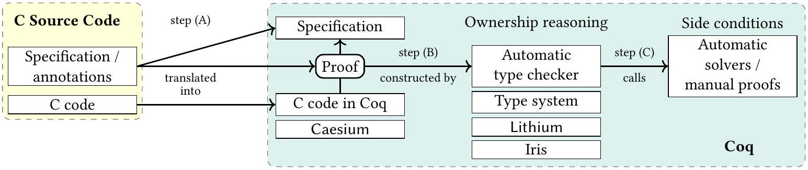
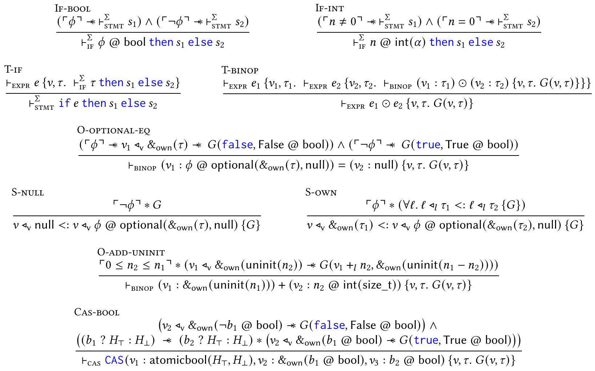

<!--
Third-party paper conversion for research use.
Authors: Michael Sammler, Rodolphe Lepigre, Robbert Krebbers, Kayvan Memarian,
Derek Dreyer, and Deepak Garg.
Original: https://doi.org/10.1145/3453483.3454036
License: CC BY 4.0 (https://creativecommons.org/licenses/by/4.0/).
Changes: PDF converted to Markdown with Mathpix; headings, footnotes, tables,
code blocks, and figure links were normalized, and extracted figures were
stored locally. Conversion completed 2026-07-30. The adjacent PDF remains the
source of truth.
-->

# RefinedC: Automating the Foundational Verification of C Code with Refined Ownership Types

Michael Sammler<br>MPI-SWS<br>Germany<br>msammler@mpi-sws.org

Rodolphe Lepigre<br>MPI-SWS<br>Germany<br>lepigre@mpi-sws.org

Robbert Krebbers<br>Radboud University Nijmegen<br>The Netherlands<br>mail@robbertkrebbers.nl

Kayvan Memarian<br>University of Cambridge UK<br>kayvan.memarian@cl.cam.ac.uk

Derek Dreyer<br>MPI-SWS<br>Germany<br>dreyer@mpi-sws.org

Deepak Garg<br>MPI-SWS<br>Germany<br>dg@mpi-sws.org


## Abstract

Given the central role that C continues to play in systems software, and the difficulty of writing safe and correct C code, it remains a grand challenge to develop effective formal methods for verifying C programs. In this paper, we propose a new approach to this problem: a type system we call RefinedC, which combines ownership types (for modular reasoning about shared state and concurrency) with refinement types (for encoding precise invariants on C data types and Hoare-style specifications for C functions).

RefinedC is both automated (requiring minimal user intervention) and foundational (producing a proof of program correctness in Coq), while at the same time handling a range of low-level programming idioms such as pointer arithmetic. In particular, following the approach of RustBelt, the soundness of the RefinedC type system is justified semantically by interpretation into the Coq-based Iris framework for higher-order concurrent separation logic. However, the typing rules of RefinedC are also designed to be encodable in a new "separation logic programming" language we call Lithium. By restricting to a carefully chosen (yet expressive) fragment of separation logic, Lithium supports predictable, automatic, goal-directed proof search without backtracking. We demonstrate the effectiveness of RefinedC on a range of representative examples of C code.


CCS Concepts: • Theory of computation → Separation logic; Automated reasoning; Type theory.

Keywords: C programming language, separation logic, ownership types, refinement types, proof automation, Iris, Coq

This work is licensed under a Creative Commons Attribution International 4.0 License.
PLDI '21, June 20-25, 2021, Virtual, Canada
© 2021 Copyright held by the owner/author(s).
ACM ISBN 978-1-4503-8391-2/21/06.
https://doi.org/10.1145/3453483.3454036


ACM Reference Format: Michael Sammler, Rodolphe Lepigre, Robbert Krebbers, Kayvan Memarian, Derek Dreyer, and Deepak Garg. 2021. RefinedC: Automating the Foundational Verification of C Code with Refined Ownership Types. In Proceedings of the 42nd ACM SIGPLAN International Conference on Programming Language Design and Implementation (PLDI '21), June 20-25, 2021, Virtual, Canada. ACM, New York, NY, USA, 17 pages. https://doi.org/10.1145/3453483.3454036


## 1 Introduction

Despite numerous advances in programming language technology over the past several decades, a great deal of safety- and security-critical systems software is still programmed in C. The C language remains widely used in large part because it provides fine-grained control over management of resources, which is indispensable to many systems programs. However, this control comes at the steep cost of regularly introducing serious and sometimes catastrophic bugs into code. It has thus long been one of the grand challenges of programming languages research to develop scalable formal methods that can help programmers build C code that is functionally correct, and verifiably so [2, 13, 15, 17, 19–21, 25, 27, 29, 31, 33, 40, 53, 63, 69, 75, 82, 86].

Existing tools for formal verification of C programs come in two varieties: automated or foundational.

On the one hand, automated tools like VeriFast [40], VCC [17], and MatchC [86] use a variety of techniques (including both off-the-shelf SMT solvers and bespoke separation-logic solvers) to verify correctness of C programs with minimal user intervention. With these tools, the user still needs to write specifications and provide some annotations (e.g., loop invariants) to aid the proof search, but the verification is otherwise automatic. However, automated tools have a sizable trusted computing base: one must trust that the often-sophisticated logic underpinning them is sound—and implemented correctly—since the tools do not provide any form of independently checkable proof.

On the other hand, foundational tools like VST [2, 10], as well as major verification efforts like CertiKOS [32-34] and
seL4 [51], embed expressive frameworks for verifying C code within a pre-existing logical foundation, typically a generalpurpose theorem prover such as Coq or Isabelle/HOL. Foundational tools have the key advantage of a smaller trusted computing base: one need only trust the proof checker of the host theorem prover and the encoding of the operational semantics of C, but not the particular logic or implementation of the tool itself. However, the use of foundational tools typically requires significant manual proof effort: although these frameworks provide tactical support for hiding tedious proof steps, the user must still guide the proof processe.g., manipulating the proof context, applying lemmas, performing case distinctions, unfolding definitions, instantiating quantifiers-by hand. One exception is Bedrock [13-15, 64], which provides much more powerful tactic-based automation. However, Bedrock does not handle many complexities of C, instead targeting a custom assembly-like language with a simplified memory model that prohibits many of the optimizations performed by modern C compilers [14].

In this paper, we present RefinedC, a new approach to verifying C code that is both automated and foundational, while at the same time handling a range of low-level programming idioms including pointer arithmetic, uninitialized memory, and concurrency with data races.

To support automated verification, RefinedC employs a novel type system combining refinement types and ownership types. Refinement types let us express precise invariants on C data types and strong Hoare-style specifications for C functions. Ownership types let us reason modularly about shared state and concurrency by controlling ownership of memory à la Rust [93]. Moreover, RefinedC's type-based approach has the benefit of offering a predictable, syntax-directed approach to automated verification.

To support foundational verification, RefinedC follows the semantic typing approach of RustBelt [42, 43]: we give meaning to RefinedC's types by interpreting them in Iris, a higher-order concurrent separation logic embedded in Coq [44, 45, 47, 55]. The typing rules of RefinedC thus simply become lemmas about our separation-logic model of types, whose soundness we establish (using Iris) in Coq. Separation logic is a natural fit for modeling RefinedC types because (a) it provides a built-in account of ownership-based reasoning, and (b) Iris provides features like invariants and ghost state, which are useful for justifying more sophisticated typing rules concerning shared state and concurrency.

Motivating example. Figure 1 shows a concrete example of RefinedC in action. The type struct mem_t represents the state of a memory allocator: a block of memory pointed to by buffer, whose size is len. The alloc function tries to allocate sz bytes of memory from a struct mem_t. It first checks, using len, that enough memory is available, and returns NULL otherwise. If buffer is large enough, then its last sz bytes are allocated using pointer arithmetic, and len is updated accordingly.

```
struct [[rc::refined_by("a: nat")]] mem_t {
    [[rc::field("a @ int<size_t>")]] size_t len;
    [[rc::field("&own<uninit<a>>")]] unsigned char* buffer;
};
[[rc::parameters("a: nat", "n: nat", "p: loc")]]
[[rc::args ("p @ &own<a @ mem_t>", "n @ int<size_t>")]]
[[rc::returns("{n ≤ a} @ optional<&own<uninit<n>>, null>")]]
[[rc::ensures("own p : {n ≤ a ? a - n : a} @ mem_t")]]
void* alloc(struct mem_t* d, size_t sz) {
    if(sz > d->len) return NULL;
    d->len -= sz;
    return d->buffer + d->len;
}
```

Figure 1. Memory allocator example in RefinedC.

The `[[rc::...]]` blocks in Figure 1 represent RefinedC annotations,[^0] which express a refined version of `mem_t` and a behavioral specification of `alloc` for RefinedC to verify automatically. Here, the refined `mem_t` is indexed by a natural number `a`, the number of bytes available from the allocator. This number must match the value stored in the `len` field as enforced using `a @ int<size_t>`, the singleton type of the `size_t` integer `a`. The buffer field is given the type `&own<uninit<a>>`, indicating that it is a pointer to an owned block of memory of size `a`. Taken as a whole, the refined `mem_t` encodes the invariant that the `len` field contains the length of the owned block pointed to by the `buffer` field.

The specification for alloc assumes (in its rc::args clause) that the argument d points to a struct mem_t with a available bytes, and that the argument sz is equal to some integer value n. The rc::returns clause specifies the refined type of the value that alloc returns: in this case, an optional value, which points to an uninitialized block of length n if the refinement $\mathrm{n} \leq \mathrm{a}$ is true, and is NULL otherwise. Finally, the rc::ensures clause specifies that, upon returning, alloc gives back the ownership of p (the pointer passed in as the argument d), now pointing to a mem_t of the appropriately reduced size.

Key idea. One may wonder how the checking of richly typed specifications like the one for `alloc` can be performed automatically. The key idea is that, even though RefinedC's refinement types encode deep (undecidable) specifications, their syntactic structure serves to judiciously and predictably guide the proof search in a syntax-directed manner. A concrete example of this is the type `b @ optional<T1,T2>` (as seen in the `rc::returns` clause in line 8 of Figure 1). Semantically, in our Iris model of RefinedC types, this type corresponds to a disjunction (untagged union) between the cases where `b` is true or false; and in general, searching for proofs of disjunctions is difficult because one may make incorrect choices, leading to backtracking. However, as we explain in §6, the


Figure 2. The architecture of RefinedC.

syntactic structure of the program and refinement types provide crucial information that we use to make a definite choice, thus avoiding backtracking.

Formally speaking, in order to ensure that RefinedC's typing rules lead to a non-backtracking proof search, we insist that they be expressible in a separation logic programming framework we call Lithium. Lithium is a carefully restricted fragment of the Iris logic, on which efficient goal-directed proof search is possible-indeed, we have implemented it in the form of a fully automated Coq tactic. A logic program in Lithium consists of a set of rules (often called clauses in logic programming), which serve to strategically guide proof search by instructing the Lithium interpreter how to convert every proposition into appropriate subgoals. These rules are certified correct by interpreting them semantically as lemmas to be proven in Iris (as described above). By expressing the RefinedC type system as a Lithium program, we thus obtain an automated and foundational method for checking C programs against RefinedC types, and one which is inherently extensible (e.g., to handle new C programming idioms) since it is encoded as an open set of Lithium rules.

The RefinedC toolchain. Figure 2 depicts the complete RefinedC toolchain.[^1] Developers write standard C code as they would without RefinedC. To this, they add a functional specification in the form of RefinedC's (refinement) types and standard annotations like loop invariants. After this, RefinedC takes over. First, in step (A), a front end that we have created (based on the front end of Cerberus [66]) translates the C code to a deep embedding of C in Coq, called Caesium, and translates the annotations to RefinedC's abstract syntax to Coq. Next, in step (B), Lithium automatically executes RefinedC's typing rules (represented as a logic program) on the Caesium code to produce a typing derivation proving the specification in Coq. During this process, verification conditions—which are pure Coq propositions—are generated. These are mostly automatically discharged using a library of Coq tactics (step (C)), but they can also be discharged by custom (e.g., domain-specific) solvers, or manual proofs.

Under the hood, hidden from the ordinary C programmer, lie RefinedC's types and typing rules, which have been defined ahead of time, in Lithium, by an expert. The expert must define types semantically (as explained above), and prove typing rules sound in Iris against the Caesium C semantics.

Contributions. We make the following contributions:

- RefinedC: A foundationally sound and automatic approach to functional verification of idiomatic C code based on refinement and ownership types (§4, §6).
- Lithium: A logic programming language based on the Iris separation logic, embedded in Coq, suitable for automating the type checking of RefinedC (§5).
- A front end translating annotated C code into Caesium, a deep embedding of C in Coq (§3).
- An evaluation of the RefinedC approach using case studies of varying complexity, which demonstrate RefinedC's handling of common low-level C idioms (§7).

## 2 RefinedC by Example

In this section, we use motivating examples to introduce RefinedC from the user's point of view. First, we go back in more detail to the example of Figure 1 (§2.1). We then verify the deallocation mechanism of a more complex allocator relying on a linked list of free chunks, which requires a recursive refinement type and a loop invariant (§2.2).

### 2.1 A Simple Memory Allocator

As shown in §1, the RefinedC annotations on struct mem_t in Figure 1 define a new RefinedC type called mem_t, which is parametric in a natural number a representing the number of available bytes. We emphasize the difference between the C type struct mem_t and the RefinedC type mem_t: The C type only specifies the physical layout-e.g., the names and the offsets of the fields, which are used by the compiler to generate field accesses-but does not give meaningful correctness guarantees. For example, the C type does not enforce that len is a valid integer: it could very well be uninitialized. The RefinedC type mem_t captures the invariant satisfied by struct mem_t values on which alloc operates. Note that RefinedC specifications are purely logical: they do not influence the program's compilation or its runtime behavior.

Specification of alloc. We now turn to the annotations assigning a type (i.e., a specification) to the alloc function. Our specification introduces a number of logical variables
(`rc::parameters` on line 6). Parameters are universally quantified in the specification and, like refinements on a struct given with `rc::refined_by`, range over arbitrary mathematical domains (i.e., Coq types). The `alloc` function has three parameters: the natural numbers `a` and `n` representing the number of available bytes and the amount requested by the caller respectively, and the location `p` at which the allocator state is stored. These parameters connect the refinements in the argument and return types, as well as possible pre- and postconditions. The types of the arguments are specified using `rc::args` on line 7. The type `p @ &own<a @ mem_t>` specifies that the first argument of `alloc` is an owned pointer to an allocator state with `a` available bytes, stored at location `p`. The singleton type `n @ int<size_t>` specifies that the second argument of `alloc`—the requested allocation size—is the `size_t` integer with value `n`.

Next, the return type of `alloc` is specified using `rc::returns` on line 8. The return value is an owned pointer if the allocation succeeds, otherwise it is NULL. These two possibilities are captured by the type `b @ optional<&own<...>, null>` that represents an owned pointer if the refinement `b` is true, and null (the singleton type containing only NULL) if the refinement `b` is false. The refinement $\mathrm{n} \leq \mathrm{a}$ checks whether allocation will succeed (i.e., if the allocator state owns enough memory).[^2]

The last part of the specification is a postcondition marked by rc::ensures on line 9. It says that alloc returns the ownership of the mem_t (that it received through its first argument) back to its caller. The mem_t in the postcondition has an updated refinement since the amount of available memory decreases on a successful allocation. Note that the first argument of alloc and the type in the postcondition are refined by the same location p. This forces alloc to return ownership for the same pointer that it was passed. This ownership transfer pattern occurs often in RefinedC. It is inspired by Mezzo [71], and is an alternative to Rust's mutable references.

Verification. RefinedC verifies the specification of `alloc` without manual intervention. In particular, RefinedC's automation picks the correct case of the returned optional by examining the type of the returned value (via rules S-null and S-own in Figure 6). It also splits the ownership associated with `buffer` into two following the pointer addition on line 13 (via rule O-add-uninit in Figure 6). One part of this ownership stays with `buffer` while the other part is returned to the caller. In §6, we explain both techniques further, as well as how the same typing rules also automatically verify a variant of `alloc` that allocates from the start of `buffer` instead of the end.

Error messages. RefinedC's syntax-directed proof search affords precise error messages. For example, suppose the programmer mistakenly writes $\mathrm{n}<\mathrm{a}$ instead of $\mathrm{n} \leq \mathrm{a}$ in the specification of alloc on line 8 in Figure 1. When n = a, the code returns a valid pointer, while the specification expects null, causing the verification to fail:

```
Cannot solve side condition in function "alloc"!
Location: "alloc.c" [13:2-13:28]
Case distinction (n > a) → false at "alloc.c" [11:5-11:18]
...
H3 : ᄀ n > a
n < a
```

This error message tells the user where in the code the verification failed (at the return on line 13), in which branch of the if statement on line 11 (the else branch), and what side condition could not be proved. Using this information, the programmer can easily debug the specification.

A thread-safe allocator. The function alloc described so far cannot be used concurrently on the same struct mem_t object due to a data race. This is why its specification requires full ownership of the allocator state. However, alloc can be made thread-safe by storing its state in a global variable protected by a lock. RefinedC supports this through a flexible spinlock abstraction containing two abstract types, spinlock< $\gamma>$ and spinlocked< $\gamma$, . . . >, which are, respectively, the type of a spinlock uniquely identified by the parameter $\gamma$ and the type of values protected by the lock $\gamma$. This interface is more general than the standard specification for locks in higher-order concurrent separation logic [38, 87] in that our spinlocked type allows adding resources to a lock after it has been allocated. A detailed discussion of our spinlock interface is outside the scope of this paper, but details can be found in the companion appendix [79, Section A].

### 2.2 Deallocation Using a List of Free Chunks

Next, consider the memory deallocation function free in Figure 3. This function inserts a chunk of memory that is being freed into a linked list of free memory chunks. When in the list, the initial bytes of a chunk are occupied by a struct chunk, which is a header that contains the chunk's size (line 10), and a pointer to the next chunk (line 11) if there is one, or NULL otherwise. The remaining bytes of the chunk can be arbitrary.

It is an invariant of free that the chunk list is always sorted in increasing order of chunk size. Hence, free has a loop to find where to insert the new chunk (lines 27-30).

Recursive type definition. Figure 3 defines two C types: struct chunk of chunk headers and chunks_t of pointers to such headers. The type chunks_t (not struct chunk) is refined by the RefinedC type chunks_t, which is defined on line 4. The annotation rc::ptr_type indicates that the defined RefinedC type refines the type of a pointer to the surrounding struct, not the struct itself. The ellipsis in the definition of chunks_t is a placeholder for the RefinedC type of the struct.

Note that chunks_t is a recursive type: The annotation on the next field mentions chunks_t again. Unfolding of recursive types is handled by RefinedC automatically; no extra annotations are required to indicate when to unfold.

```
typedef struct
[[rc::refined_by("s: {gmultiset nat}")]]
[[rc::ptr_type("chunks_t:"
        "{s = 0} @ optional<&own<...>, null>")]]
[[rc::exists ("n: nat", "tail: {gmultiset nat}")]]
[[rc::size ("n")]]
[[rc::constraints("{s = {[n]} ث tail}",
            "{৮ k, k є tail → n s k}")]]
chunk {
    [[rc::field("n @ int<size_t>")]] size_t size;
    [[rc::field("tail @ chunks_t")]] struct chunk* next;
}* chunks_t;
[[rc::parameters("s:{gmultiset nat}", "p:loc", "n:nat")]]
[[rc::args("p @ &own<s @ chunks_t>", "&own<uninit<n>>",
            "n @ int<size_t>")]]
[[rc::requires("{sizeof(struct_chunk) s n}")]]
[[rc::ensures ("own p: {{[n]} ษ s} @ chunks_t")]]
[[rc::tactics ("all: multiset_solver.")]]
void free(chunks_t* list, void* data, size_t sz) {
    chunks_t* cur = list;
    [[rc::exists ("cp: loc", "cs: {gmultiset nat}")]]
    [[rc::inv_vars("cur: cp @ &own<cs @ chunks_t>")]]
    [[rc::inv_vars("list:"
            "p @ &own<wand<{cp </ ({[n]} + cs) @ chunks_t},"
                    "{{[n]} + s} @ chunks_t>>")]]
    while(*cur != NULL) {
        if(sz <= (*cur)->size) break;
        cur = &(*cur)->next;
    }
    chunks_t entry = data;
    entry->size = sz; entry->next = *cur;
    *cur = entry;
}
```

Figure 3. Example of an allocator with a freelist.

Multiset and invariant. We explain the type chunks_t further. This type is refined by a multiset of natural numbers s on line 2. This multiset contains the sizes of all chunks in the list. When chunks_t is an owned pointer (i.e., when s is not the empty set), the struct that it points to is parameterized by the size of the first chunk n and the multiset tail refining the rest of the list. These two parameters are existentially quantified in the rest of the type (rc::exists annotation). A constraint (rc::constraints annotation) relates n and tail to s. A second constraint says that n is less than or equal to all elements of tail, which implies that the list of chunks is sorted. The last interesting point about chunks_t is the rc::size annotation on line 6. This annotation means that the chunk actually occupies n bytes in memory, of which the C type (struct chunk) only describes the initial part. In other words, the chunk is of size n bytes and a struct chunk (the header) is overlaid at its beginning. The remaining bytes of the chunk are treated as uninitialized by RefinedC.

Loop invariant and verification. The formal specification of free should be unsurprising. It says that when free is passed a free list with chunks of sizes s and a pointer to an owned chunk of size n (this is the block to be freed), then at the end of free, the free list contains chunks of sizes $\{[n]\} \uplus$ s (using Coq multiset operation notations). Importantly, free has a precondition (line 17) that the block being added to the free list is large enough to fit the struct chunk header.

Verifying free in RefinedC requires an explicit loop invariant (lines 22-26). Loop invariants are described with up to three annotations: rc::exists introduces local, existentially quantified logical variables, rc::inv_vars specifies RefinedC types of relevant program variables at the start of each loop iteration, and rc : : constraints lists additional assertions. (This example does not need rc::constraints.)

The loop invariant tracks the ownership of the list as it is traversed. Logically, the list has two parts: the suffix that has not yet been traversed and the prefix that has already been traversed. These two parts are pointed to by the local variable cur and the argument variable list, respectively. The loop invariant associates ownership of the list's two parts to these two variables. Specifically, it introduces a multiset variable cs corresponding to the multiset refinement of the suffix and asserts that cur points to an owned list of chunk sizes from cs. Next, it asserts that if this ownership extended with a chunk of size n (the new chunk) is combined with the ownership associated with list, then one obtains ownership of the entire output list (sizes from multiset \{[n]\} $\uplus$ s). This if-then relation is conveniently expressed using the wand<...> type using a standard technique for expressing partial data structures via the magic wand of separation logic [11].

Finally, the annotation rc::tactics on line 19 instructs RefinedC to use the multiset solver from the std++ Coq library [92] for proving the side conditions in this example that RefinedC's default solver cannot prove.

## 3 RefinedC Front End and Caesium

Before a C program can be verified by RefinedC, it is elaborated by the RefinedC front end to a core language we call Caesium. This language is control-flow graph-based, and given a formal semantics through a deep embedding in Coq. The core of this semantics is a low-level memory model that is roughly based on that of CompCert [61, 62]. Caesium provides both sequentially consistent and non-atomic memory accesses, and assigns undefined behavior to data races following the semantics of RustBelt [42]. Caesium supports many low-level idioms like pointer arithmetic, the address-of operator (also on local variables), access to representation bytes, fixed-size integers, goto (including unstructured switches, such as Duff's device), alignment checks, composite types as arguments and return values, uninitialized memory with poison semantics [59], and first-class function pointers. The RefinedC front end is implemented in OCaml and relies on the first half of the pipeline of Cerberus [66].

Since RefinedC aims at the verification of low-level systems code (like allocators, as shown in §2), the Caesium semantics is more permissive than what the ISO C standard describes. Indeed, it is well documented that ISO C and de facto

| Type | Intuitive semantics |
| :--- | :--- |
| $n$ @ $\operatorname{int}(\alpha)$ | C integer of type $\alpha$ that encodes $n$ |
| $\phi$ @ bool | Boolean reflecting the truth of $\phi$ |
| $\ell$ @ $\&_{\mathrm{own}}(\tau)$ | unique ownership of $\tau$ at location $\ell$ |
| uninit $(n)$ | $n$ uninitialized (i.e., arbitrary) bytes |
| null | singleton type of NULL |
| $\phi$ @ optional $\left(\tau_{1}, \tau_{2}\right)$ | if $\phi$ then $\tau_{1}$ else $\tau_{2}$ |
| wand $(H, \tau)$ | $\tau$ with hole $H$ |
| $\operatorname{struct}_{\sigma} \bar{\tau}$ | struct with layout $\sigma$, fields of types $\bar{\tau}$ |
| $\exists x . \tau(x)$ | type-level existential quantifier |
| $\{\tau \mid \phi\}$ | $\tau$ with constraint $\phi$ |
| padded $(\tau, n)$ | $\tau$ padded to $n$ bytes |

Figure 4. A selection of RefinedC types.

practices commonly found in low-level systems code disagree on many aspects of the C memory model [66, 67, 103]. Hence, the Caesium memory model has less undefined behavior than ISO C with respect to, e.g., padding in structs and effective types.

Caesium lacks some features of ISO C that are subject to active research. It does not support C's loose expression evaluation ordering [29, 37, 52] (Caesium fixes a left-to-right ordering), lifetimes of block-scoped variables [37, 57] (all local variables are function-scoped in Caesium), integer-pointer casts [49, 66], and relaxed-memory concurrency [5, 22, 48] (Caesium's only atomic accesses are sequentially consistent). To mitigate the first two points, the RefinedC front end performs an over-approximating analysis that emits warnings if an expression may be non-deterministic, or if the address of a block-scoped variable could escape.

Trusted computing base. The trusted computing base (TCB) of RefinedC includes the implementation of the front end, the definition of the Caesium semantics, and Coq. The front end contains around 6000 lines of OCaml code (excluding Cerberus) that transform Cerberus's AIL intermediate language into a control-flow graph and translate AIL constructs to Caesium (almost 1-to-1). The definition of the Caesium semantics is currently roughly 1500 lines of Coq code (including some proofs) and additionally uses definitions from the Coq standard library, std++, and the language interface of Iris. The Iris logic itself is not part of the TCB since its adequacy theorem establishes a closed Coq statement that involves just the operational semantics. Similarly, the Lithium interpreter described in §5 need not be trusted since it generates proofs in Iris.

## 4 RefinedC Types and Specifications

This section describes RefinedC's types further. Several interesting RefinedC types, along with their intuitive meaning, are shown in Figure 4. (These types also appeared in earlier examples.) In RefinedC, most types can have a refinement, an optional parameter that limits values in the type. A refinement is a logical predicate on values of the type, but the meta-level sort of the refinement and the predicate vary from type to type. For example, the type $\operatorname{int}(\alpha)$ can be refined by a mathematical integer $n$ to form the type $n$ @ $\operatorname{int}(\alpha)$ that represents the singleton set $\{n\}$ of $\alpha$-sized integers. The type $\phi$ @ bool is the single Boolean value reflecting the validity of proposition $\phi$. The refinement type $\ell$ @ $\&_{\text {own }}(\tau)$ denotes an owned (non-aliased) pointer and its refinement $\ell$ specifies the exact memory location that is owned. As examples, the annotations on mem_t on line 3 in Figure 1 use $\&_{\text {own }}(\tau)$ together with uninit $(n)$ to denote a pointer to a block of $n$ bytes of uninitialized memory. The type $\phi$ @ optional $\left(\tau_{1}, \tau_{2}\right)$ is a type-level case distinction on the validity of $\phi$. It is most commonly used to represent nullable pointers (via \& ${ }_{\text {own }}(\tau)$ and null), as illustrated in §2. Another interesting type is wand $(H, \tau)$, which is used to encode partial data structures via the magic wand [11]. The loop invariant of free in Figure 3 uses this type.

The last four types in Figure 4 are most often generated from other annotations (although they can be used directly, too). A structure type struct ${ }_{\sigma} \bar{\tau}$ is built by combining the types given by the rc::field annotations on a C struct (e.g., lines 2-3 in Figure 1). The types $\exists x . \tau(x)$ and $\{\tau \mid \phi\}$ are generated from rc::exists and rc::constraints annotations (e.g., lines 5-7 of Figure 3). Finally, the type padded $(\tau, n)$, which represents type $\tau$ padded to $n$ bytes, is generated from rc: :size annotations (e.g., line 6 of Figure 3).

Function types. Functions have RefinedC types of the form $\mathrm{fn}\left(\forall x . \overline{\tau_{\text {arg }}} ; H_{\text {pre }}\right) \rightarrow \exists y . \tau_{\text {ret }} ; H_{\text {post }}$. Function types are generated from the source code annotations we have already seen. For example, the annotations on alloc (lines 6-9 of Figure 1) lead to the function type alloc ${ }_{\text {spec }}$ shown in Figure 5. Logical variables in the rc: :parameters annotation (line 6) correspond to $x$ in the function type, the annotations rc::args and rc::returns (lines 7-8) correspond to $\overline{\tau_{\text {arg }}}$ and $\tau_{\text {ret }}$, respectively, and the annotations rc::requires and rc::ensures (line 9) correspond to $H_{\text {pre }}$ and $H_{\text {post }}$, respectively. Existential variables that are bound in the return type and the postconditions by rc::exists correspond to $y$. RefinedC function types are first-class: functions can be stored in memory and passed to or returned from other functions.

RefinedC assigns types to C programs through a type system consisting of several typing judgments and typing rules. Before introducing these judgments and rules, we describe the fragment of the Iris separation logic in which RefinedC's typing rules are represented in Coq.

## 5 Lithium: Separation Logic Programming

RefinedC's typing rules lie in a fragment of the Iris separation logic for which proof search can be directed entirely by the goal to be proven, without backtracking. This enables us to automate RefinedC efficiently. In this section, we define

```
$a @$ mem_t $\triangleq$ struct $_{\text {struct }}$ mem_t $\left[a @ \operatorname{int}\left(\operatorname{size} \_\mathrm{t}\right), \&_{\text {own }}(\operatorname{uninit}(a))\right]$
$\operatorname{alloc}_{\text {spec }} \triangleq \operatorname{fn}\left(\forall(a, n, p) . p @ \&_{\text {own }}(a @\right.$ mem_t $), n @ \operatorname{int}($ size_t $) ;$ True $)$
$\rightarrow \exists() .(n \leq a)$ @ optional $\left(\&_{\text {own }}(\operatorname{uninit}(a)), \operatorname{null}\right) ; p \triangleleft_{l}((n \leq a) ?(a-n): a) @$ mem_t
```

Figure 5. The formal specification of alloc (Figure 1) in RefinedC's type system (slightly simplified).
this fragment, called Lithium, describe how proof search works for it, and how we implement the proof search in Coq. We note that Lithium is similar to the substructural logic programming language Lolli [39] in its use of goal-directed search, but Lithium is simpler and never backtracks.

Lithium syntax. A Lithium judgment has the form $\Gamma ; \Delta \Vdash$ $G$, where $G$ is the goal to be proven, and $\Gamma$ and $\Delta$ are two contexts of hypotheses whose elements can be used an arbitrary number of times (unrestricted) and at most once (resources), respectively. The syntax of contexts and goals is:

```
Atom $\quad A::=\ell \triangleleft_{l} \tau\left|v \triangleleft_{\mathrm{v}} \tau\right| \ldots$
Basic goal $F::=\vdash_{\text {STMT }}^{\Sigma} s\left|A_{1}<: A_{2}\{G\}\right| \ldots$
Goal $G::=$ True $|F| H * G|H * G| G_{1} \wedge G_{2}$
        $|\forall x . G(x)| \exists x . G(x)$
Left-goal $\quad H::=\ulcorner\phi\urcorner|A| H * H \mid \exists x . H(x)$
Contexts $\quad \Gamma::=\emptyset|\Gamma, x| \Gamma, \phi \quad \Delta::=\emptyset \mid \Delta, A$
```

The unrestricted context $\Gamma$ contains universally quantified variables (parameters) $x$ and pure propositions $\phi$, all of which are duplicable. The resource context $\Delta$ contains atoms $A$. The atom $\ell \triangleleft_{l} \tau$ expresses that location $\ell$ has type $\tau$, and the atom $v \triangleleft_{\mathrm{v}} \tau$ expresses that value $v$ has type $\tau$. Atoms are nonduplicable because types may contain resource ownership.

Next, we describe goals, $G$. The simplest goals are basic goals, denoted $F$. Basic goals represent RefinedC typing and subsumption (subtyping) judgments. For example, the basic goal $A_{1}<: A_{2}\{G\}$ is a RefinedC subsumption judgment; logically, it is equivalent to $A_{1} *\left(A_{2} * G\right)$. The basic goal/typing judgment $\vdash_{\text {STMT }}^{\Sigma} s$ means that the C statement $s$ is well-typed in the function state $\Sigma$, which contains the control-flow graph and the postcondition of the function containing $s$.

As an example, we show below the Lithium judgment stating that alloc has the type in Figure 5. Importantly, RefinedC typing assumptions about alloc's arguments are represented in the Lithium context (to the left of $\Vdash$ ), and $\Sigma$ contains the postcondition of alloc, i.e., the consequent of alloc ${ }_{\text {spec }}$.

```
$\emptyset ; \ell_{\mathrm{d}} \triangleleft_{l} p @ \&_{\mathrm{own}}(a @$ mem_t $)$,
    $\ell_{\mathrm{sz}} \triangleleft_{l} n @ \operatorname{int}($ size_t $) \Vdash\left(\vdash_{\text {sTMT }}^{\Sigma} \operatorname{alloc}\left(\ell_{\mathrm{d}}, \ell_{\mathrm{sz}}\right)\right)$
```

Besides basic goals, goals $G$ may also contain the separation logic connectives $*, *, \wedge, \forall$ and $\exists$. However, the left sides of * and * are restricted to a smaller class of goals called left goals, $H$, which cannot contain $\wedge, \forall$ and $*$. We explain the exact purpose of this restriction later but, briefly, it significantly narrows the search space for proofs.

Goal-directed search. The search for a proof of $\Gamma ; \Delta \Vdash G$ in Lithium is directed by the goal $G$, and proceeds by case analysis of $G$. We summarize the cases below. The action in each case is based on standard introduction and rewriting rules of separation logic.

1. $G=$ True: The search succeeds trivially.
2. $G=G_{1} \wedge G_{2}$ : Fork to prove both $\Gamma ; \Delta \Vdash G_{1}$ and $\Gamma ; \Delta \Vdash G_{2}$.
3. $G=\forall x . G^{\prime}(x)$ : Prove $\Gamma, y ; \Delta \Vdash G^{\prime}(y)$ for a fresh $y$.
4. $G=\exists x . G^{\prime}(x)$ : Prove $\Gamma ; \Delta \Vdash G^{\prime}(? x)$, for a fresh evar $? x$.
5. $G=F$ : Find a RefinedC typing rule $\frac{G^{\prime}}{F^{\prime}}$ whose conclusion $F^{\prime}$ can be unified with $F$, and prove $\Gamma ; \Delta \Vdash G^{\prime}$.
6. a. $G=\left(H_{1} * H_{2}\right) * G^{\prime}$ : Prove the equivalent judgment $\Gamma ; \Delta \Vdash H_{1} *\left(H_{2} * G^{\prime}\right)$; the next step will analyze the smaller formula $H_{1}$.
b. $G=(\exists x . H(x)) * G^{\prime}$ : Prove the equivalent Lithium judgment $\Gamma ; \Delta \Vdash \exists x .\left(H(x) * G^{\prime}\right)$ and use case (4); the next step will analyze a smaller formula $H(? x)$.
c. $G=\ulcorner\phi\urcorner * G^{\prime}$ : Solve the pure side condition $\phi$ under premises $\Gamma$ and prove $\Gamma ; \Delta \Vdash G^{\prime}$.
d. $G=A * G^{\prime}$ : Find $A^{\prime} \in \Delta$ that is related to $A$, and prove $\Gamma ; \Delta \backslash A^{\prime} \Vdash A^{\prime}<: A\left\{G^{\prime}\right\}$. Atoms $A$ and $A^{\prime}$ are related if they both assign types to the same value or location.
7. a. $G=\left(H_{1} * H_{2}\right) * G^{\prime}$ : Prove the equivalent Lithium judgment $\Gamma ; \Delta \Vdash H_{1} *\left(H_{2} * G^{\prime}\right)$; the next step will analyze the smaller formula $H_{1}$.
b. $G=(\exists x . H(x)) * G^{\prime}$ : Prove the equivalent Lithium judgment $\Gamma ; \Delta \Vdash \forall x . H(x) * G^{\prime}$ and use case (3); the next step will analyze the smaller formula $H(y)$.
c. $G=\ulcorner\phi\urcorner * G^{\prime}$ : Prove $\Gamma, \phi ; \Delta \Vdash G^{\prime}$.
d. $G=A * G^{\prime}$ : Prove $\Gamma ; \Delta, A \Vdash G^{\prime}$.

No backtracking. The Lithium proof search procedure is efficient in large part because it does not backtrack. Several design choices make this possible. First, the left side of $*$ in goals is limited to the form $H$, which cannot contain $\wedge, \forall$, and * . Without this restriction, proving a goal $G_{1} * G_{2}$ would require a two-way split of the resource context $\Delta$ to prove $G_{1}$ and $G_{2}$ simultaneously, requiring backtracking over possible splits of $\Delta$. However, when $G_{1}$ is limited to the form $H$, we can reduce it in place all the way down to atoms (case (6) and its subcases), which eliminates this form of backtracking.

Second, the left side of * in goals is also restricted to the form $H$. This allows us to reduce local assumptions to atoms before adding them to the context $\Delta$ (case (7) and its subcases). By keeping only atoms in $\Delta$, we eliminate backtracking over possible hypotheses that can be used to prove a given goal atom of the form $\ell \triangleleft_{l} \tau$ or $v \triangleleft_{\mathrm{v}} \tau$ : We trivially
match $\ell$ or $v$ from the goal to each hypothesis and at most one hypothesis will match, since the context $\Delta$ won't contain multiple typing assumptions for the same location or value.

In principle, backtracking could arise in case (5), where more than one RefinedC typing rule could match the goal $F$. However, multiple matches do not actually arise because RefinedC's typing rules are syntax-directed: types and code inside $F$ uniquely determine the applicable typing rule.[^3]

Handling of evars. One important aspect of Lithium not mentioned so far is the handling of evars created in case (4). In particular, Lithium must be careful when instantiating evars because a bad instantiation could easily make the goal unprovable. To prevent this, case (4) seals the evars it creates so that they cannot be prematurely instantiated by Coq's unification. In fact, the only place sealed evars can get instantiated is when solving side conditions emitted by case (6c), at which point Lithium attempts to eliminate any evars in the side condition using one of the following heuristics.

First, Lithium tries to find a suitable instantiation for the evars by checking if the side condition is an equality and, if so, removing the seals from all evars and then trying to unify both sides (potentially instantiating evars). Though this heuristic is often effective, it may also turn a provable goal into an unprovable goal if it unifies an evar appearing as the argument of a non-injective symbol. For example, unifying (length $? x$ ) and (length $l$ ) will lead to $? x$ being instantiated with $l$, whereas the correct instantiation for ? $x$ might in fact be another list with the same length as $l$. In such cases, the user's only recourse at present is to adjust the annotations to generate side conditions in an order that allows correct instantiation. However, this has not caused problems in the examples we have tried so far. In particular, all examples of §7 use this heuristic.

Second, if Lithium cannot instantiate the evars in the side condition, it simplifies the goal using a set of user-extensible rewriting rules and equivalences. For example, a side condition of the form ? $x s \neq[]$ is simplified to the equivalent $\exists y . \exists y s . ? x s=y:: y s$, which leads Lithium to introduce evars $? y$ and $? y s$ and instantiate $x s$ with ? $y:: ? y s$. The simplification rules are also used by case (7c) to normalize assumptions introduced into the context. For example, an assumption $x s+y s=[]$ is simplified to $x s=[]$ and $y s=[]$, which causes both $x s$ and $y s$ to be substituted with []. By default, this simplification mechanism applies equivalences and thus preserves provability, but there is an escape hatch that lets one add implications (rather than equivalences) as simplification rules. (Doing so can make provable goals unprovable.)

The procedure described above is not complete as there can be a side condition for which the heuristic for evar instantiation fails and no simplification rule applies. However, the predictable nature of goal-directed search in Lithium helps the user avoid such side conditions: since Lithium always processes goals from left to right, it is straightforward to predict in which order the side conditions will be generated. For example, when checking a function call the arguments (`rc::args`) are checked before additional preconditions (`rc::requires`), so one need not worry about evars in the preconditions if they are determined by the arguments. (See `free` in Figure 3 for an example of this.) Finally, for the uncommon case where the above heuristics fail, the user has two fallback options: they can either extend the simplification rules or choose RefinedC annotations more carefully in order to generate simpler unification problems.

Implementation. We have implemented a Lithium interpreter in the Ltac language [23] of Coq. The interpreter maps $\Gamma$ to the standard Coq context and $\Delta$ to the spatial context provided by the Iris Proof Mode [54, 56]. The search for matching RefinedC typing rules (case (5) above) is handled using Coq's typeclass mechanism [84]. For unification, we leverage Coq's unification. The simplification mechanism for side conditions containing evars is based on a combination of the autorewrite tactic and typeclasses.

Extensibility. Inspired by the semantic typing approach of RustBelt [42, 43], RefinedC types and typing judgments are defined semantically in terms of the connectives of the Iris separation logic, and typing rules are proved as lemmas in Iris. This means that RefinedC can be extended with user-defined types and typing rules. RefinedC's extensibility is reflected in Lithium's automated proof search as well: when new typing rules are added, Lithium's proof search automatically uses them through case (5) above.

## 6 Examples of RefinedC Typing Rules

Next, we explain selected typing rules, shown in Figure 6. Every typing rule has the form $\frac{G}{F}$ where $G$ is a Lithium goal and $F$ is a Lithium basic goal, which encodes a RefinedC typing judgment.[^4]

Judgment basics. RefinedC has a specialized typing judgment for each program construct, e.g., $\vdash_{\text {IF }}$ for conditional statements and $\vdash_{\text {BINOP }}$ for binary operators. These judgments are parameterized by the types of the values they operate on. This ensures that Lithium's proof search does not need to backtrack since these types uniquely determine the applicable rule. For example, consider the rules If-bool and If-int in Figure 6. Depending on the type of the condition (bool vs. int) a different rule applies and typing proceeds differently. Such type-based overloading allows RefinedC to handle the same program construct differently depending on the context. This is useful because, in C, the same construct may serve different purposes.

Construct-specific judgments arise in the premises of rules for general statement and expression judgments, e.g., T-if or T-binop. The expression judgment $\vdash_{\text {EXPR }} e\{v, \tau . G(v, \tau)\}$,


Figure 6. Selected RefinedC typing rules. (Simplified by, e.g., omitting refinements of $\&_{\text {own }}$.)

which also appears in the premises of rules, is a bit unusual since it is parameterized by a continuation $G$, similar to the postcondition of the weakest precondition assertion in Iris. This continuation has two purposes. First, typing an expression infers a type $\tau$. This type, together with an inferred (symbolic) value $v$ for the result, is passed as an argument to the continuation. Second, the continuation is used to linearize type checking as in T-binop, which first types $e_{1}$, then, in the continuation, types $e_{2}$, and, after both $\tau_{1}$ and $\tau_{2}$ have been inferred, introduces $\vdash_{\text {BINOP }}$. This continuation-passing style ensures that every typing rule's premise has one logical formula, which simplifies Lithium's implementation.

Typing rules for optional. As demonstrated in §2.1, the optional type of RefinedC plays a key role in handling the common low-level programming pattern of encoding an error value as NULL. Most uses of this pattern can be handled by three RefinedC typing rules: the rule O-optional-eq for comparing an optional with NULL, and the two rules S-null and S-own for introducing an optional type.

The rule O-OPTIONAL-EQ is used to prove $\vdash_{\text {STMT }}^{\Sigma}$ `if (e == NULL) then s₁ else s₂`. To do this, Lithium first applies T-if, whose premise requires typing the Boolean expression `e == NULL`. It then applies T-binop, which requires typing $e$. Suppose Lithium infers the type $\phi$ @ optional $\left(\&_{\text {own }}(\tau)\right.$, null) for $e$. Next, Lithium types the second expression, NULL. This is trivial as NULL has type null. At this point, Lithium's goal is a judgment that matches the conclusion of O-optional-eq.

We now explain O-OPTIONAL-EQ in detail. The rule distinguishes two cases via $\wedge$, corresponding to the cases where $\phi$ holds or does not hold. When $\phi$ holds (first case), $v_{1}$ must be an owned pointer, which cannot equal NULL, so the result of the equality check in the conclusion of the rule must be false. Accordingly, in this case, the continuation $G$ is checked with argument false, and $\phi$ and $v_{1} \triangleleft_{\mathrm{v}} \&_{\text {own }}(\tau)$ are added to the context (using case (7c) and case (7d) of §5). When $\phi$ does not hold (second case), $v_{1}$ must have the type null, so $v_{1}$ must be NULL and, hence, equal to $v_{2}$. Accordingly, the continuation $G$ is checked with argument true and $\neg \phi$ added to the context.

In either of these two cases, the typing of $\vdash_{\text {STMT }}^{\Sigma}$ if ( $e=$ NULL) then $s_{1}$ else $s_{2}$ continues using If-bool (with the metavariable $\phi$ of If-bool instantiated to False or True, respectively). This rule also distinguishes two cases, but one holds vacuously by virtue of the new assumption False (or ¬True).

Next, we explain how Lithium establishes that a value $v$ has type $\phi$ @ optional $\left(\&_{\text {own }}(\tau)\right.$, null). A typing goal is an atom (A) in Lithium, so the proof starts with case (6d) of §5. Accordingly, Lithium looks for an atom $A^{\prime}$ in the context that
types $v$. Typically, $A^{\prime}$ will type $v$ at either null or $\&_{\text {own }}\left(\tau^{\prime}\right)$ for some $\tau^{\prime}$. In the first case, (6d) yields a new goal of the form $v \triangleleft_{\mathrm{v}}$ null $<: v \triangleleft_{\mathrm{v}}\left(\phi @\right.$ optional $\left(\&_{\text {own }}(\tau)\right.$, null $\left.)\right)\left\{G^{\prime}\right\}$ (for some continuation $G^{\prime}$ ). At this point, rule S-null is used to reduce the goal to proving $\neg \phi$ (and $G^{\prime}$ ), which is what one expects from the intuitive meaning of the optional type. In the second case, Lithium's goal is $v \triangleleft_{\mathrm{v}} \&_{\text {own }}\left(\tau^{\prime}\right)<: v \triangleleft_{\mathrm{v}}(\phi @$ optional $\left(\&_{\text {own }}(\tau)\right.$, null)) $\left\{G^{\prime}\right\}$. Using rule S-own, this reduces to proving $\phi$ and a subsumption between $\tau^{\prime}$ and $\tau$, which again follows the meaning of the optional type.

Ownership reasoning. Next, we explain how program syntax guides ownership reasoning in RefinedC. Consider the expression d->buffer + d->len on line 13 of Figure 1. Logically, this expression splits the ownership of d->buffer into two parts: one part that remains associated with d->buffer, and a second part that is returned to the caller with the allocated memory. This reasoning is performed by the rule O-add-uninit, which types the addition of an integer $n_{2}$ to a pointer to uninitialized memory of length $n_{1}$ (RefinedC type uninit $\left(n_{1}\right)$ ). The rule splits uninit $\left(n_{1}\right)$ into the smaller pieces uninit $\left(n_{2}\right)$ and uninit $\left(n_{1}-n_{2}\right)$, after checking that $n_{2} \leq n_{1}$. This rule is a representative instance of how RefinedC's informative types disambiguate the intended logical meaning of a commonly overloaded C operator (+ in this case).

Note that O-add-uninit can be reused in other contexts where programs add values of type ${ }_{\text {own }}(\operatorname{uninit}(n))$ and int(size_t). For example, say we change the implementation of alloc to allocate from the beginning of buffer instead of the end, i.e., replacing line 13 in Figure 1 with the following:

```
unsigned char *res = d->buffer;
d->buffer += sz;
return res;
```

RefinedC automatically verifies the resulting version of alloc without further changes since O-add-uninit is general enough to cover the type checking of + in both cases. The only difference is that the two versions distribute $v_{1}$ and $v_{1}+{ }_{l} n_{2}$ differently. In the original version, $v_{1}$ and the associated ${ }_{\text {own }}\left(\operatorname{uninit}\left(n_{2}\right)\right)$ stay in buffer, while $v_{1}+{ }_{l} n_{2}$ is returned with $\&_{\text {own }}\left(\right.$ uninit $\left.\left(n_{1}-n_{2}\right)\right)$. In the new version, buffer is updated to $v_{1}+{ }_{l} n_{2}$, while the original value $v_{1}$ is returned.[^5]

Fine-grained concurrency. RefinedC can also automatically verify fine-grained concurrent code. We illustrate this with the type atomicbool $\left(H_{\top}, H_{\perp}\right)$, which represents a Boolean that can be accessed atomically. The type holds the ownership of $H_{\top}$ if the Boolean is true, and of $H_{\perp}$ if the Boolean is false. For example, a spinlock that protects the resource $H$ can be modeled as the type atomicbool(True, $H$ ).

The main atomic operation supported by the atomicbool type is `atomic_compare_exchange_strong`, corresponding to Caesium's $\operatorname{CAS}\left(\ell_{\text {atom }}, \ell_{\text {exp }}, v_{\text {des }}\right)$ operation. The first argument $\left(\ell_{\text {atom }}\right)$ is a pointer to the value to be modified atomically, the second argument $\left(\ell_{\text {exp }}\right)$ is a pointer to the current expected value of $\ell_{\text {atom }}$, and the third argument $\left(v_{\text {des }}\right)$ is the value to be assigned to $\ell_{\text {atom }}$. CAS also sets $\ell_{\text {exp }}$ to the previous value stored at $\ell_{\text {atom }}$.

CAS is verified using the rule Cas-bool. The second and third arguments of CAS have singleton Boolean types that determine whether the premise uses $H_{\top}$ or $H_{\perp}$. Cas-bool has two cases corresponding to whether the CAS fails or succeeds. (First case) When CAS fails, the second argument is updated to $\neg b_{1}$, and false is returned. (Second case) When CAS succeeds, we receive ownership stored with the atomic Boolean before the CAS, and have to prove ownership stored after the CAS. Subsequently, we receive ownership of $v_{2}$, and the CAS returns true. (The implementation of the spinlock mentioned earlier uses Cas-bool with $b_{1} \triangleq$ false and $b_{2} \triangleq$ true, which means that on a successful CAS, one receives the ownership of $H$ stored in the spinlock.)

The RefinedC type atomicbool hides complex Iris concepts related to fine-grained concurrency like impredicative invariants and ghost state. These concepts show up only in proving the soundness of Cas-bool, which we have done once and for all in Coq. Lithium's automation only uses the much simpler statement of the Cas-bool rule, not its proof.

## 7 Evaluation and Case Studies

To evaluate the automation and expressiveness of RefinedC, we verified full functional correctness of six classes of programs in Figure 7. We selected these programs to cover a wide variety of reasoning patterns ranging over standard benchmarks (\#1), tricky ownership reasoning (\#2), difficult side conditions (\#3, \#4), real-world C code (\#5) and concurrent algorithms (\#6).

First, the table in Figure 7 lists the most interesting types used by each example. This shows how RefinedC types like wand or padded are reused across different programs. Then, the table shows the number of RefinedC typing rules used in type checking each of the examples. All typing rules used by the examples are either automatically generated unfolding rules for user-defined types or they are part of the RefinedC standard library. This standard library currently contains around 30 types and 200 typing rules. As explained in §5, Lithium automatically selects and applies the right typing rule from these predefined rules. Figure 7 shows how many such automatic rule applications Lithium performs. This number gives a sense of the automation afforded by Lithium, showing the extent to which typing rules handle tasks like ownership manipulation and unfolding of definitions that must be performed manually in some other tools. Additionally, the table shows how many existential variables are automatically instantiated via the heuristics described in §5. Across all programs, we had to instantiate only one evar manually (in Spinlock).

| Class | Test | Types used | Rules | $\exists$ | $\ulcorner\phi\urcorner$ | Impl | Spec | Annot | Pure | Ovh |
| :--- | :--- | :--- | :--- | :--- | :--- | :--- | :--- | :--- | :--- | :--- |
| \#1 | Singly linked list | wand, alloc | 44/613 | 119 | 47/5 | 106 | 33 | 24 (4/20/0) | 2 | ~0.2 |
|  | Queue | list segments, alloc | 42/310 | 81 | 10/0 | 42 | 15 | 9 (9/0/0) | 0 | ~0.2 |
|  | Binary search | arrays, func. ptr. | 40/308 | 68 | 73/6 | 42 | 16 | 6 (0/5/1) | 19 | ~0.6 |
| \#2 | Thread-safe allocator | wand, padded, lock | 58/319 | 96 | 28/2 | 68 | 18 | 21 (14/2/5) | 3 | ~0.4 |
|  | Page allocator | padded | 40/236 | 60 | 14/0 | 43 | 14 | 14 (14/0/0) | 0 | ~0.3 |
| \#3 | Bin. search tree (layered) | wand, alloc | 50/964 | 216 | 50/11 | 133 | 65 | 22 (8/7/7) | 128 | ~1.1 |
|  | Bin. search tree (direct) | wand, alloc | 48/977 | 240 | 47/43 | 115 | 43 | 17 (8/7/2) | 10 | ~0.2 |
| \#4 | Linear probing hashmap | unions, arrays, alloc | 57/1167 | 356 | 175/39 | 111 | 46 | 34 (14/17/3) | 265 | ~2.7 |
| \#5 | Hafnium mpool allocator | wand, padded, lock | 72/1730 | 515 | 122/11 | 191 | 53 | 55 (28/19/8) | 5 | ~0.3 |
| \#6 | Spinlock | atomic Boolean | 25/65 | 10 | 14/1 | 24 | 12 | 13 (0/1/12) | 1 | ~0.6 |
|  | One-time barrier | atomic Boolean | 18/34 | 5 | 6/0 | 20 | 7 | 2 (0/0/2) | 0 | ~0.1 |

Figure 7. Evaluation of RefinedC. Types used: Salient type constructs used in the program. Rules: Number of distinct typing rules / number of typing rule applications. $\exists$ : Number of automatically instantiated existential quantifiers. $\ulcorner\phi\urcorner$ : Number of side conditions automatically proved / manually proved. Impl: Lines of C code (counted by tokei [94]). Spec: Lines of top-level (function) specification. Annot: Lines of annotation in source code (numbers in parentheses show breakdown into data structure invariants / loop annotations / other annotations)). Pure: Lines of pure Coq reasoning, including definitions and lemma statements. Ovh: Sum of Annot and Pure divided by Impl.

Figure 7 also lists how many pure side conditions RefinedC solves automatically using its default solver and how many need at least some manual help. We count these numbers very conservatively: In many cases, a standard solver, like set_solver from std++ [92], discharges several side conditions automatically, but we still count these side conditions in "manual" since the developer has to explicitly specify that the set solver must be used. Basically, any side condition that cannot be discharged by the one default solver that we wrote-which currently only targets linear arithmetic and Coq lists-is counted as manual. This default solver can definitely be improved in the future. Finally, for each example, Figure 7 lists the number of lines of C code, annotations, and pure Coq reasoning for manual proofs. Importantly, there is no column for the number of lines of separation logic (Iris) reasoning since the RefinedC automation is able to handle this automatically (with the exception of the initialization function for spinlocks, which we explain later).

Overall, our experience is that RefinedC's automation can handle a wide variety of low-level reasoning, requiring manual input only for example-specific pure (mathematical) side conditions and only in the more challenging examples. RefinedC's relative annotation overhead is moderate-less than 0.7 for all examples that do not involve complex side conditions (which are not the focus of RefinedC's automation at present).
\#1: Common case studies. The first three examples of Figure 7 are case studies common to many verification tools. The verification of singly-linked lists uses the representation of partial data structures with magic wand [11, 12] illustrated in §2.2, while the verification of queues needs a more specialized notion of list segments. Both use the first allocator of \#2 below for the allocation of new nodes. The five side conditions counted here as manually discharged are actually handled automatically by set_solver from std++. Additionally, we verified a binary search implementation using a function pointer, and a client of it. RefinedC handles this easily since function pointer types are first class. The annotation overhead for these examples is low. In addition to annotations for loops and data structure invariants, only a single annotation (to import manual proofs) is necessary.
\#2: Ownership reasoning. To evaluate RefinedC's ownership reasoning, we verified two memory allocators. These examples showcase RefinedC's expressiveness, as all necessary ownership transfers can be represented using types like padded (rc::size annotation in Figure 3). The thread-safe allocator uses annotations to manipulate the spinlocked type, as described in §2 and in the companion appendix [79, Section A]. (A third memory allocator from real-world code is covered in \#5 below.)
\#3: Layered vs. direct verification. A popular approach to verification of low-level code is to split the verification tasks into many layers of intermediate specifications [34, 63]. To investigate how this layered approach works in RefinedC, we verified a binary search tree first via an intermediate functional layer, and second by directly going from C to the desired specification as a functional set. Although both approaches are viable with RefinedC, the overhead of the
direct approach is significantly less than the overhead of the layered approach as it does not require defining the intermediate layer. The direct approach works well because the type system cleanly separates ownership reasoning from pure functional reasoning and all except three side conditions are automatically discharged by variants of set_solver.
\#4: Complex functional reasoning. To check whether RefinedC scales to data structures with complex functional invariants, we verified a hashmap with linear probing. Verifying linear probing is non-trivial since all keys share the same array, and one has to prove that an insertion or deletion does not affect unrelated keys. The verification uses a functional version of the probing function for stating the invariant. RefinedC reduces verification to pure reasoning about this invariant, which is discharged through manual proofs in Coq.
\#5: Real-world code. Our largest case study applies RefinedC to a version of the page allocator of the Hafnium hypervisor [35].[^6] This verification combines many of the previously mentioned techniques, and shows that RefinedC can verify real-world C code. Even though this allocator is significantly more complicated than the allocators in \#2, we did not have to define any new RefinedC types to automatically handle the ownership reasoning.
\#6: Concurrent abstractions. The examples in this class show that RefinedC can automatically verify fine-grained concurrent code that is out of reach for many other automatic verifiers. In particular, we use the atomic Boolean type from §6 to verify two concurrent algorithms: a spinlock and a one-time barrier. This type is abstract enough to automate the verification of the acquire and release functions of the spinlock and the barrier. The initialization function needs manual proofs where it allocates a ghost token and for instantiating one existential quantifier with a newly generated ghost name. As mentioned in §2, RefinedC also provides a spinlocked type, which decouples the spinlock from the resources protected by it; the typing rules for spinlocked require 162 lines of additional Iris proofs. Altogether, the result is a reusable spinlock abstraction, which is used by several other examples in Figure 7 (the first allocator of \#2, and the allocator of \#5).

## 8 Related Work

Bedrock. Like RefinedC, the Bedrock project [13-15, 64] targets foundational and mostly automatic separation logic-based verification of low-level programs. However, Bedrock is based on a custom assembly-like language and custom DSLs built on top, using macros that are verified similar to compiler passes [14, 15]. In contrast, RefinedC applies to existing C code that can be compiled using off-the-shelf optimizing C compilers.

Another point of difference from RefinedC is that, rather than exploiting the higher-level abstractions of a refined type system to drive automation, Bedrock encodes specifications and abstract predicates in plain separation logic, for which proof automation [13, 64] can be extended via custom Ltac tactics and hints for unfolding abstract predicates. However, Bedrock's hint format is less expressive than Lithium, e.g., it cannot represent rules like Cas-bool from §6. Also, unlike RefinedC typing rules, Bedrock hints cannot be tied to specific program constructs and, hence, cannot be directed by program syntax. Thus, for example, the verification of a singly-linked list requires four custom hints and ~10 lines of custom Ltac in Bedrock [91], whereas no such extra work is required in RefinedC. (Both tools require loop invariant annotations.)

VST. VST [2, 10] is a separation logic-based framework for verifying CompCert C programs. Users of VST deploy a set of semi-automatic tactics to build functional correctness proofs in Coq [10], or a front end [102] that uses source code annotation to reduce verification to a set of entailments that have to be proven in Coq. However, in both cases the user needs to manually guide the proof by performing case distinctions, applying lemmas, unfolding predicates, and instantiating existential quantifiers-tasks that RefinedC's Lithium-based automation handles automatically in most cases. As a concrete example, verification of a binary search tree similar to the one in §7 by the authors of VST [97] requires manual effort for hundreds of such proof steps, which is not the case in RefinedC. (The binary tree example in RefinedC needs manual effort only for pure side conditions.)

Foundational verification of large-scale C programs. There are several projects that perform C verification at scale, most notably seL4 [51] and CertiKOS [32-34].
seL4 [50, 51] demonstrated the first formal proof of functional correctness of a complete, general-purpose operatingsystem kernel and comes with a translation-validation procedure [68, 81] to transfer the proofs to generated assembly code. However, most of seL4's proofs about C code are manual and rely only on basic tactic support [50, 104]. Later work automates some but not all of the most tedious parts [30, 31]. This automation, and the original seL4 verification, do not support some aspects of C (such as concurrency and taking addresses of local variables) that are supported by RefinedC.

CertiKOS [32-34] provides the first correctness proof of a general-purpose concurrent OS kernel with fine-grained locking. CertiKOS verification is integrated with the CompCert C compiler, so the proof applies to the generated assembly code. The proof technique used (called "certified abstraction layers") is based on writing programs at different layers of abstraction and proving refinements between these layers. Refinement proofs are discharged (broadly similar to VST) by manually guiding specialized tactics in Coq. As seen in §7, RefinedC does not (in most cases) require such
manual guidance in Coq, and it also supports a layer-based approach (although quite different from CertiKOS's, since RefinedC's is based on layers of types vs. layers of programs in CertiKOS). However, further work is needed in order to establish the effectiveness of RefinedC at the larger scale at which seL4 and CertiKOS have been deployed.

Non-foundational tools for verification of $C$. We compare RefinedC to some of the most closely related nonfoundational tools for verifying C code.

VCC [17] employs SMT solvers to verify C programs and has been used on large C programs in practice. However, it lacks good support for dynamic ownership reasoning. For example, a linked list predicate that supports member testing requires three ghost fields-all of which need to be updated manually in the add function [18, 95]. No such ghost fields and annotations are necessary in RefinedC.

VeriFast [40] is an automated, separation logic-based verification tool for C and Java. It provides heuristics to automatically infer annotations to reduce the proof burden [100]. VeriFast's symbolic execution approach (of which only a core subset has been proven sound [99]) uses a fixed rule for each program construct, whereas RefinedC allows type-based overloading as described in §6. RefinedC also benefits from existing Coq libraries like std++[92]: the binary search tree (layered) example from §7 requires roughly half the number of lines of pure reasoning compared to a similar example in VeriFast [96] by judicious use of existing lemmas and tactics. Other than this, the annotation burden is similar.

MatchC [78, 86] is an automated verification tool for C based on the K framework [77] and matching logic [76]. Its rewrite-based approach provides good automation for nontrivial pointer-manipulating programs and can be extended with new abstractions and custom rules like RefinedC. However, unlike RefinedC, these abstractions and their rules are not proven sound against a model, and must be trusted. MatchC also does not support concurrency.

Verification of crypto. Various projects have embedded subsets of C suitable for crypto verification in off-the-shelf verification tools. Fiat Crypto [26] provides a language for crypto in Coq, which is compiled to C. Fiat Crypto is used to verify a high-performance implementation of the P-256 elliptic curve. Low* [72] provides a semi-foundational approach to C verification through a shallow embedding of C in F* [88], which is then extracted to C. Verification of Low* code can use the full power of F*, including SMT. Low* is used in the verified HACL* cryptographic library [107]. Due to the exclusive focus on crypto, these projects do not support some features of C that are supported by RefinedC, such as recursive data types, function pointers, and concurrency.

Separation logic automation. The verification literature abounds in (non-foundational) automatic solvers for separation logic and frame inference [16, 58, 60, 70, 73, 90]. These solvers are usually specialized for a certain class of atomic formulas (usually a variant of the symbolic heap fragment [6] of separation logic), rely on more sophisticated automation (e.g., based on SMT solvers), and can automate more difficult reasoning patterns (e.g., induction reasoning [16]) than Lithium. In contrast, proof search in Lithium is conceptually more straightforward (which makes it more predictable and amenable to implementation in a proof assistant), and has no built-in knowledge about atoms and atomic formulas; rather, it relies on the user to extend it with domain-specific atoms and typing rules. This makes Lithium extensible with custom abstractions and adaptable to many different reasoning patterns used in idiomatic C code.

Logic programming languages for linear and separation logic. Prior work on logic programming for linear or separation logic [1, 3, 36, 39] focuses on identifying large subsets of the underlying logic that remain amenable to logic programming. However, these fragments need expensive techniques like backtracking. In contrast, Lithium is deliberately limited to the smallest subset of separation logic that suffices for a type system. Proof search in a type system is directed by program syntax and types, and typically does not require backtracking. Accordingly, we eliminate backtracking from Lithium, which makes it easier to implement a certifying interpreter for it in Coq.

Memory safety in low-level programming languages. RefinedC focuses on full functional verification of low-level programs. Much prior work [7, 9, 106] focuses instead on the different-and simpler-problem of automatically verifying memory safety. One popular approach [20, 25, 69] is to combine static and dynamic checks to enforce safety of C programs. In contrast, RefinedC targets verification without affecting the dynamic semantics of the program. Low-Level Liquid Types [75] verify memory safety of C code using a combination of refinement types [74] and alias types [83,101]. The annotation overhead is low (e.g., no loop invariants are required), but the goal is only memory safety. In contrast, RefinedC targets full functional verification, and thus requires more annotations but can also verify more programs (e.g., it addresses the limitations described by Rondon et al. [75, Section 5.1]). Finally, safety can also be attained by using a memory-safe language such as Vault [24], Cyclone [41, 89], or Rust [93] in place of C. However, these languages rely on runtime checks, and-unlike RefinedC- cannot guarantee functional correctness.

Refinement and ownership type systems. Refinement types [28, 74, 105], although originally developed for functional programs, have also been used for the safety and correctness of imperative code [4, 75, 98]. This line of work usually focuses on fully automatic type systems for relatively simple imperative languages. In contrast, RefinedC requires more annotations (e.g., loop invariants), but can verify more complicated properties and supports a more realistic subset of C (including pointer arithmetic, uninitialized
memory, and concurrency). A recent, closely related piece of work in this area is ConSORT [98], which, like RefinedC, combines refinement types with ownership types. ConSORT achieves a higher degree of automation by using a simpler model of ownership types. However, ConSORT does not support abstractions like the magic wand and atomic Booleans that are used in many of the programs in §7.

Foundational verification of fine-grained concurrent algorithms. There is an abundance of related work on foundational verification of fine-grained concurrent algorithms using interactive proofs, e.g., in FCSL [80], VST [65], and Iris [46, 56]. This line of work has focused on more challenging concurrent algorithms than the spinlock and barrier we have verified in RefinedC. In future work, we aim to investigate if we can develop types besides the atomic Boolean type (§6) that would enable automatic verification of more sophisticated concurrent algorithms.

Semantic typing. RefinedC's semantic typing approachin particular, building a semantic model of types on top of Iris-is modeled after that of RustBelt [42]. However, the concrete design of RefinedC's type system differs from RustBelt in several key aspects: (1) RefinedC uses Mezzo-like [71] alias types [83, 101] instead of Rust's lifetimes and mutable references, (2) RefinedC includes refinement types in addition to ownership types, and (3) RefinedC supports automated type checking, which RustBelt does not.

## 9 Limitations and Future Work

In this paper, we have demonstrated the potential of refined ownership types to effectively automate the foundational verification of C code. However, RefinedC is still in its infancy and has a number of limitations that we plan to address in future work.
$C$ idioms and features. RefinedC relies on an expert crafting typing rules to handle relevant programming idioms in the code one wishes to verify. Our evaluation shows that it is possible to come up with reusable typing rules for several common C programming idioms. However, there are C programming idioms that are not yet covered by our existing typing rules. For example, although array accesses are already well-supported, good typing rules for pointers to array elements remain to be developed.

Also, Caesium and the front end lack support for some features of C like floats or integer-pointer casts. The former is mostly a matter of engineering since mechanized libraries for floating point semantics exist [8], while the latter requires more research to find the right semantics [49, 66].

Furthermore, RefinedC relies on syntactic, not semantic, equality of pointers (see Lithium's case (6d)). This suffices in many cases because RefinedC is designed so that computing the same pointer twice (e.g., taking the address of the same field twice) results in the same pointer syntactically. However, some C code, in particular code using integer-pointer casts (not currently handled by RefinedC), requires a proper treatment of pointers that are semantically equal, but syntactically unequal. One idea would be to use a solver for semantic equality of locations in case (6d).

RefinedC currently does not support reasoning about external function calls and input-output behavior of programs. We believe that the automation provided by Lithium can also be useful for such I/O verification.

Pure automation and evars. So far, we have focused mainly on automating the separation logic aspects of reasoning. We additionally support automation for several domains of pure reasoning by leveraging existing solvers for e.g., linear arithmetic, sets, and multisets, but this support can certainly be extended further. Furthermore, as described in §5, the handling of evars is known to be incomplete in certain cases and can be improved.

Liveness properties. RefinedC only verifies partial, not total, correctness. This is mainly due to Iris's focus on verifying safety properties. However, recent work enables termination verification in Iris using transfinite step-indexing [85]. It would be interesting to combine transfinite step-indexing with RefinedC and Lithium to achieve automated and foundational verification of liveness properties.

## Acknowledgments

We thank Ralf Jung and Jan-Oliver Kaiser for many useful discussions, Ike Mulder, Paul Zhu, and Emanuele D'Osualdo for their early adoption of RefinedC, and our shepherd Tahina Ramananandro and the anonymous reviewers for their helpful feedback. Additionally, we thank Peter Sewell, Hong-Seok Kim, Chung-Kil Hur, Neel Krishnaswami, Christopher Pulte, Jean Pichon-Pharabod, Jieung Kim, Youngju Song, Ben Laurie, Sarah de Haas, the pKVM development team, and all other people involved in the pkVM verification effort for their useful feedback and support.

This research was supported in part by a European Research Council (ERC) Consolidator Grant for the project "RustBelt", funded under the European Union's Horizon 2020 Framework Programme (grant agreement no. 683289), in part by the European Research Council (ERC) under the European Union's Horizon 2020 research and innovation programme (AdG grant agreement No 789108, ELVER), in part by the Dutch Research Council (NWO), project 016.Veni.192.259, in part by the EPSRC Programme Grant REMS: Rigorous Engineering of Mainstream Systems (EP/K008528/1), in part by a Google PhD Fellowship for the first author, and in part by generous awards from Android Security's ASPIRE program and from Google Research.

## References

[1] Jean-Marc Andreoli. 1992. Logic programming with focusing proofs in linear logic. J. Log. Comput. 2, 3 (1992), 297-347. https://doi.org/ 10.1093/logcom/2.3.297

[2] Andrew W. Appel. 2014. Program Logics for Certified Compilers. Cambridge University Press. https://www.cambridge.org/de/academic/subjects/computer-science/programming-languages-and-applied-logic/program-logics-certified-compilers
[3] Pablo A. Armelín and David J. Pym. 2001. Bunched logic programming. In IfCAR (LNCS, Vol. 2083). Springer, 289-304. https://doi.org/10.1007/3-540-45744-5_21
[4] Alexander Bakst and Ranjit Jhala. 2016. Predicate abstraction for linked data structures. In VMCAI (LNCS, Vol. 9583). Springer, 65-84. https://doi.org/10.1007/978-3-662-49122-5_3
[5] Mark Batty, Scott Owens, Susmit Sarkar, Peter Sewell, and Tjark Weber. 2011. Mathematizing C++ concurrency. In POPL. ACM, 55-66. https://doi.org/10.1145/1926385.1926394
[6] Josh Berdine, Cristiano Calcagno, and Peter W. O'Hearn. 2004. A decidable fragment of separation logic. In FSTTCS (LNCS, Vol. 3328). Springer, 97-109. https://doi.org/10.1007/978-3-540-30538-5_9
[7] Josh Berdine, Cristiano Calcagno, and Peter W. O'Hearn. 2005. Smallfoot: Modular automatic assertion checking with separation logic. In FMCO (LNCS, Vol. 4111). Springer, 115-137. https://doi.org/10.1007/11804192_6
[8] Sylvie Boldo and Guillaume Melquiond. 2011. Flocq: A unified library for proving floating-point algorithms in Coq. In ARITH. IEEE Computer Society, 243-252. https://doi.org/10.1109/ARITH.2011.40
[9] Cristiano Calcagno, Dino Distefano, Peter W. O'Hearn, and Hongseok Yang. 2009. Compositional shape analysis by means of bi-abduction. In POPL. ACM, 289-300. https://doi.org/10.1145/1480881.1480917
[10] Qinxiang Cao, Lennart Beringer, Samuel Gruetter, Josiah Dodds, and Andrew W. Appel. 2018. VST-Floyd: A separation logic tool to verify correctness of C programs. J. Autom. Reason. 61, 1-4 (2018), 367-422. https://doi.org/10.1007/s10817-018-9457-5
[11] Qinxiang Cao, Shengyi Wang, Aquinas Hobor, and Andrew W. Appel. 2019. Proof pearl: Magic wand as frame. CoRR abs/1909.08789 (2019). http://arxiv.org/abs/1909.08789
[12] Arthur Charguéraud. 2016. Higher-order representation predicates in separation logic. In CPP. ACM, 3-14. https://doi.org/10.1145/2854065. 2854068
[13] Adam Chlipala. 2011. Mostly-automated verification of low-level programs in computational separation logic. In PLDI. ACM, 234-245. https://doi.org/10.1145/1993498.1993526
[14] Adam Chlipala. 2013. The Bedrock structured programming system: Combining generative metaprogramming and Hoare logic in an extensible program verifier. In ICFP. ACM, 391-402. https://doi.org/10.1145/2500365.2500592
[15] Adam Chlipala. 2015. From network interface to multithreaded web applications: A case study in modular program verification. In POPL. ACM, 609-622. https://doi.org/10.1145/2676726.2677003
[16] Duc-Hiep Chu, Joxan Jaffar, and Minh-Thai Trinh. 2015. Automatic induction proofs of data-structures in imperative programs. In PLDI. ACM, 457-466. https://doi.org/10.1145/2737924.2737984
[17] Ernie Cohen, Markus Dahlweid, Mark A. Hillebrand, Dirk Leinenbach, Michal Moskal, Thomas Santen, Wolfram Schulte, and Stephan Tobies. 2009. VCC: A practical system for verifying concurrent C. In TPHOLs (LNCS, Vol. 5674). Springer, 23-42. https://doi.org/10.1007/978-3-642-03359-9_2
[18] Ernie Cohen, Mark A. Hillebrand, Stephan Tobies, Michał Moskal, and Wolfram Schulte. 2012. Verifying C programs: A VCC tutorial. https://archive.codeplex.com/projects/VCC/fda99f81-18b5-45ae-8f49-5b28c747dcc3
[19] Jeremy Condit, Brian Hackett, Shuvendu K. Lahiri, and Shaz Qadeer. 2009. Unifying type checking and property checking for low-level code. In POPL. ACM, 302-314. https://doi.org/10.1145/1480881. 1480921
[20] Jeremy Condit, Matthew Harren, Zachary R. Anderson, David Gay, and George C. Necula. 2007. Dependent types for low-level programming. In ESOP (LNCS, Vol. 4421). Springer, 520-535. https: //doi.org/10.1007/978-3-540-71316-6_35
[21] Pascal Cuoq, Florent Kirchner, Nikolai Kosmatov, Virgile Prevosto, Julien Signoles, and Boris Yakobowski. 2012. Frama-C: A software analysis perspective. In SEFM (LNCS, Vol. 7504). Springer, 233-247. https://doi.org/10.1007/978-3-642-33826-7_16
[22] Hoang-Hai Dang, Jacques-Henri Jourdan, Jan-Oliver Kaiser, and Derek Dreyer. 2020. RustBelt meets relaxed memory. Proc. ACM Program. Lang. 4, POPL (2020), 34:1-34:29. https://doi.org/10.1145/3371102
[23] David Delahaye. 2000. A tactic language for the system Coq. In LPAR (LNCS, Vol. 1955). Springer, 85-95. https://doi.org/10.1007/3-540-44404-1_7
[24] Robert DeLine and Manuel Fähndrich. 2001. Enforcing high-level protocols in low-level software. In PLDI. ACM, 59-69. https://doi. org/10.1145/378795.378811
[25] Archibald Samuel Elliott, Andrew Ruef, Michael Hicks, and David Tarditi. 2018. Checked C: making C safe by extension. In SecDev. IEEE Computer Society, 53-60. https://doi.org/10.1109/SecDev.2018.00015
[26] Andres Erbsen, Jade Philipoom, Jason Gross, Robert Sloan, and Adam Chlipala. 2019. Simple high-level code for cryptographic arithmetic -with proofs, without compromises. In IEEE Symposium on Security and Privacy. IEEE, 1202-1219. https://doi.org/10.1109/SP.2019.00005
[27] Xinyu Feng, Zhong Shao, Yu Guo, and Yuan Dong. 2008. Combining domain-specific and foundational logics to verify complete software systems. In VSTTE (LNCS, Vol. 5295). Springer, 54-69. https://doi.org/10.1007/978-3-540-87873-5_8
[28] Timothy S. Freeman and Frank Pfenning. 1991. Refinement types for ML. In PLDI. ACM, 268-277. https://doi.org/10.1145/113445.113468
[29] Dan Frumin, Léon Gondelman, and Robbert Krebbers. 2019. Semiautomated reasoning about non-determinism in C expressions. In ESOP (LNCS, Vol. 11423). Springer, 60-87. https://doi.org/10.1007/978-3-030-17184-1_3
[30] David Greenaway, June Andronick, and Gerwin Klein. 2012. Bridging the gap: Automatic verified abstraction of C. In ITP (LNCS, Vol. 7406). Springer, 99-115. https://doi.org/10.1007/978-3-642-32347-8_8
[31] David Greenaway, Japheth Lim, June Andronick, and Gerwin Klein. 2014. Don't sweat the small stuff: formal verification of C code without the pain. In PLDI. ACM, 429-439. https://doi.org/10.1145/2594291.2594296
[32] Ronghui Gu, Jérémie Koenig, Tahina Ramananandro, Zhong Shao, Xiongnan (Newman) Wu, Shu-Chun Weng, Haozhong Zhang, and Yu Guo. 2015. Deep specifications and certified abstraction layers. In POPL. ACM, 595-608. https://doi.org/10.1145/2676726.2676975
[33] Ronghui Gu, Zhong Shao, Hao Chen, Jieung Kim, Jérémie Koenig, Xiongnan (Newman) Wu, Vilhelm Sjöberg, and David Costanzo. 2019. Building certified concurrent OS kernels. Commun. ACM 62, 10 (2019), 89-99. https://doi.org/10.1145/3356903
[34] Ronghui Gu, Zhong Shao, Jieung Kim, Xiongnan (Newman) Wu, Jérémie Koenig, Vilhelm Sjöberg, Hao Chen, David Costanzo, and Tahina Ramananandro. 2018. Certified concurrent abstraction layers. In PLDI. ACM, 646-661. https://doi.org/10.1145/3192366.3192381
[35] Hafnium. 2020. Hafnium. https://review.trustedfirmware.org/plugins/ gitiles/hafnium/hafnium/+/HEAD/README.md.
[36] James Harland, David J. Pym, and Michael Winikoff. 1996. Programming in Lygon: An overview. In AMAST (LNCS, Vol. 1101). Springer, 391-405. https://doi.org/10.1007/BFb0014329
[37] Chris Hathhorn, Chucky Ellison, and Grigore Rosu. 2015. Defining the undefinedness of C. In PLDI. ACM, 336-345. https://doi.org/10. 1145/2737924.2737979

[38] Aquinas Hobor, Andrew W. Appel, and Francesco Zappa Nardelli. 2008. Oracle semantics for concurrent separation logic. In ESOP (LNCS, Vol. 4960). Springer, 353-367. https://doi.org/10.1007/978-3-540-78739-6_27
[39] Joshua S. Hodas and Dale Miller. 1991. Logic programming in a fragment of intuitionistic linear logic. In LICS. IEEE Computer Society, 32-42. https://doi.org/10.1109/LICS.1991.151628
[40] Bart Jacobs, Jan Smans, Pieter Philippaerts, Frédéric Vogels, Willem Penninckx, and Frank Piessens. 2011. VeriFast: A powerful, sound, predictable, fast verifier for C and Java. In NASA Formal Methods (LNCS, Vol. 6617). Springer, 41-55. https://doi.org/10.1007/978-3-642-20398-5_4
[41] Trevor Jim, Greg Morrisett, Dan Grossman, Michael W. Hicks, James Cheney, and Yanling Wang. 2002. Cyclone: A safe dialect of C. In USENIX. 275-288. http://www.usenix.org/publications/library/proceedings/usenix02/jim.html
[42] Ralf Jung, Jacques-Henri Jourdan, Robbert Krebbers, and Derek Dreyer. 2018. RustBelt: Securing the foundations of the Rust programming language. Proc. ACM Program. Lang. 2, POPL (2018), 66:1-66:34. https://doi.org/10.1145/3158154
[43] Ralf Jung, Jacques-Henri Jourdan, Robbert Krebbers, and Derek Dreyer. 2021. Safe systems programming in Rust. Commun. ACM 64, 4 (April 2021), 144-152. https://cacm.acm.org/magazines/2021/4/251364-safe-systems-programming-in-rust/fulltext
[44] Ralf Jung, Robbert Krebbers, Lars Birkedal, and Derek Dreyer. 2016. Higher-order ghost state. In ICFP. ACM, 256-269. https://doi.org/10. 1145/2951913.2951943
[45] Ralf Jung, Robbert Krebbers, Jacques-Henri Jourdan, Ales Bizjak, Lars Birkedal, and Derek Dreyer. 2018. Iris from the ground up: A modular foundation for higher-order concurrent separation logic. J. Funct. Program. 28 (2018), e20. https://doi.org/10.1017/S0956796818000151
[46] Ralf Jung, Rodolphe Lepigre, Gaurav Parthasarathy, Marianna Rapoport, Amin Timany, Derek Dreyer, and Bart Jacobs. 2020. The future is ours: Prophecy variables in separation logic. Proc. ACM Program. Lang. 4, POPL (2020), 45:1-45:32. https://doi.org/10.1145/3371113
[47] Ralf Jung, David Swasey, Filip Sieczkowski, Kasper Svendsen, Aaron Turon, Lars Birkedal, and Derek Dreyer. 2015. Iris: Monoids and invariants as an orthogonal basis for concurrent reasoning. In POPL. ACM, 637-650. https://doi.org/10.1145/2676726.2676980
[48] Jan-Oliver Kaiser, Hoang-Hai Dang, Derek Dreyer, Ori Lahav, and Viktor Vafeiadis. 2017. Strong logic for weak memory: Reasoning about release-acquire consistency in iris. In ECOOP (LIPIcs, Vol. 74). Schloss Dagstuhl - Leibniz-Zentrum für Informatik, 17:1-17:29. https://doi.org/10.4230/LIPIcs.ECOOP.2017.17
[49] Jeehoon Kang, Chung-Kil Hur, William Mansky, Dmitri Garbuzov, Steve Zdancewic, and Viktor Vafeiadis. 2015. A formal C memory model supporting integer-pointer casts. In PLDI. ACM, 326-335. https://doi.org/10.1145/2737924.2738005
[50] Gerwin Klein, June Andronick, Kevin Elphinstone, Toby C. Murray, Thomas Sewell, Rafal Kolanski, and Gernot Heiser. 2014. Comprehensive formal verification of an OS microkernel. ACM Trans. Comput. Syst. 32, 1 (2014), 2:1-2:70. https://doi.org/10.1145/2560537
[51] Gerwin Klein, Kevin Elphinstone, Gernot Heiser, June Andronick, David Cock, Philip Derrin, Dhammika Elkaduwe, Kai Engelhardt, Rafal Kolanski, Michael Norrish, Thomas Sewell, Harvey Tuch, and Simon Winwood. 2009. seL4: Formal verification of an OS kernel. In SOSP. ACM, 207-220. https://doi.org/10.1145/1629575.1629596
[52] Robbert Krebbers. 2014. An operational and axiomatic semantics for non-determinism and sequence points in C. In POPL. ACM, 101-112. https://doi.org/10.1145/2535838.2535878
[53] Robbert Krebbers. 2015. The $C$ standard formalized in Coq. Ph.D. Dissertation. Radboud University Nijmegen. https://robbertkrebbers. nl/thesis.html
[54] Robbert Krebbers, Jacques-Henri Jourdan, Ralf Jung, Joseph Tassarotti, Jan-Oliver Kaiser, Amin Timany, Arthur Charguéraud, and Derek Dreyer. 2018. MoSeL: A general, extensible modal framework for interactive proofs in separation logic. Proc. ACM Program. Lang. 2, ICFP (2018), 77:1-77:30. https://doi.org/10.1145/3236772
[55] Robbert Krebbers, Ralf Jung, Ales Bizjak, Jacques-Henri Jourdan, Derek Dreyer, and Lars Birkedal. 2017. The essence of higher-order concurrent separation logic. In ESOP (LNCS, Vol. 10201). Springer, 696-723. https://doi.org/10.1007/978-3-662-54434-1_26
[56] Robbert Krebbers, Amin Timany, and Lars Birkedal. 2017. Interactive proofs in higher-order concurrent separation logic. In POPL. ACM, 205-217. http://dl.acm.org/citation.cfm?id=3009855
[57] Robbert Krebbers and Freek Wiedijk. 2013. Separation logic for non-local control flow and block scope variables. In FoSSaCS (LNCS, Vol. 7794). Springer, 257-272. https://doi.org/10.1007/978-3-642-37075-5_17
[58] Quang Loc Le, Jun Sun, and Shengchao Qin. 2018. Frame inference for inductive entailment proofs in separation logic. In TACAS (1) (LNCS, Vol. 10805). Springer, 41-60. https://doi.org/10.1007/978-3-319-89960-2_3
[59] Juneyoung Lee, Yoonseung Kim, Youngju Song, Chung-Kil Hur, Sanjoy Das, David Majnemer, John Regehr, and Nuno P. Lopes. 2017. Taming undefined behavior in LLVM. In PLDI. ACM, 633-647. https://doi.org/10.1145/3062341.3062343
[60] Wonyeol Lee and Sungwoo Park. 2014. A proof system for separation logic with magic wand. In POPL. ACM, 477-490. https://doi.org/10. 1145/2535838.2535871
[61] Xavier Leroy, Andrew Appel, Sandrine Blazy, and Gordon Stewart. 2012. The CompCert memory model, version 2. Technical Report RR-7987. Inria. https://hal.inria.fr/hal-00703441
[62] Xavier Leroy and Sandrine Blazy. 2008. Formal verification of a C-like memory model and its uses for verifying program transformations. J. Autom. Reason. 41, 1 (2008), 1-31. https://doi.org/10.1007/s10817-008-9099-0
[63] Jacob R. Lorch, Yixuan Chen, Manos Kapritsos, Bryan Parno, Shaz Qadeer, Upamanyu Sharma, James R. Wilcox, and Xueyuan Zhao. 2020. Armada: Low-effort verification of high-performance concurrent programs. In PLDI. ACM, 197-210. https://doi.org/10.1145/3385412.3385971
[64] Gregory Malecha, Adam Chlipala, and Thomas Braibant. 2014. Compositional computational reflection. In ITP (LNCS, Vol. 8558). Springer, 374—389. https://doi.org/10.1007/978-3-319-08970-6_24
[65] William Mansky, Andrew W. Appel, and Aleksey Nogin. 2017. A verified messaging system. Proc. ACM Program. Lang. 1, OOPSLA (2017), 87:1-87:28. https://doi.org/10.1145/3133911
[66] Kayvan Memarian, Victor B. F. Gomes, Brooks Davis, Stephen Kell, Alexander Richardson, Robert N. M. Watson, and Peter Sewell. 2019. Exploring C semantics and pointer provenance. Proc. ACM Program. Lang. 3, POPL (2019), 67:1-67:32. https://doi.org/10.1145/3290380
[67] Kayvan Memarian, Justus Matthiesen, James Lingard, Kyndylan Nienhuis, David Chisnall, Robert N. M. Watson, and Peter Sewell. 2016. Into the depths of C: elaborating the de facto standards. In PLDI. ACM, 1-15. https://doi.org/10.1145/2908080.2908081
[68] Magnus Oskar Myreen. 2009. Formal verification of machine-code programs. Ph.D. Dissertation. University of Cambridge, UK. http: //ethos.bl.uk/OrderDetails.do?uin=uk.bl.ethos. 611450
[69] George C. Necula, Scott McPeak, and Westley Weimer. 2002. CCured: Type-safe retrofitting of legacy code. In POPL. ACM, 128-139. https: //doi.org/10.1145/503272.503286
[70] Ruzica Piskac, Thomas Wies, and Damien Zufferey. 2014. Automating separation logic with trees and data. In CAV (LNCS, Vol. 8559). Springer, 711-728. https://doi.org/10.1007/978-3-319-08867-9_47

[71] François Pottier and Jonathan Protzenko. 2013. Programming with permissions in Mezzo. In ICFP. ACM, 173-184. https://doi.org/10. 1145/2500365.2500598
[72] Jonathan Protzenko, Jean Karim Zinzindohoué, Aseem Rastogi, Tahina Ramananandro, Peng Wang, Santiago Zanella Béguelin, Antoine Delignat-Lavaud, Catalin Hritcu, Karthikeyan Bhargavan, Cédric Fournet, and Nikhil Swamy. 2017. Verified low-level programming embedded in F*. Proc. ACM Program. Lang. 1, ICFP (2017), 17:1-17:29. https://doi.org/10.1145/3110261
[73] Andrew Reynolds, Radu Iosif, Cristina Serban, and Tim King. 2016. A decision procedure for separation logic in SMT. In ATVA (LNCS, Vol. 9938). 244-261. https://doi.org/10.1007/978-3-319-46520-3_16
[74] Patrick Maxim Rondon, Ming Kawaguchi, and Ranjit Jhala. 2008. Liquid types. In PLDI. ACM, 159-169. https://doi.org/10.1145/1375581. 1375602
[75] Patrick Maxim Rondon, Ming Kawaguchi, and Ranjit Jhala. 2010. Low-level liquid types. In POPL. ACM, 131-144. https://doi.org/10. 1145/1706299.1706316
[76] Grigore Rosu, Chucky Ellison, and Wolfram Schulte. 2010. Matching logic: An alternative to Hoare/Floyd logic. In AMAST (LNCS, Vol. 6486). Springer, 142-162. https://doi.org/10.1007/978-3-642-17796-5_9
[77] Grigore Rosu and Traian-Florin Serbanuta. 2010. An overview of the K semantic framework. J. Log. Algebraic Methods Program. 79, 6 (2010), 397-434. https://doi.org/10.1016/j.jlap.2010.03.012
[78] Grigore Rosu and Andrei Stefanescu. 2012. Checking reachability using matching logic. In OOPSLA. ACM, 555-574. https://doi.org/10. 1145/2384616.2384656
[79] Michael Sammler, Rodolphe Lepigre, Robbert Krebbers, Kayvan Memarian, Derek Dreyer, and Deepak Garg. 2021. RefinedC: Automating the foundational verification of C code with refined ownership types (Artifact and Appendix). https://doi.org/10.5281/zenodo. 4646747 Project webpage: https://plv.mpi-sws.org/refinedc/.
[80] Ilya Sergey, Aleksandar Nanevski, and Anindya Banerjee. 2015. Mechanized verification of fine-grained concurrent programs. In PLDI. ACM, 77-87. https://doi.org/10.1145/2737924.2737964
[81] Thomas Arthur Leck Sewell, Magnus O. Myreen, and Gerwin Klein. 2013. Translation validation for a verified OS kernel. In PLDI. ACM, 471-482. https://doi.org/10.1145/2491956.2462183
[82] Zhong Shao, Valery Trifonov, Bratin Saha, and Nikolaos Papaspyrou. 2005. A type system for certified binaries. ACM Trans. Program. Lang. Syst. 27, 1 (2005), 1-45. https://doi.org/10.1145/1053468.1053469
[83] Frederick Smith, David Walker, and J. Gregory Morrisett. 2000. Alias types. In ESOP (LNCS, Vol. 1782). Springer, 366-381. https://doi.org/10.1007/3-540-46425-5_24
[84] Matthieu Sozeau and Nicolas Oury. 2008. First-class type classes. In TPHOLs (LNCS, Vol. 5170). Springer, 278-293. https://doi.org/10.1007/978-3-540-71067-7_23
[85] Simon Spies, Lennard Gäher, Daniel Gratzer, Joseph Tassarotti, Robbert Krebbers, Derek Dreyer, and Lars Birkedal. 2021. Transfinite Iris: Resolving an existential dilemma of step-indexed separation logic. In PLDI. ACM. https://doi.org/10.1145/3453483.3454031
[86] Andrei Stefanescu. 2014. MatchC: A matching logic reachability verifier using the K framework. Electron. Notes Theor. Comput. Sci. 304 (2014), 183-198. https://doi.org/10.1016/j.entcs.2014.05.010
[87] Kasper Svendsen and Lars Birkedal. 2014. Impredicative concurrent abstract predicates. In ESOP (LNCS, Vol. 8410). Springer, 149-168. https://doi.org/10.1007/978-3-642-54833-8_9
[88] Nikhil Swamy, Juan Chen, Cédric Fournet, Pierre-Yves Strub, Karthikeyan Bhargavan, and Jean Yang. 2011. Secure distributed programming with value-dependent types. In ICFP. ACM, 266-278. https://doi.org/10.1145/2034773.2034811
[89] Nikhil Swamy, Michael W. Hicks, Greg Morrisett, Dan Grossman, and Trevor Jim. 2006. Safe manual memory management in Cyclone. Sci. Comput. Program. 62, 2 (2006), 122-144. https://doi.org/10.1016/j. scico.2006.02.003
[90] Quang-Trung Ta, Ton Chanh Le, Siau-Cheng Khoo, and Wei-Ngan Chin. 2018. Automated lemma synthesis in symbolic-heap separation logic. Proc. ACM Program. Lang. 2, POPL (2018), 9:1-9:29. https: //doi.org/10.1145/3158097
[91] The Bedrock Team. 2015. Verification of a singly linked list. https://github.com/mit-plv/bedrock/blob/e3ff3c2cba9976ac4351caaabb4bf/ Bedrock/Examples/SinglyLinkedList.v.
[92] The Coq-std++ Team. 2020. An extended "standard library" for Coq. https://gitlab.mpi-sws.org/iris/stdpp
[93] The Rust Team. 2020. The Rust programming language. https://rustlang.org.
[94] The Tokei Team. 2020. Tokei. https://github.com/XAMPPRocky/tokei.
[95] The VCC Team. 2016. Verification of a singly linked list. https://github. com/microsoft/vcc/blob/47f3f33d459f5fd9233203ec3d5d2fc803/vcc/ Docs/Tutorial/c/7.2.list.c.
[96] The Verifast Team. 2019. Verification of a binary search tree. https://github.com/verifast/verifast/blob/ 8bc966726de829749eaf916ec3863bf294/examples/sorted_bintree.c.
[97] The VST Team. 2020. Verification of Binary Search Tree. https://github.com/PrincetonUniversity/VST/blob/ 14e6b3a79a9685a478786436c6f0a45dc44c3d52/progs/verif_bst.v.
[98] John Toman, Ren Siqi, Kohei Suenaga, Atsushi Igarashi, and Naoki Kobayashi. 2020. ConSORT: Context- and flow-sensitive ownership refinement types for imperative programs. In ESOP (LNCS, Vol. 12075). Springer, 684-714. https://doi.org/10.1007/978-3-030-44914-8_25
[99] Frédéric Vogels, Bart Jacobs, and Frank Piessens. 2015. Featherweight VeriFast. Log. Methods Comput. Sci. 11, 3 (2015). https://doi.org/10. 2168/LMCS-11(3:19)2015
[100] Frédéric Vogels, Bart Jacobs, Frank Piessens, and Jan Smans. 2011. Annotation inference for separation logic based verifiers. In FMOODS/FORTE (LNCS, Vol. 6722). Springer, 319-333. https: //doi.org/10.1007/978-3-642-21461-5_21
[101] David Walker and J. Gregory Morrisett. 2000. Alias types for recursive data structures. In TIC (LNCS, Vol. 2071). Springer, 177-206. https: //doi.org/10.1007/3-540-45332-6_7
[102] Qinshi Wang and Qinxiang Cao. 2019. VST-A: A foundationally sound annotation verifier. CoRR abs/1909.00097 (2019). http://arxiv.org/abs/1909.00097
[103] Xi Wang, Haogang Chen, Alvin Cheung, Zhihao Jia, Nickolai Zeldovich, and M. Frans Kaashoek. 2012. Undefined behavior: What happened to my code?. In APSys. ACM, 9. https://doi.org/10.1145/2349896.2349905
[104] Simon Winwood, Gerwin Klein, Thomas Sewell, June Andronick, David Cock, and Michael Norrish. 2009. Mind the gap. In TPHOLs (LNCS, Vol. 5674). Springer, 500-515. https://doi.org/10.1007/978-3-642-03359-9_34
[105] Hongwei Xi. 2007. Dependent ML: An approach to practical programming with dependent types. J. Funct. Program. 17, 2 (2007), 215-286. https://doi.org/10.1017/S0956796806006216
[106] Hongseok Yang, Oukseh Lee, Josh Berdine, Cristiano Calcagno, Byron Cook, Dino Distefano, and Peter W. O'Hearn. 2008. Scalable shape analysis for systems code. In CAV (LNCS, Vol. 5123). Springer, 385-398. https://doi.org/10.1007/978-3-540-70545-1_36
[107] Jean Karim Zinzindohoué, Karthikeyan Bhargavan, Jonathan Protzenko, and Benjamin Beurdouche. 2017. HACL*: A verified modern cryptographic library. In CCS. ACM, 1789-1806. https: //doi.org/10.1145/3133956.3134043

[^0]: Annotations use C2x attributes syntax supported by recent C compilers.
    The unrefined version `int<size_t>` is inhabited by all `size_t` integers.

[^1]: The implementation of RefinedC (together with case studies) is provided as a companion artifact [79].

[^2]: Curly braces `{...}` are used to delimit Coq code in RefinedC annotations.

[^3]: Lithium also offers a way to specify priority among RefinedC rules in case this property fails to hold. But once a rule is chosen, RefinedC does not backtrack on the choice.

[^4]: In the companion appendix we list all RefinedC judgments [79, Section B] and give more typing rules for $\vdash_{\text {STMT }}^{\Sigma}$ and $\vdash_{\text {EXPR }}$ [79, Section C].

[^5]: This variant of the example was suggested by a PLDI reviewer; it type checked without requiring any changes to RefinedC or its typing rules.

[^6]: The original code had to be adapted since it uses integer-pointer casts, which are not yet supported by Caesium.
