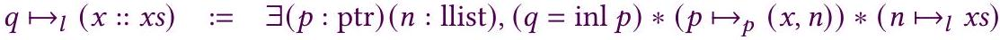
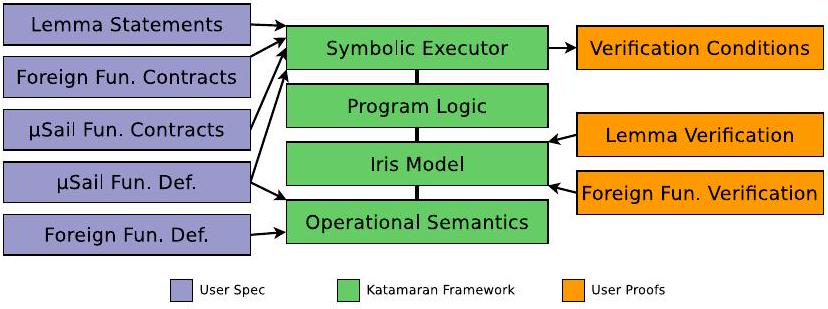

<!--
Third-party paper conversion for research use.
Authors: Steven Keuchel, Sander Huyghebaert, Georgy Lukyanov, and
Dominique Devriese.
Original: https://doi.org/10.1145/3547628
License: CC BY 4.0 (https://creativecommons.org/licenses/by/4.0/).
Changes: PDF converted to Markdown with Mathpix; headings, footnotes, tables,
code blocks, and figure links were normalized, and extracted figures were
stored locally. Conversion completed 2026-07-30. The adjacent PDF remains the
source of truth.
-->

# Verified Symbolic Execution with Kripke Specification Monads (and No Meta-programming)

STEVEN KEUCHEL, Vrije Universiteit Brussel, Belgium<br>SANDER HUYGHEBAERT, Vrije Universiteit Brussel, Belgium<br>GEORGY LUKYANOV, Newcastle University, United Kingdom<br>DOMINIQUE DEVRIESE, KU Leuven, Belgium[^authors]

## Abstract

Verifying soundness of symbolic execution-based program verifiers is a significant challenge. This is especially true if the resulting tool needs to be usable outside of the proof assistant, in which case we cannot rely on shallowly embedded assertion logics and meta-programming. The tool needs to manipulate deeply embedded assertions, and it is crucial for efficiency to eagerly prune unreachable paths and simplify intermediate assertions in a way that can be justified towards the soundness proof. Only a few such tools exist in the literature, and their soundness proofs are intricate and hard to generalize or reuse. We contribute a novel, systematic approach for the construction and soundness proof of such a symbolic execution-based verifier. We first implement a shallow verification condition generator as an object language interpreter in a specification monad, using an abstract interface featuring angelic and demonic nondeterminism. Next, we build a symbolic executor by implementing a similar interpreter, in a symbolic specification monad. This symbolic monad lives in a universe that is Kripke-indexed by variables in scope and a path condition. Finally, we reduce the soundness of the symbolic execution to the soundness of the shallow execution by relating both executors using a Kripke logical relation. We report on the practical application of these techniques in Katamaran, a tool for verifying security guarantees offered by instruction set architectures (ISAs). The tool is fully verified by combining our symbolic execution machinery with a soundness proof of the shallow verification conditions against an axiomatized separation logic, and an Iris-based implementation of the axioms, proven sound against the operational semantics. Based on our experience with Katamaran, we can report good results on practicality and efficiency of the tool, demonstrating practical viability of our symbolic execution approach.

CCS Concepts: • Theory of computation → Logic and verification; Programming logic; Hoare logic; Separation logic; Program verification.

Additional Key Words and Phrases: program verification, symbolic execution, predicate transformers, separation logic, refinement, logical relations

ACM Reference Format:
Steven Keuchel, Sander Huyghebaert, Georgy Lukyanov, and Dominique Devriese. 2022. Verified Symbolic Execution with Kripke Specification Monads (and No Meta-programming). Proc. ACM Program. Lang. 6, ICFP, Article 97 (August 2022), 31 pages. https://doi.org/10.1145/3547628

## 1 Introduction
Program logics based on Hoare logic and separation logic allow the modular verification of a very general class of correctness properties of software, including memory safety, absence of race conditions, functional correctness, termination [Gotsman et al. 2009] etc. However, derivations in

such program logics take the form of large proof trees that are unrealistic to construct by hand. Instead, verification tools are used that guarantee the existence of a Hoare logic proof on successful verification. These tools use techniques like symbolic execution (SE) or weakest preconditions (WP) to decide largely automatically whether a program satisfies the program logic rules. For many tools like Dafny [Leino 2010], Frama-C [Kirchner et al. 2015], VeriFast [Jacobs et al. 2010] etc. [Ahrendt et al. 2014; Cohen et al. 2009; Filliâtre and Marché 2007; Leino et al. 2009] this decision can be trusted only if the tool is assumed to be bug-free.

Stronger assurance is provided by verified tools like VST [Cao et al. 2018] or Bedrock [Chlipala 2011]. These tools are implemented in a proof assistant like Coq or Isabelle and come with a mechanically verified soundness proof. Such a proof guarantees that whenever the tool successfully verifies a program, there must exist a valid program logic derivation proving the program correct. However, implementing and proving the soundness of a verification tool is a challenging task.

Part of the complexity stems from the need to avoid combinatorial explosion. Naive implementations of both WP and SE lead to exponential blowup, which can be observed in practice [Flanagan and Saxe 2001]. There are multi-stage approaches relying on program transformations to generate WPs quadratic in size in terms of the input program [Flanagan and Saxe 2001; Leino 2005]. However, there is only little work on verified implementations [Parthasarathy et al. 2021; Vogels et al. 2010], the program transformation impairs the debugability of verification failures, and it is unclear how this approach scales to other assertion logics like separation logic. Symbolic executors try to counter the exponential explosion by explicitly manipulating assertions representing intermediate states (path constraints, symbolic heaps etc.), symbolically simplifying states [Cadar et al. 2008; Visser et al. 2012] and eagerly pruning unreachable states by calling into automated theorem provers during execution to detect unsatisfiable constraints [Cadar et al. 2008; Jacobs et al. 2010].

Many verified tools address this challenge similar to the SE approach, by shallowly embedding intermediate assertions as meta-logic properties and by making use of the meta-logic's metaprogramming facilities to conveniently implement assertion simplification and pruning [Cao et al. 2018; Charguéraud 2010, 2011; Chlipala 2011; Chlipala et al. 2009]. However, this makes the tools depend on meta-programming languages like Coq's Ltac for their execution. Practically, this precludes the use of meta-languages' program extraction facilities, making it impossible to use the verification tool outside of the proof assistant interpreter. This makes it hard to offer an easy-to-use verification interface for users without experience with proof assistants, or to interface with external tools like witness-producing SMT solvers. Additionally, executing a verifier in Coq's interactive interface can be significantly slower than executing an extracted version.

Implementing a sound verification tool without the use of meta-programming complicates an already considerable challenge further. It requires a deep embedding of program logic assertions and careful book-keeping of logic variables in scope, while preserving the guarantee that the intermediate assertions accurately represent all possible program paths. Only two existing SE-based tools have managed this: VeriSmall [Appel 2011] and Featherweight VeriFast [Jacobs et al. 2015]. However, the former features a restricted assertion language and the latter has a soundness proof that is intricate and hard to generalize to other tools (see Section 7 for a more detailed comparison).

In this paper, we contribute a new, systematic approach for constructing a sound program logic verifier, parametrized by a theory of user-implemented assertions and lemmas. In more detail, we make the following contributions:

- We show how to implement symbolic verification condition (VC) generators (VCGs) by writing interpreters in symbolic predicate transformer monads.

- We define a Kripke frame of path constraints and logical variable contexts: a mathematical structure that we use to make contextual information (path constraints and logical variables) available to locally prune infeasible paths during symbolic execution.
- We demonstrate how eager solution of variable equalities and pruning of unreachable paths can be implemented modularly, and combined with a postprocessing of the VC tree resulting from symbolic execution to obtain simple VCs.
- We show how symbolic VC generation can be proved sound w.r.t. shallow VC generation by means of a novel logical relation.
- We compare the efficiency of our implementation against related work and report some measurements that provide more insight into the performance characteristics of our approach.
- We demonstrate the reusability of our approach by implementing VCGs for $\mu \mathrm{S}_{\text {ail }}$. The latter forms the basis for Katamaran, a mechanized tool for mechanized verification of security guarantees offered by instruction set architectures, whose semantics is defined in a programming language called Sail [Armstrong et al. 2019].

We explain our approach step by step, starting in Section 2 with a shallow VCG that translates a statement to a Coq proposition. It is implemented as a monadic interpreter in a specification monad and is proven sound against an axiomatized program logic. This shallow VCG is not an end result of this paper, but we use it as a pedagogical tool that builds up towards the symbolic VCG in Section 3 and as a technical device for factoring the soundness proof of the symbolic VCG in Section 5. Next, Section 3 presents a symbolic executor that produces a deeply embedded verification condition, implemented as a very similar monadic interpreter in a symbolic specification monad. The section also explains how the symbolic executor prunes unreachable paths and simplifies assertions during execution. Section 4 extends the two executors to verify separation logic. Section 5 establishes the soundness of the symbolic verification conditions relative to the shallow ones, by constructing a Kripke-indexed logical relation between the two specification monads. Finally, Section 6 explains Katamaran, a verified separation logic verifier based on the techniques of this paper, to verify security properties of ISAs.

This presented work has been mechanized in the Coq proof assistant, and the development is publically available [Keuchel et al. 2022a,b].

## 2 Shallow VC Generation

A verification condition is a formula whose validity is sufficient for the correctness of a program w.r.t. its specification. The traditional way to generate VCs is based on Dijkstra's WP calculus: we reduce the validity of a Hoare triple to a first-order formula obtained by calculating the weakest (liberal) precondition of the given postcondition:

$$
\{\text { pre }\} s\{\text { post }\} \leftrightarrow(\text { pre → wp s post })
$$

The wp operator maps a statement $s$ to a predicate transformer, which in turn is a mapping from predicates on the output state (postcondition) to a predicate on the input state. Or, more generally, for a computation with input $I$ and output $O$, the wp $s$ predicate transformer is of type Pred $O \rightarrow \operatorname{Pred} I$. An important realization is that hidden behind such predicate transformer types are monads [Ahman et al. 2017; Jacobs 2014; Swamy et al. 2013].

Indeed, by using the continuation monad $W_{\text {pure }} x:=(x \rightarrow \mathbb{P}) \rightarrow \mathbb{P}$ with result type $\mathbb{P}$, also called the backwards predicate transformer monad [Maillard et al. 2019], and defining Pred $x:=x \rightarrow \mathbb{P}$ the type Pred $O \rightarrow \operatorname{Pred} I$ becomes isomorphic to $I \rightarrow W_{\text {pure }} O$.

This has been exploited in the F* language [Swamy et al. 2016] to index effectful monadic computations with their semantics as predicate transformers, allowing the user to co-design programs and specifications. Furthermore, [Maillard et al. 2019] generalize this to other effects like

```
$e \in \exp \quad::=x|n|$ true $\mid$ false $|\operatorname{inl} e| \operatorname{inr} e|(e, e)| e:: e|[]|()|e ; e| e$ op $e$
    $\mid$ let $x:=e$ in $e|x:=e|$ if $e$ then $e$ else $e \mid$ call $f \bar{e} \mid$ case $e$ of $(x, x) \Rightarrow e \mid \ldots$
$o p \in$ binop $::=+|=|\leq| \ldots \quad$ program $::=\overline{f \bar{x}:=e} \quad x \in$ pvar
$v \in \operatorname{val} \quad::=n \mid$ true $\mid$ false $|\operatorname{inl} v| \operatorname{inr} v|(v, v)| v:: v|[]|() \quad \delta \in$ store $::=\overline{x \mapsto v}$
```

Fig. 1. Object language syntax
state, exceptions and non-determinism simply by applying monad transformers to the base monad $W_{\text {pure }}$. Since these monads are used to define the specification rather than the implementation of functions, they are called specification monads.

Under this view, wp is a monadic interpreter [Liang et al. 1995] for our object language, and the result of the interpreter is the WP semantics for an object language expression.

In the remainder of this section, we develop such a monadic interpreter for the object language in Fig. 1, which is a simplified version of $\mu \mathrm{S}_{\mathrm{Ail}}$, the language that Katamaran works with (see Section 6). Our intention is to implement such interpreters in the internal language (our host language) of a theorem prover, to yield a VCG for the object language that produces VCs represented directly as propositions in the host language, i.e. a shallow embedding. The next section focuses on deep embeddings, i.e. symbolic representations.

Fig. 1 defines the grammar of expressions (exp), arithmetic, relational and boolean operators (binop), programs (program), program variables (pvar), and values (val). Local variable stores (store) are mappings of program variables to values. We use an overline to denote a repetition, i.e. a program is a list of definitions of functions $f$, which in turn each have a list of formal parameters $\bar{x}$. Otherwise, the grammar follows a standard presentation for boolean, integer, sum, product, list and unit types. As a notational convention, we use case...of... to denote pattern matching on structural types in the object language and match...with... for pattern matching in the host language.

The particular monad that we use for the interpreter is $W_{\text {store }} x:=(x \rightarrow$ store $\rightarrow \mathbb{P}) \rightarrow$ store $\rightarrow \mathbb{P}$, which is obtained by transforming $W_{\text {pure }}$ with the state transformer with state type store and uncurrying the result. In the following, we reserve wp for informal discussions about the general notation of WPs, and define the specific interpreter exec : $\exp \rightarrow W_{\text {store }}$ val.

### 2.1 Control-flow Branching

The interpreter exec can be written in different ways, and it is important to consider the consequences of different styles. For example, we could implement the interpretation of an if expression as follows:

$$
\text { exec (if } e \text { then } e_{1} \text { else } e_{2} \text { ) }=v \leftarrow \text { exec } e \text {; if } v \text { then exec } e_{1} \text { else exec } e_{2}
$$

Such a definition yields a semantically adequate predicate transformer, but it results in WPs that use host language pattern matching (hidden in the host language if-statement). In anticipation of implementing a symbolic interpreter, which cannot use host language features, we interpret control-flow branching in the shallow executor using propositional features. Using this propositional translation makes sure that the symbolic counterpart is definable using the same primitives. Consider the traditional WP rule for if-conditionals, of which there are two variants

$$
\begin{aligned}
\text { wp }\left(\text { if } e \text { then } e_{1} \text { else } e_{2}\right) \text { post } & \leftrightarrow \operatorname{wp} e\left(\lambda v .\left(v=\text { true } \rightarrow \text { wp } e_{1} \text { post }\right) \wedge\left(v=\text { false } \rightarrow \text { wp } e_{2} \text { post }\right)\right) \\
& \leftrightarrow \operatorname{wp} e\left(\lambda v .\left(v=\text { true } \wedge \text { wp } e_{1} \text { post }\right) \vee\left(v=\text { false } \wedge \text { wp } e_{2} \text { post }\right)\right)
\end{aligned}
$$

```
        $\operatorname{ret}(a: A): W_{\text {store }} A:=\lambda$ post $\delta$. post a $\delta$
            angelic : $W_{\text {store }}$ val $:=\lambda$ post $\delta . \exists v$. post $v \delta$
        demonic : $W_{\text {store }}$ val $:=\lambda$ post $\delta . \forall v$. post $v \delta$
            $m_{1} \oplus m_{2}: W_{\text {store }} A:=\lambda$ post $\delta . m_{1}$ post $\delta \vee m_{2}$ post $\delta$
            $m_{1} \otimes m_{2}: W_{\text {store }} A:=\lambda$ post $\delta . m_{1}$ post $\delta \wedge m_{2}$ post $\delta$
        assert $(p: \mathbb{P}): W_{\text {store }}():=\lambda$ post $\delta . p \wedge$ post ()$\delta$
    assume $(p: \mathbb{P}): W_{\text {store }}():=\lambda$ post $\delta . p \rightarrow$ post ()$\delta$
push $(x:$ pvar $)(v:$ val $): W_{\text {store }}():=\lambda$ post $\delta$. post $\left.a(\delta, x \mapsto v)\right)$
            pop : $W_{\text {store }}():=\lambda$ post $\left(\delta, \_\right)$. post $a \delta$
```

Fig. 2. Primitives for angelic and demonic non-determinism, assumptions and assertions, and local variable store in the specification monad with State.

```
$\operatorname{matchbool}_{\otimes} v\left(m_{1} m_{2}: W_{\text {store }} A\right): W_{\text {store }} A:=$
(assume $\left.(v=\operatorname{true}) ; m_{1}\right) \otimes\left(\right.$ assume $(v=$ false $\left.) ; m_{2}\right)$
$\operatorname{matchbool}_{\oplus} v\left(m_{1} m_{2}: W_{\text {store }} A\right): W_{\text {store }} A:=$
$\left(\right.$ assert $\left.(v=\operatorname{true}) ; m_{1}\right) \oplus\left(\right.$ assert $(v=$ false $\left.) ; m_{2}\right)$
matchsum $_{\otimes} v\left(f g:\right.$ val $\left.\rightarrow W_{\text {store }} A\right): W_{\text {store }} A:=$
    ( $v_{l} \leftarrow$ demonic; assume $\left.\left(v=\operatorname{inl} v_{l}\right) ; f v_{l}\right)$
$\otimes\left(v_{r} \leftarrow\right.$ demonic; assume $\left.\left(v=\operatorname{inr} v_{r}\right) ; g v_{r}\right)$
```

```
exec (if $e_{1}$ then $e_{2}$ else $e_{3}$ ) $:=b \leftarrow$ exec $e_{1}$;
    matchbool $_{\otimes} b\left(\right.$ exec $\left.e_{2}\right)\left(\right.$ exec $\left.e_{3}\right)$
exec (case $e$ of inl $x \rightarrow e_{l} \mid$ inr $y \rightarrow e_{r}$ ):=
    $v \leftarrow$ exec $e ;$ matchsum $_{\otimes} v$
    ( $\lambda v_{l}$. push $x v_{l}$; $r \leftarrow$ exec $e_{l}$; pop; ret $r$ )
    ( $\lambda v_{r}$. push $y v_{r} ; r \leftarrow$ exec $e_{r}$; pop; ret $r$ )
```

Fig. 3. Weakest precondition for control-flow branches
that use conjunction and implication resp. disjunction and conjunction.[^1]
In Fig. 2, we express the logical connectives at a higher-level of abstraction to hide the plumbing: they correspond to angelic and demonic non-determinism features of the monad and guards for local assumptions and assertions [Dijkstra 1975; Jacobs et al. 2015; Nelson 1989]. The guard assume indicates that subsequent computations may assume the validity of a given proposition. Conversely, assert indicates that a given proposition is required to hold. The binary angelic choice $m_{1} \oplus m_{2}$ non-deterministically chooses between two subcomputations, but it is sufficient for one of them to succeed in order for the combined computation to succeed. Binary demonic choice $m_{1} \otimes m_{2}$ works similarly, but both subcomputations must succeed in order for the combined computation to succeed. The terminology is based on the intuition that the non-deterministic choice is made by a sympathetic resp. adversarial party. The same distinction exists between operators angelic and demonic which non-deterministically produce a value val.

```
$\operatorname{exec}(x:=e): W_{\text {store }}():=\operatorname{exec} e \gg=\operatorname{assign} x$
assign $(x:$ pvar $)(v:$ val $): W_{\text {store }}():=\lambda$ post $\delta$. post () (update $\delta x$ v)
```


Fig. 4. Weakest precondition for mutable variable assignments

The primitives in Fig. 2 allow us to elegantly define our interpreter but at the same time avoid host language pattern matching in the resulting WPs. Consider, for example, Fig. 3, where we show the interpretation of if-expressions and pattern matching for sum types. The definition uses a function matchbool ${ }_{\otimes}$ which uses ⊗ and assume to implement pattern matching on booleans. Pattern matching on sum types is implemented similarly, except that we additionally use demonic to choose values for the program variables $x$ and $y$ in the branches. Modification of the local variable store is implemented using the primitives push, which adds a new binding to the store, potentially shadowing an existing one, and pop, which removes the last binding. We leave it as an exercise to the reader to verify that this definition of WPs for if-expressions unfolds to one of the more traditional definitions mentioned above.

Note that traditionally, computing the $w p$ for a statement $s$ is regarded as executing $s$ backwards starting from the postcondition. This view is understandable when we choose a first-order representation of predicates and choose a call by value evaluation strategy, i.e. when calculating $w p s Q$, the postcondition $Q$ is normalized first before continuing the recursion over the statement $s$. However, due to the higher-order representation of predicates in $W_{\text {store }}$, recursion over the expression is happening first in exec $e$. This predicate transformer will not syntactically edit the postcondition and pass edited results backwards. Instead, it will construct the WP in a forward fashion from the root and use the postcondition at the leaves of exec $e$, instantiated with an appropriate environment (see, e.g., Figs. 3 and 4). Such use of continuations to construct trees from the root is an old trick [Hinze 2012; Hughes 1986; Hutton et al. 2010; Voigtländer 2008].

### 2.2 Assignment

For verifying assignments to mutable variables, we work in a specification monad with a mutable environment. Mutable variable assignments can be implemented as defined in Fig. 4. This replaces the traditional substitution $\operatorname{post}[x \mapsto e]$ in the $w p$ rule for assignments. In essence, we build up an explicit substitution [Abadi et al. 1991] that is lazily accumulated and forced once over post, i.e. when applying post to the store. This happens here implicitly, but can also be modelled explicitly in an implementation strategy, as for example in the KeY project [Ahrendt et al. 2014]. Importantly, the execution of assignments also proceeds in a forward fashion, instead of being dependent on the result of a backwards running $w p$ sub-calculation.

The definition in Fig. 4 can result in a size explosion. For example, a sequence of assignments like $x:=x+x ; x:=x+x ; x:=x+x$ will produce 8 copies of the initial contents of the program variable $x$. For this paper, we ignore this issue, but a usual trick is to introduce abbreviations using quantification, i.e. assign' $x v:=v^{\prime} \leftarrow$ angelic; assert $\left(v=v^{\prime}\right)$; assign $x v^{\prime}$ or to algebraically simplify terms during symbolic execution.

### 2.3 Functions

To verify functions, we need a way to declare their specifications. For this, we define a form of contracts with pre- and postconditions. In anticipation of moving to deep embeddings in the next section, we already define parts of contracts in a symbolic way.

```
$V \in$ Val $::=\ell \mid n$ | true | false | $(V, V)$
    | $\operatorname{inl} V|\operatorname{inr} V|() \mid V o p V$
    $|V:: V|[] \quad \ell \in \mathrm{LVar}$
$\Sigma \in \operatorname{LCtx}::=\bar{\ell} \quad \zeta \in \operatorname{Sub}::=\overline{\ell \mapsto V}$
$\iota \in$ Valuation : LCtx → Type $::=\lambda \bar{\ell} \cdot \overline{\ell \mapsto v}$
```

Fig. 5. Symbolic values

```
summaxlen (xs : list int) : (int * int) * int :=
    case xs of
    | [] → ((0, 0), 0)
    | y :: ys → let sml := call summaxlen ys in
        case sml of | (sm, l) → case sm of | (s, m) →
        ( $(\mathrm{s}+\mathrm{y}$, if $m<y$ then $y$ else $m$ ), $l+1$ )
```

Fig. 6. Calculate sum, max and length of a list

Fig. 5 contains the basic definitions of our symbolic representation. To distinguish the definitions from their shallow counterparts, we use capital letters. Values Val now contain a production for a logic variable LVar that represents an abstract concrete value, introduced, for instance, by quantification. The namespace of logic variables is entirely separate from program variables pvar. Moreover, Val contains all productions of exp that are not translated into predicates, such as the operator production. All control flow productions, like pattern matches, are translated and are therefore not included. We will interchangeably refer to Val as symbolic values, or symbolic terms. Furthermore, Fig. 5 defines logic contexts LCtx, substitutions Sub (mappings from LVars to symbolic values Val), and Valuations (mappings from LVars to concrete values val). We treat valuations as a family indexed by logic contexts, where the index of the family forms the domain of the valuation. We will indicate this domain using a subscript, i.e. ( $\iota_{\Sigma}:$ Valuation $\Sigma$ ). We denote the instantiation of a symbolic value to a concrete one by $V[\iota]$ and the application of a substitution by $V[\zeta]$.

For functions $f \bar{x}$, we support contracts of the following form:

$$
\forall\left(\iota_{\Sigma}: \text { Valuation } \Sigma\right) .\left\{\operatorname{req} \iota_{\Sigma}\right\} f \overline{V\left[\iota_{\Sigma}\right]}\left\{v . \text { ens }\left(\iota_{\Sigma}, \ell \mapsto v\right)\right\},
$$

Such a contract is universally quantified over a given logic context $\Sigma$ and specifies a Hoare triple for calling $f$. Function arguments are specified by patterns $\overline{x \mapsto V}$ (one for each formal parameter $\bar{x}$ ), which are themselves symbolic terms with free variables in $\Sigma$. This scheme avoids conflating logic and program variables, which would be necessary to specify contracts with program variables and ghost variables. It also gives us more flexibility in the form of non-linear patterns, i.e. logic variables can occur more than once in patterns. Usually, the pattern for a program variable is simply a logic variable. The precondition $\left(\right.$ req $\left.: \iota_{\Sigma} \rightarrow \mathbb{P}\right)$ is a predicate on $\Sigma$-valuations, and the postcondition (ens : $\iota_{\Sigma, \ell} \rightarrow \mathbb{P}$ ) is a predicate on ( $\Sigma, \ell$ )-valuations, binding the result value of the function call to logic variable $\ell$. In the following, we will skip the repetition of the formal parameters $\bar{x}$ and also refer to a contract more succinctly as being a 5-tuple ( $\Sigma, \bar{V}$, req, $\ell$, ens).

As an example, consider the function summaxlen in Fig. 6 that computes the sum, max and length of a list, adapted from the first Verified Software Competition [Klebanov et al. 2011]. For readability, we include a type signature. The following contract for summaxlen expresses that the computed sum is less than or equal to the product of the computed maximum and length:

$$
\forall(x s: \text { list int }) . \quad\{\top\} \text { summaxlen } x s\left\{\begin{array}{r}
\text { match } \text { res } \text { with }(\operatorname{sm}, l) \rightarrow \\
\text { match } \operatorname{sm} \text { with }(s, m) \rightarrow s \leq m * l \wedge 0 \leq l
\end{array}\right\}
$$

Execution of a function call in exec uses the function's contract in place of its body. Since this effectively eliminates the only source of general recursion, our shallow and symbolic executors always terminate. The contract is interpreted as a specification statement [Morgan 1988], as defined in Fig. 7. First, we angelically choose values for the logic variables in the contract's logic scope $\Sigma$. Next, we assert that the passed arguments instantiate the patterns for the formal parameters of the function and also assert that the precondition of the called function holds. Finally, we can assume the postcondition for a result value $v_{\text {res }}$.

```
exec $(\operatorname{call} f \bar{v}):=\operatorname{let}(\Sigma, \bar{V}$, req, res, ens $):=\operatorname{contract} f$ in
$\iota_{\Sigma} \leftarrow \overline{\operatorname{angelic}}^{\Sigma} ;{\overline{\operatorname{assert}}\left(v=V\left[\iota_{\Sigma}\right]\right)}^{\bar{x}} ;$ assert $\left(\right.$ req $\left.\iota_{\Sigma}\right) ;$
$v_{\text {res }} \leftarrow$ demonic; assume (ens $\left(\iota_{\Sigma}\right.$, res $\left.\mapsto v_{\text {res }}\right)$ ); ret $v_{\text {res }}$
```

Fig. 7. Weakest precondition for function calls

### 2.4 Verification Condition Generation

Using the executor exec for expression as a building block, we can now implement a VCG. A function $f \bar{x}:=e$ satisfies ( $\Sigma, \bar{V}$, req, res, ens) when the specified triple holds for the body:

$$
\forall\left(\iota_{\Sigma}: \text { Valuation } \Sigma\right) . \operatorname{req} \iota_{\Sigma} \rightarrow \operatorname{exec} e\left(\lambda_{-} v_{\text {res }} . \operatorname{ens}\left(\iota_{\Sigma}, \operatorname{res} \mapsto v_{\text {res }}\right)\right)\left(\overline{x \mapsto V\left[\iota_{\Sigma}\right]}\right)
$$

The construction is dual to the execution of function calls from Section 2.3. This VC quantifies universally over a valuation $\iota_{\Sigma}$ for the logic variables $\Sigma$ of the contract. Next, we assert that the instantiated precondition req $\iota_{\Sigma}$ implies the WP of the body as calculated by exec. The input store contains the formal parameters $\bar{x}$ mapping to the instantiated patterns $\overline{V\left[\iota_{\Sigma}\right]}$. We ignore the output store and pass the extended valuation to the postcondition ens.

However, for the purpose of automatically discharging proof obligation in the symbolic executor, we use the following equivalent formulation of VCs in terms of assume and assert.

$$
\begin{aligned}
& \text { vc }(f \bar{x}:=e): \mathbb{P}:=\text { let }(\Sigma, \overline{x \mapsto V}, \text { req, res, ens }):=\text { contract } f \text { in } \\
& \qquad \forall\left(\iota_{\Sigma}: \text { Valuation } \Sigma\right) . \text { let } m: W_{\text {store }}():=\left\{\begin{array}{l}
\text { assume }\left(\text { req } \iota_{\Sigma}\right) ; \\
v \leftarrow \operatorname{exec} e ; \\
\text { assert }\left(\text { ens }\left(\iota_{\Sigma}, \text { res } \mapsto v\right)\right)
\end{array}\right. \\
& \text { in } m\left(\lambda_{--} \cdot \top\right)\left(\overline{x \mapsto V\left[\iota_{\Sigma}\right]}\right)
\end{aligned}
$$

This allows us to add constraints from the precondition to the path constraints before executing the body and thereby prune more paths. This technique is also known as preconditioned symbolic execution [Baldoni et al. 2018]. Similarly, this lets the executor try to solve obligations resulting from the postcondition automatically.

### 2.5 Soundness

The verification conditions that we describe in this section can be proven sound with respect to an axiomatised program logic with judgements on configurations of the form $\{p\} e ; \delta\{q\}$, where $\delta$ is a store that assigns values to program variables. We make the store explicit and use regular propositions $\mathbb{P}$ instead of lifting all logical connectives to store predicates $\delta \rightarrow \mathbb{P}$, since that makes the development of the program logic much shorter. This is not a problem since it is primarily used as part of the proof and is not intended to be used directly. $p$ and $q$ are the pre- resp. postcondition, the latter taking the result of $s$ and the updated local store as an argument. The program logic is assumed to satisfy a number of axioms.

An excerpt of the axioms is depicted in Fig. 8, including a standard triple for if statements, a standard consequence rule, a structural rule for eliminating an existentially quantified precondition and standard triples for assignments. We do not go into much detail on these axioms because they are standard and uncontroversial, and in fact, we have proven them sound using an Iris [Jung et al. 2018] model against the operational semantics of $\mu \mathrm{S}_{\text {ail }}$.

$$
\begin{array}{cc}
\begin{array}{l}
\{p\} e ; \delta\{r\} \\
\forall \delta^{\prime} .\left\{r \text { true } \delta^{\prime}\right\} e_{1} ; \delta^{\prime}\{q\} \\
\forall \delta^{\prime} .\left\{r \text { false } \delta^{\prime}\right\} e_{2} ; \delta^{\prime}\{q\}
\end{array} & \frac{\text { contract } f}{v=V\left[\iota_{\Sigma}\right]}=(\Sigma, \bar{V}, \text { req }, \text { res, ens }) \quad p \vdash \text { req } \iota_{\Sigma} \\
\frac{\forall v}{\{p\} \text { if } e \text { then } e_{1} \text { else } e_{2} ; \delta\{q\}} & \frac{\text { ens }\left(\iota_{\Sigma}, \text { res } \mapsto v_{\text {res }}\right) \vdash q v_{\text {res }}}{\{p\} \text { call } f \bar{v} ; \delta\left\{\lambda v_{\text {res }} \delta^{\prime} . q v_{\text {res }} \wedge\left(\delta=\delta^{\prime}\right)\right\}} \\
\frac{p \vdash p^{\prime} \quad \forall v, \delta^{\prime} . q^{\prime} v \delta^{\prime} \vdash q v \delta^{\prime}}{\{p\} s ; \delta\{q\}} & \frac{\left\{p^{\prime}\right\} s ; \delta\left\{q^{\prime}\right\}}{\{\exists a . p a\} e ; \delta\{q\}} \\
\frac{\{p\} e ; \delta\left\{\lambda v \delta^{\prime} . q v\left(\delta^{\prime}[x \mapsto v]\right)\right\}}{\{p\} x:=e ; \delta\{q\}} & \frac{\forall a .\{p a\} e ; \delta\{q\}}{\{\exists a . ; \delta a\}}
\end{array}
$$

Fig. 8. An excerpt of the program logic axioms that we prove our concrete executor sound against.

In terms of this program logic, we prove the soundness of shallowly executing program expressions in the following lemma and derive the soundness of shallow verification condition generation.

Lemma 2.1 (Soundness of shallow execution). If exec e post $\delta$ holds for an expression e, postcondition post and local store $\delta$, then the following program logic triple holds:

$$
\{T\} e ; \delta\{\text { post }\} .
$$

Alternatively phrased, the following triple always holds:

$$
\{\text { exec e post } \delta\} \text { e; } \delta\{\text { post }\} .
$$

Corollary 2.2 (Soundness of shallow verification condition generation). If the verification conditions $v c f$ holds for a function $f \bar{x}:=e$ with contract $(\Sigma, \bar{V}$, req,$\ell$, ens $)$, then the contract encodes a valid triple for the body of $f$, i.e. the following holds:

$$
v c f \rightarrow \forall\left(\iota_{\Sigma}: \text { Valuation } \Sigma\right) .\left\{\operatorname{req} \iota_{\Sigma}\right\} e ; \overline{V\left[\iota_{\Sigma}\right]}\left\{\lambda v_{-} . \text {ens }\left(\iota_{\Sigma}, \ell \mapsto v\right)\right\} .
$$

An important lemma that needs to be proved first is that all predicate transformers generated by the interpreter are monotonic, i.e. they map stronger postconditions to stronger preconditions. The soundness result is important, but despite the higher-order encoding of exec, it is proven similarly to existing textbook proofs for the soundness of weakest preconditions [see, e.g., Nielson and Nielson 2007]. Moreover, FVF [Jacobs et al. 2015] shows a similar proof of the soundness of a shallow executor written in an intensional specification monad against a concrete interpreter. So, we do not go into it in much detail. Instead, in the next sections, we focus on our novel approach to proving symbolic execution soundness. We connect the axiomatic program logic to a concrete operational semantic in Sec. 6.1, where we discuss our Iris model.

## 3 Symbolic Specification Monads

The VC generated by the interpreter of the last section reflects the recursive structure of the execution and can be seen as a (symbolic) execution tree in which we only kept control-flow constraints, and assumptions and assertions coming from specifications, but removed transient execution state like the local variable store etc. Fundamentally, we cannot inspect shallow propositions in the interpreter itself. As a consequence, the shallow VCG will explore all execution paths through a function without regard if this execution path is feasible given the precondition and the constraints imposed by control-flow branches. This is exacerbated in Section 4, where we implement

$$
\begin{aligned}
& F \in \mathbb{F} \quad::=\mathcal{P} \bar{V} \mid V=V \quad C \in \mathbb{C}::=\bar{F} \\
& P, Q \in \mathbb{S}::=\top|\perp| F \rightarrow P|F \wedge P| P \wedge P|P \vee P| \exists \ell . P \mid \forall \ell . P \\
& \quad\left|\operatorname{debug}_{D} P\right|(\ell \mapsto t) \rightarrow P \mid(\ell \mapsto t) \wedge P
\end{aligned}
$$

Fig. 9. Deeply-embedded formulas and propositions
a Smallfoot-style symbolic execution for separation logic, which makes heavy use of additional angelic non-determinism, but also adds new constraints during execution.

Ideally, we want to detect during the calculation of the weakest precondition when the execution paths become infeasible and discard this path entirely. For this, symbolic executors keep track of a path condition, the set of constraints leading to the current execution path, and use an automatic solver to detect when this path condition becomes inconsistent. This mitigates but does not rule out path explosion. In this section, we develop an alternative implementation of our interpreter based on symbolic representations (deep embeddings) that achieves this. The result of running this interpreter is a symbolic proposition with some sub-trees removed. More specifically, during execution, the path condition changes during Assume and Assert statements. If an assumed formula is inconsistent with the current path condition, we can prune the path by emitting a true proposition $\top$. If an asserted formula is inconsistent with the path condition, we emit a false proposition ⟂.

We will use the same machinery to automatically discharge proof obligations. These come from the postcondition of the function for which we calculate the VC and from the preconditions of called functions. This is achieved by developing a deeply-embedded assertion language for preand postconditions, which is then also interpreted in our monad.

Technically, our symbolic interpreter is similar to the concrete interpreter from Section 2, except for three main changes. First, we use a specification monad that generates propositions in a symbolic universe of propositions $\mathbb{S}$ rather than meta-language propositions in $\mathbb{P}$. Additionally, the use of symbolic propositions requires careful bookkeeping of contextual information: the logic variables in scope and the path constraints. As we will see in this section, this contextual information defines the worlds of a Kripke frame. This means that we index values and computations with the world in which they are meaningful, allowing us to deal with this bookkeeping in a principled manner. This also enforces monotonicity of path constraints during execution by construction. Finally, thanks to the indexing, the current path constraints are always available during symbolic execution, and we interact with a constraint solver in order to eagerly simplify path conditions and prune unreachable paths.

In this section, we begin by defining a deep embedding of terms and formulas for path constraints in Section 3.1, an interface for a constraint solver in Section 3.2, and the mentioned Kripke frame in Section 3.3. Next, we combine these components in Section 3.4 in a symbolic specification monad to obtain a symbolic version of the VC generator from Section 2. We discuss the production of debugging information in Section 3.5 and an additional simplification phase that in particular tries to instantiate quantifiers in Section 3.6. Finally, we finish with an example in Section 3.7.

### 3.1 Symbolic Terms and Constraints

In Section 2, we implemented angelic and demonic choice shallowly using existential and universal quantification from the meta-language. As a result, we could not programmatically inspect values or propositions during execution, for instance, for semi-automatic simplification or solving. In this section, we develop a deep embedding instead.

Fig. 9 contains definitions of different kinds of deeply-embedded propositions. Basic symbolic formulas $\mathbb{F}$ represent exactly the propositions that are assumed or asserted during execution. There

$$
\begin{array}{llr}
c \text { solver }: \mathbb{C} \rightarrow \overline{\mathbb{F}} \rightarrow & \text { option (Sub, } \overline{\mathbb{F}}) \\
\text { solver } C \bar{F}=\text { Some }\left(\overline{\ell \mapsto V}, \overline{F^{\prime}}\right) & \leftrightarrow & \left(C \vdash \bar{F} \leftrightarrow C \vdash \overline{\ell=V} \wedge \overline{F^{\prime}}\right) \\
\text { solver } C \bar{F}=\text { None } & \leftrightarrow & C \vdash \neg \bar{F}
\end{array}
$$

Fig. 10. Solver interface
are two cases: first, all constraints introduced by control-flow branches are equalities between values, and second, pre- and postconditions that we consider to belong to an application-specific theory. We model these by parameterizing over a set $\mathcal{P}$ of application-specific predicates.

The result of our symbolic executor is a symbolic proposition $\mathbb{S}$ that contains all the necessary logical connectives: $F \rightarrow P$ resp. $F \wedge P$ are used for assume resp. assert, $P \wedge Q$ and $P \vee Q$ for binary choice, and $\exists \ell . P$ and $\forall \ell . P$ for arbitrary choice. We discuss the debug production in Section 3.5 and the last two productions at the end of the next section.

### 3.2 Path Constraints and Entailment

To prune infeasible execution paths, we keep track of all basic formulas that are assumed or asserted in a path constraint $C \in \mathbb{C}$. Each time a new formula $F \in \mathbb{F}$ is added, we check for consistency and otherwise prune the path. Solving path constraints is an orthogonal problem to generating and keeping track of constraints. Therefore, we discuss an interface to a constraints solver but otherwise assume it to be provided. More specifically, we want to call a solver with entailment queries of the form $C \vdash F$. Instead of a coarse satisfiability answer distinguishing three cases - yes, no, or undecided - we allow the solver to give back more information. Even in the undecided case, we can expect the solver to have made some progress, but eventually halted at a sub-problem $\overline{F^{\prime}}$, s.t. $C \vdash F \leftrightarrow C \vdash \overline{F^{\prime}}$. We could therefore replace the original problem $F$ with the sub-problem $\overline{F^{\prime}}$ when recording it in the final VC. This is useful since unsolved asserts are eventually presented to the user as proof obligations. Any simplification that we can already make fully automatically should be applied to aid the user in proving the VC or debugging verification failures.

The execution of pattern matches introduces a lot of new logic variables and equality constraints. Ideally, we would like to simplify those automatically as well. To this end, we allow the solver also to report on possible unifications. We will use these later to instantiate existential quantifiers in Section 3.6. The resulting interface is in Fig. 10. The solver maps a list of formulas $\bar{F}$ to a list of single variable substitutions $\zeta=\overline{\ell \mapsto V}$, i.e. a substitution in triangular form [Baader et al. 2001], and a list of residual formulas $\overline{F^{\prime}}$ such that the entailment of the substitution $\zeta$, seen as a system of equations, and the residual formulas is equivalent to the entailment of the original formula. We record such unifications in symbolic propositions $\mathbb{S}$ using the special forms of assume $(\ell \mapsto V) \rightarrow P$ and assert $(\ell \mapsto V) \wedge P$ productions. In both cases, the executor can eliminate the variable from further consideration by applying the substitution to all other data, e.g. the program variable store. A unification marks the end-of-scope [Hendriks and van Oostrom 2003] of the logic variable $\ell$, i.e. we require $P$ to be well-formed in $\Sigma-\ell$ in both productions.

### 3.3 Kripke Frame and Modal Types

Implementing a symbolic executor poses some consistency challenges: an intermediate result, such as a symbolic term, formula or proposition, cannot be readily used under any path constraints other than the one they have been computed in. Using a value in a subset or a different set of constraints (ancestor or sibling in the execution tree) is unsound, but even using it under a larger

$$
\begin{array}{ll}
w \in \text { World } & :=\{(\Sigma, C) \in \operatorname{LCtx} \times \mathbb{C} \mid \operatorname{fv}(C) \subseteq \Sigma\} \\
\left(\Sigma_{1}, C_{1}\right) \sqsupseteq\left(\Sigma_{2}, C_{2}\right) & :=\left\{\zeta \in \operatorname{Sub}\left[\Sigma_{1}, \Sigma_{2}\right] \mid C_{2} \vdash C_{1}[\zeta]\right\}
\end{array}
$$

$$
\begin{aligned}
& \vdash A \quad:=\forall w, A w \\
& A \rightarrow B:=\lambda w \cdot A w \rightarrow B w \\
& \square A \quad:=\lambda w \cdot \forall w^{\prime}, w \sqsupseteq w^{\prime} \rightarrow A w^{\prime}
\end{aligned}
$$

$$
\begin{array}{ll}
\mathrm{T} & : \vdash \square A \rightarrow A \\
4 & :=\lambda w a \cdot a w \mathrm{id}_{\sqsupset} \\
\mathrm{K} & :=\lambda w_{0} a w_{1}\left(\omega_{1}: w_{0} \sqsupseteq w_{1}\right) w_{2}\left(\omega_{2}: w_{1} \sqsupseteq w_{2}\right) \cdot a w_{2}\left(\omega_{2} \circ_{\sqsupset} \omega_{1}\right) \\
& : \vdash \square(A \rightarrow B) \rightarrow \square A \rightarrow \square B:=\lambda w f a w^{\prime}\left(\omega: w \sqsupseteq w^{\prime}\right) \cdot f w^{\prime} \omega\left(a w^{\prime} \omega\right) \\
\_\left[\_\right] & : \vdash A \rightarrow \square A \quad A \text { persistent }
\end{array}
$$
Fig. 11. Kripke frame, modal types, and S4 axioms

set of constraints is not possible without further ado since logic variables may have gone out of scope due to unifications. In this case, we have to apply the recorded substitutions first. To enforce consistent handling, we classify all values and computations with a set of logic variables and path constraints under which they are meaningful. This also helps us to structure the soundness proof in the next section.

Formally, Fig. 11 (top) defines a set of Worlds consisting of pairs of logic variable contexts $\Sigma \in \mathrm{LCtx}$ and path constraints $C \in \mathbb{C}$ that are well-formed under the given $\Sigma$. Worlds can be loosely identified with positions in the execution tree. The contained variable context $\Sigma$ accumulates all existential and universal quantifiers on the path from that position to the root minus the variables that have been unified, and the path constraints collect all the assumed and asserted formulas with the unifications applied. To achieve the aforementioned classification, we work in the category of world indexed families World → Type rather than Type.

We will freely regard symbolic terms, stores, formulas, propositions, etc. as belonging to that universe by restricting them to the subset that is well-formed in the given world, e.g.

$$
\text { Val : World → Type : }=\lambda(\Sigma, C) .\{V \mid \operatorname{fv}(V) \subseteq \Sigma\} .
$$

Similarly, the specification monad we define in this section will be a monad on World → Type.
Fig. 11 also defines a preorder $w_{1} \sqsupseteq w_{2}$ between worlds, called the accessibility relation. Visually this (over)approximates the ancestor-descendant relationship in the execution tree, i.e. a world $w_{2}$ is accessible from a base world $w_{1}$ iff $w_{2}$ is a descendant of (appears below) $w_{1}$ in the execution tree. Formally, we define that $\left(\Sigma_{2}, C_{2}\right)$ is accessible from $\left(\Sigma_{1}, C_{1}\right)$ iff there is a simultaneous substitution $\zeta$ for all logic variables in $\Sigma_{1}$ with symbolic terms in $\Sigma_{2}$, and under this substitution $C_{2}$ represents a stronger set of constraints than $C_{1}$. The simultaneous substitution is used for both weakening (when introducing new logic variables) and substitution (for unifying variables). When moving values down to an accessible world, this substitution needs to be applied. Consequently, the substitutions are non-trivial computational contents of the accessibility relation, and therefore accessibility is proof-relevant.

The pair (World, $\supseteq$ ) defines a Kripke frame and, because of reflexivity and transitivity of the accessibility relation, forms a Kripke model of the $\mathrm{S}_{4}$ modal logic [Blackburn et al. 2001; Simpson 1994], with World → Type denoting propositions and satisfiability defined as function application $w \vDash A: \Leftrightarrow A w$. In the remainder, we will use modal logic notation and terminology to structure our expositions, but otherwise not explore the logical interpretation further. We will explain all the necessary concepts as we go, so readers need not be familiar with these concepts already. We will refer to objects in World → Type as being modal types or Kripke-indexed types.

```
$S_{\text {pure }} A:=\square(A \rightarrow \mathbb{S}) \rightarrow \mathbb{S}$
        $S_{\text {store }} A:=\square(A \rightarrow$ Store $\rightarrow \mathbb{S}) \rightarrow($ Store $\rightarrow \mathbb{S})$
Ret : $\vdash A \rightarrow S_{\text {pure }} A:=$
    $\lambda w(a: A w)($ Post $: \square(A \rightarrow \mathbb{S}) w)$.T $w$ Post a
$\gg: \vdash S_{\text {pure }} A \rightarrow \square\left(A \rightarrow S_{\text {pure }} B\right) \rightarrow S_{\text {pure }} B:=$
    $\lambda w\left(m: S_{\text {pure }} A w\right)\left(f: \square\left(A \rightarrow S_{\text {pure }} B\right) w\right)($ Post $: \square(B \rightarrow \mathbb{S}) w)$.
    $m\left(\lambda w^{\prime}\left(\omega: w \sqsupseteq w^{\prime}\right)\left(a: A w^{\prime}\right) . f w^{\prime} \omega a\left(4 w\right.\right.$ Post $\left.\left.w^{\prime} \omega\right)\right)$
Assume : $\vdash \overline{\mathbb{F}} \rightarrow S_{\text {pure }}():=$
    $\lambda w \bar{F}($ Post $: \square(() \rightarrow \mathbb{S}) w) . \quad$ Demonic $: \vdash S_{\text {pure }}$ Val $:=$
        match solver $w \bar{F}$ with $\quad \lambda w($ Post $: \square(\mathrm{Val} \rightarrow \mathbb{S}) w)$.
        | Some $\left(\overline{\ell \mapsto V}, \overline{F^{\prime}}\right) \Rightarrow \quad$ let $\ell:=$ fresh $w$ in
            let $w^{\prime}:=w[\overline{\ell \mapsto V}], \overline{F^{\prime}}$ in let $w^{\prime}:=w, \ell$ in
            let $\omega: w \supseteq w^{\prime}:=\ldots$ in let $\omega: w \supseteq w^{\prime}:=\ldots$ in
            $\overline{\ell \mapsto V} \rightarrow \overline{F^{\prime}} \rightarrow$ Post $w^{\prime} \omega() \quad \forall \ell$. Post $w^{\prime} \omega \ell$
        | None ⇒ T
```

Fig. 12. Symbolic specification monad

Fig. 11 (middle) contains some basic constructions. Validity $\vdash A$ means that a computation of the given type $A$ can be used without restriction in any world. We define a type for functions as point-wise functions of families. The box operator $\square A$ denotes that a value (or computation) of type $A$ can be used in any world accessible from a base world, i.e. at a node in the execution tree and all its descendants. A boxed value can be immediately used in the base world via the T combinator as defined in Fig. 11 (bottom). It uses the reflexivity of the accessibility relation given by the identity substitution and reflexivity of constraint entailment. The 4 combinator allows us to move a boxed value further down the execution tree without losing the box. It relies on the transitivity of accessibility which is implemented by composition of substitutions and transitivity of constraint entailment. The K combinator witnesses the semimonoidal (applicative [McBride and Paterson 2008] without pure) structure of the box operator □ . It allows us to apply a boxed function to a boxed value without losing the box. We include it for completeness, but it is not used in the remainder. The combinators $\mathrm{K}, \mathrm{T}$ and 4 are the implementation of the $\mathrm{S}_{4}$ axioms in our model.

We say that a type $A$ is persistent if its values can always be used in all worlds accessible from a base, i.e. there is a designated function $\vdash A \rightarrow \square A$. For first-order data, such as symbolic terms, persistence amounts to the definition of a substitution function. In general, function types $A \rightarrow B$ are not persistent, but boxed function types $\square(A \rightarrow B)$ are, because all boxed types $\square A$ are persistent via the 4 combinator. We denote the application of the persistence function for modal type $A$ to a value $a: A w_{0}$ and accessibility witness $\omega: w_{0} \sqsupseteq w_{1}$ as $a[\omega]$.

### 3.4 Symbolic Specification Monads

We define the backward predicate monad transformer $S_{\text {pure }}$ on modal types in Fig. 12 and then use it for the implementation of an interpreter. Similar to the shallow one $W_{\text {pure }}$ from Section 2, it is defined as a continuation monad. The postcondition is wrapped in a □ since different execution branches, i.e. different worlds, will use it. Fig. 12 also defines some basic combinators for $S_{\text {pure }}$. For presentation, we gray out the technical details around explicit handling of worlds and accessibility, and nonexpert readers may choose to ignore these parts. Ret implements a return and >> implements a bind operator for $S_{\text {pure }}$. As for the postcondition in the definition of the monad, the continuation in
the bind is wrapped in a □.[^2] To write monadic code, we use the do-notation

$$
[\omega] x \leftarrow m ; k:=m \gg \lambda_{-} \omega x . k
$$

that makes the world passing implicit but keeps the proof-relevant accessibility witness explicit.
For demonic non-deterministic choice of a term, we use a function fresh : World → LVar that picks a locally fresh name $\ell$. We construct a new world $w^{\prime}$, which is $w$ extended with $\ell$, and also an accessibility witness $\omega: w \sqsupseteq w^{\prime}$, for which we omit the details. Next, we universally quantify over $\ell$ using the deeply-embedded quantifier of the symbolic proposition. Finally, we invoke the continuation Post in the world $w^{\prime}$ on $\ell$ (as a symbolic term). In the implementation of the Assume guard we call the solver on the given formulas $\bar{F}$. In the successful case, the simplifications - unifications and residual formulas $\overline{F^{\prime}}$ - are used to construct the symbolic proposition. Furthermore, we need to construct a new world $w^{\prime}$ in which the unified variables are removed, the unifying substitution is applied to the old constraints, and the new residual formulas are added. In the failure case, the original formulas $\bar{F}$ are inconsistent with the path condition. Consequently, we prune this execution path by emitting $\top$. The Assert guard and Angelic choice are implemented analogously.

Effects can be added to the pure specification monad by means of monad transformers. Fig. 12 shows the result $S_{\text {store }}$ of applying the state transformer with a symbolic store and uncurrying the result. The choice and guard operators can then be lifted to transformed monads like $S_{\text {store }}$.

Equipped with these definitions, we can reimplement the interpreter of Section 2 in the symbolic specification monad. Where necessary, types have to be wrapped in □ and values and computations persisted, but otherwise, the structure of the interpreter does not change. For instance, our combinator for pattern matching on sums becomes

$$
\begin{aligned}
& \text { Matchsum } \otimes: \vdash \mathrm{Val} \rightarrow \square\left(\mathrm{Val} \rightarrow S_{\text {pure }} A\right) \rightarrow \square\left(\mathrm{Val} \rightarrow S_{\text {pure }} A\right) \rightarrow S_{\text {pure }} A:=\lambda w V k_{l} k_{r} . \\
& \quad\left(\begin{array}{c}
{\left[\omega_{1}\right] V_{l} \leftarrow \text { Demonic; }} \\
{\left[\omega_{2}\right]_{-} \leftarrow \text { Assume }\left(V\left[\omega_{1}\right]=\operatorname{inl} V_{l}\right) ;} \\
T\left(k_{l}\left[\omega_{1} \circ \omega_{2}\right] V_{l}\left[\omega_{2}\right]\right)
\end{array}\right) \otimes\left(\begin{array}{c}
{\left[\omega_{1}\right] V_{r} \leftarrow \text { Demonic; }} \\
{\left[\omega_{2}\right]_{-} \leftarrow \text { Assume }\left(V\left[\omega_{1}\right]=\operatorname{inr} V_{r}\right) ;} \\
T\left(k_{r}\left[\omega_{1} \circ \omega_{2}\right] V_{r}\left[\omega_{2}\right]\right)
\end{array}\right)
\end{aligned}
$$

and the main verification condition function

$$
\begin{aligned}
& \text { VC }(f \bar{x}:=e): \mathbb{S}:=\text { let }(\bar{\ell}, \overline{x \mapsto V}, \text { req, res, ens }):=\text { contract } f \text { in } \\
& \text { let } w: \text { World }:=(\bar{\ell},[]) \text { in } \\
& \qquad \text { let } m: S_{\text {store }}() w:=\left\{\begin{aligned}
{\left[\omega_{1}\right] } & \leftarrow \text { Assume req; } \\
{\left[\omega_{2}\right] V_{\text {res }} } & \leftarrow \text { Exec } e ; \\
& \text { Assert ens }\left[\omega_{1} \circ \omega_{2}, \text { res } \mapsto V_{\text {res }}\right] ;
\end{aligned}\right. \\
& \text { in } \forall \bar{\ell} \cdot m\left(\lambda w^{\prime} \omega() \delta^{\prime} \cdot \top\right) \delta
\end{aligned}
$$

### 3.5 Debug Information

The debug production of $\mathbb{S}$ can be used to record information for any persistent type $D$ during execution. For instance, this can include the path constraints that led to the executed branch and the program variable store at that point.

Our implementation in Section 6 will record such debug information automatically for all potential proof obligations, i.e. all assert $(F \wedge P \mid(\ell \mapsto V) \wedge P)$ and false $(\perp)$ nodes. Furthermore, the user can request debug nodes explicitly via ghost commands in the programs and in the contracts or automatically for all calls of a particular function. We discuss examples of this debug information in Section 3.7 and in Section 4.1.

### 3.6 Postprocessing

To finalize the verification, we can submit the generated verification conditions to an automated or alternatively to an interactive theorem prover. Multiple cases may necessitate human interaction. For instance, unsatisfiable VCs due to bugs in the program or the specification, or alternatively the absence of a sufficiently complete solver, because the application-specific theory is undecidable or because a solver cannot be integrated without enlarging the trusted code base. In any case, we want to make it as easy as possible for a user to pinpoint the source of a problem or prove VCs manually. To that end, we implement a postprocessing phase that simplifies the output of the symbolic executor. By implementing this phase ourselves instead of relying on an automated solver, we can, in particular, pay attention to not disturbing the control-flow structure encoded in the VC. More importantly, we can ensure that the recorded debug information stays consistent through this transformation.

In particular, we want to remove parts that correspond to explored execution paths with fully solved proof obligations, and to instantiate quantifiers by using the unifications provided by the solver. Consider the summaxlen example. At the node where the postcondition of the recursive call is assumed, the output of the symbolic executor contains a formula of the form

$$
\forall \mathrm{sml} \operatorname{sm} \text { l. }(\mathrm{sml} \mapsto(\mathrm{sm}, \mathrm{l})) \rightarrow \forall \mathrm{s} \mathrm{~m} .(\mathrm{sm} \mapsto(\mathrm{~s}, \mathrm{~m})) \rightarrow \ldots
$$

which can be simplified to $(\forall 1 \mathrm{~s} \mathrm{~m} \ldots$.$) , essentially fusing two one-level pattern matches into a$ single multi-level one.

This can be implemented by the following transformation

$$
(\forall \Sigma . \bar{F} \rightarrow(\ell \mapsto V) \rightarrow P) \leadsto(\forall(\Sigma-\ell) . \overline{F[\ell \mapsto V]} \rightarrow P) \quad \ell \in \Sigma
$$

which also allows for assumed formulas between the quantifier and the unification. Dually, we instantiate existentials with asserted formulas and unifications. Transformations such as

$$
\forall \ell . \perp \leadsto \perp \quad \exists \ell . \top \leadsto \top
$$

are sound and complete for languages that have only inhabited types. Otherwise, the universal transformation is sound but can lead to incompleteness bugs, and the existential one is unsound.

The separation logic extension that we describe in Section 4 uses a heuristic that makes heavy use of angelic non-determinism to try different chunks of a symbolic heap. For this, we found it helpful to be more aggressive and distribute existentials over the disjunction

$$
\exists \Sigma . \bar{F} \wedge(P \vee Q) \leadsto(\exists \Sigma . \bar{F} \wedge P) \vee(\exists \Sigma . \bar{F} \wedge Q)
$$

### 3.7 Example

Running our symbolic executor on the summaxlen example with a solver that performs unification modulo the constructor theories of products and list, but without support for arithmetic, yields the following verification condition

$$
\begin{gathered}
\forall(y: \text { int })(y s: \text { list int }) . \quad \forall(l s m: \text { int }) . s \leq m * l \rightarrow 0 \leq l \rightarrow \\
(m<y \rightarrow s+y \leq y *(l+1) \wedge 0 \leq l+1 \wedge \top) \wedge \\
(m \geq y \rightarrow s+y \leq m *(l+1) \wedge 0 \leq l+1 \wedge \top)
\end{gathered}
$$

```
$\forall($ xs : list int $)$, true = true →
    $(\mathrm{nil}=\mathrm{xs} \rightarrow \exists(s m: \operatorname{int} * \mathrm{int})(l: \operatorname{int}),(s m, l)=(0,0,0) \wedge$
        $\exists(s m: \operatorname{int}),(s, m)=s m \wedge s \leq m * l \wedge 0 \leq l \wedge \top) \wedge$
    $\left(\forall(y: \operatorname{int})(y s:\right.$ list int $), y:: y s=x s \rightarrow \exists\left(y s^{\prime}:\right.$ list int $), y s^{\prime}=y s \wedge$ true $=$ true $\wedge$
        $\forall(s m l: \operatorname{int} * \operatorname{int} * \operatorname{int})(s m: \operatorname{int} * \operatorname{int})(l: \operatorname{int}),(s m, l)=s m l \rightarrow$
        $\forall(s m: \operatorname{int}),(s, m)=s m \rightarrow s \leq m * l \rightarrow 0 \leq l \rightarrow$
        $\forall\left(s m^{\prime}: \operatorname{int} * \operatorname{int}\right)\left(l^{\prime}: \operatorname{int}\right),\left(s m^{\prime}, l^{\prime}\right)=s m l \rightarrow \forall\left(s^{\prime} m^{\prime}: \operatorname{int}\right),\left(s^{\prime}, m^{\prime}\right)=s m^{\prime} \rightarrow$
        $\left(m^{\prime}<y \rightarrow \exists\left(s m^{\prime \prime}: \operatorname{int} * \operatorname{int}\right)\left(l^{\prime \prime}: \operatorname{int}\right),\left(s m^{\prime \prime}, l^{\prime \prime}\right)=\left(s^{\prime}+y, y, l^{\prime}+1\right) \wedge\right.$
            $\left.\exists\left(s^{\prime \prime} m^{\prime \prime}: \operatorname{int}\right),\left(s^{\prime \prime}, m^{\prime \prime}\right)=s m^{\prime \prime} \wedge s^{\prime \prime} \leq m^{\prime \prime} * l^{\prime \prime} \wedge 0 \leq l^{\prime \prime} \wedge \top\right) \wedge$
        $\left(m^{\prime} \geq y \rightarrow \exists\left(s m^{\prime \prime}: \operatorname{int} * \operatorname{int}\right)\left(l^{\prime \prime}: \operatorname{int}\right),\left(s m^{\prime \prime}, l^{\prime \prime}\right)=\left(s^{\prime}+y, m^{\prime}, l^{\prime}+1\right) \wedge\right.$
            $\left.\exists\left(s^{\prime \prime} m^{\prime \prime}: \operatorname{int}\right),\left(s^{\prime \prime}, m^{\prime \prime}\right)=s m^{\prime \prime} \wedge s^{\prime \prime} \leq m^{\prime \prime} * l^{\prime \prime} \wedge 0 \leq l^{\prime \prime} \wedge \top\right)$ ).
```

Fig. 13. The VC for summaxlen generated with the shallow executor.

In the nil case $(x s=[])$, the postcondition $0 \leq 0 * 0 \wedge 0 \leq 0$ can be proved automatically by partial evaluation, or in this case, even concrete evaluation. The part of the VC related to that branch has been fully removed. For the cons case $(\mathrm{xs}=\mathrm{y}:: \mathrm{ys})$ the logic variable $x s$ of the contract - which is also the initial value of the program variable $x s$ - is substituted by $y:: y s$ and the quantifier removed by the postprocessing phase. The second part of the first line of the VC contains the result of assuming the postcondition from the recursive call, simplified as described in Section 3.6. The last two lines contain obligations for proving the postcondition for both branches. The postprocessing phase removed translated pattern matches on products here as well. This VC can then be solved automatically by a solver with support for non-linear arithmetic.

Compare this to the VC generated with shallow execution in Fig. 13, which retains the propositional translation of the pattern matches and has not solved the nil case automatically. In particular, this clutter impairs a user to debug verification failures.

Asking for debug information using a ghost statement[^3] on the last line of summaxlen will result in two debug nodes for both outcomes of the if-statement. The second of which contains the following information: the logic variables in scope are $\mathrm{y}, \mathrm{ys}, \mathrm{l}, \mathrm{s}, \mathrm{m}$, and the path constraints are $\mathrm{m} \geq \mathrm{y} \wedge 0 \leq \mathrm{l} \wedge \mathrm{s} \leq \mathrm{m} * \mathrm{l}$. Furthermore, the symbolic variable store contains the following mappings of program variables to symbolic terms:

$$
\begin{array}{llll}
\mathrm{xs} \mapsto \mathrm{y}:: \mathrm{ys} & \mathrm{ys} \mapsto \mathrm{ys} & \mathrm{~s} \mapsto \mathrm{~s} & \mathrm{sml} \mapsto((\mathrm{~s}, \mathrm{~m}), \mathrm{l}) \\
\mathrm{y} \mapsto \mathrm{y} & 1 \mapsto \mathrm{l} & \mathrm{~m} \mapsto \mathrm{~m} & \mathrm{sm} \mapsto(\mathrm{~s}, \mathrm{~m})
\end{array}
$$

In particular, in this case, the mapping for the formal parameter xs shows the call pattern that, together with the path constraints, determines the execution path. For functions that assign new values to the formal parameter variables, the initial contents need to be copied for the same effect.

## 4 Symbolic Heap Separation Logic

Smallfoot [Berdine et al. 2005b] is a tool for checking program specifications that only describe the shape of pointer data structures rather than their contents. It works on a decidable fragment [Berdine et al. 2005a] of separation logic where all assertions are of the form $P \wedge Q$, where $P$ is a pure proposition (the path condition), and $Q$ is a separating conjunction of spatial heap predicates (the symbolic heap). In particular, the separating implication (magic wand) or septraction connective,

```
$c \in$ chunk $::=\mathcal{H} \bar{v} \quad h \in$ heap $::=\bar{c} \quad C \in$ Chunk $::=\mathcal{H} \bar{V} \quad H \in$ Heap $::=\bar{C}$
```


Fig. 14. Shallow and deep heaps and chunks

```
$\operatorname{produce}_{\text {chunk }}(c: \operatorname{chunk}): \mathrm{W}_{\text {heap }}():=h \leftarrow \operatorname{get}_{\text {heap }} ; \operatorname{put}_{\text {heap }}(c:: h)$
consume $_{\text {chunk }}(c:$ chunk $): \mathrm{W}_{\text {heap }}():=\left(c_{1} . . c_{n}\right) \leftarrow$ get $_{\text {heap }} ; i \leftarrow$ angelic $;$
assert $\left(c=c_{i}\right)$; put ${ }_{\text {heap }}\left(c_{1} \ldots c_{i-1}, c_{i+1} \ldots c_{n}\right)$
```

Fig. 15. Producing and consuming chunks
which are generally used for spatial WP rules, is absent. Furthermore, Berdine et al. [2005c] present a symbolic execution method for automatically proving Hoare triples in this fragment.

Many verifiers [Distefano and Parkinson J 2008; Jacobs et al. 2010; Müller et al. 2016] adopted this approach, but also extended it to reason about the contents of data structures. In this section, we present how such a symbolic heap can be integrated into our method. Essentially, we extend our shallow and symbolic specification monads with an additional piece of state: a shallow and symbolic separation logic heap, respectively:

$$
\begin{aligned}
& W_{\text {heap }} x:=(x \rightarrow \text { store } \rightarrow \text { heap } \rightarrow \mathbb{P}) \rightarrow \text { store } \rightarrow \text { heap } \rightarrow \mathbb{P} \\
& S_{\text {heap }} x:=\square(x \rightarrow \text { Store } \rightarrow \text { Heap } \rightarrow \mathbb{S}) \rightarrow \text { Store } \rightarrow \text { Heap } \rightarrow \mathbb{S}
\end{aligned}
$$

These heaps have the syntax depicted in Fig. 14: a list of chunks, which themselves are abstract spatial predicate constructors applied to concrete or symbolic arguments. Similarly to pure predicates, we allow these spatial predicates to be custom-defined by the user and manipulated with user-provided lemmas, provided that both are backed up by implementations in the underlying model. In this way, we can support arbitrary separation logic assertions, even though non-trivial manipulations of custom assertions require user annotations in the form of lemma invocations.

In terms of this additional state, we can then define produce ${ }_{\text {chunk }}$ and consume ${ }_{\text {chunk }}$ functions, the shallow versions of which are shown in Fig. 15. The naming of these functions stems from the resource interpretation of separation logic. produce ${ }_{\text {chunk }}$ adds a single spatial predicate to the heap, and consume ${ }_{\text {chunk }}$ implements a heuristic for removing one by angelically choosing an element from the heap and asserting equality. Instead of the simple equality $c=c_{i}$ in Fig. 15, the shallow executor could do better and decide equality of the predicate names first, which never results in a blocked meta-computation since these are always specified concretely by the user. However, in general, it cannot inspect the arguments without blocking. The symbolic version can improve upon this by looking at the arguments as well, and avoiding the backtracking semantics of the heuristic when the arguments already match a chunk on the heap exactly, and for precise predicates [O'Hearn et al. 2009] when only the "input" arguments match exactly.

Using chunks as a building block, we define the syntax for arbitrary structured assertions to be used in pre- and postconditions and more general produce and consume functions that interpret them in a specification monad. However, for space reasons, we do not go into this further. The definitions are generally similar to those of FVF [Jacobs et al. 2015] and $\mu$ VeriFast [Devriese 2019].

### 4.1 Example: Linked Lists

To give you an idea of the practical use of our separation logic solver, we develop predicates and functions for dynamically heap-allocated singly linked lists [Reynolds 2000], implemented in our object language. We represent pointers `ptr` to the heap as integers, and linked lists `llist` as nullable pointers. The primitive contracts are:

$$
\begin{aligned}
& \forall x:\mathrm{int},q:\mathrm{llist}.\quad
  \{\top\}\ \mathrm{mkcons}\ x\ q\
  \{p.\ p\mapsto_p(x,q)\} \\
& \forall p:\mathrm{ptr},x:\mathrm{int},q:\mathrm{llist}.\quad
  \{p\mapsto_p(x,q)\}\ \mathrm{fst}\ p\
  \{r.\ r=x * p\mapsto_p(x,q)\} \\
& \forall p:\mathrm{ptr},x:\mathrm{int},q:\mathrm{llist}.\quad
  \{\exists y:\mathrm{int}.\ p\mapsto_p(y,q)\}\ \mathrm{setfst}\ p\ x\
  \{\_.\ p\mapsto_p(x,q)\} \\
& \forall p:\mathrm{ptr},x:\mathrm{int},q:\mathrm{llist}.\quad
  \{p\mapsto_p(x,q)\}\ \mathrm{snd}\ p\
  \{r.\ r=q * p\mapsto_p(x,q)\}.
\end{aligned}
$$


Fig. 16. Contracts for linked lists primitives

$$
\{\top\}\ \mathrm{open\_nil}\ \{\mathrm{inr}\ ()\mapsto_l[]\}
$$


$$
\begin{aligned}
& \forall p:\mathrm{ptr},x:\mathrm{int},xs:\mathrm{list}\ \mathrm{int},
  n:\mathrm{llist}.\\
& \qquad
  \{p\mapsto_p(x,n) * n\mapsto_l xs\}\
  \mathrm{close\_cons}\ p\
  \{\mathrm{inl}\ p\mapsto_l(x::xs)\}.
\end{aligned}
$$

Fig. 17. Lemmas about linked list heap predicates

Pointers and linked-list pointers are represented by:

$$
\mathrm{ptr}:=\mathrm{int}
\qquad
\mathrm{llist}:=\mathrm{ptr}+().
$$

We implement linked lists in terms of heap-allocated pairs, consisting of a single element and a tail pointer, for which we use the following primitive procedures: mkcons to allocate a new pair on the heap, fst and snd to access the components of a heap-allocated pair, and setfst and setsnd to update the components. The signatures and contracts of these primitives are shown in Fig. 16. In our implementation (Section 6), we instantiate the memory of the Iris model as a finite map of pointers to pairs:

```
mem := ptr - fin (int, llist)
```

and implement the primitives directly in Coq. For the separation logic contracts, we use two spatial points-to predicates, one for a single heap-allocated pair and one for a heap-allocated list:

```
p ⟼ p (x,q) p : ptr, x : int, q : llist
q ⟼ l xs q : llist, xs : list int
```

The definition of these predicates is part of the model, with the list predicate defined recursively in terms of the pair predicate [Reynolds 2000]:

```
q ⟼ l [] := q = inr ()
```


We do not expose the recursive definition to the VCGs. Instead, we declare and use lemmas for the folding/unfolding of the recursion, which are defined in Fig. 17. Such lemmas can generally be inserted to aid the verifier in making non-trivial reasoning steps and need to be proven sound by the user in the underlying model. Currently, we require the user to give hints to the VCGs when a lemma needs to be used to transform the proof state, which the user provides through ghost statements in the code. In the future, we are planning to support user-provided heuristics which automatically invoke such lemmas where needed.

```
        $\left\{\operatorname{inl} p \mapsto_{l} x s * q \mapsto_{l} y s\right\}$
    $\operatorname{append}_{\text {loop }}(p: \operatorname{ptr}, q: \operatorname{llist}):():=$
$\left\{p \mapsto_{l} x s * q \mapsto_{l} y s\right\} \quad$ lemma open_cons $p$;
append $(p:$ llist $, q:$ llist $):$ llist $:=\quad$ let $t:=$ foreign $\operatorname{snd} p$ in
    case $p$ of inl $n \Rightarrow$ call append $_{\text {loop }} n q ; p \quad$ case $t$ of inl $n \Rightarrow$ call append $_{\text {loop }} n q$
        inr $z \Rightarrow$ lemma close_nil $z ; q \quad$ inr $z \Rightarrow$ lemma close_nil $z$;
$\left\{r . r \mapsto_{l} x s++y s\right\}$
                    foreign setsnd $p q$;
        lemma close_cons $p$
    $\left\{\_. p \mapsto_{l} x s++y s\right\}$
```

Fig. 18. Appending two linked lists

Fig. 18 shows the two functions append and append ${ }_{\text {loop }}$ with their contracts. Together, they implement an in-place append for linked lists. append ${ }_{\text {loop }}$ follows the chain of the first linked list till the end and updates the (null) tail pointer to point to the second list instead. At each step, it unfolds one level of the recursive list predicate using open_cons to reveal the cons cell. After returning from a recursive call, the predicate needs to be folded again using close_cons. Spatial predicates for the empty list, which hence do not contain any cons cells, can be discarded using close_nil.

Omission of any of the lemma ghost statements in the code will result in a verification failure: the consumption of some chunk will fail if nothing suitable is found on the heap. For instance, removing the first ghost lemma statement that invoked open_cons in append ${ }_{\text {loop }}$ will result in the following failure for the foreign call to snd, for which we can again record debugging information.

The chunk to be consumed is

$$
p \mapsto_{p}\left(x^{\prime}, q^{\prime}\right)
$$

which comes from the precondition of snd with $x^{\prime}$ and $q^{\prime}$ being existential variables. However, the heap only contains the incompatible chunks

$$
\operatorname{inl} p \mapsto_{l} x s \quad q \mapsto_{l} y s
$$

and hence execution fails. We can of course record the state again. The local variable store will still contain its initial mapping

$$
\mathrm{p} \mapsto \mathrm{p} \quad \mathrm{q} \mapsto \mathrm{q}
$$

since no unifications have been performed yet.

### 4.2 Discussion

The separation logic primitives of the shallow $\mathrm{W}_{\text {heap }}$ monad defined in this section are not representative. In particular, the backtracking heuristic of consume ${ }_{\text {chunk }}$ produces many unnecessary branches, and the reasoning steps performed by explicit user-provided ghost statements are usually implicitly performed as part of a proof script or even hold trivially by definitional equality.

For our purposes, the shallow VCG serves primarily as a means to factorize the soundness proof of the symbolic VCG for which it defines the allowed behavior. More realistically, a shallow VCG would be implemented using a specification monad (e.g. $W_{\text {pure }}$ ) defined on top of proper separation logic propositions.

$$
\begin{aligned}
& \mathcal{R}_{\lessapprox \llbracket A, a \rrbracket} \subseteq\left\{\left(w, \iota_{w}, A, a\right)\right\} \\
& \mathcal{R}_{\lessapprox} \llbracket \mathrm{Val}, \mathrm{val} \rrbracket=\left\{\left(w, \iota_{w}, V, v\right) \mid v=V\left[\iota_{w}\right]\right\} \\
& \mathcal{R}_{\lessapprox} \llbracket \mathbb{S}, \mathbb{P} \rrbracket=\left\{\left(w, \iota_{w}, P, p\right) \mid\left(\iota_{w} \vDash P\right) \rightarrow p\right\} \\
& \mathcal{R}_{\lessapprox} \llbracket \square A, a \rrbracket=\left\{\left(w, \iota_{w}, x, y\right) \mid \quad \forall w^{\prime}\left(\omega: w \supseteq w^{\prime}\right) \iota_{w^{\prime}} \iota_{w}=\iota_{w^{\prime}} \circ \omega \rightarrow\right. \\
& \mathcal{R}_{\lessapprox} \llbracket A \rightarrow B, a \rightarrow b \rrbracket=\left\{\left(w, \iota_{w}, f, g\right) \mid \forall x y .\left(w, \iota_{w^{\prime}}, x w^{\prime} \omega, y\right) \in \mathcal{R}_{\S} \llbracket A, a \rrbracket\right\} \\
&\left.\mathcal{R}_{\lessapprox} \llbracket A, a \rrbracket \rightarrow\left(w, \iota_{w}, f x, g y\right) \in \mathcal{R}_{\lessapprox} \llbracket B, b \rrbracket\right\}
\end{aligned}
$$

Fig. 19. Refinement relation to prove soundness of symbolic execution - selected rules

In such a monad, produce ${ }_{\text {chunk }}$ and consume ${ }_{\text {chunk }}$ are the spatial equivalents of assume and assert. Indeed, given an interpretation $\llbracket-\rrbracket$ of chunks as separation logic propositions, we can use the definitions:

$$
\begin{aligned}
& \text { produce }_{\text {chunk }}(c: \text { chunk }): W_{\text {pure }}():=\lambda k \cdot \llbracket c \rrbracket-* k() \\
& \text { consume }_{\text {chunk }}(c: \text { chunk }): W_{\text {pure }}():=\lambda k \cdot \llbracket c \rrbracket * k()
\end{aligned}
$$

## 5 Refinement

The two executors that we described in Sections 2 and 3 are essentially the same program, albeit implemented in two different languages. The question arises in what way these two implementations are equivalent, and how we can establish that fact formally. Ultimately, the property we want for their outputs is dictated by our soundness requirement, which is expressed by the following lemma.

Lemma 5.1 (Soundness of symbolic execution). Given a program, if the symbolic verification condition holds for a function, then so does the shallow one, i.e.

$$
\forall f,(\epsilon \models V C f) \rightarrow v c f .
$$

We have to generalize this in two ways. First, we need to consider other moments of the execution instead of just the final closed result. That means we are in a world $w$ and want to consider the implication $\left(\iota_{w} \models P\right) \rightarrow p$ for valuations $\left(\iota_{w}\right.$ : Valuation $\left.w\right)$ of that world, i.e. valuations for the contained logic variables that also respect the path constraints:

$$
\text { Valuation : World → Type }:=\lambda(\Sigma, C) .\left\{\iota_{\Sigma} \in \text { Valuation } \Sigma \mid \iota_{\Sigma} \models C\right\}
$$

Second, we need to generalize this to other types, which we do in a logical relation [Tait 1967] $\mathcal{R}_{\lesssim}$ that we discuss shortly. In particular, we can relate predicate transformer monads, e.g. $S_{\text {pure }}$ and $W_{\text {pure }}$. For these types, $\mathcal{R}_{\lesssim}$ encodes a notion of refinement [Back and Wright 1998; Morgan 1994].

The refinement relation is defined in Fig. 19. $\mathcal{R}_{\lesssim \llbracket A, a \rrbracket}$ relates symbolic computations of type $A$ with pure computations of type $a$ at given world $w$ and valuation $\iota_{w}$. For propositions and formulas, the relation is as just discussed. For first-order data like symbolic terms, stores, heaps, etc. it is equality after instantiation. As usual, related functions map related inputs to related outputs. The most interesting case is that of a boxed typed $\square A$. It requires that in every accessible world $\omega: w \sqsupseteq w^{\prime}$, the symbolic computation is related to the pure one. However, we also need to consider valuations in the new world; we require relatedness for every valuation $\iota_{w^{\prime}}$ that is compatible with (that extends) the old one, which is expressed by composition with the substitution that witnesses the accessibility.

Proof sketch of Lemma 5.1. Unfolding the definition of the logical refinement relation on propositions $\mathcal{R}_{\leq} \llbracket \mathbb{S}, \mathbb{P} \rrbracket$, we can see that the soundness statement is equivalent to the inclusion in
the relation in the empty (initial) world:

$$
(\varnothing, \epsilon, \operatorname{VC} f, \operatorname{vc} f) \in \mathcal{R}_{\mathbb{S}} \llbracket \mathbb{S}, \mathbb{P} \rrbracket
$$

To prove this, we show that all constituent functions and monadic operators are related, e.g.

$$
\begin{gathered}
\left(w, \iota_{w}, \text { Exec } e, \text { exec } e\right) \in \mathcal{R}_{\lesssim \llbracket} S_{\text {store }} \text { Val, } W_{\text {store }} \text { val } \rrbracket \\
\left(w, \iota_{w}, \gg, \gg=\mathcal{\mathcal { R } _ { \lessapprox }} \llbracket S A \rightarrow \square(A \rightarrow S B) \rightarrow S B, \ldots \rrbracket\right.
\end{gathered}
$$

This is mostly mechanical, since the two implementations have the same structure. The only meaningful difference is in the Assume and Assert commands that call the solver, e.g.

$$
\left(w, \iota_{w}, \text { Assume, assume }\right) \in \mathcal{R}_{\lesssim} \llbracket \mathbb{F} \rightarrow S_{\text {pure }}(), \mathbb{P} \rightarrow W_{\text {pure }}() \rrbracket
$$

This property is established by reducing it to the correctness of the solver. $\square$

Example: demonic choice. As an example of a relatedness proof, consider the demonic choice combinators (shown in Figures 2 and 12). After inlining the definitions, applying them to two related postconditions

$$
\left(w, \iota_{w}, \text { Post }, \text { post }\right) \in \mathcal{R} \llbracket \square(\text { Val } \rightarrow \mathbb{S}), \text { val } \rightarrow \mathbb{P} \rrbracket
$$

and using $\ell:=$ fresh $w$ the logical relation becomes

$$
\left(\iota_{w} \models \forall \ell . \text { Post }(w, \ell) \omega \ell\right) \rightarrow \forall v \text {.post } v
$$

where $\omega: w \sqsubseteq(w, \ell)$. After introducing the quantified value $v$ on the right and instantiating the left quantifier it simplifies further to

$$
\left(\left(\iota_{w}, \ell \mapsto v\right) \models \operatorname{Post}(w, \ell) \omega \ell\right) \rightarrow \text { post } v
$$

Using relatedness of the postconditions it remains to show

$$
\left((w, \ell),\left(\iota_{w}, \ell \mapsto v\right), \ell, v\right) \in \mathcal{R} \llbracket \text { Val, val } \rrbracket,
$$

i.e. that the logic variable $\ell$ is related to $v$ in $(w, \ell)$, which is immediate.
Discussion. An alternative approach would be to prove the soundness of the symbolic VC against the program logic directly. As briefly discussed at the end of Sec. 2.5 this proceeds in two steps: first, show the monotonicity of the predicate transformers and then their soundness.

The monotonicity statement for symbolic predicate transformers $T: \square(A \rightarrow \mathbb{S}) \rightarrow \mathbb{S}$ has to be properly generalized to account for world changes. In particular, we have to generalize the order relation on predicates $P, Q: \square(A \rightarrow \mathbb{S})$ to account for using them in two different but accessible worlds. More precisely, in a base world $w_{0}$, we may want to use $P$ in $w_{1}$ with $\omega_{1}: w_{0} \sqsupseteq w_{1}$ and $Q$ in $w_{2}$ with $\omega_{2}: w_{1} \sqsupseteq w_{2}$ and apply them to different but related values $a_{1}: A w_{1}$ and $a_{2}: A w_{2}$. Consequently, defining the monotonicity of predicate transformers precisely seems to require another custom-built logical relation. We attempted a direct proof using these ideas, which we ultimately gave up on, but we still think that the discussed generalization is sufficient to carry out this proof.

Factorizing the proof through the shallow vc also splits up the monotonicity proof. Specifically, the universal quantification over the witness in the logical relation for boxed types in Fig. 19 takes care of the world change, and the remaining monotonicity proof for shallow predicate transformers can use equal values of a result type $A$.

Establishing (relative) completeness of our symbolic VCG is not a goal of this paper. In fact, our shallow and symbolic VCGs are currently not complete because they make use of incomplete heuristics. If those heuristics were removed or replaced with complete ones, we believe the refinement proof between the symbolic and shallow VCG should be relatively easy to adapt to also


Fig. 20. Structure of Katamaran

establish completeness. Essentially, the $\mathcal{R}_{\leq} \llbracket \mathbb{S}, \mathbb{P} \rrbracket$ case in the logical relation in Figure 19 would need to be changed from an implication into an equivalence. We don't expect problems adapting the relatedness proofs of the functions used in the VCGs and the VCGs themselves. Relative completeness of the VCG as a whole can then be reduced to (relative) completeness of the shallow executor w.r.t. a program logic and the program logic w.r.t. an operational semantics.

## 6 Katamaran

Katamaran is a verifier for Sail [Armstrong et al. 2019] that implements the techniques described in this paper. It is fully mechanized in Coq and axiom-free. Sail is a domain-specific language for executable specifications of instruction set architectures, and Katamaran implements a variant of Sail called $\mu$ Sail, which is deeply embedded in the Coq theorem prover. Like Sail, $\mu$ Sail features structured types such as lists, enums, records unions and bit-vectors,[^4] but omits some of Sail's advanced type system features such as dependent types and flow-sensitive refinement types, and imperative features like rich l-value assignments that are compiled away by the Sail tool. The goal of Katamaran is to support semi-automatic proofs of ISA security properties, something we will report in more detail elsewhere.

The structure of Katamaran is depicted in Fig. 20. The semantics of $\mu \mathrm{S}_{\mathrm{ail}}$ is defined both in terms of a small-step operational semantics and an axiomatic program logic interface based on separation logic Hoare triples. Specifications of programs consist of triples for all declared functions. The implementation of Katamaran's shallow and symbolic executors is essentially as described in Sections 2 and 3, and the soundness of the symbolic executor is established and mechanized using the logical relation approach of Section 5.

The framework is abstracted over an underlying separation logic, and any logic implementing the defined interfaces can serve as a model. The library comes with a pre-defined model that uses the Iris separation logic framework [Jung et al. 2018] together with an adequacy theorem that links the Iris model with the operational semantic. It treats registers (global variables) and machine memory as resources. A user-provided runtime system defines what constitutes a machine's memory and provides access to it via foreign functions, i.e. functions callable from $\mu \mathrm{S}_{\mathrm{Ail}}$ but implemented in CoQ. On top, we have a symbolic VC generator that is proved sound w.r.t. a shallow one, which in turn is proved sound to the program logic.

For the symbolic executor, Katamaran includes a simple but inherently incomplete solver. It implements, among other things, unification modulo the constructor theory for structured datatypes using datatype generic programming and proving techniques [Altenkirch and Mcbride 2003; Hinze 2000], a rudimentary tautology solver, and an algebraic simplifier. The user can hook his own solver into the symbolic executor, to augment the generic one, and in this way, provide automation for application-specific predicates $\mathcal{P}$ (cf. Sec. 3.1). Instead of being too idealistic and striving for completeness, we are practical and only include enough proof strength and ad hoc cases in both the generic and application-specific solvers for the automation of our case studies.

As outlined in Section 4, $\mu \mathrm{S}_{\mathrm{Ail}}$ allows the invocation of lemmas (sometimes referred to as ghost statements), which instructs the verifier to take a proof step, which is currently the only form of non-trivial spatial reasoning in the VC gens. The user has to prove these lemmas in the underlying model, which can be done using Iris Proof Mode [Krebbers et al. 2018] for the included model.

The implementation uses an intrinsically-typed representation [Altenkirch and Reus 1999; Bach Poulsen et al. 2017; Benton et al. 2012], which means that all values, variables, expressions, statements, symbolic terms, stores, predicates etc. are constrained to be well-scoped and well-typed, and all operations on them are type-preserving by construction. In particular, the generic solver, the symbolic executor and the program logic can ignore cases that are impossible due to typing. Dodds and Appel [Dodds and Appel 2013] report on similar benefits of integrating a type checker in a verifier. Katamaran makes heavy use of the Equations [Sozeau and Mangin 2019] package for dependent pattern matching on typed terms.

The proof obligations for the user are the verification conditions, the lemmas used in ghost statements, and the verification of the foreign functions. These proofs are inputs to the various soundness theorems of the framework.

### 6.1 Iris Model

We have developed a small-step operational semantics for $\mu \mathrm{S}_{\mathrm{AIL}}$ with a step relation of the form

$$
(\gamma, \mu, \delta, e) \Longrightarrow\left(\gamma^{\prime}, \mu^{\prime}, \delta^{\prime}, e^{\prime}\right)
$$

with global state for registers $\gamma, \gamma^{\prime}$ and memory $\mu, \mu^{\prime}$, local variable store $\delta, \delta^{\prime}$ and expressions $e, e^{\prime}$. We instantiated the Iris separation logic framework [Jung et al. 2018] with our operational semantics to obtain a model for our axiomatic program logic and proved that all rules of our program logic are admissible in the model. This contains a catch-22: the program logic and executors are parameterized over a set of given contracts, and thus, the verification conditions express the validity of a contract for a function body under the assumption that all contracts hold for recursive calls. The guarded recursion machinery of Iris provides the means to tie this knot. Moreover, Iris provides the necessary adequacy lemmas to connect the specified contracts to the operational semantics for which we state a special case for functions with pure contracts that can be expressed without referring to the program logic or another abstraction.

Lemma 6.1 (Adequacy of pure contract). Assuming the generated VCs hold for all functions, then for any function $f$ with a pure (non-spatial) contract $(\Sigma, \bar{V}$, req, res, ens) the following holds

$$
\forall \iota_{\Sigma} \delta \delta^{\prime} \gamma \gamma^{\prime} \mu \mu^{\prime} v . \text { req } \iota_{\Sigma} \rightarrow\left(\gamma, \mu, \delta, \text { call } f \overline{V\left[\iota_{\Sigma}\right]}\right) \Longrightarrow{ }^{*}\left(\gamma^{\prime}, \mu^{\prime}, \delta^{\prime}, v\right) \rightarrow \text { ens }\left(\iota_{\Sigma}, \text { res } \mapsto v\right)
$$

This demonstrates that the implementation, soundness proofs and Iris model of Katamaran can be combined to obtain end-to-end results stated purely in terms of the operational semantics of the language. Note that this expresses a partial correctness result, the default for Iris models, but Iris also includes a more restricted variant for total correctness. Using this variant, or any other total correctness program logic and model, requires additional termination proofs to be carried out.

### 6.2 Singly Linked Lists

An important contribution of this paper is a principled way to support simplifying path constraints and pruning unreachable paths. Table 1 illustrates this by showing the number of execution paths explored in shallow and symbolic VC generation for the linked list examples of Section 4. The table shows the number of execution branches explored by both the shallow and the symbolic executor,

Table 1. Linked list comparison.
| Function | Shallow branches | Shallow pruned | Symbolic branches | Symbolic pruned | Symbolic time | Solver time | Bedrock time | VST time | SLF time |
| :--- | ---: | ---: | ---: | ---: | ---: | ---: | ---: | ---: | ---: |
| `append` | 4 | 0 | 2 | 0 | 0.009 |  | 31.5 | 2.61 |  |
| `appendloop` | 34 | 26 | 3 | 1 | 0.034 |  |  |  | 0.99 |
| `copy` | 33 | 15 | 3 | 1 | 0.026 |  |  |  | 0.95 |
| `length` | 5 | 3 | 3 | 1 | 0.027 | 0.22 | 16.8 |  | 0.78 |
| `reverse` | 2 | 0 | 1 | 0 | 0.004 |  | 20.0 | 2.34 |  |
| `reverseloop` | 24 | 14 | 3 | 1 | 0.028 | 0.26 |  |  |  |
| `summaxlen` | 3 | 0 | 3 | 0 | 0.094 |  |  |  |  |
| Lemmas |  |  |  |  | 0.28 |  | 1.05 |  | 0.33 |
| length | 5 | 3 | 3 | 1 | 0.027 | 0.22 | 16.8 <br> 20.0 | 2.34 | 0.78 |
| reverse | 2 | 0 | 1 | 0 | 0.004 |  |  |  |  |
| reverse $_{\text {loop }}$ | 24 | 14 | 3 | 1 | 0.028 | 0.26 |  |  |  |
| summaxlen | 3 | 0 | 3 | 0 | 0.094 |  |  |  |  |
| Lemmas |  |  |  |  | 0.28 |  | 1.05 |  | 0.33 |


and the number of branches that have been pruned early, i.e. executions that did not reach the end of a function or, more precisely, the end of the postcondition of a function. For the listed functions, the pruning of the branches in the symbolic executor comes solely from the ⟂ assertion in the postcondition of the open_cons lemma.

As previously explained, the simplification of constraints is crucial for preventing path explosion in practically viable symbolic execution tools. In particular, in these examples, the eager unification of variables helps the symbolic execution, because it helps the heuristics of deterministically instead of angelically selecting a chunk from the symbolic heap that we briefly described in Sec. 4. In fact, all consumed chunks in the examples are selected deterministically by the symbolic executor and angelically by the shallow one. The table shows that simplifying path conditions and pruning unreachable paths in the symbolic VCG strongly reduces the number of execution paths compared to the shallow VCG, even in these relatively simple examples. While solving these shallow VCs is still tractable, it quickly becomes intractable for larger examples.

Table 1 also shows a comparison of total verification time in seconds for the example functions of our symbolic execution and similar functions in related work. The Bedrock framework [Chlipala 2011] works with a custom low-level imperative language, and the Separation Logic Foundations [Charguéraud 2020] on a custom ML-like language. The Verified Software Toolchain [Cao et al. 2018] operates on C programs. All three of these systems use meta-programming for reasoning about a shallowly-embedded logic. We omit the entries when the function or its verification is not available as part of the systems' codebases. The Lemmas line shows the verification time of the lemmas listed in Figure 17 in Iris Proof Mode, and similar definitions for the other systems.

While the symbolic executor is, in principle, extractable we have not done so. The numbers show the time to generate the VC by evaluation in Coq's type checker and subsequent proving of the VC. For the length and reverse ${ }_{\text {loop }}$ functions, we needed to define pure predicates that encode the functional correctness specification, and the Solver column shows the time to prove a user-defined solver for these predicates correct. The other systems have to perform similar reasoning steps during their verifications.

The measurements were taken using Coq 8.15 .2 on an AMD Ryzen 9 5950X with the exception of the Bedrock column, for which we used Coq 8.4.6. For all the linked list functions simplification and postprocessing resulted in a trivial VC. Hence, these verification problems are fully solved by computational reflection [Barendregt and Barendsen 2002; Beeson 2016; Boutin 1997], which is more performant than proof term construction. As a result, Katamaran is more than an order of

```
$\{(\exists c . p c \mapsto c * \mathcal{V}(c)) *(\forall r \in \mathrm{GPR} . \exists w . r \mapsto w * \mathcal{V}(w))\}$
store( $r s$ : GPR, $r b$ : GPR, immediate : int) : bool :=
    let base_cap : = call read_reg_cap rb in
    let (perm, beg, end, cursor) := base_cap in
    let $c:=$ (perm, beg, end, cursor + immediate) in
    let $w:=$ call read_reg rs in
    lemma move_cursor base_cap c;
    call write_mem c w;
    call update_pc;
    true
$\{(\exists c . p c \mapsto c * \mathcal{V}(c)) *(\forall r \in \mathrm{GPR} . \exists w . r \mapsto w * \mathcal{V}(w))\}$
```

Fig. 21. Capability safety for the store instruction.
magnitude faster. For the summaxlen, the generated VC is the one we discussed in Sec. 3.7, which is proved with the help of Coq's nia tactic.

### 6.3 MinimalCaps

We have instantiated our approach in our capability machine case study, called MinimalCaps [Huyghebaert et al. 2022; Keuchel et al. 2022b], for which we prove that the capability safety property [Devriese et al. 2016; Georges et al. 2021; Swasey et al. 2017; Van Strydonck et al. 2019] holds. The MinimalCaps case study exemplifies the intended usage of Katamaran, the verification of security guarantees offered by ISAs. However, we limit the discussion of our case study to the evaluation of Katamaran in verifying that the capability safety property holds.

In the case study, we have defined contracts for each available instruction, as well as the fetchdecode-execute loop. The contract for the store instruction is shown in Fig. 21 as a separation logic Hoare triple around the definition of the instruction. The meaning of the shown pre- and postcondition can be summarized as: if we start with a capability safe configuration, we will end (upon successful execution) with a capability safe configuration. In other words, the instructions of the MinimalCaps case study cannot break the capability safety property. The store instruction has 3 parameters, a register containing the value to be stored in memory, a register containing a capability as a basis for the memory location and an immediate value that will be added to the cursor of the capability to get the exact location for the memory store (which needs to be within the bounds of the capability). The body of the store instruction consists of 4 let bindings that will read the argument registers and derive a capability based on the one in the $r b$ register. Furthermore, we have a lemma invocation to aid Katamaran in the verification of this construct, and some function calls to perform the actual write to memory and increment the program counter. The boolean at the end of the store definition indicates that the fetch-decode-execute loop should continue looping.

The verification of the store contract starts with the precondition stating that all accessible registers and memory locations contain safe values. Throughout the let bindings, Katamaran will learn more about the contents of some of these registers. For example, by invoking read_reg_cap, we learn that the register $r b$ has to contain a capability (the contract for read_reg_cap states this, otherwise, the machine will go into a failed state). The binding for $w$ corresponds to the contents of register $r s$, and from the precondition we know that this value will be safe. The only missing piece
of information that Katamaran still needs to verify this contract is that the capability to perform the write with, i.e., $c$, needs to be safe. This information is learned with the lemma move_cursor, which will derive the safety of a capability that is derived from a safe capability. At the end of the store instruction, Katamaran will be able to verify that the postcondition holds.

The MinimalCaps case study consists 444 LoC for $48 \mu \mathrm{~S}$ ail functions and 12 LoC for 3 foreign functions. We define 8 lemmas to guide the spatial reasoning, which are used in a total of 34 invocations. Moreover, we define one pure predicate for a simple permission lattice and include a solver for it. The interesting and complicated part of the development is the verification of the lemmas and safety of the foreign functions that provide access to the machine's memory. This verification is done directly in the Iris model using Iris Proof Mode. The functions implemented in $\mu$ S $_{\text {Ail }}$ like the store instruction in Fig. 21 are much simpler to verify but represent the majority of the code. In fact, a large subset does not even touch memory. Katamaran's goal is to automate this boring bulk of security property verification.

The time to verify all $48 \mu S_{\text {AIL }}$ functions with the symbolic executor is 0.56 s , meaning it is fast enough to allow us to interactively experiment with definitions in our case study, continuously expand it and immediately verify the corresponding contracts. In total, the symbolic executor explores 117 execution paths, of which it prunes 17 early, while the shallow executor explores 57867 paths with 42686 pruned paths.

## 7 Related Work

The literature on the topics we touch in this paper is vast. For the discussion, we focus on related work with a high degree of assurance.

Certified verifications. The ecosystem of verifiers, solvers, and theorem provers is evolving to the extent that we can formally establish program verification results with machine-checked proofs. One approach, the one promoted in this paper, is to verify the implementation of a verifier itself, so that we can automagically trust each run. This is sometimes called the autarkic style [Barendregt and Barendsen 2002; Beeson 2016] or proof by computational reflection [Boutin 1997].

Existing work has already mechanized various subsets of the pipeline of verifiers. For instance, [Vogels et al. 2009] contains a mechanized formalization of an intermediate verification language (IVL), together with a proof of the soundness of its VCG, and [Vogels et al. 2010] goes even further to mechanize an algorithm for compact VCs [Flanagan and Saxe 2001; Leino 2005]. To boost confidence in tools, we would ideally integrate verified implementations in their code. Unfortunately, this is not common practice, since mechanized implementations are usually not built for performance. But it is also not unheard of. For instance, [Appel 2011] reports competitive performance of an extracted version of VeriSmall versus the original Smallfoot implementation.

A more common approach is to verify individual runs of a verifier, the skeptical style. For instance, we can instrument the implementation of a verifier [Parthasarathy et al. 2021] to produce certificates that can then be checked in a theorem prover, to mechanically verify that it indeed witnesses a valid derivation in the program logic. A second variation is to autarkically verify a checker that validates certificates, but we are not aware of such a system for the purpose of program verification. Another option is to integrate the tool with a theorem prover, by embedding the program logic in the logic of the prover and interacting with it to build a proof term for the derivation, by interactive, semi-automatic, or mostly-automated [Cao et al. 2018; Chlipala 2011; Krebbers et al. 2018; Tuerk 2009] means. This approach has been used to support large subsets of realistic programming languages, e.g. in the VST [Cao et al. 2018] and CFML [Charguéraud 2010] frameworks.

Specification and Dijkstra monads. As we have shown in this paper, there are clearly variations possible in the definition of specification monads. We believe that other variations are possible, such
as using the propositions of other domain-specific logics, be they shallowly or deeply embedded. VeriSmall [Appel 2011] also uses a continuation monad to model non-determinism, but since it works on a decidable fragment of separation logic, it can even use a boolean result type. Featherweight VeriFast (FVF) [Jacobs et al. 2015] uses an intensional specification monad that supports angelic and demonic choice, which is not based on continuation monads.

Dijkstra monads [Ahman et al. 2017; Jacobs 2014; Maillard et al. 2019; Swamy et al. 2013] can be constructed by indexing a computation monad with a specification monad, to co-design programs and specifications, and verify correctness. We believe we could similarly index the specification monad $S$ with the monad $W$, and implement the symbolic executor with the concrete one as the specification. This would essentially fuse the implementation of the symbolic executor with the refinement proofs of Section 5.

Verified symbolic execution. Although other tools do not make them as explicit as we do, Kripke frames naturally arise in the implementation of symbolic executors and can clearly be seen in the proofs. For instance, VeriSmall [Appel 2011] represents variables as numbers and keeps track of an upper bound of used variables to allocate fresh ones. The upper bound with the path constraints form the worlds, and the proof irrelevant accessibility is the inequality $\leq$ and constraint entailment. Similarly, FVF [Jacobs et al. 2015] uses sets of variables and proof irrelevant set inclusion.

The main soundness theorem of VeriSmall uses an intricate induction scheme, that involves the treatment of fresh variables, including a number ghost that separates numbers representing program variables from logic variables. In our mechanization, we only used standard structural induction. We believe that the difficulty in VeriSmall arises during induction over assertions or statements that contain logic variables for which we needed to add another □ -operator to account for the fact that the world can change during traversal. Since accessibility in VeriSmall is proof irrelevant, this additional □ would be invisible in the implementation of the symbolic executor but, in our experience, needs to be accounted for in the proof.

Our approach draws many inspirations from FVF, but also improves on the method and systematizes it in several ways. FVF defines an approximation relation which is roughly equivalent to our logic relation for the specification monad types. However, FVF does not generalize this to other types, but defines the needed soundness statement adhoc as needed. Our logical relation systematically calculates the soundness theorem for every type. While FVF works with an intensional specification monad, the soundness theorem of FVF applies a CPS on top. When trying to use their specification monad without CPS we found that we needed additional proof obligations that encode a notion of stability: postcondition continue to hold under accessibility. Furthermore, FVF does not prove a general refinement relation for the monadic bind operator, but instead relies on the monad laws to reassociate operations and then use a CPS transformed refinement on the first operation.

## Acknowledgments

We would like to thank Thomas Van Strydonck and the anonymous reviewers for their invaluable comments on an earlier draft of this paper. This work was supported in part by the Research Foundation - Flanders (FWO), by the Flemish Research Programme Cybersecurity and by a European Research Council (ERC) Starting Grant for the project "UniversalContracts", funded by the European Union. Views and opinions expressed are, however, those of the author(s) only and do not necessarily reflect those of the European Union or the European Research Council. Neither the European Union nor the European Research Council can be held responsible for them.

## References

Martin Abadi, Luca Cardelli, Pierre-Louis Curien, Curien, and Jean-Jacques Lévy. 1991. Explicit substitutions. Journal of Functional Programming 1, 4 (1991), 375-416. https://doi.org/10.1017/S0956796800000186
Danel Ahman, Cătălin Hriţcu, Kenji Maillard, Guido Martínez, Gordon Plotkin, Jonathan Protzenko, Aseem Rastogi, and Nikhil Swamy. 2017. Dijkstra Monads for Free. In Proceedings of the 44th ACM SIGPLAN Symposium on Principles of Programming Languages (Paris, France) (POPL 2017). Association for Computing Machinery, New York, NY, USA. https://doi.org/10.1145/3009837.3009878
Wolfgang Ahrendt, Bernhard Beckert, Daniel Bruns, Richard Bubel, Christoph Gladisch, Sarah Grebing, Reiner Hähnle, Martin Hentschel, Mihai Herda, Vladimir Klebanov, Wojciech Mostowski, Christoph Scheben, Peter H. Schmitt, and Mattias Ulbrich. 2014. The KeY Platform for Verification and Analysis of Java Programs. In Verified Software: Theories, Tools and Experiments, Dimitra Giannakopoulou and Daniel Kroening (Eds.). Springer International Publishing. https: //doi.org/10.1007/978-3-319-12154-3_4
Thorsten Altenkirch and Conor Mcbride. 2003. Generic Programming within Dependently Typed Programming. In Generic Programming: IFIP TC2 / WG2.1 Working Conference Programming July 11-12, 2002, Dagstuhl, Germany, Jeremy Gibbons and Johan Jeuring (Eds.). Springer US, Boston, MA. https://doi.org/10.1007/978-0-387-35672-3_1
Thorsten Altenkirch and Bernhard Reus. 1999. Monadic Presentations of Lambda Terms Using Generalized Inductive Types. In Computer Science Logic (LNCS, Vol. 1683), Jörg Flum and Mario Rodriguez-Artalejo (Eds.). Springer, 453-468. https://doi.org/10.1007/3-540-48168-0_32
Andrew W. Appel. 2011. VeriSmall: Verified Smallfoot Shape Analysis. In Certified Programs and Proofs, Jean-Pierre Jouannaud and Zhong Shao (Eds.). Springer Berlin Heidelberg. https://doi.org/10.1007/978-3-642-25379-9_18
Alasdair Armstrong, Thomas Bauereiss, Brian Campbell, Alastair Reid, Kathryn E. Gray, Robert M. Norton, Prashanth Mundkur, Mark Wassell, Jon French, Christopher Pulte, Shaked Flur, Ian Stark, Neel Krishnaswami, and Peter Sewell. 2019. ISA Semantics for ARMv8-a, RISC-v, and CHERI-MIPS. Proc. ACM Program. Lang. 3, POPL, Article 71 (Jan. 2019), 31 pages. https://doi.org/10.1145/3290384
Franz Baader, Wayne Snyder, Paliath Narendran, Manfred Schmidt-Schauss, and Klaus Schulz. 2001. Chapter 8 - Unification Theory. In Handbook of Automated Reasoning, Alan Robinson and Andrei Voronkov (Eds.). North-Holland, Amsterdam. https://doi.org/10.1016/B978-044450813-3/50010-2
Casper Bach Poulsen, Arjen Rouvoet, Andrew Tolmach, Robbert Krebbers, and Eelco Visser. 2017. Intrinsically-Typed Definitional Interpreters for Imperative Languages. Proc. ACM Program. Lang. 2, POPL, Article 16 (dec 2017). https: //doi.org/10.1145/3158104
Ralph-Johan Back and Joakim Wright. 1998. Refinement Calculus: A Systematic Introduction. Springer New York, NY. https://doi.org/10.1007/978-1-4612-1674-2
Roberto Baldoni, Emilio Coppa, Daniele Cono D'elia, Camil Demetrescu, and Irene Finocchi. 2018. A Survey of Symbolic Execution Techniques. ACM Comput. Surv. 51, 3, Article 50 (2018). https://doi.org/10.1145/3182657
Henk Barendregt and Erik Barendsen. 2002. Autarkic Computations in Formal Proofs. Journal of Automated Reasoning 28, 3 (01 Apr 2002). https://doi.org/10.1023/A:1015761529444
Michael Beeson. 2016. Mixing Computations and Proofs. Journal of Formalized Reasoning 9, 1 (2016). https://doi.org/10. 6092/issn.1972-5787/4552
Nick Benton, Chung-Kil Hur, Andrew J. Kennedy, and Conor McBride. 2012. Strongly Typed Term Representations in Coq. Journal of Automated Reasoning 49, 2 (2012). https://doi.org/10.1007/s10817-011-9219-0
Josh Berdine, Cristiano Calcagno, and Peter W. O'Hearn. 2005a. A Decidable Fragment of Separation Logic. In FSTTCS 2004: Foundations of Software Technology and Theoretical Computer Science, Kamal Lodaya and Meena Mahajan (Eds.). Springer Berlin Heidelberg, Berlin, Heidelberg. https://doi.org/10.1007/978-3-540-30538-5_9
Josh Berdine, Cristiano Calcagno, and Peter W. O'Hearn. 2005b. Smallfoot: Modular Automatic Assertion Checking with Separation Logic. In Formal Methods for Components and Objects. Springer, Berlin, Heidelberg. https://doi.org/10.1007/11804192_6
Josh Berdine, Cristiano Calcagno, and Peter W. O'Hearn. 2005c. Symbolic Execution with Separation Logic. In Programming Languages and Systems. Springer Berlin Heidelberg. https://doi.org/10.1007/11575467_5
Patrick Blackburn, Maarten de Rijke, and Yde Venema. 2001. Modal Logic. Cambridge University Press. https://doi.org/10. 1017/CBO9781107050884
Samuel Boutin. 1997. Using reflection to build efficient and certified decision procedures. In Theoretical Aspects of Computer Software, Martín Abadi and Takayasu Ito (Eds.). Springer Berlin Heidelberg, Berlin, Heidelberg. https://doi.org/10.1007/BFb0014565
Cristian Cadar, Daniel Dunbar, and Dawson Engler. 2008. KLEE: Unassisted and Automatic Generation of High-Coverage Tests for Complex Systems Programs. In Proceedings of the 8th USENIX Conference on Operating Systems Design and Implementation (OSDI'08). USENIX Association, 209-224. http://www.usenix.org/events/osdi08/tech/full_papers/cadar/cadar.pdf

Proc. ACM Program. Lang., Vol. 6, No. ICFP, Article 97. Publication date: August 2022.

Qinxiang Cao, Lennart Beringer, Samuel Gruetter, Josiah Dodds, and Andrew W. Appel. 2018. VST-Floyd: A Separation Logic Tool to Verify Correctness of C Programs. Journal of Automated Reasoning 61, 1 (2018). https://doi.org/10.1007/s10817-018-9457-5
Arthur Charguéraud. 2010. Program Verification through Characteristic Formulae. In Proceedings of the 15th ACM SIGPLAN International Conference on Functional Programming (Baltimore, Maryland, USA) (ICFP '10). Association for Computing Machinery, New York, NY, USA, 321-332. https://doi.org/10.1145/1863543.1863590
Arthur Charguéraud. 2011. Characteristic Formulae for the Verification of Imperative Programs. SIGPLAN Not. 46, 9 (sep 2011), 418-430. https://doi.org/10.1145/2034574.2034828
Arthur Charguéraud. 2020. Separation Logic for Sequential Programs (Functional Pearl). Proc. ACM Program. Lang. 4, ICFP, Article 116 (2020). https://doi.org/10.1145/3408998
Adam Chlipala. 2011. Mostly-automated Verification of Low-level Programs in Computational Separation Logic. SIGPLAN Not. 46, 6 (2011). https://doi.org/10.1145/1993316.1993526
Adam Chlipala, Gregory Malecha, Greg Morrisett, Avraham Shinnar, and Ryan Wisnesky. 2009. Effective Interactive Proofs for Higher-Order Imperative Programs. In Proceedings of the 14th ACM SIGPLAN International Conference on Functional Programming (Edinburgh, Scotland) (ICFP '09). Association for Computing Machinery, New York, NY, USA, 79-90. https://doi.org/10.1145/1596550.1596565
Ernie Cohen, Markus Dahlweid, Mark Hillebrand, Dirk Leinenbach, Michał Moskal, Thomas Santen, Wolfram Schulte, and Stephan Tobies. 2009. VCC: A Practical System for Verifying Concurrent C. In Theorem Proving in Higher Order Logics, Stefan Berghofer, Tobias Nipkow, Christian Urban, and Makarius Wenzel (Eds.). Springer. https://doi.org/10.1007/978-3-642-03359-9_2
Dominique Devriese. 2019. Modular Effects in Haskell through Effect Polymorphism and Explicit Dictionary Applications: A New Approach and the $\mu$ VeriFast Verifier as a Case Study (Haskell 2019). ACM. https://doi.org/10.1145/3331545.3342589
Dominique Devriese, Lars Birkedal, and Frank Piessens. 2016. Reasoning about Object Capabilities with Logical Relations and Effect Parametricity. In IEEE European Symposium on Security and Privacy (EuroS\&P). 147-162. https://doi.org/10. 1109/EuroSP.2016.22
Edsger W. Dijkstra. 1975. Guarded Commands, Nondeterminacy and Formal Derivation of Programs. Commun. ACM 18, 8 (1975). https://doi.org/10.1145/360933.360975
Dino Distefano and Matthew J. Parkinson J. 2008. JStar: Towards Practical Verification for Java. In Proceedings of the 23rd ACM SIGPLAN Conference on Object-Oriented Programming Systems Languages and Applications (OOPSLA '08). Association for Computing Machinery, New York, NY, USA. https://doi.org/10.1145/1449764.1449782
Josiah Dodds and Andrew W. Appel. 2013. Mostly Sound Type System Improves a Foundational Program Verifier. In Certified Programs and Proofs, Georges Gonthier and Michael Norrish (Eds.). Springer International Publishing, Cham. https://doi.org/10.1007/978-3-319-03545-1_2
Jean-Christophe Filliâtre and Claude Marché. 2007. The Why/Krakatoa/Caduceus Platform for Deductive Program Verification. In Computer Aided Verification, Werner Damm and Holger Hermanns (Eds.). Springer Berlin Heidelberg, Berlin, Heidelberg, 173-177. https://doi.org/10.1007/978-3-540-73368-3_21
Cormac Flanagan and James B. Saxe. 2001. Avoiding Exponential Explosion: Generating Compact Verification Conditions. In Proceedings of the 28th ACM SIGPLAN-SIGACT Symposium on Principles of Programming Languages (London, United Kingdom) (POPL '01). Association for Computing Machinery, New York, NY, USA. https://doi.org/10.1145/360204.360220
Aïna Linn Georges, Armaël Guéneau, Thomas Van Strydonck, Amin Timany, Alix Trieu, Sander Huyghebaert, Dominique Devriese, and Lars Birkedal. 2021. Efficient and Provable Local Capability Revocation Using Uninitialized Capabilities. Proc. ACM Program. Lang. 5, POPL, Article 6 (Jan. 2021), 30 pages. https://doi.org/10.1145/3434287
Alexey Gotsman, Byron Cook, Matthew Parkinson, and Viktor Vafeiadis. 2009. Proving That Non-Blocking Algorithms Don't Block. ACM SIGPLAN Notices 44, 1 (Jan. 2009), 16-28. https://doi.org/10.1145/1594834.1480886
Dimitri Hendriks and Vincent van Oostrom. 2003. adbmal. In Automated Deduction - CADE-19 (Lecture Notes in Computer Science, Vol. 2741), Franz Baader (Ed.). Springer Berlin Heidelberg, 136-150. https://doi.org/10.1007/978-3-540-45085-6_11
Ralf Hinze. 2000. Generic programs and proofs. Habilitation thesis. Universität Bonn.
Ralf Hinze. 2012. Kan Extensions for Program Optimisation Or: Art and Dan Explain an Old Trick. In Mathematics of Program Construction, Jeremy Gibbons and Pablo Nogueira (Eds.). Springer Berlin Heidelberg, Berlin, Heidelberg, 324-362. https://doi.org/10.1007/978-3-642-31113-0_16
R. John Muir Hughes. 1986. A novel representation of lists and its application to the function "reverse". Inform. Process. Lett. 22, 3 (1986). https://doi.org/10.1016/0020-0190(86)90059-1
Graham Hutton, Mauro Jaskelioff, and Andy Gill. 2010. Factorising folds for faster functions. Journal of Functional Programming 20, 3-4 (2010), 353-373. https://doi.org/10.1017/S0956796810000122
Sander Huyghebaert, Dominique Devriese, and Steven Keuchel. 2022. MinimalCaps Case Study. https://github.com/katamaran-project/katamaran/tree/v0.2/case_study/MinimalCaps

Bart Jacobs. 2014. Dijkstra Monads in Monadic Computation. In Coalgebraic Methods in Computer Science, Marcello M. Bonsangue (Ed.). Springer Berlin Heidelberg, Berlin, Heidelberg. https://doi.org/10.1007/978-3-662-44124-4_8
Bart Jacobs, Jan Smans, and Frank Piessens. 2010. A Quick Tour of the VeriFast Program Verifier. In Programming Languages and Systems. Lecture Notes in Computer Science, Vol. 6461. Springer Berlin Heidelberg. https://doi.org/10.1007/978-3-642-17164-2_21
Bart Jacobs, Frédéric Vogels, and Frank Piessens. 2015. Featherweight VeriFast. Logical Methods in Computer Science Volume 11, Issue 3 (2015). https://doi.org/10.2168/LMCS-11(3:19)2015
Ralf Jung, Robbert Krebbers, Jacques-Henri Jourdan, Aleš Bizjak, Lars Birkedal, and Derek Dreyer. 2018. Iris from the Ground up: A Modular Foundation for Higher-Order Concurrent Separation Logic. Journal of Functional Programming 28 (2018). https://doi.org/10.1017/S0956796818000151
Steven Keuchel, Sander Huyghebaert, Georgy Lukyanov, and Dominique Devriese. 2022a. Katamaran Development Repository. https://github.com/katamaran-project/katamaran/
Steven Keuchel, Sander Huyghebaert, Georgy Lukyanov, and Dominique Devriese. 2022b. Verified Symbolic Execution with Kripke Specification Monads (and no Meta-Programming) - Artifact. https://doi.org/10.5281/zenodo. 6865817
Florent Kirchner, Nikolai Kosmatov, Virgile Prevosto, Julien Signoles, and Boris Yakobowski. 2015. Frama-C: A Software Analysis Perspective. Form. Asp. Comput. 27, 3 (2015). https://doi.org/10.1007/s00165-014-0326-7
Vladimir Klebanov, Peter Müller, Natarajan Shankar, Gary T. Leavens, Valentin Wüstholz, Eyad Alkassar, Rob Arthan, Derek Bronish, Rod Chapman, Ernie Cohen, Mark Hillebrand, Bart Jacobs, K. Rustan M. Leino, Rosemary Monahan, Frank Piessens, Nadia Polikarpova, Tom Ridge, Jan Smans, Stephan Tobies, Thomas Tuerk, Mattias Ulbrich, and Benjamin Weiß. 2011. The 1st Verified Software Competition: Experience Report. In Proceedings of the 17th International Conference on Formal Methods (Limerick, Ireland) (FM'11). https://doi.org/10.1007/978-3-642-21437-0_14
Satoshi Kobayashi. 1997. Monad as modality. Theoretical Computer Science 175, 1 (1997). https://doi.org/10.1016/S0304-3975(96)00169-7
Robbert Krebbers, Jacques-Henri Jourdan, Ralf Jung, Joseph Tassarotti, Jan-Oliver Kaiser, Amin Timany, Arthur Charguéraud, and Derek Dreyer. 2018. MoSeL: A General, Extensible Modal Framework for Interactive Proofs in Separation Logic. Proc. ACM Program. Lang. 2, ICFP, Article 77 (2018). https://doi.org/10.1145/3236772
K. Rustan M. Leino. 2005. Efficient weakest preconditions. Inform. Process. Lett. 93, 6 (2005). https://doi.org/10.1016/j.ipl. 2004.10.015
K. Rustan M. Leino. 2010. Dafny: An Automatic Program Verifier for Functional Correctness. In Logic for Programming, Artificial Intelligence, and Reasoning, Edmund M. Clarke and Andrei Voronkov (Eds.). Springer Berlin Heidelberg, Berlin, Heidelberg. https://doi.org/10.1007/978-3-642-17511-4_20
K. Rustan M. Leino, Peter Müller, and Jan Smans. 2009. Verification of Concurrent Programs with Chalice. , 195-222 pages. https://doi.org/10.1007/978-3-642-03829-7_7
Sheng Liang, Paul Hudak, and Mark Jones. 1995. Monad Transformers and Modular Interpreters. In Proceedings of the 22nd ACM SIGPLAN-SIGACT Symposium on Principles of Programming Languages (San Francisco, California, USA) (POPL '95). Association for Computing Machinery, New York, NY, USA, 333-343. https://doi.org/10.1145/199448.199528
Kenji Maillard, Danel Ahman, Robert Atkey, Guido Martínez, Cătălin Hriţcu, Exequiel Rivas, and Éric Tanter. 2019. Dijkstra Monads for All. Proc. ACM Program. Lang. 3, ICFP, Article 104 (July 2019), 29 pages. https://doi.org/10.1145/3341708
Conor McBride and Ross Paterson. 2008. Applicative programming with effects. Journal of Functional Programming 18, 1 (2008). https://doi.org/10.1017/S0956796807006326
Carroll Morgan. 1988. The Specification Statement. ACM Trans. Program. Lang. Syst. 10, 3 (1988). https://doi.org/10.1145/44501.44503
Carroll Morgan. 1994. Programming from Specifications (2 ed.). Prentice Hall. http://www.cs.ox.ac.uk/publications/books/PfS/
Peter Müller, Malte Schwerhoff, and Alexander J. Summers. 2016. Viper: A Verification Infrastructure for Permission-Based Reasoning (Lecture Notes in Computer Science), Barbara Jobstmann and K. Rustan M. Leino (Eds.). Springer, Berlin, Heidelberg, 41-62. https://doi.org/10.1007/978-3-662-49122-5_2
Greg Nelson. 1989. A Generalization of Dijkstra's Calculus. ACM Trans. Program. Lang. Syst. 11, 4 (Oct. 1989), 517-561. https://doi.org/10.1145/69558.69559
Hanne Riis Nielson and Flemming Nielson. 2007. Semantics With Applications: An Appetizer. Springer London. https: //doi.org/10.1007/978-1-84628-692-6
Peter W. O'Hearn, Hongseok Yang, and John C. Reynolds. 2009. Separation and Information Hiding. ACM Trans. Program. Lang. Syst. 31, 3, Article 11 (2009). https://doi.org/10.1145/1498926.1498929
Gaurav Parthasarathy, Peter Müller, and Alexander J. Summers. 2021. Formally Validating a Practical Verification Condition Generator. In Computer Aided Verification, Alexandra Silva and K. Rustan M. Leino (Eds.). Springer International Publishing, Cham. https://doi.org/10.1007/978-3-030-81688-9_33
John C. Reynolds. 2000. Intuitionistic reasoning about shared mutable data structure. In Millennial Perspectives in Computer Science: Proceedings of the 1999 Oxford-Microsoft Symposium in honour of Sir Tony Hoare, J. Davies, B. Roscoe, and
J. Woodcock (Eds.). Macmillan Education UK.
Alex K Simpson. 1994. The proof theory and semantics of intuitionistic modal logic. Ph. D. Dissertation. University of Edinburgh.
Matthieu Sozeau and Cyprien Mangin. 2019. Equations Reloaded: High-Level Dependently-Typed Functional Programming and Proving in Coq. Proc. ACM Program. Lang. 3, ICFP, Article 86 (2019). https://doi.org/10.1145/3341690
Nikhil Swamy, Catalin Hritcu, Chantal Keller, Aseem Rastogi, Antoine Delignat-Lavaud, Simon Forest, Karthikeyan Bhargavan, Cédric Fournet, Pierre-Yves Strub, Markulf Kohlweiss, Jean-Karim Zinzindohoué, and Santiago Zanella-Béguelin. 2016. Dependent Types and Multi-Monadic Effects in F*. In 43rd ACM SIGPLAN-SIGACT Symposium on Principles of Programming Languages (POPL). ACM. https://doi.org/10.1145/2837614.2837655
Nikhil Swamy, Joel Weinberger, Cole Schlesinger, Juan Chen, and Benjamin Livshits. 2013. Verifying Higher-Order Programs with the Dijkstra Monad. In Proceedings of the 34th ACM SIGPLAN Conference on Programming Language Design and Implementation (Seattle, Washington, USA) (PLDI '13). Association for Computing Machinery, New York, NY, USA. https://doi.org/10.1145/2491956.2491978
David Swasey, Deepak Garg, and Derek Dreyer. 2017. Robust and Compositional Verification of Object Capability Patterns. Proc. ACM Program. Lang. 1, OOPSLA, Article 89 (Oct. 2017), 26 pages. https://doi.org/10.1145/3133913
W. W. Tait. 1967. Intensional interpretations of functionals of finite type I. Journal of Symbolic Logic 32, 2 (1967). https: //doi.org/10.2307/2271658
Thomas Tuerk. 2009. A Formalisation of Smallfoot in HOL. In Theorem Proving in Higher Order Logics, Stefan Berghofer, Tobias Nipkow, Christian Urban, and Makarius Wenzel (Eds.). Springer Berlin Heidelberg. https://doi.org/10.1007/978-3-642-03359-9_32
Thomas Van Strydonck, Frank Piessens, and Dominique Devriese. 2019. Linear Capabilities for Fully Abstract Compilation of Separation-Logic-Verified Code. Proc. ACM Program. Lang. 3, ICFP, Article 84 (July 2019), 29 pages. https://doi.org/10. 1145/3341688
Willem Visser, Jaco Geldenhuys, and Matthew B. Dwyer. 2012. Green: Reducing, Reusing and Recycling Constraints in Program Analysis. In Proceedings of the ACM SIGSOFT 20th International Symposium on the Foundations of Software Engineering (FSE '12). ACM, Article 58. https://doi.org/10.1145/2393596.2393665
Frédéric Vogels, Bart Jacobs, and Frank Piessens. 2009. A Machine Checked Soundness Proof for an Intermediate Verification Language. In SOFSEM 2009: Theory and Practice of Computer Science, Mogens Nielsen, Antonín Kučera, Peter Bro Miltersen, Catuscia Palamidessi, Petr Tůma, and Frank Valencia (Eds.). Springer Berlin Heidelberg, Berlin, Heidelberg. https://doi.org/10.1007/978-3-540-95891-8_51
Frédéric Vogels, Bart Jacobs, and Frank Piessens. 2010. A Machine-Checked Soundness Proof for an Efficient Verification Condition Generator. In Proceedings of the 2010 ACM Symposium on Applied Computing (Sierre, Switzerland) (SAC '10). Association for Computing Machinery, New York, NY, USA. https://doi.org/10.1145/1774088.1774610
Janis Voigtländer. 2008. Asymptotic Improvement of Computations over Free Monads. In Mathematics of Program Construction, Philippe Audebaud and Christine Paulin-Mohring (Eds.). Springer Berlin Heidelberg, Berlin, Heidelberg, 388-403. https://doi.org/10.1007/978-3-540-70594-9_20


[^authors]: Authors' addresses: Steven Keuchel, Vrije Universiteit Brussel, Belgium, steven.keuchel@vub.be; Sander Huyghebaert, Vrije Universiteit Brussel, Belgium, sander.huyghebaert@vub.be; Georgy Lukyanov, Newcastle University, United Kingdom, mail@geo2a.info; Dominique Devriese, KU Leuven, Belgium, dominique.devriese@kuleuven.be.

[^1]: We will mainly use the former but both are equivalent. In practice, for simplifying the resulting VC (cf. Section 3.6), the former translation is beneficial when the wp (if...) subcomputation is surrounded by a universal quantification, which is commonly the case when interpreting expressions. Dually the latter works best for an existential quantification, which usually comes up when interpreting asserted pre- or postconditions that contain structured ifs.

[^2]: The $S_{\text {pure }}$ monad is not a strong monad, which prevents us from defining a bind with the usual type. However, it is an $\mathcal{L}$-strong monad [Kobayashi 1997] which ultimately results in a bind with the given type.

[^3]: The variable store in the debug information for proof obligations arising from the postcondition only contains the final state of the formal parameters of the function, since all other program variables are not in scope anymore.

[^4]: Katamaran is still in early development and does not yet support proof automation for bit-vectors.
