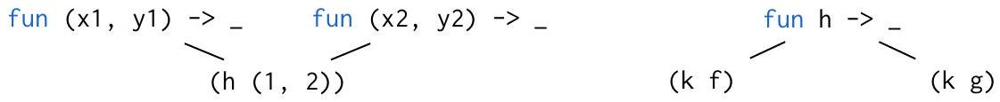
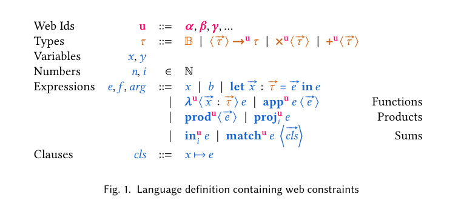
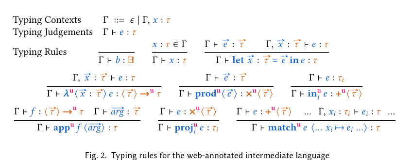
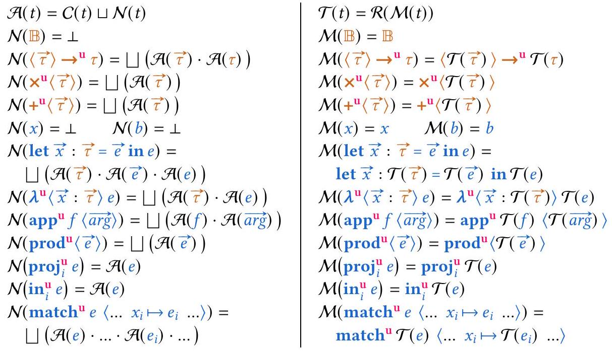
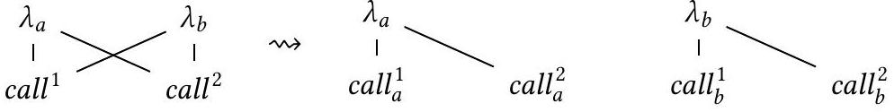
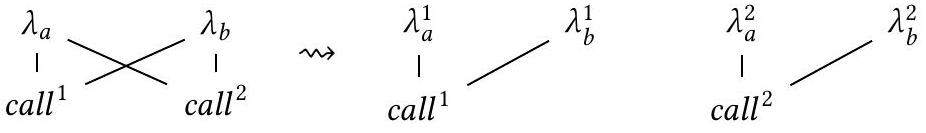
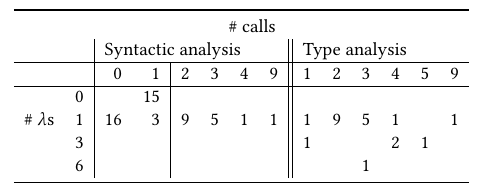

<!--
Third-party paper; not covered by the evm-sail software license.
Authors: Benjamin Quiring, David Van Horn, John Reppy, and Olin Shivers.
Original: https://doi.org/10.1145/3729280
License: Creative Commons Attribution 4.0 International (CC BY 4.0),
https://creativecommons.org/licenses/by/4.0/
Change notice: converted from the accompanying PDF to Markdown with Mathpix on
2026-07-29. The conversion may contain OCR, equation, or layout errors.
-->

# Webs and Flow-Directed Well-Typedness Preserving Program Transformations

BENJAMIN QUIRING, University of Maryland, USA<br>DAVID VAN HORN, University of Maryland, USA<br>JOHN REPPY, University of Chicago, USA<br>OLIN SHIVERS, Northeastern University, USA[^0]

We define webs to be the collections of producers and consumers (e.g., functions and calls) in a program that are constrained: in higher-order languages, multiple functions can flow to the same call, all of which must agree on an interface (e.g., calling convention). We argue that webs are fundamentally the unit of transformation: a change to one member requires changes across the entire web. We introduce a web-centric intermediate language that exposes webs as annotations, and describe web-based (that is, flow-directed) transformations guided by these annotations. As they affect all members of a web, these transformations are interprocedural, operating over entire modules. Through the lens of webs we reframe and generalize a collection of transformations from the literature, including dead-parameter elimination, uncurrying, and defunctionalization, as well as describe novel transformations. We contrast this approach with rewriting strategies that rely on inlining and cascading rewrites.

Webs are an over-approximation of the semantic function-call relationship produced by control-flow analyses (CFA). This information is inherently independent from the transformations; more precise analyses permit more transformations. A limitation of precise analyses is that the transformations may not maintain well-typedness, as the type system is a less-precise static analysis. Our solution is a simple and lightweight typed-based analysis that causes the flow-directed transformations to preserve well-typedness, making flow-directed, type-preserving transformations easily accessible in many compilers. This analysis builds on unification, distinguishing types that look the same from types that have to be the same. Our experiments show that while our analysis is theoretically less precise, in practice its precision is similar to CFAs.

CCS Concepts: • Software and its engineering → Compilers; Functional languages; Automated static analysis.

Additional Key Words and Phrases: Flow Analysis, Program Transformations, Type Systems
ACM Reference Format:
Benjamin Quiring, David Van Horn, John Reppy, and Olin Shivers. 2025. Webs and Flow-Directed Well-Typedness Preserving Program Transformations. Proc. ACM Program. Lang. 9, PLDI, Article 177 (June 2025), 35 pages. https://doi.org/10.1145/3729280

## 1 Introduction

At the heart of many program transformations is implicit reasoning about the relationship between functions and their calls. For example, dead-parameter elimination (DPE) deletes unused parameters from a function and the corresponding arguments from its calls. In functional languages, functions being first-class values complicate this reasoning; they can be passed as arguments, returned from other functions, and stored in data structures. This is exemplified by the OCaml program (a).

**(a)**

```
let f = fun (x1, y1) -> x1 + 3 in
let g = fun (x2, y2) -> x2 + 4 in
let k = fun h -> (h (1, 2)) in
(k f) + (k g)
```

(b)

```
let f = fun (x1, y1) -> x1 + 3 in
let g = fun (x2, y2) -> x2 + y2 in
let k = fun h -> (h (1, 2)) in
(k f) + (k g)
```

Both f and g have a dead second parameter, but DPE cannot be applied without knowing where they are called. As they are both higher-order arguments to k, their calls are not syntactically apparent; static analysis is needed to determine their calls. Such an analysis would find that ( $\mathrm{h}(1,2)$ ) is the only call for both. Knowing this, a compiler can proceed with DPE. If g's parameter is not dead as in (b), however, f's dead parameter cannot be eliminated because f and g must have the same interface: sharing a call constrains f, g, and (h (1,2)) to agree on the number of arguments.

The producer-consumer relationship is the key. The semantic function-call relationships can be described with a bipartite graph on $\lambda \mathrm{s}$ and calls, where an edge indicates a possible run-time call:


All elements of each connected component are constrained together, as transformations to functions and calls must occur on a per-component basis: deleting a $\lambda$ 's dead parameter means deleting an argument from its calls, which means deleting a parameter from the other $\lambda \mathrm{s}$ those calls invoke, and so on. Every element of the component must be touched - it is the unit of transformation.

These components are important, so they deserve a good, concise name: we call them webs, borrowing the name from Muchnick [26], who introduces "definition-use" webs between definitions and uses of variables in SSA: mutable variables and join points allow for multiple definitions. Whenever there is a producer-consumer relationship, there are webs. This paper proposes that webs are a useful lens for viewing transformations to functions, and more generally, any producerconsumer relationship. Towards this goal, we define an intermediate language that annotates producers and consumers (e.g., functions and calls) with their web, and describe how many standard transformations can be generalized by framing them in terms of webs.

Many modern compilers perform transformations such as DPE, uncurrying, and inlining only on known functions [4], which are functions that are bound to a variable and only used in function position. We call these syntactic webs. Presumably this choice is due to the extra effort and compilation time required to (1) compute webs via a static analysis, (2) ensure the condition for an optimization is satisfied for all members of the web (e.g., all $\lambda \mathrm{s}$ have a shared dead parameter), and (3) apply the transform to the whole web. Sophisticated rewriting systems such as GHC use wrappers and inlining [17] to expose these connections, propagating changes from functions to their calls. While this approach works well for higher-order behavior, it requires careful tuning [21] and has limitations, such as functions that escape into data structures. Webs shortcut this process by exposing the calls of functions before changes even occur; intermediate places functions flow through do not need to be inspected. Because of this, web-based, or flow-directed, transformations are inherently interprocedural as they involve touching many non-local program locations at once; they are semantically local by connecting producer directly to consumer. Webs provide a generalizing, unifying view for approaching program transformations; restricting webs to known functions recovers the original syntactic transformations.

To improve over syntactic approaches, compilers turn to control-flow analyses (CFA) that compute the semantic function-call relationship. The usefulness of webs is well-established by past work that uses CFAs, such as defunctionalization [35] in MLton [10], which uses the semantic information to specialize function-call relationships, making it so that every call knows exactly which $\lambda$ is applied.

CFA vs. type systems. One technical challenge of using such CFAs is that they consider a smaller set of program behaviors than what the type system describes, meaning that flow-directed transformations may leave a program ill-typed. As a simple, somewhat reductive, example:

```
let f = fun a1 a2 -> a1 + 1 in
let g = fun b1 b2 -> b1 + b2 in
let choose = fun (b : bool) (f : 'a) (g : 'a) -> if b then f else g
((choose true f g) 1 2)
```

As choose returns f to r, a CFA finds that the webs are \{f, (r 1 2)\} and \{g\}. Since a2 is dead and f is the web's only function, a2 can be eliminated. This would leave the program ill-typed, however: choose takes two arguments of the same type, which is effectively the type system accounting for a trace where g flows to r. While this is an intentionally simple example that could be solved through inlining or marking the body of g as unreachable, it highlights that the mismatch between the CFA and the type system means that some flow-directed transformations will break well-typedness.

One solution is to encode the flow information in the type system itself. [5, 9, 11, 27, 36] This comes at the cost of (1) complex typing rules effectively encoding the CFA, (2) complex inference, or (3) difficulty of preserving such information through a broad spectrum of transformations. An alternative approach is to use a less-precise analysis that respects types. For example, type-directed transformations [6, 44] use a very coarse function-call relationship, but easily maintain types.

Our solution takes the best of both worlds. It (1) encodes webs through a simple extension of the simply-typed $\lambda$-calculus, (2) has lightweight, easy-to-implement inference, and (3) easily preserves these types through the myriad generalized web-based transformations. Additionally, we have found that it (4) is comparable in precision with CFAs. We believe our solution, along with our meta-theory of web-based transformations, makes it easy for new and existing compilers alike to implement flow-directed transformations.

On top of framing webs as a unifying perspective, our contributions are:

- A web-annotated intermediate language that highlights webs as an explicit structuring mechanism. This perspective applies whenever there is a producer-consumer relationship. (Section 2)
- A type system that exposes webs as a simple extension of the simply-typed $\lambda$-calculus which can be generalized to type systems of existing languages, and a lightweight inference procedure building on unification, delivering webs at the same time as types. (Section 2)
- A framework for describing web-based transformations. For our type-based webs, these are simultaneously type-directed, flow-directed, and type-preserving. (Section 3)
- Descriptions of web-based transformations, including (1) generalizations of contractive and interface transformations such as DPE and uncurrying, (2) code-motion transformations such as arity raising, constant propagation, and inlining that exploit how webs provide a notion of semantic locality by directly connecting producers to consumers, and (3) generalizations of web-splitting transformations such as defunctionalization. (Section 4)
- A discussion of implementation strategies for these transformations. (Section 5)
- An evaluation demonstrating that on our benchmarks, our type-based webs provide comparable quality to traditional CFAs. (Section 6)

## 2 An Intermediate Language for Webs

This section introduces the web-based intermediate language. The key features of this intermediate language are annotations u called web identifiers on, in particular, every function and call in the program. Given a bipartite graph describing "which functions are called where," produced by some static analysis, a compiler can assign a unique web identifier to every connected component. Then, it annotates the functions and calls in the term with their identifiers. Fundamentally, these identifiers





encode semantic constraints: at a call with identifier u, the invoked function must be a $\lambda$ with the same identifier. Armed with these annotations, we can perform web-based transformations that require transforming every element of a web.

In addition to functions, other types such as sums (e.g., datatypes) and products also have a notion of a producer (introducer) and consumer (eliminator); just as there is "which functions are called where," there is the symmetric "which value construction can be destructed at which match," and "which tuple can flow to which projection." Our intermediate language exposes webs for functions, sums and products, and in Section 4, we describe symmetric transformations on all three of these.

Figure 1 contains the syntax of the web-annotated intermediate language. It contains variables, base values, a (parallel) let-binding form, functions, calls, products, projections, tagged sums, and matches (all $n$-ary). Every producer and consumer for functions, products, and sums is annotated with a web identifier. We use blue for terms, orange for types, and magenta for webs. Vector arrows $\vec{x}$ indicate a (possibly empty) sequence. We index these with $x_{i}$ and write them explicitly as ... $x_{i} \ldots$ or $x_{1} \ldots x_{n}$. Appending an element $x$ or another sequence $\vec{x}^{\prime}$ to $\vec{x}$ is written $\vec{x} \cdot x$ or $\vec{x} \cdot \vec{x}^{\prime}$. For easier parsing, sequences in the syntax are wrapped in brackets $\langle\vec{e}\rangle$.

Webs in the type system. As discussed in the introduction, this intermediate language is also typed, which in the syntax manifests through type annotations on bindings. The type system for this language is given in Figure 2. We write $\vec{x}: \vec{\tau}$ to mean a sequence of zero or more variables followed by a sequence of types with the same length, and $\Gamma \vdash \vec{e}: \vec{\tau}$ to mean the $i$ th expression has the $i$ th type, and $\Gamma, \vec{x}: \vec{\tau}$ to mean adding the $i$ th variable of the $i$ th type to the context.

The type system is a simple extension of the simply-typed $\lambda$-calculus: every type constructor (function arrow, product, sum) is also annotated with its web u, and the typing rules ensure that the webs match between the terms and types. These typing rules ensures sound over-approximation of the "which function is called where" semantic constraint: at an elimination (call) belonging to u, the (function) value being consumed must be from a u-annotated producer ( $\lambda$ ).

The key way to interpret the annotated types of this language are as distinct, but isomorphic copies of the types they annotate. In other words, " $\langle\cdot\rangle \rightarrow^{\alpha}$. " and " $\langle\cdot\rangle \rightarrow^{\beta}$." are actually two different types. The annotations serve to distinguish types that behave the same (e.g., all arrows behave the same) from types that must be the same (due to typing constraints). With this intuition, transformations can be interpreted as type-directed, and thus type-preserving: performing dead-parameter elimination on a web u means that every function, call, and type annotated with u will be transformed.

Semantic correctness. Effectively, webs on types are carriers of proof that their value belongs to a certain web, along with a promise that those values will only be used at the proper elimination sites. Semantically, the webs on types mean that only values from the same web can flow to those types, and thus to the correct elimination sites. In other words, we could write a semantics for this language that tags all values with the web of their producer. Then as usual, the types in the program describe the values that they represent: the web of the type matches that of the value. With the interpretation that different annotations are actually distinct types, proofs of progress and preservation are essentially copied from the simply-typed $\lambda$-calculus, with the corollary that these webs are valid over-approximations of "which functions are called where."

### 2.1 Web inference

In this section, we describe a lightweight inference procedure for determining the most general (well-typed) web annotations that builds off of unification-based type inference procedures, injecting the simply-typed $\lambda$-calculus into the annotated language. We begin by taking an unannotated well-typed term and standard typing derivation. Each producer, consumer, and type former are annotated with a fresh distinct web. Then, whenever the typing rules in Figure 2 constrain webs to be the same, we will merge, or globally rename one into the other. These equality constraints can be processed efficiently using union-find [12]. As this inference procedure only merges as necessary, it produces the maximal number of well-typed webs.

Example. We begin with a program annotated with fresh webs, represented by OCaml comments.

```
let f: int ->(*u1*) int ->(*u2*) int = fun x ->(*u3*) fun y ->(*u4*) x + y in
let g: int ->(*u5*) int ->(*u6*) int = fun z ->(*u7*) fun w ->(*u8*) z - w in
let h: (int ->(*u9*) int ->(*u10*) int) ->(*u11*) int =
    fun k ->(*u12*) ((k 1)(*u13*) 2)(*u14*) in
(h f)(*u15*) + (h g)(*u16*)
```

The constraints yielded by the typing rules are

```
u1=u3 u2=u4 (def.f) u5=u7 u6=u8 (def.g) u9=u13 u10=u14 u11=u12 (def.h)
    u1=u9 u2=u10 u5=u9 u6=u10 u11=u15 u11=u16 (calls to h)
```

Solving these constraints (renaming larger into smaller) yields the resulting well-typed program

```
let f: int ->(*u1*) int ->(*u2*) int = fun x ->(*u1*) fun y ->(*u2*) x + y in
let g: int ->(*u1*) int ->(*u2*) int = fun z ->(*u1*) fun w ->(*u2*) z - w in
let h: (int ->(*u1*) int ->(*u2*) int) ->(*u11*) =
    fun k ->(*u11*) ((k 1)(*u1*) 2)(*u2*) in
(h f)(*u11*) + (h g)(*u11*)
```

We extract the bipartite graph from this program, connecting functions and calls in the same web.

```
(fun x -> _) (fun z -> _) (fun y -> _) (fun w -> _) (fun k -> _)
u1: । u2: । u11: 1 -
    (k 1) (_ 2) (h f) (h g)
```

Determining webs during type inference. Instead of a separate pass, we can perform web inference during type inference by making the following small change to standard unification, where u is the result of globally renaming one of $\mathrm{u}_{1}$ and $\mathrm{u}_{2}$ into the other (achieved via effects or monads).

$$
\operatorname{unify}\left(\left\langle\tau_{11}\right\rangle \rightarrow^{\mathbf{u}_{1}} \tau_{12},\left\langle\tau_{21}\right\rangle \rightarrow^{\mathbf{u}_{2}} \tau_{22}\right)=\left\langle\operatorname{unify}\left(\tau_{11}, \tau_{21}\right)\right\rangle \rightarrow^{\mathrm{u}} \operatorname{unify}\left(\tau_{12}, \tau_{22}\right)
$$

Separate compilation. Modules delineate compilation units and program boundaries. Often the interface values used to interact across these boundaries cannot change: if an exported function is ternary, it is expected to be ternary when imported. The web-annotated type system provides a convenient description of the values that interact across these boundaries: those belonging to webs visible on the boundary (types exposed as abstract types are invisible). For example, if the top-level term is $\Gamma \vdash \bar{e}: \tau$, then $\Gamma$ contains all imports and $\tau$ contains all exports. Web-based, or flow-directed, transformations touch all members of webs, and thus are whole-term. These are not whole-program (as MLton requires [10]) as they can be applied on a per-module basis by forbidding transformations to members of boundary webs. In a more advanced setting, a compiler can communicate how interfaces are changed across compilation units [15, 31].

Polymorphism and recursive types. This type system can be extended to polymorphism and (both iso- and equi-) recursive types; the typing rules do not change, as the underlying type system has only split type formers into distinct copies. The abbreviated typing rules are (using substitution):

$$
\frac{\Gamma \vdash e: \forall a . \tau}{\Gamma \vdash \operatorname{tapp} e \tau^{\prime}: \tau\left[\tau^{\prime} / a\right]} \quad \frac{\Gamma, a \vdash e: \tau}{\Gamma \vdash \Lambda a . e: \forall a . \tau} \quad \frac{\Gamma \vdash e: \tau[\mu a . \tau / a]}{\Gamma \vdash \operatorname{roll} e: \mu a . \tau} \quad \frac{\Gamma \vdash \text { unroll } e: \mu a . \tau}{\Gamma \vdash e: \tau[\mu a . \tau / a]}
$$

These rules essentially assert that certain portions of types (in particular, the $\tau$ that appears multiple times) are the same, which will be enforced during unification; in a type checker, when the polymorphic type is applied, the substitution will be unified with the instantiated type of the call, which will merge the webs appropriately. Recursive types are handled similarly; whenever the isomorphism $\mu a . \tau=\tau[\mu a . \tau / a]$ (where $\mu$ is the recursive binder) is invoked (either explicitly or implicitly), the webs in the various instances of $\tau$ are merged. In fact, type abstraction and instantiation and roll-unroll for isorecursive types are two more examples of producer-consumer relationships, which could be web-annotated! In our prototype, we infer webs for well-typed terms with polymorphism and equirecursive types through the same merging procedure.

Under the intuition that distinctly-annotated types and terms are just different copies of an underlying language mechanism, existing type-soundness proofs for those underlying language mechanisms should be able to be adapted to the web-annotated setting. Morally, polymorphism should not interfere with transformations either; removing a dead parameter works whether or not the type contains type variables. There are some cases where polymorphic terms can prevent certain transformations, however, which we discuss at the end of Section 4.1.

Mutation. Functional languages such as Standard ML permit mutation through explicit types such as 'a ref and 'a array, requiring that the types of the values stored in these cells does not change. These are treated as any other type constructor: the types and syntactic forms for creating, mutating, and accessing should also be given web annotations, which will be merged. The effect is that all possible values that enter those mutable cells are treated as being in the same web; the analysis will not distinguish different values based on where the cell is accessed. In this case, web-annotated types provide a simple may-alias analysis as values belonging to distinct webs cannot be the same.

## 3 Foundations of Web-Based Transformations

The point of exposing webs in the intermediate language is to enable flow-directed transformations. These transformations require modifying all elements of web, meaning they are non-local and whole-term. This section provides a foundation for how to formalize, describe, and understand these transformations. As a concrete example, we develop a simple web-based dead-parameter elimination (DPE), and in the following Section 4 we describe many more transformations.

To start, consider the following web-annotated program, which defines a function f that does not use its second parameter y, is passed to g, and is only called at (h (arg, 2)):

```
let f = fun (x: int, y: int) ->(*u1*) x + 4 in
let g = fun (h: int * int ->(*u1*) int, arg: int) ->(*u2*) (h (arg, 2))(*u1*) in
(g (f, 3))(*u2*)
```

To perform DPE on f we first need to check a condition: does every function in f's web u1 not use its second parameter? To do this, we visit every location in the term, checking this condition upon encountering any u1-annotated function. If the condition holds everywhere, then we transform by revisiting every location, applying a rewrite rule that erases (1) the second parameter of every $\lambda$ in u1, (2) the second argument from every call in u1, and to preserve well-typedness, (3) the second argument from every u1 arrow. For the example, this transformation yields

```
let f = fun (x: int) ->(*u1*) x + 4 in
let g = fun (h: int ->(*u1*) int, arg: int) ->(*u2*) (h arg)(*u1*) in
(g (f, 3))(*u2*)
```

Notationally, we use inference rules to describe conditional transformations, as in Li and Appel [24]. For DPE we have the following informal rule; formalizing it is the goal of this section:

$$
\frac{\exists \alpha \text {, for every } \lambda^{\alpha}\left\langle x_{1} x_{2}: \tau_{1} \tau_{2}\right\rangle e \text { in } \bar{e}, x_{2} \text { not free in } e}{\text { apply the rewrite }\left\{\begin{array}{ll}
\lambda^{\alpha}\left\langle x_{1} x_{2}: \tau_{1} \tau_{2}\right\rangle e & \leadsto \lambda^{\alpha}\left\langle x_{1}: \tau_{1}\right\rangle e \\
\operatorname{app}^{\alpha} f\left\langle a r g_{1} \arg _{2}\right\rangle & \leadsto \operatorname{app}^{\alpha} f\left\langle a r g_{1}\right\rangle \\
\left\langle\tau_{1} \tau_{2}\right\rangle \rightarrow^{\alpha} \tau_{3} & \leadsto\left\langle\tau_{1}\right\rangle \rightarrow^{\alpha} \tau_{3}
\end{array}\right\} \text { everywhere in } \bar{e}}
$$

Let the top-level program term be $\bar{e}$. This rule reads: if, for some fixed web $\alpha$, all $\lambda \mathrm{s}$ in $\bar{e}$ and belonging to $\alpha$ do not use their second parameter (the condition above the line), then for each $\lambda$, call, and arrow type within $\bar{e}$ and belonging to $\alpha$, remove that dead parameter, the corresponding argument, and argument type (the rewrite below the line).

Formalism. The intuitions of "evaluate a condition everywhere" and "apply a rewrite everywhere" occur in all web-based transformations, and so our formalization of these ideas abstracts over a condition $\mathcal{C}(\cdot)$ and rewrite $\mathcal{R}(\cdot)$. To formalize "evaluate a condition everywhere," the left side of Figure 3 defines two metafunctions, $\mathcal{A}$ and $\mathcal{N} . \mathcal{A}(e)$ evaluates the condition $C$ on every subterm and type of $e$ by (1) evaluating $\mathcal{C}(e)$, and (2) using $\mathcal{N}(e)$ to apply $\mathcal{A}$ recursively (including to types). For conciseness, these distribute over sequences. The condition results are combined with an operator ப, which has an identity ⟂ and where □ ( → ) folds □ over sequences.

Often the condition $C$ simply produces a boolean result, as in the DPE example, where ⟂ is true and $\sqcup$ is conjunction. More complicated rules require producing data structures, however. For example, to apply DPE to all webs at once and remove multiple dead parameters, the condition produces a map from webs u to sets of live indices (described in Section 4.1). In general, we have found these structures to be (join) semilattices, and so use such notation.



*Figure 3. Condition (left) and transformation (right) metafunctions.*

To formalize "apply a rewrite everywhere," the right side of Figure 3 defines $\mathcal{T}$ and $\mathcal{M} . \mathcal{T}(e)$ applies the rewrite $\mathcal{R}$ to every subterm and type of $e$ from the bottom up: $\mathcal{M}(e)$ first applies $\mathcal{T}$ recursively and rebuilds the term, applying $\mathcal{R}$ afterwards.

The choices of $\mathcal{C}$ and $\mathcal{R}$ determine a transformation. For the DPE example, we have:

$$
\begin{array}{lll} 
& \mathcal{R}_{D P E}\left(\lambda^{\alpha}\langle x y\rangle e\right) & =\lambda^{\alpha}\langle x\rangle e \\
C_{D P E}\left(\lambda^{\alpha}\langle x y\rangle e\right)=y \text { not free in } e & \mathcal{R}_{D P E}\left(\operatorname{app}^{\alpha} f\left\langle\arg _{1} \arg _{2}\right\rangle\right)= & \operatorname{app}^{\alpha} f\left\langle\arg _{1}\right\rangle \\
C_{D P E}(t) & =\perp, \quad \text { otherwise. } & \mathcal{R}_{D P E}\left(\left\langle\tau_{1} \tau_{2}\right\rangle \rightarrow^{\alpha} \tau_{3}\right)=\left\langle\tau_{1}\right\rangle \rightarrow \rightarrow^{\alpha} \tau_{3} \\
& \mathcal{R}_{D P E}(t) & =t, \quad \text { otherwise. }
\end{array}
$$

When applied to terms irrelevant to the transformation, $C$ checks nothing and the rewrite $\mathcal{R}$ does nothing. Using the formally-defined $\mathcal{A}$ and $\mathcal{T}$, the inference-rule notation can be revised:

$$
\begin{gathered}
\exists \alpha, \mathcal{A}(\bar{e})\left\{\lambda^{\alpha}\langle x y\rangle e \Longrightarrow y \text { not free in } e\right\} \\
\bar{e} \rightsquigarrow \mathcal{T}(\bar{e})\left\{\begin{array}{ll}
\lambda^{\alpha}\langle x y\rangle e & \leadsto \lambda^{\alpha}\langle x\rangle e \\
\operatorname{app}^{\alpha} f\left\langle\arg _{1} \arg _{2}\right\rangle & \leadsto \operatorname{app}^{\alpha} f\left\langle\arg _{1}\right\rangle \\
\left\langle\tau_{1} \tau_{2}\right\rangle \rightarrow^{\alpha} \tau_{3} & \leadsto\left\langle\tau_{1}\right\rangle^{\alpha} \tau_{\tau_{3}}
\end{array}\right\}
\end{gathered}
$$

This reads: if $\mathcal{A}$ (with the $\mathcal{C}$ provided in braces) holds for $\bar{e}$, then transform $\bar{e}$ via applying $\mathcal{T}$ (with the rewrite rule $\mathcal{R}$ provided in braces). The "otherwise" clauses of the provided $\mathcal{C}$ and $\mathcal{R}$ are implicit.

Preserving well-typedness. To prove that the DPE transformation preserves the well-typedness of the term, we can lift the transformation to contexts and judgements:

$$
\mathcal{T}(\epsilon)=\epsilon \quad \mathcal{T}(\Gamma, x: \tau)=\mathcal{T}(\Gamma), x: \mathcal{T}(\tau) . \quad \mathcal{T}(\Gamma \vdash e: \tau)=\mathcal{T}(\Gamma) \vdash \mathcal{T}(e): \mathcal{T}(\tau)
$$

To show preservation of well-typedness, we construct the typing derivation for the transformed term by induction, transforming each existing judgement.[^1] For example, the “irrelevant” cases of $\mathcal{R}$

just push $\mathcal{T}$ through every judgement, as with products in DPE:
$$
\frac{\Gamma \vdash \vec{e}: \vec{\tau}}{\Gamma \vdash \operatorname{prod}^{\alpha}\langle\vec{e}\rangle: \times^{\alpha}\langle\vec{\tau}\rangle} \leadsto \frac{\mathcal{T}(\Gamma \vdash \vec{e}: \vec{\tau})}{\mathcal{T}\left(\Gamma \vdash \operatorname{prod}^{\alpha}\langle\vec{e}\rangle: \times^{\alpha}\langle\vec{\tau}\rangle\right)}=\frac{\mathcal{T}(\Gamma) \vdash \mathcal{T}(\vec{e}): \mathcal{T}(\vec{\tau})}{\mathcal{T}(\Gamma) \vdash \operatorname{prod}^{\alpha}\langle\mathcal{T}(\vec{e})\rangle: \times^{\alpha}\langle\mathcal{T}(\vec{\tau})\rangle} .
$$
The interesting cases of $\mathcal{R}$ require more work. The $\lambda$ case for DPE (for the specific web $\alpha$ ) is
$$
\frac{\Gamma, x_{1} x_{2}: \tau_{1} \tau_{2} \vdash e: \tau}{\Gamma \vdash \lambda^{\alpha}\left\langle x_{1} x_{2}: \tau_{1} \tau_{2}\right\rangle e:\left\langle\tau_{1} \tau_{2}\right\rangle \rightarrow^{\alpha} \tau} \leadsto \frac{\mathcal{T}(\Gamma), x_{1}: \mathcal{T}\left(\tau_{1}\right) \vdash \mathcal{T}(e): \mathcal{T}(\tau)}{\mathcal{T}(\Gamma) \vdash \lambda^{\alpha}\left\langle x_{1}: \mathcal{T}\left(\tau_{1}\right)\right\rangle \mathcal{T}(e):\left\langle\mathcal{T}\left(\tau_{1}\right)\right\rangle \rightarrow^{\alpha} \mathcal{T}(\tau)}
$$
When transforming this derivation step, we know that $\mathcal{C}_{D P E}$ holds on the $\lambda$, so $x_{2}$ is not free in $e$. Also, the induction hypothesis applied to the premise tells us that $\mathcal{T}(\Gamma), x_{1} x_{2}: \mathcal{T}\left(\tau_{1}\right) \mathcal{T}\left(\tau_{2}\right) \vdash \mathcal{T}(e): \mathcal{T}(\tau)$. To transform the conclusion judgement, we need to establish that (1) dead parameters can be removed from the context of typing derivation, and (2) $x_{2}$ not free in $e$ implies $x_{2}$ not free in $\mathcal{T}(e)$; (1) is a transformation condition that states $\mathcal{C}$ provides the evidence required to apply $\mathcal{R}$, and (2) says that although we know $\mathcal{C}(e)$ prior to the transformation, when performing the transformation we actually need to know $\mathcal{C}(\mathcal{M}(e))$, since the inner term has been transformed, in order to derive $\mathcal{T}(\Gamma) \vdash \mathcal{T}(e): \mathcal{T}(\tau)$ from $\mathcal{M}(\Gamma) \vdash \mathcal{M}(e): \mathcal{M}(\tau)$. This manifests in general as a lemma that must be proven, which takes the form:
$$
\forall e, \mathcal{C}(\mathcal{M}(e)) \sqcup \mathcal{C}(e)=\mathcal{C}(e), \text { (equivalently } \mathcal{C}(\mathcal{M}(e)) \sqsubseteq \mathcal{C}(e) \text { in the underlying order) }
$$
which means that the computed conditions are still valid. For DPE: dead variables are still dead.
For some rules this is a non-trivial lemma that needs to be proven inductively (e.g., DPE and deadness). For other rules that are local and do not inspect far into nested subterms, it is fairly trivial. (e.g., uncurrying in Section 4.1). We believe this lemma is necessary not just for proving well-typedness, but also semantic correctness of these rules, which we leave to future work.

## 4 Web-Based Transformations

Armed with the formalism and notation introduced in the previous section, we can now describe many examples of web-based transformations for the language described in Section 2, which serves as a representative of intermediate languages in real compilers. Every rule preserves well-typedness in the web-annotated type system, meaning crucially that (1) webs do not need to be reinferred after transformation (reinference is discussed in Section 5.3) and (2) as erasing webs yields a well-typed simply-typed $\lambda$ term, the transformations also preserve well-typedness in that underlying type system. Note that in the untyped setting, the exact same transformations apply, just by erasing the types; an aggressive optimizing compiler using a more precise control-flow analysis can apply the same rules.

First, we present generalizations of common existing transformations in compilers: contractive transformations like DPE, and uncurrying (Section 4.1). These transformations are strictly more general (can be applied more often) than their syntactic first-order counterparts. Following, we describe how webs provide a notion of "semantic locality," connecting producers directly to consumers, which allows computations to be moved between them (Section 4.2). Finally, we describe specialization via web splitting, which is similar to defunctionalization (Section 4.3).

These rules roughly fall into three categories: change of interface (changes to calling convention; e.g., how many arguments, what type of arguments, etc.), computation movement (inlining, constant propagation, etc.), and web manipulation (defunctionalization, monomorphization, etc.). Appendix A contains paper proofs that these rules preserve well-typedness, as well as additional transformations.

### 4.1 Generalizing transformations

Dead elimination. The following generalizes the earlier DPE, removing dead parameters in all webs.

$$
\begin{aligned}
& \frac{\boldsymbol{m}}{e} \mathcal{A}(\bar{e})\left\{\lambda^{\mathrm{u}}\langle\vec{x}: \vec{\tau}\rangle e \Longrightarrow\left[\mathrm{u} \mapsto\left\{i \text { such that } x_{i} \text { free in } e\right\}\right]\right\} \\
& \bar{e} \rightsquigarrow \mathcal{T}(\bar{e})\left\{\begin{array}{l}
\lambda^{\mathrm{u}}\langle\vec{x}: \vec{\tau}\rangle e \leadsto \lambda^{\mathrm{u}}\langle\operatorname{flt}(\mathfrak{m}(\mathrm{u}), \vec{x}): \operatorname{flt}(\mathfrak{m}(\mathrm{u}), \vec{\tau})\rangle e \\
\operatorname{app}^{\mathrm{u}} f\langle\overrightarrow{\arg }\rangle \leadsto \operatorname{app}^{\mathrm{u}} f\langle\operatorname{flt}(\mathbf{m}(\mathrm{u}), \overrightarrow{\arg r})\rangle \\
\langle\vec{\tau}\rangle \rightarrow^{\mathrm{u}} \tau_{\text {res }} \leadsto\langle\operatorname{flt}(\mathbf{m}(\mathrm{u}), \vec{\tau})\rangle \rightarrow^{\mathrm{u}} \tau_{\text {res }}
\end{array}\right\}
\end{aligned}
$$

Instead of computing a boolean result, the condition computes a map $\mathfrak{m}$ from webs to the indices that are live for that web. It does this by finding the indices of the parameters that are live for each $\lambda$ in any web. Then, these are all combined with $\sqcup$, which distributes across the map and unions sets of live indices: a web's $i$ th parameter is live if some $\lambda$ in that web uses its $i$ th parameter.

$$
\left(\mathfrak{m}_{1} \sqcup \mathfrak{m}_{2}\right)(\mathrm{u})=\mathfrak{m}_{1}(\mathrm{u}) \sqcup \mathfrak{m}_{2}(\mathrm{u})=\mathfrak{m}_{1}(\mathrm{u}) \cup \mathfrak{m}_{2}(\mathrm{u})
$$

The transformation uses $\mathfrak{m}$ and a "filter" helper function $f l t(\mathcal{I}, \overrightarrow{)}$, which keeps the $i$ th element if $i \in \mathcal{I}$, to remove the dead parameters and corresponding arguments and types. Note that despite processing all webs, this rule is not a fixpoint: deleting arguments can reveal new dead parameters.

Aside from functions, products and sums also have a symmetric "dead elimination" rule: delete components that are never projected, or never introduced, respectively. Symmetry is a common theme for webs: transformations for one kind of web often have symmetric versions.

$$
\begin{aligned}
& \begin{array}{c}
\mathfrak{m}=\mathcal{A}(\bar{e})\left\{\operatorname{proj}_{i}^{\mathrm{u}} e \Longrightarrow[\mathrm{u} \mapsto\{i\}]\right\} \\
\bar{e} \rightsquigarrow \mathcal{T}(\bar{e})\left\{\begin{array}{ll}
\operatorname{prod}^{\mathrm{u}}\langle\vec{e}\rangle & \leadsto \operatorname{prod}^{\mathrm{u}}\langle\operatorname{flt}(\mathfrak{m}(\mathrm{u}), \vec{e})\rangle \\
\operatorname{proj}_{i}^{\mathrm{u}} e & \leadsto \operatorname{proj}_{\operatorname{shift}(\mathrm{m}(\mathrm{u}), i)} e^{e} \\
\times^{\mathrm{u}}\langle\vec{\tau}\rangle & \leadsto x^{\mathrm{u}}\langle\operatorname{flt}(\mathrm{~m}(\mathrm{u}), \vec{\tau})\rangle
\end{array}\right\}
\end{array}
\end{aligned}
$$

As before, the conditions find the live indices. The transformation uses another helper $\operatorname{shift}(\mathcal{I}, i)$, which decrements $i$ by $|\{j \mid j<i, j \notin \mathcal{I}\}|$, to appropriately shift projections and sum intros.

Additional web-based contractive transformations, provided in Appendix A, include: deadparameter elimination in matches (rewriting the sum to package a unit value), rewriting webs that have no eliminations to the unit type, flattening unary sums and products, and eliminating unit-typed parameters from functions and unit-typed components from tuples.

Uncurrying. Uncurrying merges nested $\lambda \mathrm{s}$ and nested calls (the function of one is the result of the other). With the web perspective, we can easily uncurry functions that escape into data structures or are used as higher-order arguments. What we want the rule to be is: if it is the case that the $\lambda \mathrm{s}$ in u always consists of a nested $\lambda$, and the calls in u are always wrapped in an outer call, then merge the $\lambda \mathrm{s}$ and calls together. Unfortunately, testing if a call is always wrapped in another is difficult using the condition combinator because it needs additional information about the context. Interestingly, an ANF or CPS representation does not require additional context information or secondary simplifications because it allows looking into the rest of the term to see adjacent calls since the computation has been linearized.

Even without a generalization to the meta-theory, we can still perform uncurrying by merging adjacent $\lambda \mathrm{s}$ and wrapping each call in u in a new curried $\lambda$, effectively shifting the currying from
the source of the function to where it is called, which then gets $\beta$-reduced:

$$
\begin{gathered}
\mathfrak{m}=\mathcal{A}(\bar{e})\left\{\lambda^{\mathrm{u}}\langle\vec{x}: \vec{\tau}\rangle e \Longrightarrow\left[\mathrm{u} \mapsto \mathrm{u}^{\prime} \text { if } e \text { has the form } \lambda^{\mathrm{u}^{\prime}}\left\langle\vec{y}: \vec{\tau}^{\prime}\right\rangle e^{\prime}, \text { else fail }\right]\right\} \\
\bar{e} \leadsto \mathcal{T}(\bar{e})\left(\mathcal{R}_{\beta} \circ \mathcal{R}_{\text {uncurry }}\right) \quad \text { where } \\
\mathcal{R}_{\text {uncurry }}=\left\{\begin{array}{ll}
\lambda^{\mathrm{u}}\langle\vec{x}: \vec{\tau}\rangle \lambda^{\mathrm{u}^{\prime}}\left\langle\vec{y}: \vec{\tau}^{\prime}\right\rangle e^{\prime} & \leadsto \lambda^{\mathrm{u}}\left\langle\vec{x} \cdot \vec{y}: \vec{\tau} \cdot \vec{\tau}^{\prime}\right\rangle e^{\prime} \text { when } \mathfrak{m}(\mathrm{u})=\mathrm{u}^{\prime} \\
\operatorname{app}^{\mathrm{u}} f\langle\overrightarrow{a r g}\rangle & \leadsto \lambda^{\mathrm{u}^{\prime}}\left\langle\vec{y}: \vec{\tau}^{\prime}\right\rangle \operatorname{app}^{\mathrm{u}} f\langle\overrightarrow{\arg } \cdot \vec{y}\rangle \text { when } \mathfrak{m}(\mathrm{u})=\mathrm{u}^{\prime} \\
\langle\vec{\tau}\rangle \rightarrow \vec{\tau}^{\mathrm{u}}\left\langle\vec{\tau}^{\prime}\right\rangle \rightarrow \mathrm{u}^{\prime} \tau_{\text {res }} & \leadsto\left\langle\vec{\tau} \cdot \vec{\tau}^{\prime}\right\rangle \rightarrow \overrightarrow{\mathrm{u}}^{\mathrm{u}} \tau_{\text {res }} \text { when } \mathfrak{m}(\mathrm{u})=\mathrm{u}^{\prime}
\end{array}\right\} \\
\mathcal{R}_{\beta}=\left\{\operatorname{app}^{\mathrm{u}^{\prime}}\left(\lambda^{\mathrm{u}^{\prime}}\left\langle\vec{y}: \vec{\tau}^{\prime}\right\rangle \operatorname{app}^{\mathrm{u}} f\langle\overrightarrow{a r g} \cdot \vec{y}\rangle\right)\left\langle\overrightarrow{a r g}^{\prime}\right\rangle \leadsto \operatorname{app}^{\mathrm{u}} f\left\langle\overrightarrow{a r g} \cdot \overrightarrow{\arg }{ }^{\prime}\right\rangle\right\}
\end{gathered}
$$

The condition computes, for each web, whether the body of the $\lambda$ is always another $\lambda$. If so, it provides that $\lambda$ 's web, otherwise "fail." The join is defined as:

$$
\left(\mathfrak{m}_{1} \sqcup \mathfrak{m}_{2}\right)(\mathrm{u})=\mathfrak{m}_{1}(\mathrm{u}) \sqcup \mathfrak{m}_{2}(\mathrm{u}) \quad \mathrm{u} \sqcup \mathrm{u}=\mathrm{u} \quad \mathrm{u} \sqcup \mathrm{u}^{\prime}=\text { fail } \quad \text { _ ப fail }=\text { fail }=\text { fail } \sqcup \_
$$

Then, $\mathcal{R}_{\text {uncurry }}$ merges nested $\lambda \mathrm{s}$ (for which $\mathfrak{m}(\mathrm{u})$ is not fail) and introduces currying at the calls. This is followed up by $\mathcal{R}_{\beta}$, which performs $\beta$-reduction (in particular, to the newly introduced $\lambda \mathrm{s}$ ).

This trick is similar to that in Appel [4], which introduces a wrapper function containing the curried behavior that calls a fully-applied uncurried version. This wrapper is then inlined and simplified away (via $\mathcal{R}_{\beta}$ ), eliminating the currying. Or, it is passed to a higher-order function which is then specialized via inlining, effectively propagating the change until it gets to a call (we contrast with this style in the related work). Instead, our rule immediately introduces the currying at the calls, then relying on the simplifier in the same way. This rule simultaneously highlights two important parts of web-based transformations: (1) behaviors can be moved directly from the producer to the consumer, which is the computation movement rule that we describe next, and (2) simplifying passes can be fused together with the transformations (further discussion in Section 5).

There are symmetric rules for products and sums that merge nested structures into outer ones. Products have the same issue as functions: the adjacent projection happens on the outside. We can play the same trick as with functions to resolve this, rewriting the inner projections to create a new tuple that would get eliminated by a secondary pass. Appendix A contains these rules.

Polymorphism. Promising to maintain a well-typed representation can block certain semanticspreserving transformations, like the dead-parameter elimination example from the introduction, because they cannot preserve the types. Polymorphic terms themselves can also block transformations: suppose we had a polymorphic function fun (f: 'a ->(*u1*) 'b) (x: 'a) ->(*u2*) (f x)(*u1*). It may be the case that every function value provided to f is a closure over a curried function like fun _ ->(*u1*) fun _ ->(*u3*) e. The polymorphism in the term blocks the uncurrying transformation, because the nested arrow is not available; how would one transform the type of f? We believe this issue cannot occur in the simply-typed $\lambda$-calculus. In the polymorphic setting, the condition needs to additionally inspect the type, to ensure that the transformation to the type is possible. This check is not required for DPE, as it does not look at nested shapes of types. Uncurrying does requires this check as it needs types to have a certain shape. To overcome this limitation on transformation, one can partially specialize the "most general unifier" that Hindley-Milner type inference provided; if it is always given a curried function, transform the type to reflect that.

### 4.2 Semantic locality and movement of computation

DPE and uncurrying change the interface of webs and they can be decomposed into two pieces: identifying some local transform around a function, which manifests as a wrapper around the function, and moving that wrapper from the producer directly to the consumer. We call this direct connection semantic locality. Compilers typically restrict themselves to transformations that are syntactically local (adjacent in the syntax, connecting definition of syntax to use) or lexically local
(connecting definitions of variables to their uses). Just as a compiler performs simplification steps (syntactic locality: $\beta$-simplification) or moves computations from definitions to uses (lexical locality: substitution), a compiler can also simplify and move computations directly between producers and consumers (semantic locality). For example, consider the following transforms:

```
let f(x: int) = 2*(x+1) in 3. let f(x: int) = 2*x in let f(x: int) = 2*x in
f (... - 1) f ((... - 1) + 1) f ...
```

The function f always adds one to its parameter before using it, and whenever f is called, it subtracts one from the argument. The transform moves the +1 to the call, which is then canceled out.

Notation. A one-hole context $E$ is an expression containing a hole □ that can be filled by an expression: $E \llbracket e \rrbracket$. Every subterm of an expression can be uniquely identified as a context focusing on the subterm. We write substitution as $e^{\prime}[\vec{e} / \vec{x}]$, which substitutes all occurrences of $x_{i}$ in $e^{\prime}$ with $e_{i}$.

Inner computation movement. The general pattern is that computations that only rely on the input parameters can be moved to the call. For function webs, the first rule for moving computation is:

$$
\begin{gathered}
\exists \alpha e^{\prime}, e^{\prime} \text { does not reference } \alpha \text {, has free variables } \vec{y}: \vec{\tau} \text { with } \vec{y}: \vec{\tau} \vdash e^{\prime}: \tau^{\prime}, \\
\text { and } \mathcal{A}(\bar{e})\left\{\lambda^{\alpha}\langle\vec{x}: \vec{\tau}\rangle e \Longrightarrow \exists E, e=E \llbracket e^{\prime}[\vec{x} / \vec{y}] \rrbracket\right\} \\
\bar{e} \rightsquigarrow \mathcal{T}(\bar{e})\left\{\begin{array}{ll}
\lambda^{\alpha}\langle\vec{x}: \vec{\tau}\rangle E \llbracket e^{\prime}[\vec{x} / \vec{y}] \rrbracket & \leadsto \lambda^{\alpha}\left\langle\vec{x} \cdot x^{\prime}: \vec{\tau} \cdot \tau^{\prime}\right\rangle E \llbracket x^{\prime} \rrbracket \\
\operatorname{app}^{\alpha} f\langle\overrightarrow{a r g}\rangle & \leadsto \operatorname{app}^{\alpha} f\left\langle\overrightarrow{a r g} \cdot\left(e^{\prime}[\overrightarrow{a r g} / \vec{y}]\right)\right\rangle \\
\langle\vec{\tau}\rangle \rightarrow^{\alpha} \tau_{\text {res }} & \leadsto\left\langle\vec{\tau} \cdot \tau^{\prime}\right\rangle \rightarrow^{\alpha} \tau_{\text {res }}
\end{array}\right\}
\end{gathered}
$$

First, the condition: $e^{\prime}$ is a "pattern" that should appear in every $\lambda$ in $\alpha$. For this rule, each $\lambda$ 's body is decomposed into an outer one-hole context $E$, focused on the shared $e^{\prime}$, which instantiates its "pattern variables" $\vec{y}$ with the $\lambda$ 's parameters. The pattern $e^{\prime}$ is only allowed to depend on the parameters of the $\lambda \mathrm{s}$ because when we move $e^{\prime}$ to the call we have the arguments available. To allow $e^{\prime}$ additionally to refer to free variables of the $\lambda$ s, we would need to ensure that not only are those free variables available at the calls, but that at run time those are the same instances.

If there is such a pattern, we can lift it outside the call, introducing a new parameter $x^{\prime}$ corresponding to the evaluation of the focused $e^{\prime}[\overrightarrow{\arg } / \vec{y}]$, which has the same evaluation as $e^{\prime}[\vec{x} / \vec{y}]$. Effectively, the computation of $e^{\prime}$ has been lifted from the definition to outside the call. We term this inner computation movement because the shared computation is the inner $e^{\prime}$. Additionally, $e^{\prime}$ cannot reference $\alpha$, as this web is being transformed.

Note that this rule can be applied in reverse: if one argument can always be rewritten as a fixed function of the others, it can be substituted into the body of the functions in the web. In this case, the conditions are on the calls rather than the $\lambda \mathrm{s}$. The forward direction most often applies when there is exactly one $\lambda$ in the web, and the reverse direction most often applies when there is exactly one call. Finally, this rule can be appropriately defined for products and sums.

This transformation is not always semantics preserving, as it forces the evaluation of a computation, which may not terminate, that may never have been computed in the first place. For example, $e^{\prime}$ could be nested in a $\lambda$ or under a match branch never taken. For effectful programs, the argument values should first be let-bound to avoid duplication and changing the order of computation. The generality of this rule is a novel application of webs and web-based transformation, and is a general schematic to categorize various transformations.

For polymorphism, types are scoped and moving $\tau^{\prime}$ from the function to the body is not necessarily well-typed; additional restrictions are required. Contractive transformations usually do not need such restrictions because they do not move types, instead just shuffling what is already available. For example, our uncurrying rule seems to implicitly move parameter types from the function to the call, but those types are available from the call's return type.

Constant propagation. One example of this transformation in reverse is constant propagation, where functions that are always given a constant argument propagate that constant into the function:

$$
\frac{\exists \alpha c \tau^{\prime}, \text { such that } \epsilon \vdash c: \tau^{\prime} \text { and } \mathcal{A}(\bar{e})\left\{\operatorname{app}^{\alpha} f\langle\overrightarrow{\arg } \cdot \arg \rangle \Longrightarrow \arg =c\right\}}{\bar{e} \rightsquigarrow \mathcal{T}(\bar{e})\left\{\begin{array}{ll}
\lambda^{\alpha}\left\langle\vec{x} \cdot x^{\prime}: \vec{\tau} \cdot \tau^{\prime}\right\rangle e \rightsquigarrow \lambda^{\alpha}\langle\vec{x}: \vec{\tau}\rangle \operatorname{let} x^{\prime}: \tau^{\prime}=c \operatorname{in} e \\
\operatorname{app}^{\alpha} f\langle\overrightarrow{a r g} \cdot c\rangle & \leadsto \operatorname{app}^{\alpha} f\langle\overrightarrow{\arg }\rangle \\
\left\langle\vec{\tau} \cdot \tau^{\prime}\right\rangle \rightarrow^{\alpha} \tau_{\text {res }} & \leadsto\langle\vec{\tau}\rangle \rightarrow^{\alpha} \tau_{\text {res }}
\end{array}\right\}}
$$

There are symmetric rules for products and sums, and for when a function returns a constant.
Inlining. In fact, returning a constant is a special case of inlining. Inlining is allowed when the entire function body is the shared pattern, which typically only occurs for webs with exactly one $\lambda$.

$$
\frac{\exists \alpha e^{\prime}, e^{\prime} \text { has free variables } \vec{y}: \vec{\tau} \text { and } \mathcal{A}(\bar{e})\left\{\lambda^{\alpha}\langle\vec{x}: \vec{\tau}\rangle e \Longrightarrow e=e^{\prime}[\vec{x} / \vec{y}]\right\}}{\bar{e} \rightsquigarrow \mathcal{T}(\bar{e})\left\{\begin{array}{ll}
\lambda^{\alpha}\langle\vec{x}: \vec{\tau}\rangle e^{\prime}[\vec{x} / \vec{y}] & \leadsto() \\
\operatorname{app}^{\alpha} f\langle\overrightarrow{\arg }\rangle & \leadsto \text { let } \vec{y}: \vec{\tau}=\overrightarrow{\arg } \text { in } e^{\prime} \\
\langle\vec{\tau}\rangle \rightarrow^{\alpha} \tau_{\text {res }} & \leadsto \mathbb{1}
\end{array}\right\}}
$$

When we inline, the function is not used anymore, since all of its calls have been transformed, so we turn it into the unit value (), and its type into the unit type $\mathbb{1}$. To simulate inlining using simpler rules, first the code movement rule is applied, transforming each $\lambda$ to have a new parameter (for the computation of the old body) and a new body that immediately returns that new parameter. Applying dead-parameter elimination then rewrites the $\lambda$ s to the identity function. Finally, we apply a special rule that eliminates webs that apply identity function, which introduces the units.

Outer computation movement. The second code movement rule, outer computation movement, instead has the context $E$ as the shared pattern, which is then moved out to the call:

$$
\begin{aligned}
& \exists \alpha E \tau^{\prime} \tau_{\text {res }}, E \text { does not reference } \alpha \text {, has free variables } \vec{y}: \vec{\tau}, \text { and binds } \vec{z}: \vec{\tau}^{\prime \prime}, \\
& \quad\left(\text { if } \Gamma, \vec{x}: \vec{\tau}, \vec{z}: \vec{\tau}^{\prime \prime} \vdash e^{\prime}: \tau^{\prime} \text { then } \Gamma, \vec{x}: \vec{\tau} \vdash E[\vec{x} / \vec{y}] \llbracket e^{\prime} \rrbracket: \tau_{\text {res }}\right), \text { and } \\
& \mathcal{A}(\bar{e})\left\{\lambda^{\alpha}\langle\vec{x}: \vec{\tau}\rangle e \Longrightarrow e=E[\vec{x} / \vec{y}] \llbracket e^{\prime} \rrbracket \text { and } \vec{x}: \vec{\tau}, \vec{z}: \vec{\tau}^{\prime \prime} \vdash e^{\prime}: \tau^{\prime}\right\} \\
& \bar{e} \rightsquigarrow \mathcal{T}(\vec{e})\left\{\begin{array}{ll}
\lambda^{\alpha}\langle\vec{x}: \vec{\tau}\rangle E[\vec{x} / \vec{y}] \llbracket e^{\prime} \rrbracket \leadsto \lambda^{\alpha}\left\langle\vec{x} \cdot \vec{z}: \vec{\tau} \cdot \vec{\tau}^{\prime \prime}\right\rangle e^{\prime} \\
\operatorname{app}^{\alpha} f\langle\overrightarrow{\arg }\rangle & \leadsto(E[\overrightarrow{\arg } / \vec{y}]) \llbracket \operatorname{app}^{\alpha} f\langle\overrightarrow{a r g} \cdot \vec{z}\rangle \rrbracket \\
\langle\vec{\tau}\rangle \rightarrow^{\alpha} \tau_{\text {res }} & \leadsto\langle\vec{\tau}\rangle \rightarrow^{\alpha} \tau^{\prime}
\end{array}\right\}
\end{aligned}
$$

Clearly, this rule is complicated. First, the shared $E$ can only refer to the free variables of the $\lambda$ s, just like the shared $e^{\prime}$ for inner computation movement, but it also might bind variables $\vec{z}$. These bound variables do not need to be the same between all $\lambda \mathrm{s}$, but that would only serve to complicate the rule further. The second line of the condition states that filling in the context with an appropriate expression yields a well-typed result, and the condition for each $\lambda$ on the third line states that $E$ is shared and that the expression it focuses on is suitably appropriate. Additionally, this rule needs to ensure that the remaining part of the bodies of the functions in the web $e^{\prime}$ all have the same type $\tau^{\prime}$, so that the function type can be appropriately patched after transformation. With additional formalism to access the typing contexts, $e^{\prime}$ can be made to depend on other free variables that are in-scope. When performing the transformation over the typing derivation, however, this information is available. In the untyped setting, none of these concerns arise.

As with inner computation movement, this rule is a schematic for other transformations, is not necessarily semantics preserving, can be applied in reverse, and has versions for products and sums. For example, both DPE and uncurrying can be framed through this schematic as a rule that (1) first create a wrapper function with some behavior (removing a parameter or uncurrying), which is then moved to the call (and simplified). This closely mimics traditional rewriting techniques, which we compare with in the related work, but relies on semantic locality instead than inlining.

Argument flattening. Argument flattening (syn. arity raising [8]), spreads tupled arguments across multiple parameters. When the tuple is always projected at the beginning of the function (and then is not used after), the projections can be moved from the $\lambda \mathrm{s}$ to the calls.

$$
\frac{\mathcal{A}(\bar{e})\left\{\begin{array}{lll}
\lambda^{\alpha}\left\langle\vec{x} \cdot x: \vec{\tau} \cdot x^{\beta}\left\langle\vec{\tau}^{\prime}\right\rangle\right\rangle e & \Longrightarrow & e=\text { let } \vec{y}: \vec{\tau}^{\prime}=\ldots \operatorname{proj}_{i}^{\beta} x \ldots \operatorname{in} e^{\prime}, \\
& \text { and } x \operatorname{not}^{\operatorname{pree} \operatorname{in} e^{\prime}} \\
\operatorname{app}^{\alpha} f\langle\overrightarrow{a r g} \cdot \arg \rangle & \Longrightarrow & \arg =\operatorname{prod}^{\beta}\left\langle\overrightarrow{a r g}^{\prime}\right\rangle
\end{array}\right\}}{\bar{e} \rightsquigarrow \mathcal{T}(\bar{e})\left\{\begin{array}{ll}
\lambda^{\alpha}\left\langle\vec{x} \cdot x: \vec{\tau} \cdot\left(x^{\beta}\left\langle\vec{\tau}^{\prime}\right\rangle\right)\right\rangle & \leadsto \lambda^{\alpha}\left\langle\vec{x} \cdot \vec{y}: \vec{\tau} \cdot \vec{\tau}^{\prime}\right\rangle e^{\prime} \\
\operatorname{let} \vec{y}: \vec{\tau}^{\prime}=\ldots \operatorname{proj}_{i}^{\beta} x \ldots \operatorname{in} e^{\prime} & \operatorname{let} \vec{y}: \vec{\tau}^{\prime}=\ldots \operatorname{proj}_{i}^{\beta} \arg \ldots \operatorname{in} \\
\operatorname{app}^{\alpha} f\langle\overrightarrow{\arg } \cdot \arg \rangle & \leadsto \operatorname{app}^{\alpha} f\langle\overrightarrow{\arg } \cdot \vec{y}\rangle \\
\left\langle\vec{\tau} \cdot\left(x^{\beta}\left\langle\vec{\tau}^{\prime}\right\rangle\right)\right\rangle \rightarrow^{\alpha} \tau_{\text {res }} & \leadsto\left\langle\vec{\tau} \cdot \vec{\tau}^{\prime}\right\rangle \rightarrow{ }^{\alpha} \tau_{\text {res }}
\end{array}\right\}}
$$

Composing a simplification rewrite can eliminate the projections when the tuple is known (like $\beta$-reduction for uncurrying). Finally, outer computation movement is good for other kinds of specialization. For example, when the context $E$ packages $e^{\prime}$ into a specific sum constructor, and surrounding the call is always match, then the constructor can be moved to the call and eliminated.

We are confident that this is list is incomplete; thinking in terms of semantic locality provides the ability to generalize many other existing transformations, and perhaps create new ones too.

### 4.3 Web-splitting and specialization

What happens when we want to apply a transformation like DPE, but the condition does not hold for a single member of a web? It would be nice to "split" that member off into its own web, so that we can apply the transformation to the rest. What we are really asking for is the ability to specialize a web. Traditional rewriting systems rely primarily on inlining, which specializes by duplicating entire function bodies: before inlining, the function call contains typing constraints, which may e.g., constrain the function's arguments to be in the same web, but after, the calls are $\beta$-reduced and the constraints disappear, having the effect of "splitting" the web.

Compilers that have access to webs have another option: defunctionalization. Defunctionalization first closure-converts and $\lambda$-lifts a program, and afterwards assigns a unique sum tag to every $\lambda$. When constructing a closure, the tag is packaged instead of the code pointer. Then, each call is transformed into a case over the packaged tag; in each branch, the $\lambda$ corresponding to the tag for that branch is called. Defunctionalization allows every call to know exactly which $\lambda$ it invokes.

In terms of webs, defunctionalization's key property is "splitting" the web into multiple webs, one for each $\lambda$. By necessity, this duplicates calls (whereas inlining duplicates entire definitions).

The utility of this transformation is the ability to specialize the eliminators for each of the introducers. We therefore term this transform introduction web-splitting. After defunctionalization, every call knows exactly which $\lambda$ it is calling, and so can specialize as much as desired. Defunctionalization is a proven application of webs: the MLton compiler [10] monomorphizes and defunctionalizes early on, making optimization and specialization easier in downstream passes, with the limitation of being whole-program. This limitation is not foundational: defunctionalization can be applied on a permodule basis, as long as either (1) webs that interact with unknown code are not defunctionalized or (2) the interaction with unknown code is wrapped appropriately.

Introduction web-splitting is useful when only some $\lambda$ s exhibit optimizable behavior, as in the following. The left constrains three functions f1, f2, and f3 together, and the first two have a dead second parameter. Introduction web-splitting splits this web using a sum type t with constructors A and B. Assigning A to f1 and f2 and B to f3 permits applying DPE on every function in A, because the type system treats the arrow in A as distinct from (i.e., unconstrained with) the arrow in B.

```
let f1 = fun (x1,y1) -> x1 in type t = A of (int -> int) | B of (int*int -> int)
let f2 = fun (x2,y2) -> 2*x2 in let f1 = A (fun x1 -> x1) in
let f3 = fun (x3,y3) -> x3+y3 in let f2 = A (fun x2 -> 2*x2) in
let g = fun h -> m let f3 = B (fun (x3,y3) -> x3+y3) in
    h(1,2) in let g = fun h -> match h with
(g f1) + (g f2) + (g f3) | A h1 => h1(1)
        | B h2 => h2(1,2) in
    (g f1) + (g f2) + (g f3)
```

Our transformation for introduction web-splitting focuses only on the tagging, and does not do closure conversion and $\lambda$ lifting, as the tagging is what actually splits the web.
the producers, consumers, and types in the web u are $\left\{\operatorname{intr} o_{i}^{\mathrm{u}}\right\}_{i},\left\{e l i m_{j}^{\mathrm{u}} \llbracket e_{j} \rrbracket\right\}_{j}$, and $\left\{\tau_{k}^{\mathrm{u}}\right\}_{k}$

$$
\bar{e} \rightsquigarrow \mathcal{T}(\bar{e})\left\{\begin{array}{ll}
\text { introi }_{i}^{\mathrm{u}} & \leadsto \text { in }_{I(i)}^{\mathrm{u}^{\prime}} \text { intro }_{i}^{\mathrm{u}_{I(i)}} \\
\text { elim }_{j}^{\mathrm{u}} \llbracket e_{j} \rrbracket & \leadsto \text { match }^{\mathrm{u}^{\prime}} e_{j}\left\langle\ldots x_{l} \mapsto e l i m_{j}^{\mathrm{u}_{l}} \llbracket x_{l} \rrbracket \ldots\right\rangle \\
\tau_{k}^{\mathrm{u}} & \leadsto+^{\mathrm{u}^{\prime}}\left\langle\ldots \tau_{k}^{\mathrm{u}_{l}} \ldots\right\rangle
\end{array}\right\}
$$

We parameterize this transformation over a function $\mathcal{I}: \mathbb{N} \rightarrow \mathbb{N}$, which maps the indexing set of introducers $i$ to indexes of the new sum $l$. The map $\mathcal{I}$ is not required to be injective; two producers use the same constructor like in the example above, allowing for partial defunctionalization in the sense that webs are not completely split. The transform splits u into a collection of webs $\mathrm{u}_{l}$ (the old u does not appear in the transformed program), and uses another $\mathrm{u}^{\prime}$ for the new sum. Each intro ${ }_{i}^{\mathrm{u}}$ in u is wrapped in a sum constructor and changes its web to $\mathbf{u}_{I(i)}$.

Each consumer $\operatorname{elim}_{j}^{\mathrm{u}} \llbracket e_{j} \rrbracket$ is a one-hole context focused at the eliminated value, and is transformed into a match containing duplicated copies of the elimination forms that use the new split webs. Each type transforms into a sum of the same duplicated type, each which use the new webs.

The dual of defunctionalization. Introduction web-splitting allows the consumers (calls) to specialize based on the producers ( $\lambda \mathrm{s}$ ). The dual flips the order: it specializes the producers ( $\lambda \mathrm{s}$ ) based on the consumers (calls). The effect is that the producers are duplicated for each consumer,

and so we term this elimination web-splitting. Elimination web-splitting is achieved by duplicating the producers and packaging them into a product, with one index for each call; each call then selects the appropriate index. The rewrite rule for elimination web-splitting is
the intros, elims, and types in the web u are $\left\{\text { intro }_{i}^{\mathrm{u}}\right\}_{i},\left\{e l i m_{j}^{\mathrm{u}} \llbracket e_{j} \rrbracket\right\}_{j}$ and $\left\{\tau_{k}^{\mathrm{u}}\right\}_{k}$

$$
\bar{e} \rightsquigarrow \mathcal{T}(\bar{e})\left\{\begin{array}{ll}
\text { introu }_{i}^{\mathrm{u}} & \leadsto \operatorname{prod}^{\mathrm{u}^{\prime}}\left\langle\ldots \text { intro }_{i}^{\mathrm{u}_{l}} \ldots\right\rangle \\
\operatorname{elim}_{j}^{\mathrm{u}} \llbracket e_{j} \rrbracket & \leadsto \operatorname{elim}_{j}^{\mathrm{u}_{j}} \llbracket \operatorname{proj}_{\mathcal{E}} \mathrm{u}_{(j)}^{\mathrm{u}^{\prime}} e_{j} \rrbracket \\
\tau_{k}^{\mathrm{u}} & \leadsto x^{\mathrm{u}^{\prime}}\left\langle\ldots \tau_{k}^{\mathrm{u}_{l}} \ldots\right\rangle
\end{array}\right\}
$$

Just as with introduction web-splitting, we allow for partial web-splitting that groups multiple consumers together by using a (non-injective) function $\mathcal{E}: \mathbb{N} \rightarrow \mathbb{N}$ mapping from the index set of eliminations $j$ into the product's index set $l$. As before, this rule introduces new webs $\mathrm{u}^{\prime}$ and $\mathrm{u}_{l}$.

Elimination web-splitting for $\lambda \mathrm{s}$ fundamentally involves duplicating the $\lambda$ terms of the web. This transformation may be worth applying if the $\lambda$ s can be appropriately specialized to the calls. Monomorphization is one example of this transformation as it duplicates function definitions. Another example is where one call in the web provides some constant argument (like a $\lambda$ term), and propagating that constant into the function body allows the large amounts of simplifications.

Splitting webs to get exactly one consumer is not always possible. For example, elimination web-splitting on recursive functions introduces new calls when the function definition is duplicated:

```
let fact n = let fact2 n = if n=0 then 1 else n*fact2(n-1) in
    if n=0 then 1 else n*fact(n-1) in ⇝ let fact1 n = if n=0 then 1 else n*fact2(n-1) in
fact(10) fact1(10)
```

The function fact is duplicated, using fact1 for the entry and fact2 for the recursive call, but duplication causes a second call to fact2. Effectively, the loop has been unrolled by one iteration.

Complete web-splitting. Introduction web-splitting followed by elimination web-splitting provides a datatype-like structure of sums of products where producers are one-to-one with consumers.

## 5 Implementation Strategies

A naïve implementation of these transformations would repeatedly traverse the term, leading to high compile-time costs. This section discusses several implementation strategies to address this.

### 5.1 AST representation

Although it is uncommon for functional languages, some prior work [7, 41] have made use of mutable graph representations for ASTs to enable efficient transformations. In these representations, each node is a pointer, and the contents of that pointer can be updated. In particular, Benton et al. [7] use such a representation with an external map associating variable definition sites to variable uses, to quickly jump between them. We can generalize this to track and maintain maps from web identifiers to their members, which enables processing each web individually by indexing into the term, instead of traversing the whole term and modifying all webs.

### 5.2 Composition by fusion

Graph representations have their own complexities, so alternatively: transformations should be able to process many webs at once, as in Section 4.1, and also fused together to avoid multiple passes over the AST. While we leave much of this topic to future work, consider an example: instead of doing DPE followed by eliminating dead components in products (DPrE), we did both in one pass. This pass would compute both dead parameters and dead components, and then rewrite both of these away in a single transformation pass. We could also throw in extra simplifications like $\beta$-reduction on the way back up, like uncurrying in Section 4.1, or extend the meta-theory to also compute information like variable counts on the way back up for normal dead-variable elimination. Note that such a fused pass is not equivalent to performing DPE on the whole term, followed by DPrE on the whole term: DPE could eliminate dead arguments, which could eliminate projections nested in the arguments, uncovering more dead behavior for DPrE that was not exposed before.

To fuse two rules with $\left(\mathcal{C}_{1}, \mathcal{R}_{1}\right)$ and $\left(\mathcal{C}_{2}, \mathcal{R}_{2}\right)$, we first compute both $C_{i}$ in one traversal with

$$
\left\{\mathcal{A}(\bar{e}) C_{1}\right\} \otimes\left\{\mathcal{A}(\bar{e}) C_{2}\right\}=\mathcal{A}(\bar{e})\left\{C_{1} \otimes C_{2}\right\}
$$

where ⊗ on elements constructs a pair and ⊗ on conditions distributes to the results:

$$
\ell_{1} \otimes \ell_{2}=\left\langle\ell_{1}, \ell_{2}\right\rangle \quad\left(C_{1} \otimes C_{2}\right)(\cdot)=C_{1}(\cdot) \otimes C_{2}(\cdot) .
$$

Then, the two rewrites $\mathcal{R}_{1}$ and $\mathcal{R}_{2}$ consume the results of these conditions. Applying the composition $\mathcal{R}_{2} \circ \mathcal{R}_{1}$ is valid when the correctness lemma holds (Equation 1 from Section 3), which now manifests as two lemmas; one for $\mathcal{R}_{1}$ operating on $\mathcal{M}(e)$ and one for the subsequent $\mathcal{R}_{2}$ :

$$
\forall e, \mathcal{C}_{1}(\mathcal{M}(e)) \sqcup \mathcal{C}_{1}(e)=\mathcal{C}_{1}(e) \quad \text { and } \quad \forall e, \mathcal{C}_{2}\left(\mathcal{R}_{1}(\mathcal{M}(e))\right) \sqcup \mathcal{C}_{2}(e)=\mathcal{C}_{2}(e) .
$$

For example, (1) DPrE's condition of deadness will still hold, even if parameters are eliminated by DPE as both are contractive transforms, (2) Performing DPE following by uncurrying is sound, because the uncurrying condition ( $\lambda$ s are nested) will hold even if parameters are deleted. On the other hand, (3) uncurrying followed by DPE does not fuse, because the live index set computed by DPE is invalidated after adding the new parameters: the new parameters are live and need to be included. If DPE instead computed sets of dead indices then it fuses, since every "original" dead parameter is still dead after uncurrying. We believe that many of the web-generalized rules (e.g., contractive transformations) can be fused in this way, and many local simplification rules (like $\beta$-reduction) can be included as well, but leave further exploration to future work.

### 5.3 Web reinference

Our web-based transformations maintain well-typedness in the annotated type system, meaning webs do not necessarily need to be reinferred after transformations. On the other hand, as transformations can delete constraints that merge webs during inference, reinferring post-transformation may yield more precise webs. Instead of resolving equality constraints at inference time, we could instead maintain a graph on web identifiers with the constraints as edges. When transforming, we could dynamically maintain this graph and its connectivity properties [22]: deleting a term requires traversing it, collecting the constraints it contributes, and removing them from the graph. This is an instance of program analysis that is incremental in program edits (Stein et al. [43] tackle a similar problem for online static analysis), and we leave further exploration of this to future work.

## 6 Evaluation

Let us rewind. Our type-based web inference is intentionally less precise than existing controlflow analyses, because it is intended to be a lightweight and easy-to-implement analysis, that is congruent with types. But how much coarser is it - how much precision do we give up in order to preserve types? We implemented our type system in the 3CPS Standard ML compiler [32] and compared the results to the existing control-flow analysis (CFA) within, which is a significantly engineered more-precise 0-CFA that tracks extra flow properties to cut spurious paths. [34]

To visualize the webs of programs, we produce diagrams like the following:



This diagram contains descriptions of both the syntactic and our typed-based $\lambda$ webs. The entry of a table at row $r$ / column $c$ counts the number of webs that have $r \lambda \mathrm{~s}$ and $c$ calls, similar to a heat map. Syntactic webs are partitioned into two categories: unknown on the left and known on the right; "unknown" means that the syntactic analysis gives up on understanding the web because
its members deal with higher-order behavior. For example, there are fifteen calls to higher-order functions, sixteen $\lambda$ s that have zero syntactic calls and are also unknown, three $\lambda$ s that are used once syntactically and are also unknown, and nine $\lambda$ s that are known and have exactly two calls. Syntactic webs will always have at most one $\lambda$. The unknown table of our type-based analysis is empty because no webs are unknown. It finds two webs that have three $\lambda \mathrm{s}$ and four calls. Our benchmarks are closed programs; which means that almost all webs are possible to know. The one rare edge case is when a value is packaged into an exception, raised, and then not caught; such a value "escapes" from its compilation context, effectively making its web impossible to know, just like values exposed in separate compilation. Our implementation[^2] exposes exception types and exception continuations, and web inference is applied to these, so these edge cases are able to be identified easily. Our supplement we provide a diagram for each kind of web: $\lambda \mathrm{s}$, continuations, products, and datatypes. For continuations, the syntactic analysis only identifies join points, and it gives up entirely for products and datatypes as known behavior for these is simplified away.

We found some interesting patterns in our diagrams. For datatypes, we noticed that webs with exactly one match were common, and for tuples, we noticed that webs with exactly two projections were common: pairs project out both components. Both of these are many-producer one-consumer relationships. Continuation webs were often the other way around: many calls for raising exceptions, all processed by single handler. Our web-based DPE also easily identifies functions that do not raise exceptions, because the handler is eliminated. Our web-based arity-raising and contraction also eliminated a significant number of the tuple webs. In Standard ML tuples are the standard way to pass multiple arguments, so it is expected that there are many tuple webs are only used to wrap multiple arguments; the syntactic analysis does not find these, but webs find them easily.

To compare the type- and CFA-based analyses, we first note that webs are a partial order: the least-precise webs have one web containing everything, while more precise webs have more disjoint sets. Two sets of webs are comparable if there exists a sequence of unions to turn one into the other. Numerically, we count the number of union operations it would take to get from the more-precise to the less-precise. As each union operation subtracts one from the number of webs, this count is just the difference between the number of webs. On our benchmarks, the compiler's CFA is at least as precise as the type webs, and the syntactic analysis is always less precise than both. With polymorphism, our type-based analysis can theoretically outperform the CFA (Section 6.1).

We summarize our findings for $\lambda$ webs in Table 1 (summary tables for other webs and post-webbased-contraction are available in Appendix B.2). In our experiments, the type-based $\lambda$ webs and the CFA $\lambda$ webs were almost exactly the same. The disparity between these analyses across all kinds of webs is in part due to the CFA pruning certain execution paths, leading to it finding dead functions and calls. Performing web-based contractive passes eliminates many disparities.

The CFA we compare against has been significantly engineered to be very fast and precise, domainspecific fixpoint and precision strategies that makes the analysis faster by lowering precision where it is not needed and increases precision elsewhere. Our type-based analysis has not been tuned at all, and yields comparable results while often running faster than the CFA. That being said, both are on the order of milliseconds and only contribute a small amount to the compile-time.

We also provide a theoretical upper bound on analysis precision, by means of an instrumented interpreter gathering the unsound webs of a single trace (e.g., running the algorithm on a single

*Table 1. Summary of syntactic analysis, type analysis, and CFA results. Column (1) contains the benchmark. Column (2) has the total number of $\lambda \mathrm{s}$ and calls in the program, (3) has the number of known syntactic webs, and (4) has the total number of $\lambda \mathrm{s}$ and calls that belong to unknown webs—the analyses sort these into known webs. Column (4) provides a measure of how “higher-order” a benchmark is: more unknown, more higher-order. Columns (5) and (6) have the number of webs from the CFA and our type-based analysis, respectively, and (7) has the difference between these. The unknown elements are often sorted into only a few webs. Column (8) describes a theoretical bound on the number of webs based on the results of running an instrumented interpreter on a single trace. The second number in parentheses in this column describes the number of “dead” elements, or $\lambda \mathrm{s}$ and calls that were never explored during the trace. Columns (9) and (10) have the CFA time and our web-inference time, respectively, and Column (11) provides the speedup. Descriptions of our benchmarks are available in Appendix B.1.*

**Analysis precision**

| File | Total | Syn. | Unkn. | CFA | Types | $\Delta$ | Interp |
| :--- | ---: | ---: | ---: | ---: | ---: | ---: | ---: |
| nucleic | 135+211 | 101 | 34+11 | 107 | 107 | 0 | 108(1) |
| mc-ray | 73+139 | 58 | 15+9 | 67 | 67 | 0 | 70(3) |
| boyer | 30+178 | 22 | 8+10 | 25 | 25 | 0 | 48(25) |
| k-cfa | 115+231 | 90 | 25+36 | 110 | 109 | -1 | 157(53) |
| ratio-regions | 109+364 | 74 | 35+11 | 83 | 83 | 0 | 90(7) |
| knuth-bendix | 135+268 | 91 | 44+36 | 118 | 113 | -5 | 137(27) |
| raytracer | 50+138 | 46 | 4+4 | 49 | 49 | 0 | 61(13) |
| s-n-f | 46+94 | 37 | 9+20 | 42 | 42 | 0 | 52(10) |
| cps-convert | 35+64 | 25 | 10+7 | 28 | 28 | 0 | 31(1) |
| json-decode | 43+47 | 18 | 25+13 | 26 | 26 | 0 | 28(2) |
| interpreter | 18+44 | 14 | 4+2 | 16 | 16 | 0 | 20(5) |
| parser-comb | 84+111 | 26 | 58+42 | 39 | 39 | 0 | 42(3) |
| twenty-four | 49+77 | 28 | 21+20 | 36 | 36 | 0 | 42(2) |
| streams | 28+33 | 9 | 19+22 | 25 | 25 | 0 | 28(3) |
| tardis | 55+54 | 17 | 38+22 | 29 | 29 | 0 | 30(1) |
| derivative | 19+40 | 13 | 6+8 | 17 | 16 | -1 | 18(2) |
| life | 55+81 | 28 | 27+21 | 41 | 41 | 0 | 42(1) |
| safe-for-space | 7+7 | 4 | 3+1 | 7 | 7 | 0 | 8(3) |
| cpstak | 6+7 | 2 | 4+1 | 3 | 3 | 0 | 4(1) |
| y-fact | 6+8 | 3 | 3+3 | 6 | 6 | 0 | 7(1) |

**Analysis time**

| File | CFA (ms) | Infer (ms) | Speedup |
| :--- | ---: | ---: | ---: |
| nucleic | 62.9 | 10.9 | 5.8x |
| mc-ray | 4.0 | 0.6 | 6.4x |
| boyer | 63.4 | 26.6 | 2.4x |
| k-cfa | 19.2 | 9.2 | 2.1x |
| ratio-regions | 17.1 | 3.0 | 5.7x |
| knuth-bendix | 21.3 | 6.4 | 3.4x |
| raytracer | 6.1 | 1.7 | 3.5x |
| s-n-f | 5.1 | 0.5 | 11.1x |
| cps-convert | 4.9 | 2.1 | 2.3x |
| json-decode | 6.2 | 2.0 | 3.1x |
| interpreter | 4.1 | 2.4 | 1.7x |
| parser-comb | 9.0 | 2.1 | 4.3x |
| twenty-four | 5.8 | 0.6 | 9.5x |
| streams | 0.9 | 0.4 | 2.1x |
| tardis | 4.1 | 0.8 | 5.0x |
| derivative | 6.1 | 1.3 | 4.6x |
| life | 7.6 | 1.5 | 5.1x |
| safe-for-space | 0.2 | 0.1 | 2.2x |
| cpstak | 0.5 | 0.0 | 36.9x |
| y-fact | 0.1 | 0.0 | 3.4x |


example). Due to the single-trace behavior, many $\lambda$ s are dead; based on our manual inspection, dead elements almost always belong to already-known webs. For an entry $X(Y)$, if every $\lambda$ is possible to invoke in some trace, then $X-Y$ is an upper-bound on the maximum number of sound webs possible, since one merge per element in $Y$ yields $X-Y$ webs. In k-cfa, knuth-bendix, derivative, and safe-for-space, the flow analysis found one, eight, one, and two dead elements, respectively, with all other programs having zero. After factoring these out, this upper-bound $X-Y$ being exactly or very close to the CFA results indicates that it, and thus the type-based analysis, is very precise. Because of this, we did not find much benefit to increasing the precision of the analysis using a more precise allocator, such as in Gilray et al. [18].

After CPS conversion, our implementation begins by annotating every location in every type with a fresh web identifier. Additionally, it introduces a fresh datatype definition everywhere that references a datatype, meaning there will be e.g., many copies of the list datatype, each used in only one location. This corresponds to annotating inline recursive types with fresh web identifiers. Then, it invokes the type-checker, which has two modes: one to check that webs and datatypes are the same, which corresponds to checking the typing rules in Figure 2, and one to record every time the
type checker wants two webs or two datatypes to be equal. Web inferences uses this second mode to collect all of the web and datatype constraints. Afterwards, datatypes that are required to be the same are merged together using union-find. This induces further web and datatype constraints, as merging two datatypes requires merging the constructors, which corresponds to unifying two inline recursive types. We process datatype constraints to a fixpoint, and then perform union-find on the web constraints. After processing all constraints, we traverse the term, renaming the fresh webs and datatypes to their representatives from the union-find. Depending on the existing type inference implementation, performing web inference during type inference may be cheaper than doing it afterwards as a second pass, since type-checking a term needs to check (potentially large) types for equality, whereas type inference can short-circuit equality checks between unification variables. In an existing compiler, one can annotate with fresh webs during parsing, collect the constraints during type inference, and maintain the mapping from webs to their union-find representations in an external table. Thus, solving the constraints is the primary compile-time cost of implementing this analysis which, as seen from our table, is bounded by milliseconds for benchmarks several hundreds of lines long, even when done as a secondary pass.

Our web analysis is faster than and just as precise as CFAs on our benchmarks, while simultaneously enabling flow-directed, type-directed, and type-preserving program transformations.

### 6.1 Qualitative comparison to CFAs

In the simply-typed $\lambda$-calculus, a standard 0-CFA should always be more precise than our typebased analysis. This is primarily because the monotone (less-than-or-equal-to) constraints of the flow-analysis are essentially replaced by equality constraints in the type system. This idea has been explored in the past to design efficient CFAs (see the related work in Section 7).

One simple example [18] demonstrating the gap between CFA and our approach is

```
let id = fun (x : bool) -> x in
let a = id true in
let b = id false in ...
```

The type-based analysis finds that both values can flow to both a and b. A traditional 0-CFA finds that true flows to a, but not to b, with false flowing to both. The gap in precision should always exist for the simply-typed $\lambda$-calculus.

With polymorphism, however, the type-based analysis can be more precise than a standard 0-CFA. For example, the following is well-typed and distinguishes between the webs u2 and u3.

```
let f (x : 'a * 'b ->(*u1*) 'c, y : 'a, z : 'b) = x(y, z) in
let res1 = f (fun (x, y) ->(*u1*) x(y)(*u2*), fun (x: int) ->(*u2*) 3 + x, 5) in
let res2 = f (fun (w, v) ->(*u1*) w(v)(*u3*), fun (w: int) ->(*u3*) 4 + w, 6) in ...
```

0-CFA conflates the functions flowing to y even if it tracks (non-web) type instantiations for polymorphic variables, a-la Adsit and Fluet [3]. Extending such a method to using the web type system presented in this paper can improve the precision of CFAs. Finally, by modifying this example to layer multiple calls, one can construct examples that beat $k$-CFA, for any given $k$.

Transformations can increase the precision of the type-based web analysis. For example, contractive transformations can remove constraints, permitting more precise webs. Contraction and specialization like inlining iteratively simplify points in the program that introduce imprecision, which helps both CFAs and our coarser analysis. Additionally, as one reviewer observed, the elimination web-splitting transform roughly changes the precision of the analysis to 1-CFA, as specializing a function based on its call sites is very similar to a 1-CFA tracking which call the abstract state came from.

## 7 Related Work

### 7.1 Traditional rewriting

Traditional rewriting engines, of which perhaps the most sophisticated and tuned is GHC, rely on cascading local transformations to propagate changes to producers or consumers, which consequently propagates changes to types. This happens by (1) introducing wrappers for $\lambda \mathrm{s}$ à la worker-wrapper [17, 37], (2) moving interface changes (e.g., DPE) to the wrapper, and (3) specializing $\lambda$ s via inlining. Essentially, changes to a function, such as deleting a dead parameter, are floated up to the header, which then get inlined appropriately. After inlining, the wrapper either (1) arrives at a call and is eliminated, (2) is passed to a higher-order function, resulting in further floating and specialization, or (3) is stuck, due to e.g., being put in a data structure or passed to another module. For example, consider the following transforms, where a is a large piece of code that inhibits inlining h, and y is dead. The goal: propagate DPE for f.

```
let h(g) = let h(g) = let i(g) =
    let a = _ in let a = _ in let a = _ in
    let f(x,y) = _ in let f(x) = _ in let f(x) = _ in
    g(f) g(fun (x,y) -> f(x)) g(f) in
        let h(g) = i(fun f -> g(fun (x,y) -> f(x)))
```

First, we make a wrapper for $f$ that encapsulates the DPE change, and then inline that wrapper. Then, as g is applied to a $\lambda$, we should specialize it. To do this, we create a wrapper for h (containing an $\eta$-expanded header for g) that encapsulates the specialized behavior. Then, this header for h can be inlined and reduced, deleting the dead parameter. At the end, the body of h is exactly the same as the beginning... because we did not make a change to h, only f! This rewriting strategy is elegant: the carefully tweaked and tuned cascading rewrites succeed at exposing the functioncall relationships, and the local rules easily compose, making it easy extensible. [30] We believe web-based transformations mitigate the following potential downsides.

Reliance on inlining. It heavily relies on inlining for specialization. Inlining is great for specialization but comes at a cost, as stated by the GHC user guide: "While inlining can often cut through runtime overheads this usually comes at the cost of not just program size, but also compiler performance. In extreme cases making it impossible to compile certain code." [1] Not to mention that inliners are finicky and full of heuristics [21, 29]. Additionally, propagating changes requires many steps, which flow-directed transforms shortcut. Although we leave it to future work, we believe that the extra contraction and user-defined rewrites done "along the way" while propagating can also be done for the flow-based transformations.

Incompleteness and getting stuck. Propagated transformations can get "stuck." For example, if h was packaged into a list constructed in a recursive loop, it is very difficult to propagate the change further. Thus the final inlining leaves two extra $\lambda$ terms and calls, which likely has a larger run-time cost than simply passing the dead parameter. To fix this, the compiler would have to go through a complicated "undo" process for the changes. Fundamentally, the propagation strategy is hoping that its specializations will be an optimization. To be clear: it usually is! Semantic web-based transformations handle the case of higher-order functions and data structures uniformly, and webs also provide the ability to "look into the future" of the propagation and tell if a transformation is not going to work, or determine why it will not work out and perform web-splitting or inlining.

### 7.2 Program analysis and flow-directed transformations

Flow-analyses and flow-directed program transformations have a long history, and the following is by no means an exhaustive list. Shivers [39] first introduced the well-known $k$-CFA analysis
and observes that the which-function-called-where information can be easily extracted, which is referred to as the call cache. Following, Shivers [40] describes "useless-variable elimination" - a web-based version of DPE that chases variables references through calls to see if they are actually used. Equivalently, this is the fixpoint of DPE applied to every web. Serrano [38] also describes the function-call relationship information as the " $\mathcal{T}$ " property, using it to optimize away portions of closure structure in the Bigloo Scheme compiler. Steckler and Wand [42] introduces an analysis and transformation that reduces the number of free variables closures package, at the cost of passing additional extra arguments. To enable this, they use "the protocol", which essentially ensures that the transformation occurs on a per-web basis. Dimock et al. [14] perform "flow-based" closure representation specialization, selective defunctionalization and "pollution removal", and flow-based inlining (inlining when webs contain a single function), which are examples of non-injective web-splitting and web-based inlining. They call constrained functions "colleagues."

MLton uses flow-directed defunctionalization and closure conversion [10] to lower from a higherorder to a first-order representation, that is then targeted by first-order optimizations. Recently Brandon et al. [9] revisited defunctionalization via specialization, defining a " $\lambda$-set" annotated language. Their type system is more complicated because the flow analysis is more precise; in particular, they introduce the equivalent of "web-annotation polymorphism" that can produce more precise webs. The extra precision limits the type-preserving transformations.

Type-directed or type-driven transformations [44] are essentially web-based transformations on very coarse webs: only one per type. For example, Bell et al. [6] introduces type-driven defunctionalization, in which e.g., all functions of type "int -> int" will be in the same web. These approaches rely on equality constraints, just as our analysis does. Forgoing the directed $\sqsubseteq$ constraints of fixpoint-based CFAs in favor of symmetric equality constraints to produce a faster analysis is a well-explored theme in the CFA literature [2, 13, 20, 36]. Our way of encoding webs in the type system is novel.

The Certicoq compiler [28] actually contains web annotations for $\lambda \mathrm{s}$ and calls named fun_tags which are used to prove correctness. The proofs only care about over-approximating the functioncall relationship, but precise webs are not used in practice: only one web per arity. As a nonoptimization example, Frank et al. [16] use web-annotations on functions during random program generation (for property-based testing) to generate parameters at the same time as their uses, increasing the probability that parameters are actually used.

To our knowledge and against our expectation, refactoring tools do not combine flow analysis and type preservation. There are tools that preserve types in the object-oriented setting [45, 46] which deal with subtyping but not analyzing higher-order functions, and there are tools that use CFAs but are unconcerned with types [19, 23].

## 8 Conclusion and Future Work

Webs are the constraints of the semantic relationship between producers and consumers. Webs are the fundamental structure underlying many program transformations, which we explicitly expose in our intermediate language to describe web-based transformations, which are often generalizations of transformations in existing compilers. These are fundamentally semantically local, looking past syntax and binding. Our analysis hits a "sweet spot" in the CFA design space: a simple but precise type system, lightweight inference, leading to flow-directed, type-directed, and type-preserving transformations. For future work, there is a large design space for webs and transformations: when to specialize, how to specialize, adapting further existing transformations to webs, designing new web-based transformations via fusion and fixpoints, dynamically maintains precise webs, and studying the impact of such transformations, although prior work on defunctionalization demonstrates that exploiting web information provides clear benefits.

## Data availability statement

Our prototype implementation in the 3CPS compiler containing our web inference, flow analysis, benchmarks, and three web-based transformations (uncurrying, arity-raising, and dead-elimination) is available via Zenodo [33]. It contains README.md files that describe how to reproduce our results and documentation on where particular pieces of code are located within the compiler.

## Acknowledgments

This material is based upon work partially supported by the National Science Foundation under grant numbers 2212537 and 2212538. The views and conclusions contained herein are those of the authors and should not be interpreted as necessarily representing the official policies or endorsements, either expressed or implied, of these organizations or the U.S. Government.

## References

[1] 2024. GHC user guide: Controlling inlining via optimisation flags. https://downloads.haskell.org/ghc/9.10-latest/docs/ users_guide/hints.html\#controlling-inlining-via-optimisation-flags Accessed: 2024-11-14.
[2] Michael D. Adams. 2011. Flow-sensitive control-flow analysis in linear-log time. Ph. D. Dissertation. USA. Advisor(s) Dybvig, R. Kent. AAI3488016.
[3] Connor Adsit and Matthew Fluet. 2014. An Efficient Type- and Control-Flow Analysis for System F. In Proceedings of the 26nd 2014 International Symposium on Implementation and Application of Functional Languages (Boston, MA, USA) (IFL '14). Association for Computing Machinery, New York, NY, USA, Article 3, 14 pages. https://doi.org/10.1145/2746325.2746327
[4] Andrew W. Appel. 1992. Compiling with Continuations. Cambridge University Press, USA.
[5] Anindya Banerjee and Thomas Jensen. 2003. Modular control-flow analysis with rank 2 intersection types. Mathematical. Structures in Comp. Sci. 13, 1 (Feb. 2003), 87-124. https://doi.org/10.1017/S0960129502003845
[6] Jeffrey M. Bell, Françoise Bellegarde, and James Hook. 1997. Type-driven defunctionalization. SIGPLAN Not. 32, 8 (aug 1997), 25-37. https://doi.org/10.1145/258949.258953
[7] Nick Benton, Andrew Kennedy, Sam Lindley, and Claudio Russo. 2005. Shrinking Reductions in SML.NET. In Implementation and Application of Functional Languages, Clemens Grelck, Frank Huch, Greg J. Michaelson, and Phil Trinder (Eds.). Springer Berlin Heidelberg, Berlin, Heidelberg, 142-159.
[8] Lars Bergstrom and John Reppy. 2009. Arity Raising in Manticore. In 21st International Symposia on Implementation and Application of Functional Languages (IFL 2009) (Lecture Notes in Computer Science, Vol. 6041). Springer-Verlag, New York, NY, 90-106.
[9] William Brandon, Benjamin Driscoll, Frank Dai, Wilson Berkow, and Mae Milano. 2023. Better Defunctionalization through Lambda Set Specialization. Proc. ACM Program. Lang. 7, PLDI, Article 146 (jun 2023), 24 pages. https: //doi.org/10.1145/3591260
[10] Henry Cejtin, Suresh Jagannathan, and Stephen Weeks. 2000. Flow-Directed Closure Conversion for Typed Languages. In Programming Languages and Systems, Gert Smolka (Ed.). Springer Berlin Heidelberg, Berlin, Heidelberg, 56-71.
[11] Maheen Riaz Contractor and Matthew Fluet. 2021. Type- and Control-Flow Directed Defunctionalization. In Proceedings of the 32nd Symposium on Implementation and Application of Functional Languages (Canterbury, United Kingdom) (IFL '20). Association for Computing Machinery, New York, NY, USA, 79-92. https://doi.org/10.1145/3462172.3462193
[12] Thomas H. Cormen, Charles E. Leiserson, Ronald L. Rivest, and Clifford Stein. 2009. Introduction to Algorithms, Third Edition (3rd ed.). The MIT Press.
[13] Greg DeFouw, David Grove, and Craig Chambers. 1998. Fast interprocedural class analysis. In Proceedings of the 25th ACM SIGPLAN-SIGACT Symposium on Principles of Programming Languages (San Diego, California, USA) (POPL '98). Association for Computing Machinery, New York, NY, USA, 222-236. https://doi.org/10.1145/268946.268965
[14] Allyn Dimock, Ian Westmacott, Robert Muller, Franklyn Turbak, and J. B. Wells. 2001. Functioning without closure: type-safe customized function representations for standard ML. SIGPLAN Not. 36, 10 (oct 2001), 14-25. https: //doi.org/10.1145/507669.507640
[15] Martin Elsman. 1999. Static interpretation of modules. In Proceedings of the Fourth ACM SIGPLAN International Conference on Functional Programming (Paris, France) (ICFP '99). Association for Computing Machinery, New York, NY, USA, 208-219. https://doi.org/10.1145/317636.317800
[16] Justin Frank, Benjamin Quiring, and Leonidas Lampropoulos. 2024. Generating Well-Typed Terms That Are Not "Useless". Proc. ACM Program. Lang. 8, POPL, Article 77 (jan 2024), 22 pages. https://doi.org/10.1145/3632919

[17] Andy Gill and Graham Hutton. 2009. The worker/wrapper transformation. Journal of Functional Programming 19, 2 (2009), 227-251. https://doi.org/10.1017/S0956796809007175
[18] Thomas Gilray, Steven Lyde, Michael D. Adams, Matthew Might, and David Van Horn. 2016. Pushdown control-flow analysis for free. In Proceedings of the 43rd Annual ACM SIGPLAN-SIGACT Symposium on Principles of Programming Languages (St. Petersburg, FL, USA) (POPL '16). Association for Computing Machinery, New York, NY, USA, 691-704. https://doi.org/10.1145/2837614.2837631
[19] Alex Gyori, Shuvendu K. Lahiri, and Nimrod Partush. 2017. Refining interprocedural change-impact analysis using equivalence relations. In Proceedings of the 26th ACM SIGSOFT International Symposium on Software Testing and Analysis (Santa Barbara, CA, USA) (ISSTA 2017). Association for Computing Machinery, New York, NY, USA, 318-328. https://doi.org/10.1145/3092703.3092719
[20] Nevin Heintze and David McAllester. 1997. Linear-time subtransitive control flow analysis. In Proceedings of the ACM SIGPLAN 1997 Conference on Programming Language Design and Implementation (Las Vegas, Nevada, USA) (PLDI '97). Association for Computing Machinery, New York, NY, USA, 261-272. https://doi.org/10.1145/258915.258939
[21] Celeste Hollenbeck, Michael F. P. O'Boyle, and Michel Steuwer. 2022. Investigating magic numbers: improving the inlining heuristic in the Glasgow Haskell Compiler. In Proceedings of the 15th ACM SIGPLAN International Haskell Symposium (Ljubljana, Slovenia) (Haskell 2022). Association for Computing Machinery, New York, NY, USA, 81-94. https://doi.org/10.1145/3546189.3549918
[22] Bruce M. Kapron, Valerie King, and Ben Mountjoy. 2013. Dynamic graph connectivity in polylogarithmic worst case time. In Proceedings of the 2013 Annual ACM-SIAM Symposium on Discrete Algorithms (SODA). 1131-1142. https://doi.org/10.1137/1.9781611973105.81 arXiv:https://epubs.siam.org/doi/pdf/10.1137/1.9781611973105.81
[23] Fredrik Kjolstad, Danny Dig, Gabriel Acevedo, and Marc Snir. 2010. Refactoring for Immutability. https://api. semanticscholar.org/CorpusID:11471932
[24] John M. Li and Andrew W. Appel. 2021. Deriving efficient program transformations from rewrite rules. Proc. ACM Program. Lang. 5, ICFP, Article 74 (aug 2021), 29 pages. https://doi.org/10.1145/3473579
[25] Yasuhiko Minamide, Greg Morrisett, and Robert Harper. 1996. Typed closure conversion. In Proceedings of the 23rd ACM SIGPLAN-SIGACT Symposium on Principles of Programming Languages (St. Petersburg Beach, Florida, USA) (POPL '96). Association for Computing Machinery, New York, NY, USA, 271-283. https://doi.org/10.1145/237721.237791
[26] S. Muchnick. 1997. Advanced Compiler Design Implementation. Morgan Kaufmann Publishers, San Francisco, CA, USA.
[27] Jens Palsberg and Patrick O'Keefe. 1995. A type system equivalent to flow analysis. ACM Trans. Program. Lang. Syst. 17, 4 (July 1995), 576-599. https://doi.org/10.1145/210184.210187
[28] Zoe Paraskevopoulou, John M. Li, and Andrew W. Appel. 2021. Compositional optimizations for CertiCoq. Proc. ACM Program. Lang. 5, ICFP, Article 86 (Aug. 2021), 30 pages. https://doi.org/10.1145/3473591
[29] Simon Peyton Jones and Simon Marlow. 2002. Secrets of the Glasgow Haskell Compiler inliner. J. Funct. Program. 12, 5 (July 2002), 393-434. https://doi.org/10.1017/S0956796802004331
[30] Simon Peyton Jones, Andrew Tolmach, and Tony Hoare. 2001. Playing by the Rules: Rewriting as a practical optimisation technique in GHC. Haskell 2001 (04 2001).
[31] Matthew Pickering. 2023. Interface Files with Core Definitions. https://well-typed.com/blog/2023/02/interface-fileswith-core/ Accessed: 2024-11-14.
[32] Benjamin Quiring, John Reppy, and Olin Shivers. 2022. Analyzing binding extent in 3CPS. Proc. ACM Program. Lang. 6, ICFP, Article 114 (Aug. 2022), 29 pages. https://doi.org/10.1145/3547645
[33] Benjamin Quiring, John Reppy, Olin Shivers, Skye Soss, Byron Zhong, J. Carr, and Lingxiao Zheng. 2025. Artifact for "Webs and Flow-directed Well- Typedness Preserving Program Transformations". https://doi.org/10.5281/zenodo. 15050194
[34] Benjamin Quiring and David Van Horn. 2024. Deriving with Derivatives: Optimizing Incremental Fixpoints for Higher-Order Flow Analysis. Proc. ACM Program. Lang. 8, ICFP, Article 261 (Aug. 2024), 28 pages. https://doi.org/10. 1145/3674650
[35] John C. Reynolds. 1972. Definitional Interpreters for Higher-Order Programming Languages. Higher-Order and Symbolic Computation 11 (1972), 363-397. https://api.semanticscholar.org/CorpusID:163294
[36] Bratin Saha, Nevin Heintze, and Dino Oliva. 1998. Subtransitive CFA using types. (oct 1998).
[37] Neil Sculthorpe and Graham Hutton. 2014. Work it, wrap it, fix it, fold it. Journal of Functional Programming 24, 1 (2014), 113-127. https://doi.org/10.1017/S0956796814000045
[38] Manuel Serrano. 1995. Control Flow Analysis: A Functional Languages Compilation Paradigm. In Proceedings of the 1995 ACM Symposium on Applied Computing (SAC '95) (Nashville, Tennessee, USA) (SAC '95). ACM, New York, NY, USA, 118-122. https://doi.org/10.1145/315891.315934
[39] Olin Shivers. 1991. Control-Flow Analysis of Higher-Order Languages, or Taming Lambda. Ph. D. Dissertation. School of Computer Science, Carnegie Mellon University, Pittsburgh, Pennsylvania. Technical Report CMU-CS-91-145.
[40] Olin Shivers. 1991. Useless-variable elimination. In Proceedings of the Workshop on Static Analysis of Equational, Functional and Logic Programs (JTASPEFL'91) (Bigre, Vol. 74), Michel Billaud, Pierre Castéran, Marc-Michel Corsini,

Kandina Musumbu, and Antoine Rauzy (Eds.). Atelier Irisa, IRISA Campus de Beaulieu, Laboratoire Bordelais de Recherche en Informatique, 197-201.
[41] Olin Shivers and Mitchell Wand. 2005. Bottom-Up $\beta$-Reduction: Uplinks and $\lambda$-DAGs. In Programming Languages and Systems, Mooly Sagiv (Ed.). Springer Berlin Heidelberg, Berlin, Heidelberg, 217-232.
[42] Paul A Steckler and Mitchell Wand. 1997. Lightweight closure conversion. ACM Transactions on Programming Languages and Systems (TOPLAS) 19, 1 (1997), 48-86. https://doi.org/10.1145/239912.239915
[43] Benno Stein, Bor-Yuh Evan Chang, and Manu Sridharan. 2021. Demanded Abstract Interpretation. In Proceedings of the 42nd ACM SIGPLAN International Conference on Programming Language Design and Implementation (Virtual, Canada) (PLDI 2021). Association for Computing Machinery, New York, NY, USA, 282-295. https://doi.org/10.1145/3453483. 3454044
[44] David Tarditi, Greg Morrisett, Perry Cheng, Chris Stone, Robert Harper, and Peter Lee. 2004. TIL: a type-directed, optimizing compiler for ML. SIGPLAN Not. 39, 4 (April 2004), 554-567. https://doi.org/10.1145/989393.989449
[45] Frank Tip, Robert M. Fuhrer, Adam Kieżun, Michael D. Ernst, Ittai Balaban, and Bjorn De Sutter. 2011. Refactoring using type constraints. ACM Trans. Program. Lang. Syst. 33, 3, Article 9 (May 2011), 47 pages. https://doi.org/10.1145/1961204.1961205
[46] Frank Tip, Adam Kiezun, and Dirk Bäumer. 2003. Refactoring for generalization using type constraints. In Proceedings of the 18th Annual ACM SIGPLAN Conference on Object-Oriented Programing, Systems, Languages, and Applications (Anaheim, California, USA) (OOPSLA '03). Association for Computing Machinery, New York, NY, USA, 13-26. https://doi.org/10.1145/949305.949308


[^0]:    Authors' Contact Information: Benjamin Quiring, bquiring@umd.edu, University of Maryland, College Park, MD, USA; David Van Horn, dvanhorn@cs.umd.edu, University of Maryland, College Park, MD, USA; John Reppy, jhr@cs.uchicago.edu, University of Chicago, Chicago, IL, USA; Olin Shivers, shivers@ccs.neu.edu, Northeastern University, Boston, MA, USA.

[^1]: Before doing this, we first need to also check $C(\tau)$ for every judgement $\Gamma \vdash e: \tau$ in the derivation and combine it into the condition result. This is mostly a proof artifact that deals with implicit conditions about uniform arities for webs. If the condition truly needs to inspect the types, such as looking at all arrows belonging to $\alpha$, then this needs to be done in a real implementation. Inspecting types on bindings is sufficient for internal representations that bind all intermediate values.

[^2]: The internal representation of 3CPS is a hybrid ANF/CPS; continuations are used for function return, exceptions, and join points. Continuations have a distinct type former `'a cont` indicating a continuation that accepts an `'a`. Before flow analysis and web inference, it performs simplification passes, such as inlining of known functions used exactly once, and uncurrying and contractive passes on known functions and data structures. 3CPS is a prototype without a competitive backend, so we leave studying how much our generalized web-based transformations improve performance to future work; existing results for defunctionalization and flow-directed transformations provide sufficient motivation.
